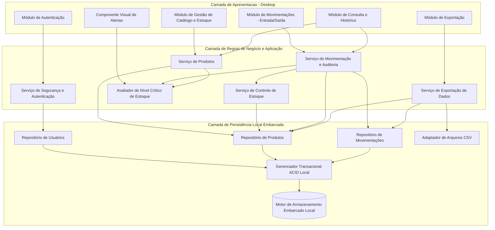
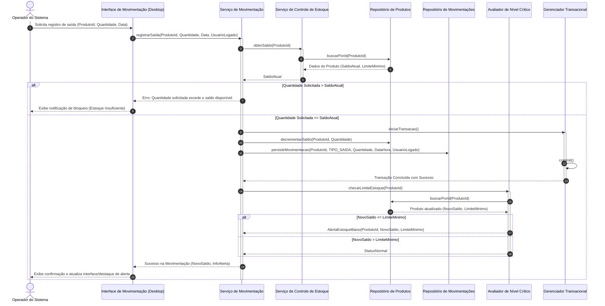

# Relatório Técnico de Arquitetura de Software

## 1. Identificação das HUs

| Identificador | Título / Descrição Sintética | Ator Principal | Requisitos Vinculados | Complexidade Estimada |
|---|---|---|---|---|
| **HU01** | **Cadastrar produto**: Registro de novo produto com nome, quantidade inicial e preço de custo, validando unicidade de nome. | Operador | RF01, RF12, RNF01, RNF02, RNF03, RNF06, RNF08 | Média |
| **HU02** | **Registrar entrada de mercadoria**: Lançamento de acréscimo de estoque para um produto selecionado com persistência de log e atualização imediata de saldo. | Operador | RF04, RF07, RNF01, RNF02, RNF03, RNF04, RNF06, RNF08 | Média |
| **HU03** | **Registrar saída de produto**: Lançamento de decréscimo de estoque com validação de saldo disponível e registro de auditoria. | Operador | RF05, RF06, RF07, RNF01, RNF02, RNF03, RNF04, RNF06, RNF08 | Média |
| **HU04** | **Ser alertado sobre estoque baixo**: Mecanismo de notificação/destaque visual disparado quando o saldo atinge ou fica abaixo do limite mínimo. | Operador | RF08, RF09, RF10, RNF01, RNF04, RNF05 | Baixa |
| **HU05** | **Configurar limite mínimo de estoque por produto**: Parametrização individual de limiar de estoque para acionamento de regras de alerta. | Operador | RF02, RF08, RF09, RNF01, RNF02, RNF06, RNF08 | Baixa |
| **HU06** | **Consultar saldo atual do estoque**: Visualização consolidada em tela única com capacidade de ordenação e sinalização visual de estoque crítico. | Operador | RF10, RF12, RNF01, RNF04, RNF05, RNF06 | Média |
| **HU07** | **Consultar histórico de movimentações**: Rastreamento de entradas/saídas com filtros por produto e período, ordenação cronológica decrescente. | Operador | RF11, RF12, RNF01, RNF05, RNF06, RNF08 | Média |
| **HU08** | **Exportar dados de estoque e movimentações**: Extração de relatórios e dados transacionais em formato tabular delimitado (CSV) em diretório local. | Operador | RNF01, RNF07, RNF06, RNF08 | Baixa |

---

## 2. Diagramas de Arquitetura (Mermaid)

### 2.1 Diagrama de Componentes Lógicos do Sistema

---

### 2.2 Diagrama de Sequência: Registro de Saída de Produto com Validação de Saldo e Disparo de Alerta (HU03, HU04, RF05, RF06, RF07, RF09)

---

## 3. Decisões de Arquitetura

### 3.1 Padrão Arquitetural em Camadas (Layered Architecture) para Desktop Local
- **Contexto**: A aplicação deve operar localmente em ambiente desktop monofonte, sem dependência de conectividade de rede externa ou de infraestrutura cliente-servidor distribuída (RNF01, RNF02).
- **Decisão**: Adoção de arquitetura em 3 camadas lógicas:
  1. *Camada de Apresentação (UI Desktop)*: Responsável pela interação direta, manipulação de visualizações, atalhos de usabilidade e captura de eventos do operador.
  2. *Camada de Aplicação e Domínio*: Concentra as regras de negócio, lógica de movimentação, checagem de limites e orquestração de transações.
  3. *Camada de Persistência e Acesso a Dados*: Abstrai a interface com o mecanismo de armazenamento local embarcado e o sistema de arquivos local.
- **Consequências**: Facilita a testabilidade unitária dos serviços de domínio, reduz o acoplamento com a tecnologia de renderização visual e garante isolamento do mecanismo de banco embarcado.

### 3.2 Transacionalidade Atômica e Isolamento Local (ACID)
- **Contexto**: A integridade dos dados deve ser preservada rigorosamente contra travamentos, quedas de energia ou fechamentos abruptos da aplicação (RNF03).
- **Decisão**: Todas as operações de entrada, saída e ajuste de inventário devem ser executadas sob controle transacional atômico (*Write-Ahead Logging* ou similar garantido pelo motor embarcado), sincronizando a alteração da quantidade do produto e a inserção do registro no log de movimentação de forma indissociável.
- **Consequências**: Elimina estados intermediários inconsistentes (ex.: registrar histórico de saída sem decrementar saldo). Exige overhead mínimo de escrita síncrona local, perfeitamente comportável pela baixa latência do disco da máquina hospedeira.

### 3.3 Mecanismo de Alerta em Memória e Avaliação Síncrona Pós-Transação
- **Contexto**: Operadores devem ser informados imediatamente quando produtos atingirem ou caírem abaixo do limite mínimo (RF09, HU04).
- **Decisão**: Implementar a checagem de limiar como um gancho de pós-processamento transacional síncrono. O estado de criticidade do produto é atualizado e propagado imediatamente para a camada de visualização ativa por meio de vinculação de dados (*data binding*) reativo na interface.
- **Consequências**: O alerta visual é instantâneo e não exige varreduras contínuas em segundo plano (*polling*), otimizando o consumo de CPU da máquina desktop.

### 3.4 Formato de Armazenamento e Exportação de Arquivos
- **Contexto**: O sistema precisa fornecer histórico rastreável e recurso de exportação para backup e análise externa (RNF07, RNF08, HU08).
- **Decisão**: A persistência primária é feita em formato binário estruturado/relacional embarcado, e a exportação é tratada por um módulo adaptador dedicado que lê as entidades e projeta o formato tabular de texto delimitado (CSV codificado em UTF-8 com separadores padronizados).
- **Consequências**: Desacopla o formato de backup/integração do operador do formato interno de alta performance de gravação do banco embarcado.

---

## 4. Tabela de Componentes e Rastreabilidade

| Componente | Responsabilidade Principal | Comunica-se com | Origem (HU / Critério de Aceite) |
|---|---|---|---|
| **Módulo de Autenticação (UI & Backend)** | Controlar credenciais de acesso, manter contexto do operador logado e gerenciar sessão local. | Repositório de Usuários, Módulos de Interface | RNF06, RNF08, HU07 (Registro do operador) |
| **Serviço de Catálogo de Produtos** | Criar, editar, consultar e remover itens de produtos; validar unicidade de nome e tipos de dados. | Repositório de Produtos, Avaliador de Nível Crítico | RF01, RF02, RF03, RF12, HU01, HU05 |
| **Serviço de Controle de Estoque** | Orquestrar saldos disponíveis, validar consistência de estoque positivo e aplicar limites mínimos. | Repositório de Produtos, Serviço de Movimentação | RF06, RF07, RF08, HU02, HU03, HU05 |
| **Serviço de Movimentação e Histórico** | Processar transações de entrada e saída, registrar trilha de auditoria com operador/data/hora e consultar extratos. | Repositório de Movimentações, Repositório de Produtos, Gerenciador Transacional | RF04, RF05, RF06, RF07, RF11, RNF03, RNF08, HU02, HU03, HU07 |
| **Avaliador de Nível Crítico** | Comparar saldo atual em relação ao limite mínimo configurado e calcular sinalizações visuais de atenção. | Repositório de Produtos, Módulo de Interface | RF08, RF09, RF10, HU04, HU06 |
| **Módulo de Exportação CSV** | Gerar arquivos delimitados contendo inventário e logs de movimentação em diretório definido pelo usuário. | Repositório de Produtos, Repositório de Movimentações, Adaptador de Arquivos | RNF07, HU08 |
| **Gerenciador Transacional Local** | Garantir execução atômica, consistente, isolada e durável (ACID) das operações de gravação física. | Motor de Armazenamento Embarcado, Repositórios | RNF02, RNF03 |

---

## 5. Bloqueios e Pendências

1. **Política de Exclusão de Produtos com Histórico (RF03 vs. RF11 / RNF08)**:
   - *Bloqueio*: RF03 permite ao operador remover um produto do cadastro. Contudo, se um produto possuir histórico prévio de movimentações (entradas/saídas), uma exclusão física (*hard delete*) violaria a integridade referencial ou destruiria a rastreabilidade exigida por RNF08 e HU07.
   - *Impacto*: Risco de inconsistência de banco de dados ou perda de histórico contábil.
   - *Direcionamento Proposto*: Definir regra de negócio para adoção de inativação lógica (*soft delete* / desativação) para produtos que possuam movimentações registradas, permitindo remoção física apenas para produtos virgens.

2. **Gestão de Sessão e Timeout Local (RNF06)**:
   - *Pendência*: RNF06 especifica necessidade de autenticação por usuário e senha, mas não define se a aplicação deve bloquear a tela por inatividade ou manter múltiplos perfis concorrentes em uma mesma estação física de trabalho.

3. **Política de Tratamento de Entradas Duplicadas em Lote**:
   - *Pendência*: HU02 não prevê comportamento de cancelamento/estorno de entrada incorreta lançada por engano pelo operador.

---

## 6. Cobertura de Requisitos

| Requisito | Atendido por Componente / Módulo | Nível de Cobertura | Justificativa / Rastreamento |
|---|---|---|---|
| **RF01** | Serviço de Catálogo de Produtos / UI Estoque | Total | Cadastro estruturado com validação de campos obrigatórios e unicidade. |
| **RF02** | Serviço de Catálogo de Produtos / UI Estoque | Total | Edição de atributos cadastrais do item. |
| **RF03** | Serviço de Catálogo de Produtos / Repositório | Parcial | Funcionalidade prevista; pendente decisão sobre exclusão física vs. lógica. |
| **RF04** | Serviço de Movimentação / Repositório Movimentações | Total | Registro de entrada com acréscimo de saldo, data e operador. |
| **RF05** | Serviço de Movimentação / Repositório Movimentações | Total | Registro de saída com decréscimo de saldo, data e operador. |
| **RF06** | Serviço de Controle de Estoque / Svc Movimentação | Total | Bloqueio síncrono pré-transação para saídas superiores ao saldo. |
| **RF07** | Serviço de Controle de Estoque / TxManager | Total | Atualização atômica imediata pós-lançamento. |
| **RF08** | Serviço de Catálogo de Produtos / Svc Estoque | Total | Campo configurável por produto para parâmetro de corte mínimo. |
| **RF09** | Avaliador de Nível Crítico / UI Alertas | Total | Disparo visual de alerta baseado no corte configurado. |
| **RF10** | UI Estoque / Repositório de Produtos | Total | Grid consolidado de saldos e limites mínimos. |
| **RF11** | Serviço de Movimentação / UI Histórico | Total | Filtros por produto, intervalo de datas e ordenação descendente. |
| **RF12** | Serviço de Catálogo de Produtos / Repositórios | Total | Mecanismo de busca e indexação por texto/nome do produto. |
| **RNF01** | Apresentação Desktop | Total | Arquitetura focada em execução monofonte em ambiente Windows. |
| **RNF02** | Motor de Armazenamento Embarcado Local | Total | Persistência local autocontida sem dependência de servidores. |
| **RNF03** | Gerenciador Transacional ACID Local | Total | Garantia de transações seguras contra desligamentos súbitos. |
| **RNF04** | UI de Movimentação / Fluxo Direto da Tela Principal | Total | Desenho de telas orientado a conclusão de operações em até 3 cliques. |
| **RNF05** | Índices nos Repositórios Locais | Total | Indexação por nome de produto e data de movimentação (< 2s de resposta). |
| **RNF06** | Módulo de Autenticação | Total | Controle de acesso via login/senha local. |
| **RNF07** | Módulo de Exportação CSV | Total | Extração para arquivos tabulares no sistema de arquivos local. |
| **RNF08** | Serviço de Movimentação / Repositório | Total | Carimbo de data, hora e operador persistidos em todas as operações. |

---

## 7. Gap Analysis

| Item de Lacuna | Descrição do Gap | Impacto Arquitetural / Técnico | Ação Recomendada para o Time de Engenharia |
|---|---|---|---|
| **GAP-01: Gestão de Estorno de Lançamento** | Ausência de especificação sobre cancelamento ou retificação de entradas/saídas lançadas incorretamente. | Operadores podem tentar corrigir erros com saídas/entradas fictícias, distorcendo relatórios de auditoria e métricas contábeis. | Modelar tipo transacional de "Estorno/Ajuste de Inventário", exigindo justificativa textual e preservando o registro original inalterado. |
| **GAP-02: Gerenciamento Inicial de Usuários (Bootstrap)** | RNF06 exige login/senha, mas os requisitos não especificam tela de cadastro de usuários ou criação do primeiro administrador. | Impossibilidade de primeiro acesso ou risco de inclusão de credenciais hardcoded inseguras. | Criar rotina de inicialização automática no banco local com credencial administrativa padrão temporária solicitando troca no primeiro uso. |
| **GAP-03: Indexação e Limpeza de Histórico Local** | RNF05 exige consultas rápidas (< 2s) em banco embarcado com grande volume de dados acumulados ao longo dos anos. | Degradação de performance em discos de baixa velocidade com o crescimento desmedido do arquivo do banco local. | Especificar índices compostos nas colunas `(ProdutoId, DataHora)` e definir estratégia de arquivamento/expurgo periódico para dados legados. |
| **GAP-04: Concorrência Local de Arquivos do Banco** | RNF01 e RNF02 mencionam execução desktop com banco embarcado em arquivos locais. | Se o usuário abrir duas instâncias simultâneas do executável na mesma máquina, poderá haver corrupção ou travamento de arquivo (*file lock*). | Implementar verificação de instância única (*Single Instance Application Mutex*) no ciclo de vida da inicialização do software. |