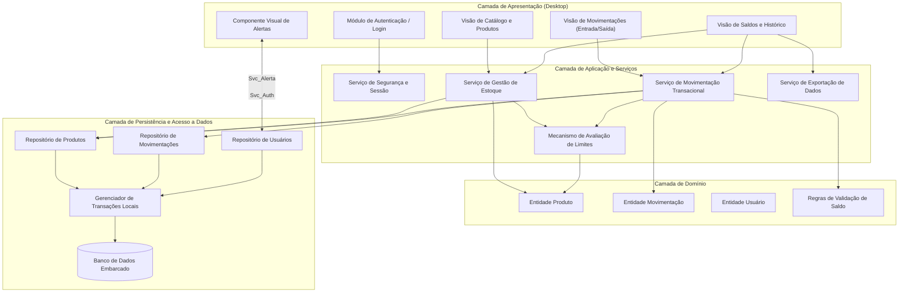
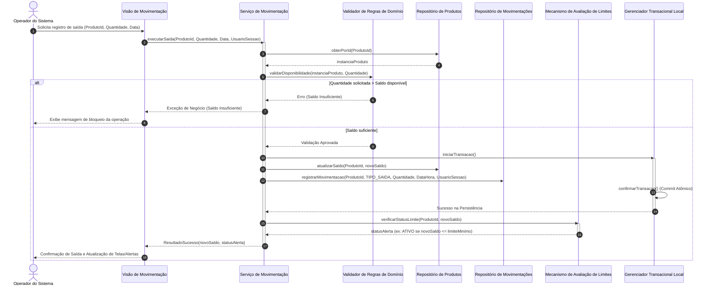

# Relatório Técnico de Arquitetura de Software

## 1. Identificação das HUs

| ID | Título | Ator | Descrição Sumarizada | Critérios de Aceite Chave |
| :--- | :--- | :--- | :--- | :--- |
| **HU01** | Cadastrar produto | Operador | Registro de novo item com nome, quantidade inicial e preço de custo. | Campos obrigatórios validados; unicidade de nome garantida; disponibilidade imediata na listagem de estoque. |
| **HU02** | Registrar entrada de mercadoria | Operador | Incremento de quantidade física em estoque com registro temporal. | Seleção por lista/busca; quantidade inteira positiva; atualização instantânea de saldo; registro em log/histórico. |
| **HU03** | Registrar saída de produto | Operador | Decremento de quantidade por venda/baixa com validação de disponibilidade. | Bloqueio de saída com saldo insuficiente; mensagem de erro explicativa; atualização imediata de saldo; registro auditável em histórico. |
| **HU04** | Ser alertado sobre estoque baixo | Operador | Notificação visual quando o saldo atinge ou fica abaixo do limite configurado. | Alerta visual imediato; identificação clara do item e saldo; persistência do estado de alerta até reposição. |
| **HU05** | Configurar limite mínimo por produto | Operador | Definição de patamar mínimo individual para disparo de alertas. | Configuração individual; aceitação exclusiva de inteiros não negativos; reflexo instantâneo no motor de alertas. |
| **HU06** | Consultar saldo atual do estoque | Operador | Visualização consolidada de todos os produtos, saldos e limites. | Lista unificada com saldos e limites; destaque visual para itens críticos; ordenação por nome e quantidade. |
| **HU07** | Consultar histórico de movimentações | Operador | Auditoria e visualização cronológica de entradas e saídas. | Filtro por produto e intervalo de datas; detalhamento com tipo, quantidade, data, hora e usuário; ordenação cronológica decrescente. |
| **HU08** | Exportar dados de estoque e histórico | Operador | Extração de registros tabulares para arquivos estruturados de intercâmbio. | Geração de arquivo estruturado (formato delimitado); seleção de diretório local de destino; confirmação explícita de conclusão. |

---

## 2. Diagramas de Arquitetura (Mermaid)

### 2.1. Diagrama de Componentes Estrutural

### 2.2. Diagrama de Sequência: Registro de Saída com Validação, Auditoria e Alerta

---

## 3. Decisões de Arquitetura

* **ADR 01: Padrão Arquitetural em Camadas para Execução Local Monolítica**
  * *Contexto:* O sistema deve operar localmente em ambiente desktop Windows (RNF01, RNF02) sem dependência de infraestrutura externa de rede ou servidores.
  * *Decisão:* Adoção do padrão em Camadas Estritas (Apresentação, Aplicação, Domínio, Persistência), encapsuladas em um único processo executável local.
  * *Consequência:* Baixa latência nas chamadas internas, facilidade de empacotamento, distribuição simplificada e total conformidade com a restrição de banco embarcado local.

* **ADR 02: Transacionalidade Atômica e Confiabilidade por Mecanismo Embarcado ACID**
  * *Contexto:* O sistema exige garantia absoluta contra inconsistências ou perdas de lançamentos em caso de encerramento inesperado (RNF03, RF07).
  * *Decisão:* Toda atualização de saldo combinada com inserção no histórico deve ser executada sob um único contexto transacional com suporte a propriedades ACID, gravado de forma síncrona no meio de persistência embarcado.
  * *Consequência:* Proteção contra dados órfãos ou saldos corrompidos; garantia de consistência de estado sem overhead de coordenação distribuída.

* **ADR 03: Motor Centralizado de Avaliação de Limites de Estoque**
  * *Contexto:* Necessidade de emitir alertas visuais imediatos e persistentes sempre que o saldo for menor ou igual ao limite configurado (RF08, RF09, HU04, HU05, HU06).
  * *Decisão:* Desacoplamento da checagem de limites em um componente de serviço específico (`Mecanismo de Avaliação de Limites`), invocado sincronamente ao final de qualquer mutação de estoque e consultado de forma agregada pelas telas de consulta.
  * *Consequência:* Evita duplicação de regras de alerta entre telas de cadastro, saídas e relatórios, garantindo resposta uniforme.

* **ADR 04: Isolamento da Rastreabilidade e Auditoria de Lançamentos**
  * *Contexto:* RNF08 e RF11 exigem registro detalhado e imutável de usuário, data, hora e tipo para todas as movimentações.
  * *Decisão:* A entidade de histórico é estritamente append-only (somente inserção), vinculada à identidade injetada pelo contexto de sessão do usuário autenticado no momento da operação.
  * *Consequência:* Alto grau de conformidade de auditoria e impossibilidade técnica de alterar históricos passados por vias comuns da aplicação.

---

## 4. Tabela de Componentes e Rastreabilidade

| Componente | Responsabilidade Principal | Comunica-se com | Origem (HU / Critério de Aceite) |
| :--- | :--- | :--- | :--- |
| **Módulo de Autenticação / Login** | Coletar credenciais do operador, validar identidade e manter o estado da sessão local. | Serviço de Segurança e Sessão | RNF06, RNF08 |
| **Visão de Catálogo e Produtos** | Interface de cadastro, edição, remoção e consulta de produtos. | Serviço de Gestão de Estoque | HU01, HU05, RF01, RF02, RF03, RF08, RF12 |
| **Visão de Movimentações** | Interface otimizada (até 3 interações) para registrar entradas e saídas de estoque. | Serviço de Movimentação Transacional | HU02, HU03, RF04, RF05, RNF04 |
| **Visão de Saldos e Histórico** | Exibição consolidada de estoques, filtros temporais de movimentação e acionamento de exportação. | Serviço de Gestão de Estoque, Serviço de Movimentação Transacional, Serviço de Exportação | HU06, HU07, HU08, RF10, RF11, RNF05 |
| **Componente Visual de Alertas** | Renderizar sinais visuais destacados para produtos em estado crítico de estoque. | Mecanismo de Avaliação de Limites, Visão de Saldos | HU04, HU06, RF09 |
| **Serviço de Segurança e Sessão** | Validar hash de senhas, autenticar usuários e disponibilizar o token/objeto do usuário ativo. | Repositório de Usuários | RNF06, RNF08 |
| **Serviço de Gestão de Estoque** | Orquestrar regras de CRUD de produtos, validação de unicidade de nome e atualização de limites mínimos. | Repositório de Produtos, Mecanismo de Avaliação de Limites | HU01, HU05, RF01, RF02, RF03, RF08, RF12 |
| **Serviço de Movimentação Transacional** | Coordenar o fluxo de negócio de entrada/saída, validação de saldo e criação de registros auditáveis. | Validador de Regras de Domínio, Repositório de Produtos, Repositório de Movimentações, Gerenciador de Transações | HU02, HU03, RF04, RF05, RF06, RF07, RNF03, RNF08 |
| **Mecanismo de Avaliação de Limites** | Avaliar se o saldo atual de um produto atingiu ou violou o limite mínimo configurado. | Entidade Produto | HU04, HU05, HU06, RF08, RF09 |
| **Serviço de Exportação de Dados** | Extrair coleções tabulares de produtos e históricos, convertendo-os para arquivo estruturado em disco local. | Repositório de Produtos, Repositório de Movimentações | HU08, RNF07 |
| **Repositório de Dados / Gerenciador Transacional** | Abstrair operações de I/O no banco embarcado garantindo atomicidade e isolamento. | Banco de Dados Embarcado | RNF02, RNF03, RNF05 |

---

## 5. Bloqueios e Pendências

1. **Gestão de Ciclo de Vida de Usuários (Auth/CRUD):**
   * *Pendência:* Os requisitos RNF06 e RNF08 exigem autenticação e vinculação de usuário aos lançamentos, mas não foram detalhados requisitos funcionais para criação, edição, inativação ou recuperação de senha de operadores.
   * *Risco:* Bloqueio na definição da tela de administração de acessos ou necessidade de carga inicial estática.

2. **Política de Exclusão de Produtos com Histórico (Integridade Referencial):**
   * *Pendência:* O requisito RF03 permite a remoção de produtos, enquanto o RF11 e RNF08 exigem histórico completo de movimentações.
   * *Risco:* Exclusões físicas (*hard delete*) corrompem o histórico ou violam chaves estrangeiras. Deve-se definir formalmente a política de desativação lógica (*soft delete* / inativação).

3. **Concorrência de Acesso ao Arquivo de Banco Embarcado:**
   * *Pendência:* Aplicações desktop com banco embarcado exigem definição clara sobre o suporte ou bloqueio a múltiplas instâncias concorrentes no mesmo host operacional.
   * *Risco:* Travamento de arquivo (*file lock*) caso o operador abra mais de uma instância da aplicação.

---

## 6. Cobertura de Requisitos

### 6.1. Requisitos Funcionais (RF)

| Requisito | Atendido por | Evidência Arquitetural |
| :--- | :--- | :--- |
| **RF01** (Cadastro de Produto) | Serviço de Gestão de Estoque / Repositório de Produtos | `ADR 01`, Componente de Catálogo, HU01 |
| **RF02** (Edição de Produto) | Serviço de Gestão de Estoque / Repositório de Produtos | Componente de Catálogo, Atualização de Entidade |
| **RF03** (Remoção de Produto) | Serviço de Gestão de Estoque / Repositório de Produtos | Módulo de Catálogo, Política de Exclusão (Pendência 2) |
| **RF04** (Entrada de Mercadoria) | Serviço de Movimentação Transacional | `ADR 02`, Diagrama de Componentes, HU02 |
| **RF05** (Saída de Produtos) | Serviço de Movimentação Transacional | Diagrama de Sequência, HU03 |
| **RF06** (Bloqueio de Saída sem Saldo) | Validador de Regras de Domínio | Diagrama de Sequência (Fluxo Alternativo 5.1-5.3), HU03 |
| **RF07** (Atualização Automática de Saldo) | Serviço de Movimentação / Gerenciador Transacional | `ADR 02`, Diagrama de Sequência (Passos 7-10) |
| **RF08** (Configuração de Limite Mínimo) | Serviço de Gestão de Estoque / Entidade Produto | `ADR 03`, Componente de Catálogo, HU05 |
| **RF09** (Alerta de Estoque Baixo) | Mecanismo de Avaliação de Limites / UI Alertas | `ADR 03`, Diagrama de Sequência (Passo 11), HU04 |
| **RF10** (Consulta Geral de Saldos) | Visão de Saldos e Histórico / Repositório de Produtos | Componente de Consultas, HU06 |
| **RF11** (Histórico por Produto e Período) | Repositório de Movimentações / Visão de Histórico | `ADR 04`, Componente de Consultas, HU07 |
| **RF12** (Pesquisa por Nome) | Repositório de Produtos / Mecanismos de Indexação | Componente de Catálogo, HU01, HU02 |

### 6.2. Requisitos Não Funcionais (RNF)

| Requisito | Atendido por | Evidência Arquitetural |
| :--- | :--- | :--- |
| **RNF01** (Desktop Windows) | Padrão Arquitetural em Camadas | `ADR 01`, Processo nativo em Camadas |
| **RNF02** (Banco Embarcado Local) | Camada de Persistência Local | `ADR 01`, `DB_Embarcado` no Diagrama de Componentes |
| **RNF03** (Confiabilidade e Não Perda) | Gerenciador Transacional Local | `ADR 02`, Transação Atômica com Commit Síncrono |
| **RNF04** (Usabilidade <= 3 Interações) | Visão de Movimentações | Design de UI desacoplada com atalhos diretos da tela principal |
| **RNF05** (Desempenho <= 2s) | Índices em Repositórios Locais | Índices por Produto/Data no banco embarcado e queries otimizadas |
| **RNF06** (Segurança por Autenticação) | Módulo e Serviço de Autenticação | `ADR 04`, Módulo de Login e Sessão Ativa |
| **RNF07** (Exportação em CSV) | Serviço de Exportação de Dados | Componente de Exportação, HU08 |
| **RNF08** (Rastreabilidade Completa) | Repositório de Movimentações (Append-Only) | `ADR 04`, Injeção de Usuário/Timestamp no registro |

---

## 7. Gap Analysis

| Lacuna de Especificação | Impacto Arquitetural | Ação Recomendada |
| :--- | :--- | :--- |
| **Ausência de Mecanismo de Provisão de Contas de Acesso** | Impossibilita o ciclo completo de segurança sem intervenção direta no banco. | Especificar um requisito funcional para o primeiro acesso administrativo e cadastro local de operadores. |
| **Conflito entre Exclusão (RF03) e Rastreabilidade Histórica (RF11/RNF08)** | Se um produto for removido fisicamente, referências no histórico tornam-se nulas ou quebram integridade. | Adotar arquiteturalmente o padrão de *Soft Delete* (Inativação de Cadastro), impedindo exclusão física se houver histórico. |
| **Indefinição de Formato e Tratamento de Erros de I/O na Exportação** | Falhas de permissão de gravação no diretório de destino podem causar travamento da interface. | Implementar tratamento de exceções de sistema de arquivos com feedback assíncrono na interface de exportação. |
| **Política de Bloqueio por Sessão Inativa** | Riscos à rastreabilidade caso o operador deixe a aplicação aberta em terminal compartilhado. | Estabelecer um *timeout* configurável de inatividade para bloqueio automático da interface desktop. |