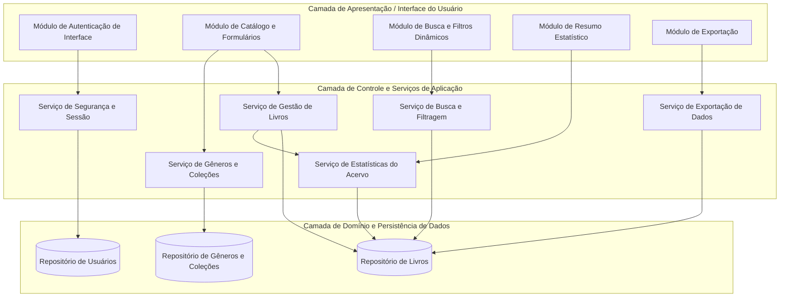
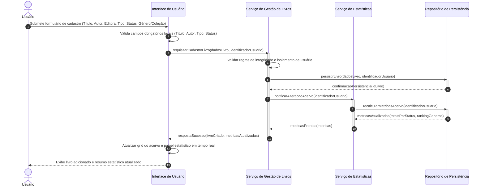
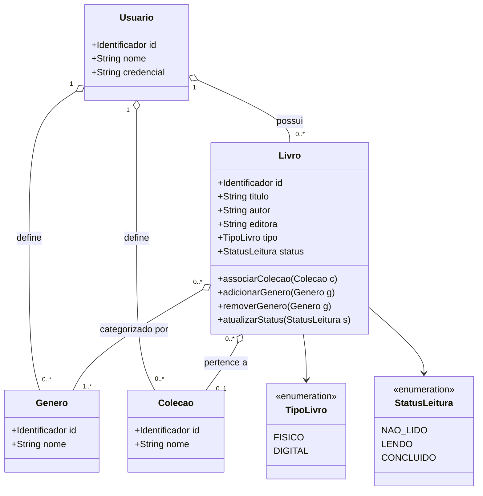

# Relatório Técnico de Arquitetura de Software

## 1. Identificação das HUs

| ID | Título | Ator Primário | Objetivo / Descrição Sumária | Requisitos Associados |
| :--- | :--- | :--- | :--- | :--- |
| **HU01** | Cadastrar livro | Usuário | Cadastrar novos livros no acervo com título, autor, editora, formato (físico/digital) e status de leitura. | RF01, RF04, RF13, RNF01, RNF02, RNF04 |
| **HU02** | Atualizar status de leitura | Usuário | Modificar o progresso de leitura de um livro (não lido, lendo, concluído) com impacto imediato nas métricas. | RF02, RF04, RF05, RNF01, RNF04, RNF05 |
| **HU03** | Organizar livros por gênero | Usuário | Realizar CRUD de gêneros literários e associar múltiplos gêneros a livros sem exclusão em cascata de títulos. | RF06, RF08, RNF01, RNF04 |
| **HU04** | Organizar livros por coleção | Usuário | Realizar CRUD de coleções e vincular livros a no máximo uma coleção por vez, mantendo integridade na desassociação. | RF07, RF08, RNF01, RNF04 |
| **HU05** | Filtrar o acervo | Usuário | Filtrar livros de forma combinada por múltiplos atributos com opção de limpeza rápida de critérios. | RF09, RNF02, RNF03, RNF06 |
| **HU06** | Pesquisar livros por título ou autor | Usuário | Buscar dinamicamente livros no acervo por termos parciais de título ou autor. | RF12, RNF02, RNF03, RNF06 |
| **HU07** | Visualizar resumo do acervo | Usuário | Visualizar painel estatístico em tempo real com totais por status e ranking de gêneros mais frequentes. | RF10, RF11, RNF01, RNF02, RNF05 |
| **HU08** | Exportar o acervo | Usuário | Gerar e baixar arquivo estruturado contendo todo o acervo do usuário nos formatos CSV ou JSON. | RNF01, RNF07 |

---

## 2. Diagramas de Arquitetura (Mermaid)

### 2.1. Diagrama Estrutural de Componentes e Camadas Lógicas

---

### 2.2. Diagrama de Sequência: Cadastro de Livro e Atualização de Resumo (HU01, HU07)

---

### 2.3. Diagrama de Classes do Domínio Conceitual

---

## 3. Decisões de Arquitetura

1. **Isolamento Lógico por Tenant/Usuário (Multi-Tenancy Lógico):**
   - *Justificativa:* Atende ao requisito RNF01. Todas as operações de leitura, escrita, busca, agregação e exportação devem conter obrigatoriamente a amarração da identidade do usuário autenticado como chave de particionamento lógico no domínio e nas consultas.
2. **Desacoplamento de Taxonomias e Resiliência Estrutural:**
   - *Justificativa:* Conforme HU03 e HU04, a exclusão de um `Gênero` ou de uma `Coleção` não pode acionar exclusão em cascata da entidade `Livro`. O relacionamento entre Livro e Coleção é de associação simples opcional ($0..1$), enquanto com Gênero é N:N associativa desacoplada ($1..*$).
3. **Agregação e Consistência de Resumo em Tempo Real:**
   - *Justificativa:* Em conformidade com RF10, RF11 e RNF05, toda mutação de estado de catálogo (criação, edição de status, remoção) dispara recálculo síncrono ou orientado a eventos locais de métricas, permitindo que a camada de apresentação sincronize contadores imediatamente.
4. **Mecanismo Neutro de Busca Multicritério e Indexação:**
   - *Justificativa:* Para suportar RF09, RF12 e RNF03 (resposta em até 2 segundos em listagens/filtros), a camada de busca opera com filtros combinatórios normalizados e busca textual parcial (substring/prefixo) sobre atributos-chave (título, autor).
5. **Motor Agnóstico de Serialização para Exportação:**
   - *Justificativa:* Atendimento ao RNF07 e HU08 via serviço especializado que lê o grafo completo de livros do usuário e projeta uma estrutura canônica plana (para formato CSV) ou hierárquica (para formato JSON).

---

## 4. Tabela de Componentes e Rastreabilidade

| Componente | Responsabilidade Principal | Comunica-se com | Origem (HU / Critério de Aceite) |
| :--- | :--- | :--- | :--- |
| **Módulo de Autenticação e Sessão** | Prover barreiras de segurança, validação de credenciais e injeção do contexto do usuário logado em todas as requisições. | Repositório de Usuários, Serviços de Aplicação | RNF01, HU01 a HU08 |
| **Serviço de Gestão de Livros** | Executar regras de negócio para criação, alteração cadastral, remoção e troca de status de leitura de livros. | Repositório de Livros, Serviço de Estatísticas, Serviço de Gêneros e Coleções | HU01 (Aceites 1-3), HU02 (Aceites 1-2), RF01, RF02, RF03, RF04, RF05, RF13 |
| **Serviço de Gêneros e Coleções** | Gerenciar o ciclo de vida de gêneros e coleções e garantir integridade referencial não destrutiva para com os livros. | Repositório de Gêneros e Coleções, Repositório de Livros | HU03 (Aceites 1-3), HU04 (Aceites 1-3), RF06, RF07, RF08 |
| **Serviço de Busca e Filtragem** | Processar consultas combinadas (AND/OR) de múltiplos atributos e executar buscas textuais parciais de títulos e autores. | Repositório de Livros, Repositório de Gêneros e Coleções | HU05 (Aceites 1-3), HU06 (Aceites 1-2), RF09, RF12, RNF03 |
| **Serviço de Estatísticas do Acervo** | Computar volume total, contadores consolidados por status de leitura e ranking de frequência de gêneros do usuário. | Repositório de Livros, Módulo de Resumo Estatístico | HU07 (Aceites 1-3), RF10, RF11, RNF05 |
| **Serviço de Exportação de Dados** | Extrair todos os registros do usuário e serializar a carga de dados nos formatos CSV e JSON para download direto. | Repositório de Livros, Módulo de Exportação | HU08 (Aceites 1-3), RNF07 |
| **Controlador de Apresentação e Estado da UI** | Renderizar componentes responsivos, tratar filtros dinâmicos reativos e manter sincronismo com eventos de catálogo. | Serviços de Aplicação, Navegador Web | RNF02, RNF05, RNF06 |

---

## 5. Bloqueios e Pendências

1. **Ausência de Mecanismo de Recuperação/Redefinição de Credenciais:**
   - O RNF01 exige autenticação e isolamento, mas os requisitos não especificam fluxo de criação de conta, recuperação de senha ou expiração de sessão.
2. **Política de Validação de Duplicidade de Livros:**
   - Não há definição sobre unicidade de registros (ex.: permitir ou bloquear múltiplos cadastros do mesmo título/autor ou ISBN no acervo do mesmo usuário).
3. **Limite Volumétrico de Exportação em Memória:**
   - Para acervos de grande escala, não foi estipulada política de paginação/streaming na geração dos arquivos de exportação CSV/JSON para evitar gargalos de consumo de memória.

---

## 6. Cobertura de Requisitos

| Requisito Funcional / Não Funcional | Componente(s) Responsável(is) | História de Usuário Relacionada | Status de Cobertura |
| :--- | :--- | :--- | :--- |
| **RF01** (Cadastro de Livro) | Serviço de Gestão de Livros | HU01 | Coberto |
| **RF02** (Edição de Livro) | Serviço de Gestão de Livros | HU01, HU02 | Coberto |
| **RF03** (Remoção de Livro) | Serviço de Gestão de Livros | HU01 | Coberto |
| **RF04** (Opções de Status de Leitura) | Serviço de Gestão de Livros | HU01, HU02 | Coberto |
| **RF05** (Atualização de Status) | Serviço de Gestão de Livros, Serviço de Estatísticas | HU02 | Coberto |
| **RF06** (CRUD de Gêneros) | Serviço de Gêneros e Coleções | HU03 | Coberto |
| **RF07** (CRUD de Coleções) | Serviço de Gêneros e Coleções | HU04 | Coberto |
| **RF08** (Associação Livro-Gênero/Coleção) | Serviço de Gêneros e Coleções, Serviço de Gestão de Livros | HU03, HU04 | Coberto |
| **RF09** (Filtragem Multiatributo) | Serviço de Busca e Filtragem | HU05 | Coberto |
| **RF10** (Total por Status de Leitura) | Serviço de Estatísticas do Acervo | HU07 | Coberto |
| **RF11** (Gêneros Mais Frequentes) | Serviço de Estatísticas do Acervo | HU07 | Coberto |
| **RF12** (Busca Textual por Título/Autor) | Serviço de Busca e Filtragem | HU06 | Coberto |
| **RF13** (Diferenciação Físico/Digital) | Serviço de Gestão de Livros | HU01 | Coberto |
| **RNF01** (Segurança e Isolamento) | Módulo de Autenticação e Sessão | HU01 a HU08 | Coberto |
| **RNF02** (Usabilidade e Responsividade) | Controlador de Apresentação e Estado da UI | HU01 a HU08 | Coberto |
| **RNF03** (Desempenho $\le$ 2s) | Serviço de Busca e Filtragem, Repositório de Livros | HU05, HU06 | Coberto |
| **RNF04** (Persistência Transacional) | Repositórios de Dados (Persistência) | HU01 a HU04 | Coberto |
| **RNF05** (Estatísticas em Tempo Real) | Serviço de Estatísticas do Acervo, UI | HU02, HU07 | Coberto |
| **RNF06** (Compatibilidade de Navegadores)| Controlador de Apresentação e Estado da UI | HU05, HU06 | Coberto |
| **RNF07** (Exportação CSV/JSON) | Serviço de Exportação de Dados | HU08 | Coberto |

---

## 7. Gap Analysis

| Lacuna de Especificação Identificada | Impacto Arquitetural | Ação Recomendada para o Time de Desenvolvimento |
| :--- | :--- | :--- |
| **G1. Falta de especificação de identificadores padrão de mercado (ISBN/ISSN)** | Dificulta enriquecimento futuro, padronização de metadados e prevenção de duplicidades. | Adicionar atributo opcional `ISBN` na entidade `Livro` com validação de formato e unicidade no escopo do usuário. |
| **G2. Comportamento de exportação diante de filtros ativos** | Indefinição se a HU08 exporta todo o acervo ou apenas o subconjunto resultante do filtro corrente aplicado na tela. | Implementar por padrão a exportação completa do acervo do usuário autenticado e disponibilizar parâmetro para "exportar seleção/filtrados". |
| **G3. Tamanho máximo e formatação do payload de exportação** | Riscos de estouro de memória no cliente ou servidor caso o usuário tenha dezenas de milhares de livros cadastrados. | Padronizar a geração do arquivo em buffer serializado e utilizar codificação UTF-8 explícita com delimitador padrão (ex.: vírgula ou ponto-e-vírgula em CSV). |
| **G4. Regra de desassociação de livros ao editar/remover coleções e gêneros** | Risco de estado inconsistente caso um livro fique sem nenhum gênero se a remoção de gênero for executada. | Garantir que o modelo permita `Livro` temporariamente sem gênero ou definir um gênero sentinela ("Não categorizado") caso a regra de negócio exija ao menos um gênero por livro. |