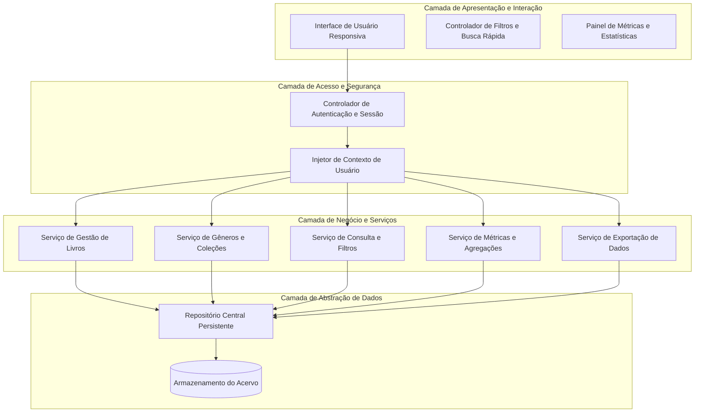
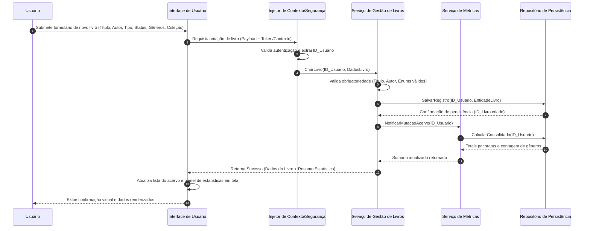
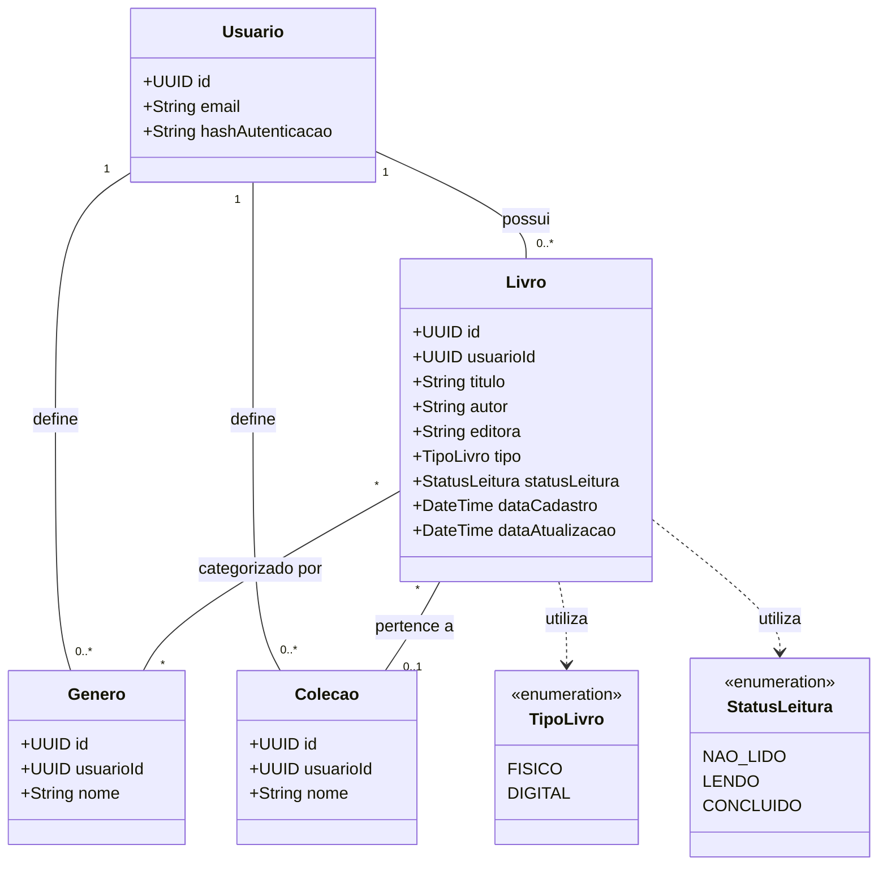

# Relatório Técnico de Arquitetura de Software

## 1. Identificação das HUs

Abaixo está o mapeamento canônico das Histórias de Usuário identificadas no domínio da Biblioteca Pessoal de Livros (P04), consolidando critérios de aceite e requisitos funcionais/não funcionais vinculados:

| ID | Título | Declaração da HU | Critérios de Aceite Chave | Requisitos Vinculados |
| :--- | :--- | :--- | :--- | :--- |
| **HU01** | Cadastrar livro | Como usuário, quero cadastrar um livro com título, autor, editora, tipo (físico ou digital) e status de leitura, para registrá-lo no meu acervo pessoal. | - Título e autor obrigatórios. - Status dentre: não lido, lendo, concluído. - Diferenciação entre físico e digital. - Inclusão imediata no acervo isolado do usuário. | RF01, RF04, RF13, RNF01, RNF04 |
| **HU02** | Atualizar status de leitura | Como usuário, quero atualizar o status de leitura de um livro, para registrar meu progresso ao longo do tempo. | - Transição permitida a qualquer momento entre os 3 status. - Atualização imediata das métricas do acervo. | RF02, RF04, RF05, RNF04, RNF05 |
| **HU03** | Organizar livros por gênero | Como usuário, quero criar gêneros literários e associar livros a eles, para categorizar meu acervo de forma organizada. | - Operações completas de CRUD de gêneros. - Relação N:N (um livro pode ter múltiplos gêneros). - Desvinculação em cascata segura (remoção de gênero não exclui livros). | RF06, RF08, RNF04 |
| **HU04** | Organizar livros por coleção | Como usuário, quero criar coleções e agrupar livros dentro delas, para organizar séries, sagas ou agrupamentos temáticos pessoais. | - Operações de CRUD de coleções. - Relação 1:N (um livro pertence a no máximo uma coleção). - Remoção de coleção desvincula livros sem excluí-los. | RF07, RF08, RNF04 |
| **HU05** | Filtrar o acervo | Como usuário, quero filtrar meu acervo por qualquer atributo (título, autor, editora, status, gênero, coleção ou tipo), para localizar livros específicos com facilidade. | - Combinação de múltiplos filtros simultâneos. - Resposta em até 2 segundos. - Recurso para limpeza total de filtros ativos em um clique. | RF09, RNF02, RNF03 |
| **HU06** | Pesquisar livros por título ou autor | Como usuário, quero pesquisar livros digitando parte do título ou do nome do autor, para encontrar rapidamente um registro específico no acervo. | - Busca por correspondência parcial (substring). - Feedback dinâmico de pesquisa. - Resposta em até 2 segundos. | RF12, RNF02, RNF03 |
| **HU07** | Visualizar resumo do acervo | Como usuário, quero visualizar um resumo com estatísticas do meu acervo, para entender meu comportamento de leitura e a composição da minha biblioteca. | - Totalizador geral e contadores por status de leitura. - Lista ordenada de gêneros mais frequentes. - Recálculo reativo/imediato após mutações. | RF10, RF11, RNF05 |
| **HU08** | Exportar o acervo | Como usuário, quero exportar todos os dados do meu acervo em CSV ou JSON, para fazer backup pessoal ou usar as informações em outras ferramentas. | - Inclusão de todos os metadados dos livros. - Formatos selecionáveis: CSV ou JSON. - Download direto disparado pela aplicação cliente. | RNF07 |

---

## 2. Diagramas de Arquitetura (Mermaid)

### 2.1. Visão Lógica de Componentes do Sistema

### 2.2. Diagrama de Sequência: Cadastro de Livro com Atualização de Métricas

### 2.3. Diagrama do Modelo de Domínio

---

## 3. Decisões de Arquitetura

*   **ADR 01: Isolamento de Dados Baseado em Tenant por Usuário (*Logical Multitenancy*)**
    *   *Contexto:* O requisito RNF01 exige que o acervo seja estritamente pessoal e isolado por usuário autenticado.
    *   *Decisão:* Todas as consultas, criações, mutações e agregações no repositório de dados conterão imperativamente o identificador do usuário (`usuarioId`) originado do contexto autenticado, impossibilitando acessos cruzados.
    *   *Consequência:* Garante conformidade de segurança e privacidade desde o núcleo do domínio, sem vazamento de dados.

*   **ADR 02: Desacoplamento do Mecanismo de Agregação de Métricas**
    *   *Contexto:* RF10, RF11 e RNF05 requerem cálculo de resumo por status e gêneros mais frequentes em tempo real (< 2s).
    *   *Decisão:* Adotar uma estratégia de cálculo sob demanda acionada por eventos de mutação (criação, edição, exclusão e troca de status) ou via consultas agregadas otimizadas no repositório, garantindo idempotência e consistência eventual imediata na interface.
    *   *Consequência:* Mantém a responsividade da interface e previne bloqueios no fluxo transacional principal.

*   **ADR 03: Tratamento de Desvinculação em Cascata Não-Destrutiva para Taxonomias**
    *   *Contexto:* HU03 e HU04 definem que a exclusão de um Gênero ou Coleção não deve remover os Livros associados.
    *   *Decisão:* As entidades de associação entre `Livro` e `Genero` (relação N:N) e `Livro` e `Colecao` (relação 1:N) adotarão estratégia de dissociação nula/remoção de vínculo relacional (`ON DELETE SET NULL` ou remoção de tupla associativa intermediária), mantendo o registro do Livro intacto.
    *   *Consequência:* Preserva a integridade e histórico do acervo contra perdas acidentais de dados de livros.

*   **ADR 04: Motor Unificado de Filtros Multicritério com Suporte a Busca Parcial**
    *   *Contexto:* RF09, RF12, HU05 e HU06 exigem filtragem dinâmica combinada por múltiplos atributos e pesquisa por texto parcial com tempo de resposta inferior a 2s (RNF03).
    *   *Decisão:* Implementar uma especificação de consulta combinatória parametrizável que una predicados relacionais (status, gênero, coleção, tipo) a operadores de busca textual (substring para título e autor) de maneira declarativa.
    *   *Consequência:* Permite composição dinâmica de filtros em uma única chamada de serviço, reduzindo tráfego e latência.

---

## 4. Tabela de Componentes e Rastreabilidade

| Componente | Responsabilidade Principal | Comunica-se com | Origem (HU / Critério de Aceite) |
| :--- | :--- | :--- | :--- |
| **Controlador de Autenticação e Sessão** | Proteger rotas, validar credenciais e assegurar que o contexto de usuário esteja presente em todas as requisições. | Interface de Usuário, Injetor de Contexto | RNF01 |
| **Serviço de Gestão de Livros** | Executar operações de criação, leitura, atualização e exclusão de livros, validando regras de negócio e tipagens. | Injetor de Contexto, Repositório Central, Serviço de Métricas | HU01, HU02, RF01, RF02, RF03, RF04, RF05, RF13 |
| **Serviço de Gêneros e Coleções** | Gerenciar o ciclo de vida de gêneros (N:N) e coleções (1:N), garantindo regras de desvinculação não destrutiva. | Injetor de Contexto, Repositório Central | HU03, HU04, RF06, RF07, RF08 |
| **Serviço de Consulta e Filtros** | Processar pesquisas textuais parciais e cruzamento de múltiplos filtros simultâneos do acervo. | Repositório Central, Interface de Usuário | HU05, HU06, RF09, RF12, RNF03 |
| **Serviço de Métricas e Agregações** | Consolidar totais de livros por status de leitura e classificar gêneros por frequência de uso no acervo. | Repositório Central, Serviço de Gestão de Livros, Interface | HU07, RF10, RF11, RNF05 |
| **Serviço de Exportação de Dados** | Estruturar e serializar a totalidade dos dados do acervo do usuário nos formatos CSV e JSON para download. | Repositório Central, Interface de Usuário | HU08, RNF07 |
| **Repositório Central Persistente** | Abstrair operações de armazenamento e recuperação com garantia de persistência durável e isolamento de dados. | Mecanismo de Armazenamento, Serviços de Domínio | RNF04 |
| **Interface de Usuário Responsiva** | Prover interação adaptável a desktops e dispositivos móveis, com atualização visual reativa e limpeza de filtros em 1 clique. | Controladores e Serviços de Aplicação | RNF02, RNF06, HU05, HU06 |

---

## 5. Bloqueios e Pendências

1.  **Mecanismo de Recuperação de Credenciais:** RNF01 exige autenticação e isolamento, contudo os requisitos não especificam o fluxo de recuperação de conta / troca de senha.
2.  **Tratamento de Duplicidade no Acervo:** Não há definição explícita sobre a permissão ou bloqueio de múltiplos cadastros com o mesmo título e autor para um mesmo usuário.
3.  **Limite Volumétrico para Exportação Direta:** A exportação síncrona (HU08) diretamente pelo cliente requer definição de limites de paginação/tamanho de acervo para evitar sobrecarga de memória na aplicação cliente em bibliotecas massivas.
4.  **Codificação de Caracteres na Exportação CSV:** Necessidade de padronização (ex: UTF-8 com BOM) para garantir compatibilidade na visualização de caracteres latinos em diferentes softwares de planilhas.

---

## 6. Cobertura de Requisitos

| Requisito de Origem | Tipo | Componente(s) Responsável(is) | Status de Cobertura |
| :--- | :--- | :--- | :--- |
| **RF01** | Funcional | Serviço de Gestão de Livros, Repositório Central | 100% Coberto (HU01) |
| **RF02** | Funcional | Serviço de Gestão de Livros, Repositório Central | 100% Coberto (HU01, HU02) |
| **RF03** | Funcional | Serviço de Gestão de Livros, Repositório Central | 100% Coberto (HU01) |
| **RF04** | Funcional | Serviço de Gestão de Livros (Enum `StatusLeitura`) | 100% Coberto (HU01, HU02) |
| **RF05** | Funcional | Serviço de Gestão de Livros, Serviço de Métricas | 100% Coberto (HU02) |
| **RF06** | Funcional | Serviço de Gêneros e Coleções, Repositório Central | 100% Coberto (HU03) |
| **RF07** | Funcional | Serviço de Gêneros e Coleções, Repositório Central | 100% Coberto (HU04) |
| **RF08** | Funcional | Serviço de Gestão de Livros, Serviço de Gêneros e Coleções | 100% Coberto (HU03, HU04) |
| **RF09** | Funcional | Serviço de Consulta e Filtros | 100% Coberto (HU05) |
| **RF10** | Funcional | Serviço de Métricas e Agregações | 100% Coberto (HU07) |
| **RF11** | Funcional | Serviço de Métricas e Agregações | 100% Coberto (HU07) |
| **RF12** | Funcional | Serviço de Consulta e Filtros | 100% Coberto (HU06) |
| **RF13** | Funcional | Serviço de Gestão de Livros (Enum `TipoLivro`) | 100% Coberto (HU01) |
| **RNF01** | Não Funcional | Controlador de Autenticação e Sessão, ContextInterceptor | 100% Coberto (ADR 01) |
| **RNF02** | Não Funcional | Interface de Usuário Responsiva | 100% Coberto |
| **RNF03** | Não Funcional | Serviço de Consulta e Filtros, Repositório Central | 100% Coberto (ADR 04) |
| **RNF04** | Não Funcional | Repositório Central Persistente | 100% Coberto |
| **RNF05** | Não Funcional | Serviço de Métricas e Agregações, Interface de Usuário | 100% Coberto (ADR 02) |
| **RNF06** | Não Funcional | Interface de Usuário Responsiva | 100% Coberto |
| **RNF07** | Não Funcional | Serviço de Exportação de Dados | 100% Coberto (HU08) |

---

## 7. Gap Analysis

| Lacuna Identificada | Impacto Arquitetural | Ação Recomendada |
| :--- | :--- | :--- |
| **Ausência de funcionalidade de Importação em Lote** | O sistema prevê exportação de dados (HU08, RNF07), mas não oferece meio de restaurar ou importar acervos legados via CSV/JSON. | Especificar contrato de interface e serviço de validação/ingestão em lote de registros para ciclos futuros. |
| **Inexistência de Ordenação Configurável** | HU05 e HU06 contemplam filtros e buscas, mas não especificam ordenação personalizada dos resultados (ex: alfabética, data de cadastro, avaliação). | Adicionar parâmetro padronizado de ordenação (`sortBy`, `sortDirection`) no contrato do `Serviço de Consulta e Filtros`. |
| **Falta de Metadados Complementares no Livro** | Atributos comuns como ISBN, número de páginas, data de publicação e avaliação/nota pessoal não constam no escopo do RF01. | Prever extensibilidade no esquema de dados da entidade `Livro` com campos opcionais para evitar migrações destrutivas posteriores. |
| **Tratamento de Concorrência e Sessões Simultâneas** | Múltiplas abas abertas pelo mesmo usuário podem causar descompasso nas métricas exibidas em tela. | Estabelecer sincronização de estado via barramento de eventos no cliente ou atualização reativa automática pós-foco. |