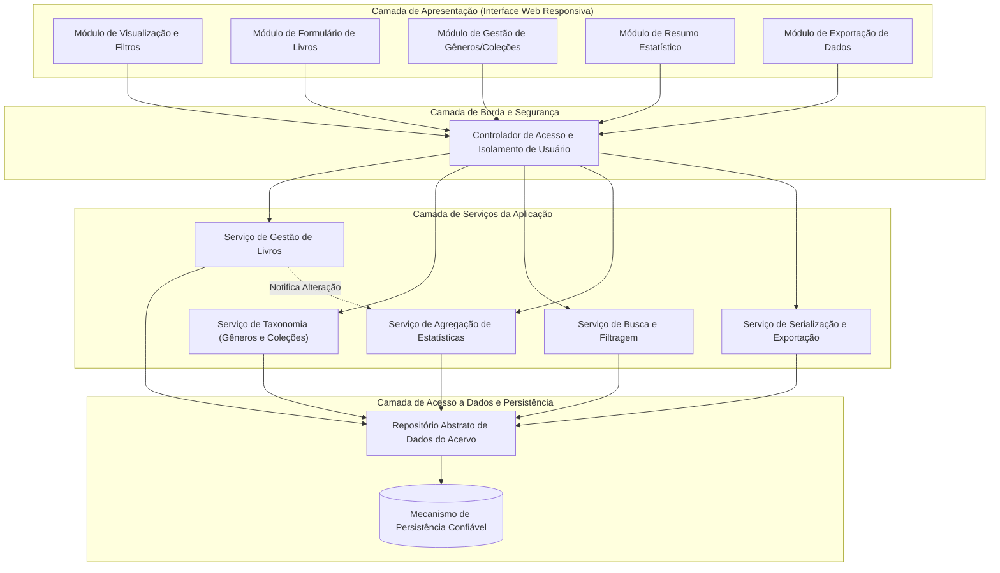
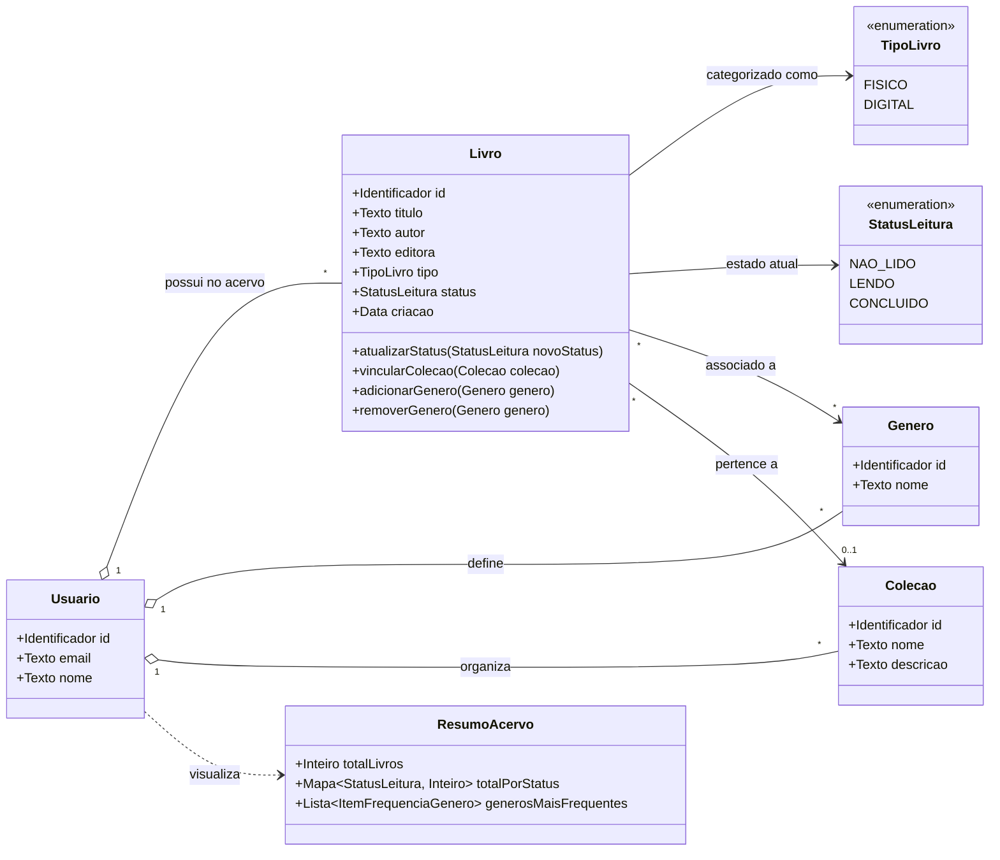
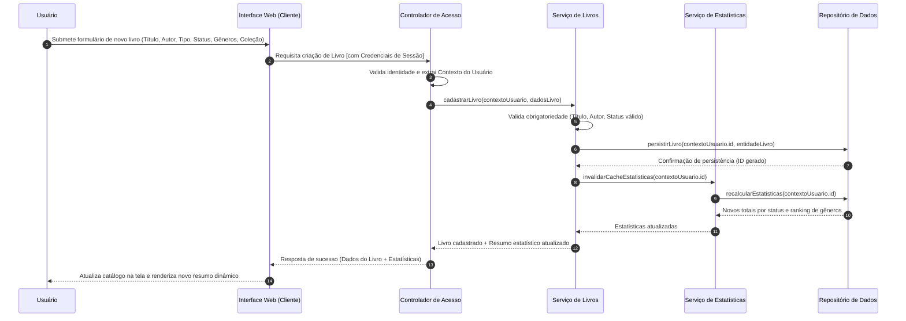

# Relatório Técnico de Arquitetura de Software

## 1. Identificação das HUs

Abaixo estão consolidadas as Histórias de Usuário extraídas da especificação do sistema de catalogação de livros, com foco no perfil **Usuário**:

| ID | Título | Declaração da História | Critérios de Aceite Principais |
| :--- | :--- | :--- | :--- |
| **HU01** | Cadastrar livro | Como usuário, quero cadastrar um livro com título, autor, editora, tipo (físico/digital) e status de leitura, para registrá-lo no meu acervo pessoal. | • Título e autor obrigatórios. • Status restrito a: *não lido*, *lendo*, *concluído*. • Disponibilidade imediata no acervo. |
| **HU02** | Atualizar status de leitura | Como usuário, quero atualizar o status de leitura de um livro, para registrar meu progresso ao longo do tempo. | • Alteração livre entre os 3 status a qualquer momento. • Reflexo imediato nas métricas do resumo do acervo. |
| **HU03** | Organizar livros por gênero | Como usuário, quero criar gêneros literários e associar livros a eles, para categorizar meu acervo de forma organizada. | • CRUD de gêneros. • Associação N:N (um livro com múltiplos gêneros). • Deleção de gênero apenas desvincula, sem deletar livros. |
| **HU04** | Organizar livros por coleção | Como usuário, quero criar coleções e agrupar livros dentro delas, para organizar séries, sagas ou agrupamentos temáticos. | • CRUD de coleções. • Associação 1:N (um livro pertence a no máximo uma coleção). • Deleção de coleção apenas desvincula, sem deletar livros. |
| **HU05** | Filtrar o acervo | Como usuário, quero filtrar meu acervo por qualquer atributo, para localizar livros específicos com facilidade. | • Combinação de múltiplos filtros simultâneos. • Atualização dinâmica dos resultados. • Ação de limpeza de todos os filtros com um clique. |
| **HU06** | Pesquisar livros por título ou autor | Como usuário, quero pesquisar livros digitando parte do título ou autor, para encontrar rapidamente um registro no acervo. | • Correspondência parcial (substring). • Busca dinâmica/reativa conforme digitação. |
| **HU07** | Visualizar resumo do acervo | Como usuário, quero visualizar um resumo com estatísticas do meu acervo, para entender meu comportamento de leitura e composição. | • Total geral e total por status de leitura. • Listagem de gêneros mais frequentes. • Atualização reativa a alterações no acervo. |
| **HU08** | Exportar o acervo | Como usuário, quero exportar todos os dados do meu acervo em CSV ou JSON, para fazer backup pessoal ou usar em outras ferramentas. | • Inclusão de todos os metadados do livro. • Seleção entre formatos CSV e JSON. • Download direto disparado pela interface do cliente. |

---

## 2. Diagramas de Arquitetura (Mermaid)

### 2.1. Diagrama de Componentes de Alto Nível (Visão Funcional e Lógica)

### 2.2. Diagrama de Classes de Domínio Conceitual

### 2.3. Diagrama de Sequência: Cadastro de Livro com Atualização Reativa de Estatísticas

---

## 3. Decisões de Arquitetura

* **DA01 — Isolamento Lógico de Domínio por Usuário (Multi-tenant Lógico):**
  * *Contexto:* O RNF01 exige que o acervo seja estritamente pessoal e inacessível por outros usuários.
  * *Decisão:* Toda consulta, mutação e chave primária/estrangeira no repositório de persistência conterá obrigatoriamente o identificador do usuário proprietário (`usuario_id`). A camada de segurança intercepta as chamadas na borda e anexa o contexto autenticado do usuário em todas as operações de domínio.

* **DA02 — Desacoplamento entre Ciclo de Vida de Metadados e Livros (Taxonomias Fracas):**
  * *Contexto:* Os requisitos HU03 e HU04 estabelecem que a remoção de um gênero ou coleção não deve excluir os livros relacionados, apenas desvinculá-los.
  * *Decisão:* O modelo relacional/conceitual define a exclusão de Gênero e Coleção sob a regra de desassociação nula (`ON DELETE SET NULL` para coleção e `ON DELETE CASCADE` estritamente na tabela de junção N:N de gêneros), impedindo a propagação de deleção em cascata para as entidades de Livro.

* **DA03 — Motor Unificado de Filtros e Busca Composta:**
  * *Contexto:* O RF09, RF12, HU05 e HU06 demandam filtragem combinada simultânea (múltiplos campos) e busca por correspondência parcial de strings (título e autor) com tempo de resposta inferior a 2 segundos (RNF03).
  * *Decisão:* Implementação de uma interface unificada de especificação de consulta (`QuerySpecification`), capaz de montar filtros dinâmicos indexados (autor, editora, status, tipo, coleção, gêneros) somados a predicados de busca textual não exata.

* **DA04 — Processamento de Agregação e Estatísticas Orientado a Evento de Mutação:**
  * *Contexto:* RNF05 e HU07 exigem que as estatísticas (totais por status e gêneros mais frequentes) reflitam alterações em tempo real.
  * *Decisão:* Qualquer mutação de livro (criação, alteração de status, exclusão, troca de gênero) dispara uma notificação síncrona/reativa para o componente de agregação de métricas, permitindo o recálculo imediato e a devolução do resumo consolidado na mesma transação ou por meio de atualização de estado da interface.

* **DA05 — Serialização Flexível de Exportação Sem Acoplamento de Armazenamento:**
  * *Contexto:* RNF07 e HU08 exigem geração de arquivos CSV e JSON para download direto no navegador.
  * *Decisão:* A exportação é processada por um pipeline de projeção de dados (Transformação de Entidades -> DTO de Exportação -> Formatador CSV/JSON) gerando fluxo de dados transferível em tempo real, sem necessidade de escrita permanente de arquivos intermediários no servidor.

---

## 4. Tabela de Componentes e Rastreabilidade

| Componente | Responsabilidade Principal | Comunica-se com | Origem (HU / Critério de Aceite) |
| :--- | :--- | :--- | :--- |
| **Controlador de Acesso** | Autenticar o usuário, isolar escopo de dados e injetar o contexto de segurança nas requisições. | Interface Web, Serviços da Aplicação | RNF01 |
| **Serviço de Gestão de Livros** | Orquestrar o ciclo de vida dos livros (cadastro, edição, remoção, alteração de status) e validar campos obrigatórios. | Repositório de Dados, Serviço de Estatísticas, Controlador de Acesso | RF01, RF02, RF03, RF04, RF05, RF13, HU01, HU02 |
| **Serviço de Taxonomia** | Gerenciar o ciclo de vida de gêneros literários e coleções, garantindo regras de desvinculação não destrutiva. | Repositório de Dados, Controlador de Acesso | RF06, RF07, RF08, HU03, HU04 |
| **Serviço de Busca e Filtragem** | Executar buscas textuais parciais (título/autor) e aplicar combinações dinâmicas de múltiplos filtros em tempo hábil (<2s). | Repositório de Dados, Interface Web | RF09, RF12, RNF03, HU05, HU06 |
| **Serviço de Agregação e Estatísticas** | Calcular totais de acervo, distribuição por status de leitura e ranking de frequência de gêneros em tempo real. | Repositório de Dados, Serviço de Gestão de Livros, Interface Web | RF10, RF11, RNF05, HU07 |
| **Serviço de Exportação** | Projetar os dados integrais do acervo do usuário e serializá-los sob demanda nos formatos CSV e JSON. | Repositório de Dados, Interface Web | RNF07, HU08 |
| **Repositório Abstrato de Dados** | Prover persistência confiável, isolamento por chave de usuário e integridade referencial dos registros. | Mecanismo de Persistência, Serviços da Aplicação | RNF04 |
| **Interface Web Responsiva** | Apresentar catálogo, formulários, painel estatístico reativo, acionar filtros rápidos e disparar downloads. | Controlador de Acesso, Usuário | RNF02, RNF06, HU01-HU08 |

---

## 5. Bloqueios e Pendências

1. **Gestão do Ciclo de Vida de Identidades:** Os requisitos determinam autenticação e isolamento de acervo (RNF01), porém não especificam o fluxo de autocadastro de contas de usuários, redefinição de credenciais ou encerramento de conta.
2. **Estratégia para Empate no Ranking de Gêneros:** Não há definição sobre critérios de desempate ou limite quantitativo fixo (ex.: "Top 5" ou "Top 10") para a listagem dos gêneros mais frequentes (RF11, HU07).
3. **Volume Limite para Exportação Síncrona:** A exportação direta via navegador para bibliotecas de grande porte pode exigir estratégias de streaming ou paginação contínua para manter a estabilidade da memória do cliente/servidor.
4. **Política de Normalização de Gêneros e Coleções:** A especificação permite criar gêneros livremente, mas não define regras de tratamento para nomes duplicados (ex.: "Ficção Científica" vs. "ficção científica").

---

## 6. Cobertura de Requisitos

A matriz abaixo demonstra a cobertura completa dos Requisitos Funcionais (RF) e Não Funcionais (RNF) pelas Histórias de Usuário, Componentes e Decisões de Arquitetura:

| Requisito | Tipo | História de Usuário (HU) | Componente Responsável | Decisão de Arquitetura |
| :---: | :---: | :---: | :--- | :---: |
| **RF01** | Funcional | HU01 | Serviço de Gestão de Livros, Interface Web | DA01 |
| **RF02** | Funcional | HU01, HU02 | Serviço de Gestão de Livros | DA01 |
| **RF03** | Funcional | HU01 | Serviço de Gestão de Livros | DA01, DA02 |
| **RF04** | Funcional | HU01, HU02 | Serviço de Gestão de Livros | - |
| **RF05** | Funcional | HU02 | Serviço de Gestão de Livros, Serviço de Estatísticas | DA04 |
| **RF06** | Funcional | HU03 | Serviço de Taxonomia | DA02 |
| **RF07** | Funcional | HU04 | Serviço de Taxonomia | DA02 |
| **RF08** | Funcional | HU03, HU04 | Serviço de Taxonomia, Serviço de Gestão de Livros | DA02 |
| **RF09** | Funcional | HU05 | Serviço de Busca e Filtragem | DA03 |
| **RF10** | Funcional | HU07 | Serviço de Agregação e Estatísticas | DA04 |
| **RF11** | Funcional | HU07 | Serviço de Agregação e Estatísticas | DA04 |
| **RF12** | Funcional | HU06 | Serviço de Busca e Filtragem | DA03 |
| **RF13** | Funcional | HU01 | Serviço de Gestão de Livros | - |
| **RNF01** | Não Funcional | Todas | Controlador de Acesso, Repositório Abstrato | DA01 |
| **RNF02** | Não Funcional | Todas | Interface Web Responsiva | - |
| **RNF03** | Não Funcional | HU05, HU06 | Serviço de Busca e Filtragem, Repositório | DA03 |
| **RNF04** | Não Funcional | Todas | Repositório Abstrato de Dados | DA01, DA02 |
| **RNF05** | Não Funcional | HU02, HU07 | Serviço de Agregação e Estatísticas | DA04 |
| **RNF06** | Não Funcional | Todas | Interface Web Responsiva | - |
| **RNF07** | Não Funcional | HU08 | Serviço de Exportação | DA05 |

---

## 7. Gap Analysis

| Item / Lacuna Identificada | Impacto Arquitetural | Ação Recomendada para o Time de Engenharia |
| :--- | :--- | :--- |
| **1. Ausência de especificação para Provedor de Identidade (IdP)** | A arquitetura precisa garantir a segregação de inquilinos (RNF01), mas não possui escopo definido de gerenciamento de credenciais (senhas, tokens, recuperação). | Adotar um módulo padrão de autenticação baseado em padrões abertos de tokens de sessão, isolando a verificação de credenciais do domínio da aplicação. |
| **2. Falta de paginação formal para grandes coleções** | Consultas massivas com múltiplos filtros podem violar o RNF03 (resposta em até 2s) caso o acervo cresça sem paginação no cliente ou servidor. | Projetar a interface do Repositório de Dados com suporte nativo a paginação por cursor/deslocamento (`limit/offset`), aplicando-a transparentemente na listagem do acervo. |
| **3. Comportamento de concorrência e idempotência nas estatísticas** | Mutações rápidas e concorrentes no catálogo podem gerar leituras inconsistentes no painel estatístico se o cálculo depender de pipelines não transacionais. | Executar as consultas de sumarização agregada com isolamento transacional consistente ou calcular métricas através de agregações indexadas no repositório de dados. |
| **4. Estrutura e formatação de caracteres na exportação CSV** | Falta de definição sobre delimitadores (vírgula vs. ponto e vírgula) e codificação de caracteres (UTF-8 com BOM) pode corromper caracteres acentuados em editores de planilhas. | Padronizar a exportação CSV sob a especificação RFC 4180 com codificação UTF-8 explícita e tratamento de escape em campos textuais. |