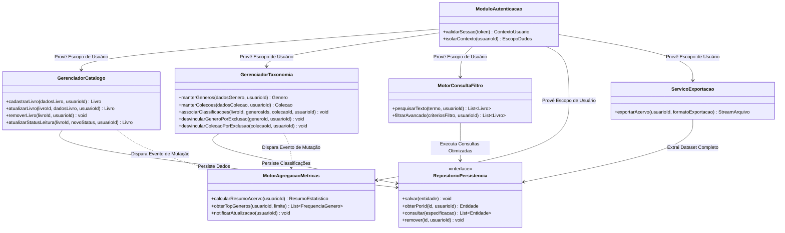
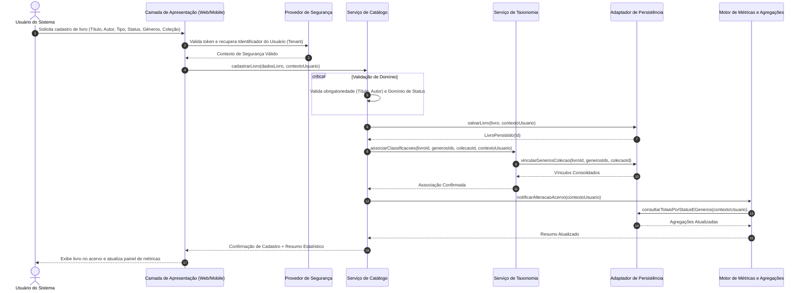

# Relatório Técnico de Arquitetura de Software

## 1. Identificação das HUs

| ID | Título | Descrição Resumida | Critérios de Aceite Chave | Requisitos Vinculados |
| :--- | :--- | :--- | :--- | :--- |
| **HU01** | Cadastrar livro | Registro de novos itens no acervo pessoal informando título, autor, editora, tipo e status. | - Título e autor obrigatórios.<br>- Status dentre: não lido, lendo, concluído.<br>- Atualização imediata do acervo. | RF01, RF04, RF13, RNF01, RNF04 |
| **HU02** | Atualizar status de leitura | Alteração dinâmica do estado de leitura de uma obra. | - Transição livre entre estados.<br>- Reflexo imediato no painel estatístico. | RF02, RF04, RF05, RNF04, RNF05 |
| **HU03** | Organizar livros por gênero | Gestão e categorização de gêneros literários associados aos livros. | - CRUD de gêneros.<br>- Associação N:N (um livro, múltiplos gêneros).<br>- Desvinculação não destrutiva de livros ao excluir gênero. | RF06, RF08, RNF04 |
| **HU04** | Organizar livros por coleção | Agrupamento de livros em coleções, séries ou sagas temáticas. | - CRUD de coleções.<br>- Associação 1:N (um livro pertence a no máximo uma coleção).<br>- Desvinculação não destrutiva de livros ao excluir coleção. | RF07, RF08, RNF04 |
| **HU05** | Filtrar o acervo | Consulta combinatória multidimensional no catálogo do usuário. | - Combinação de múltiplos filtros simultâneos.<br>- Atualização dinâmica.<br>- Ação de limpeza global de filtros. | RF09, RNF02, RNF03 |
| **HU06** | Pesquisar livros por título ou autor | Busca textual parcial e incremental em tempo real. | - Retorno por correspondência parcial de termos.<br>- Feedback dinâmico durante digitação. | RF12, RNF02, RNF03 |
| **HU07** | Visualizar resumo do acervo | Exibição de métricas e agregações estatísticas da biblioteca. | - Totalizadores globais e segregados por status.<br>- Relação de gêneros mais frequentes.<br>- Recálculo reativo a mutações no acervo. | RF10, RF11, RNF05 |
| **HU08** | Exportar o acervo | Extração integral estruturada dos dados para arquivo local. | - Inclusão de todos os metadados dos livros.<br>- Formatos suportados: CSV e JSON.<br>- Download direto disparado pela interface. | RNF07 |

---

## 2. Diagramas de Arquitetura (Mermaid)

### 2.1. Diagrama Estrutural de Componentes Lógicos



---

### 2.2. Diagrama de Sequência: Ciclo de Cadastro, Classificação e Atualização de Resumo



---

## 3. Decisões de Arquitetura

### 3.1. Isolamento Lógico de Dados por Usuário (Multi-tenancy a Nível de Aplicação)
* **Decisão:** Todas as operações de leitura, escrita, indexação e exportação devem ser parametrizadas obrigatoriamente pelo identificador único do usuário autenticado no contexto da requisição (`usuarioId`).
* **Justificativa:** Atende ao RNF01, assegurando que o acervo seja estritamente pessoal e inacessível por terceiros, sem necessidade de isolamento físico de infraestrutura para cada usuário.

### 3.2. Modelo de Domínio e Relacionamentos Taxonômicos
* **Decisão:**
  * A entidade `Livro` possui cardinalidade N:M com `Genero` e cardinalidade N:0..1 com `Colecao`.
  * `TipoLivro` é modelado como um enum discriminador (`FISICO`, `DIGITAL`).
  * `StatusLeitura` é restrito a um enum (`NAO_LIDO`, `LENDO`, `CONCLUIDO`).
  * As chaves estrangeiras entre `Livro`, `Genero` e `Colecao` devem implementar a política de nulificação (`ON DELETE SET NULL` ou desvinculação em tabela associativa intermediária), garantindo que a remoção de gêneros ou coleções não exclua os livros associados (HU03, HU04).

### 3.3. Pipeline Reativo/Síncrono para Métricas e Resumos
* **Decisão:** O recálculo de estatísticas (total geral, totais por status e ranking de gêneros) deve ocorrer como consequência atômica ou evento disparado por qualquer comando de mutação (criação, edição, atualização de status e remoção de livros ou gêneros).
* **Justificativa:** Satisfaz o RNF05 e o critério de aceite da HU02/HU07, garantindo a consistência imediata do painel informativo para o usuário.

### 3.4. Mecanismo de Busca Incremental e Filtragem Composta
* **Decisão:** O mecanismo de consulta deve disponibilizar uma interface capaz de compor dinamicamente predicados lógicos (conjunções aditivas/`AND`) para busca textual parcial (`LIKE`/`Contains` em título e autor) e filtros categóricos exatos (status, formato, gênero, coleção).
* **Justificativa:** Cumpre os requisitos RF09, RF12, HU05, HU06 e garante tempos de resposta inferiores a 2 segundos (RNF03).

### 3.5. Desacoplamento da Camada de Exportação
* **Decisão:** O subsistema de exportação operará como um serviço de transformação de dados que consome a projeção integral do catálogo do usuário sob demanda, canalizando a saída diretamente para a resposta binária/textual (*streaming*) nos formatos CSV e JSON.
* **Justificativa:** Atende ao RNF07 e HU08 sem reter arquivos temporários desnecessários no armazenamento central.

---

## 4. Tabela de Componentes e Rastreabilidade

| Componente | Responsabilidade Principal | Comunica-se com | Origem (HU / Critério de Aceite) |
| :--- | :--- | :--- | :--- |
| **Controlador/Fronteira de Autenticação** | Validar identidade do requisitante e injetar o contexto de segurança/tenant nas requisições. | Interface de Usuário, Todos os Serviços de Negócio | RNF01, HU01 a HU08 |
| **Módulo de Gestão de Acervo (Catálogo)** | Orquestrar o ciclo de vida dos livros (cadastro, edição, alteração de status e exclusão). | Adaptador de Persistência, Motor de Taxonomia, Motor de Métricas | HU01, HU02, RF01, RF02, RF03, RF04, RF05, RF13 |
| **Módulo de Taxonomia (Gêneros e Coleções)** | Gerenciar o ciclo de vida de gêneros e coleções e aplicar regras de desvinculação não-destrutiva. | Adaptador de Persistência, Motor de Métricas | HU03, HU04, RF06, RF07, RF08 |
| **Motor de Busca e Filtragem** | Processar consultas combinadas multidimensionais e pesquisas textuais parciais em tempo real. | Adaptador de Persistência, Interface de Usuário | HU05, HU06, RF09, RF12, RNF03 |
| **Motor de Métricas e Agregações** | Computar volumes totais por status de leitura e classificar gêneros por frequência relativa. | Adaptador de Persistência, Interface de Usuário | HU07, RF10, RF11, RNF05 |
| **Serviço de Exportação de Dados** | Extrair e serializar o catálogo integral do usuário nos formatos CSV e JSON para download. | Adaptador de Persistência, Interface de Usuário | HU08, RNF07 |
| **Camada de Acesso a Dados (Persistência)** | Abstrair operações de armazenamento atômico e transacional, garantindo integridade e durabilidade. | Banco de Dados / Mecanismo de Armazenamento | RNF04 |

---

## 5. Bloqueios e Pendências

1. **Ciclo de Vida de Identidades de Usuário:** A especificação de requisitos define a necessidade de isolamento e autenticação (RNF01), porém não detalha regras para cadastro de novos usuários, recuperação de credenciais ou encerramento de conta.
2. **Definição de Limites Operacionais e Paginação:** A exigência de tempo de resposta inferior a 2 segundos (RNF03) em listagens e filtros, associada ao critério de exibição imediata do acervo, não explicita se a interface deve adotar paginação por demanda, rolagem infinita ou carregamento integral de coleções extensas.
3. **Comportamento de Conflito em Importação/Duplicidade:** Não há regra explícita determinando se o sistema deve impedir ou permitir o cadastro de livros duplicados (mesmo título/autor) para um mesmo usuário.
4. **Padronização de Caracteres na Exportação CSV:** Pendente a definição da convenção de codificação (ex: UTF-8 com/sem BOM) e do caractere delimitador (vírgula ou ponto-e-vírgula) para compatibilidade com softwares de planilha locais.

---

## 6. Cobertura de Requisitos

```
[RF01] -> Módulo de Gestão de Acervo (HU01)
[RF02] -> Módulo de Gestão de Acervo (HU01, HU02)
[RF03] -> Módulo de Gestão de Acervo (HU01)
[RF04] -> Módulo de Gestão de Acervo (HU01, HU02)
[RF05] -> Módulo de Gestão de Acervo (HU02)
[RF06] -> Módulo de Taxonomia (HU03)
[RF07] -> Módulo de Taxonomia (HU04)
[RF08] -> Módulo de Taxonomia + Gestão de Acervo (HU03, HU04)
[RF09] -> Motor de Busca e Filtragem (HU05)
[RF10] -> Motor de Métricas e Agregações (HU07)
[RF11] -> Motor de Métricas e Agregações (HU07)
[RF12] -> Motor de Busca e Filtragem (HU06)
[RF13] -> Módulo de Gestão de Acervo (HU01)

[RNF01] -> Controlador/Fronteira de Autenticação + Isolamento Lógico (Decisão 3.1)
[RNF02] -> Camada de Apresentação (Responsividade Desktop/Mobile)
[RNF03] -> Motor de Busca e Filtragem + Indexação de Acesso a Dados (Decisão 3.4)
[RNF04] -> Camada de Acesso a Dados (Persistência Transacional)
[RNF05] -> Motor de Métricas e Agregações + Pipeline Reativo (Decisão 3.3)
[RNF06] -> Camada de Apresentação (Conformidade Web Standard)
[RNF07] -> Serviço de Exportação de Dados (Decisão 3.5, HU08)
```

---

## 7. Gap Analysis

| Lacuna Identificada | Impacto Arquitetural | Ação Recomendada |
| :--- | :--- | :--- |
| **Ausência de Identificadores Padrão da Indústria (ex: ISBN)** | A busca e integridade de registros dependem exclusivamente de cadeias de caracteres de Título/Autor, sujeitas a variações ortográficas e duplicidades. | Incluir campo opcional para identificador padronizado (ex: ISBN/ASIN) no contrato de dados da entidade `Livro`. |
| **Volume de Dados vs. Renderização sem Paginação** | Se um usuário possuir milhares de livros, a transferência integral dos registros para renderização dinâmica violará o SLA de 2 segundos (RNF03) em clientes móveis. | Projetar a API de consulta com suporte a paginação cursor-based ou offset-limit transparente, mantendo a contagem global desacoplada. |
| **Estratégia de Notificação de Métricas em Tempo Real** | O requisito RNF05 exige atualização em tempo real do resumo estatístico. A ausência de padrão de comunicação pode levar a polling excessivo ou sobrecarga na interface. | Adotar padrão de resposta composta (a mutação retorna o objeto modificado e o resumo recalculado) ou mensageria de eventos em tempo real no cliente. |
| **Mecanismo de Desfazimento de Exclusão (Soft Delete vs Hard Delete)** | A remoção acidental de um livro (RF03) ou gênero (RF06) acarreta perda imediata de histórico. | Definir formalmente se a arquitetura de persistência implementará exclusão lógica (*soft delete*) ou remoção física imediata. |