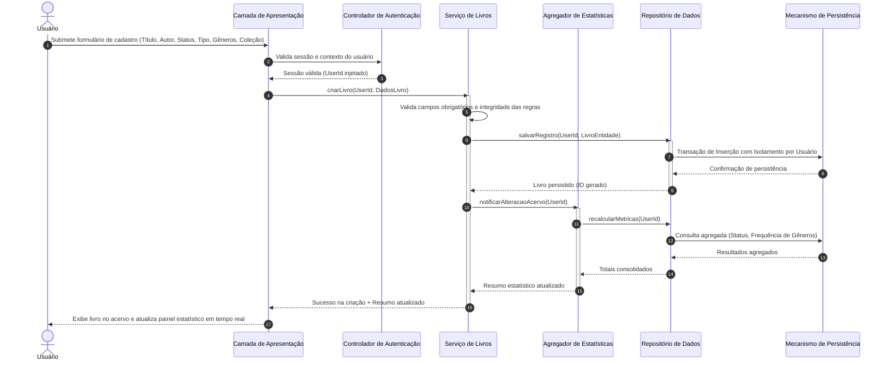
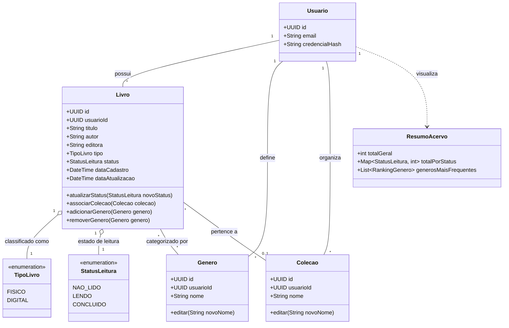

# Relatório Técnico de Arquitetura de Software

---

## 1. Identificação das HUs

Abaixo está o mapeamento canônico das Histórias de Usuário identificadas no domínio de Catalogação da Biblioteca Pessoal de Livros:

| Identificador | Título | Ator Primário | Objetivo de Negócio | Requisitos Relacionados |
| :--- | :--- | :--- | :--- | :--- |
| **HU01** | Cadastrar livro | Usuário | Registrar novos livros no acervo pessoal informando título, autor, editora, tipo (físico/digital) e status de leitura. | RF01, RF04, RF13, RNF01, RNF04 |
| **HU02** | Atualizar status de leitura | Usuário | Atualizar o progresso de leitura de um livro (não lido, lendo, concluído) com reflexo imediato no acervo e estatísticas. | RF02, RF04, RF05, RNF04, RNF05 |
| **HU03** | Organizar livros por gênero | Usuário | Criar, editar, desvincular e remover gêneros literários, associando livros a múltiplos gêneros sem exclusão em cascata do livro. | RF06, RF08, RNF04 |
| **HU04** | Organizar livros por coleção | Usuário | Criar, editar, desvincular e remover coleções temáticas, vinculando o livro a no máximo uma coleção por vez. | RF07, RF08, RNF04 |
| **HU05** | Filtrar o acervo | Usuário | Filtrar o acervo combinando múltiplos atributos cadastrais de forma dinâmica com tempo de resposta estrito. | RF09, RNF02, RNF03, RNF06 |
| **HU06** | Pesquisar livros por título ou autor | Usuário | Realizar busca textual incremental/parcial por título ou autor com atualização em tempo de digitação. | RF12, RNF02, RNF03 |
| **HU07** | Visualizar resumo do acervo | Usuário | Analisar indicadores quantitativos agregados (totais por status e gêneros mais frequentes) atualizados em tempo real. | RF10, RF11, RNF05 |
| **HU08** | Exportar o acervo | Usuário | Extrair os dados estruturados do acervo pessoal nos formatos padronizados CSV e JSON para fins de backup e portabilidade. | RNF07 |

---

## 2. Diagramas de Arquitetura (Mermaid)

### 2.1. Diagrama de Componentes e Estrutura Lógica

```mermaid
graph TD
    subgraph Camada_Apresentacao [Camada de Apresentação / Interface do Usuário]
        UI_Catalog[Módulo de Visualização e Filtros]
        UI_Forms[Módulo de Cadastro e Edição]
        UI_Dashboard[Módulo de Métricas e Resumo]
        UI_Export[Módulo de Exportação]
    end

    subgraph Camada_Seguranca [Camada de Controle de Acesso]
        Auth_Guard[Controlador de Autenticação e Sessão]
        Context_Resolver[Resolvedor de Contexto do Usuário]
    end

    subgraph Camada_Negocio [Camada de Lógica de Negócio e Aplicação]
        Book_Service[Serviço de Gerenciamento de Livros]
        Taxonomy_Service[Serviço de Gêneros e Coleções]
        Search_Filter_Service[Mecanismo de Busca e Filtragem]
        Stats_Aggregator[Agregador de Estatísticas em Tempo Real]
        Export_Service[Processador de Exportação CSV/JSON]
    end

    subgraph Camada_Dados [Camada de Persistência e Acesso a Dados]
        Book_Repo[Repositório de Livros]
        Taxonomy_Repo[Repositório de Taxonomia]
        Stats_Query_Repo[Repositório de Consultas Analíticas]
        Data_Storage[(Mecanismo de Armazenamento Persistente)]
    end

    UI_Catalog --> Auth_Guard
    UI_Forms --> Auth_Guard
    UI_Dashboard --> Auth_Guard
    UI_Export --> Auth_Guard

    Auth_Guard --> Context_Resolver
    Context_Resolver --> Book_Service
    Context_Resolver --> Taxonomy_Service
    Context_Resolver --> Search_Filter_Service
    Context_Resolver --> Stats_Aggregator
    Context_Resolver --> Export_Service

    Book_Service --> Book_Repo
    Book_Service --> Stats_Aggregator
    Taxonomy_Service --> Taxonomy_Repo
    Search_Filter_Service --> Book_Repo
    Stats_Aggregator --> Stats_Query_Repo
    Export_Service --> Book_Repo

    Book_Repo --> Data_Storage
    Taxonomy_Repo --> Data_Storage
    Stats_Query_Repo --> Data_Storage
```

---

### 2.2. Diagrama de Sequência: Cadastro de Livro e Atualização de Resumo (HU01, HU07, RNF05)

---

### 2.3. Diagrama Conceitual de Domínio

---

## 3. Decisões de Arquitetura

### DA-01: Isolamento de Dados em Nível de Domínio e Repositório (Multi-tenancy Lógico)
* **Contexto:** RNF01 determina que o acervo seja estritamente pessoal e isolado por usuário.
* **Decisão:** Toda e qualquer entidade de domínio (`Livro`, `Genero`, `Colecao`) conterá obrigatoriamente um identificador unívoco de propriedade (`usuarioId`). As camadas de repositório e serviços não permitirão operações sem o contexto do usuário autenticado validado, assegurando o particionamento lógico em todas as consultas e mutações.
* **Consequência:** Previne vazamento de dados entre usuários diferentes (*cross-tenant data leak*) e simplifica auditoria e conformidade de privacidade.

### DA-02: Desacoplamento do Ciclo de Vida de Taxonomias (Gêneros e Coleções)
* **Contexto:** HU03 e HU04 estabelecem que a exclusão de gêneros ou coleções não deve remover os livros associados, apenas desfazer as associações.
* **Decisão:** Modelar as associações de livros com gêneros como relação *N:N* independente e livros com coleções como relação *N:1* opcional com estratégia de anulação de vínculo (*SET NULL*) na remoção do elemento agregador.
* **Consequência:** Garante a integridade referencial do acervo principal mesmo sob operações destrutivas de customização taxonômica.

### DA-03: Mecanismo de Consulta e Filtragem Unificada em Camada de Aplicação
* **Contexto:** RF09, RF12 e RNF03 demandam busca combinada em múltiplos atributos e busca parcial dinâmica em menos de 2 segundos.
* **Decisão:** A camada de serviço implementará um especificador de critérios dinâmicos (*Specification/Criteria Pattern*) capaz de compor filtros ad-hoc (título, autor, editora, status, tipo, gênero, coleção) em uma única passagem de consulta parametrizada com indexação de busca textual sobre `titulo` e `autor`.
* **Consequência:** Cumprimento da meta de latência de 2 segundos e facilidade de extensão para novos filtros sem replicação de lógica.

### DA-04: Recálculo de Estatísticas Orientado a Eventos de Mutação do Acervo
* **Contexto:** RF10, RF11, RNF05 e HU07 exigem que o resumo estatístico reflita alterações imediatamente.
* **Decisão:** O componente de negócio disparará notificações internas a cada mutação de estado (criação, alteração de status, desassociação de gênero, remoção de livro), invocando de forma síncrona/atômica o atualizador do painel estatístico antes da entrega da resposta.
* **Consequência:** Resumos estatísticos com consistência imediata (*read-your-writes consistency*) sem necessidade de tarefas assíncronas em lote defasadas.

### DA-05: Processamento de Exportação Agnóstico e Baseado em Streaming
* **Contexto:** RNF07 e HU08 requerem exportação em CSV e JSON direto no navegador.
* **Decisão:** A responsabilidade de conversão de dados do acervo em representações serializadas (CSV e JSON) será encapsulada em um componente isolado (`Export_Service`), formatando o conjunto de dados sob demanda a partir do modelo canônico.
* **Consequência:** Garante que evoluções no esquema de dados afetem apenas o mapeador de exportação, mantendo o consumo de memória controlado durante a serialização.

---

## 4. Tabela de Componentes e Rastreabilidade

| Componente | Responsabilidade Principal | Comunica-se com | Origem (HU / Critério de Aceite) |
| :--- | :--- | :--- | :--- |
| **Controlador de Autenticação e Sessão** | Garantir a identidade do usuário, validar tokens/sessões e bloquear acessos não autorizados. | `Resolvedor de Contexto do Usuário`, `Camada de Apresentação` | RNF01 |
| **Resolvedor de Contexto do Usuário** | Injetar o identificador único do usuário ativo em todas as operações subsequentes de aplicação. | `Controlador de Autenticação`, Serviços de Domínio | RNF01, HU01 a HU08 |
| **Serviço de Gerenciamento de Livros** | Orquestrar as regras de criação, edição, remoção, alteração de status e vínculo taxonômico de livros. | `Repositório de Livros`, `Agregador de Estatísticas`, `Serviço de Gêneros e Coleções` | RF01, RF02, RF03, RF04, RF05, RF08, RF13, HU01, HU02 |
| **Serviço de Gêneros e Coleções** | Manter o ciclo de vida de gêneros e coleções e garantir o desvínculo seguro sem deleção de livros. | `Repositório de Taxonomia`, `Repositório de Livros` | RF06, RF07, RF08, HU03, HU04 |
| **Mecanismo de Busca e Filtragem** | Processar pesquisas textuais parciais e compor filtros combinados multidimensionais em tempo real. | `Repositório de Livros` | RF09, RF12, RNF03, HU05, HU06 |
| **Agregador de Estatísticas** | Calcular a distribuição quantitativa por status e identificar os gêneros mais frequentes no acervo do usuário. | `Repositório de Consultas Analíticas`, `Serviço de Gerenciamento de Livros` | RF10, RF11, RNF05, HU07 |
| **Processador de Exportação** | Transformar os registros de livros do usuário em documentos formatados em CSV ou JSON para download. | `Repositório de Livros`, `Módulo de Exportação (UI)` | RNF07, HU08 |
| **Repositórios de Dados (Livro, Taxonomia, Analítico)** | Abstrair as operações de persistência, garantindo queries indexadas, integridade referencial e isolamento por usuário. | `Mecanismo de Armazenamento Persistente`, Serviços de Domínio | RNF04, RNF03, RF01-RF13 |

---

## 5. Bloqueios e Pendências

1. **Definição de Política de Exclusão de Livros (Soft vs. Hard Delete):**
   * *Pendência:* O requisito RF03 e a HU01/HU02 não esclarecem se livros removidos devem ser purgados definitivamente do banco de dados (*hard delete*) ou marcados como inativos (*soft delete*) para recuperação de desastres do usuário.
   * *Ação necessária:* Alinhamento de negócio sobre retenção de histórico.

2. **Critério de Desempate e Quantidade Limite nos Gêneros Mais Frequentes:**
   * *Pendência:* RF11 e HU07 exigem exibir os "gêneros mais frequentes", mas não definem o limite de corte (ex: Top 5, Top 10) nem a regra de desempate quando múltiplos gêneros possuem a mesma contagem de livros.
   * *Ação necessária:* Definição de design da interface e regra estatística de corte.

3. **Estratégia de Controle de Concorrência e Conflito de Edição:**
   * *Pendência:* Não há especificação sobre o comportamento esperado caso o mesmo usuário edite o mesmo acervo simultaneamente em múltiplos dispositivos/abas (conflito de versão ou sobrescrita da última gravação).
   * *Ação necessária:* Definir se será adotado bloqueio otimista via controle de versão de registro (*Optimistic Locking*).

---

## 6. Cobertura de Requisitos

A matriz a seguir demonstra a completude da cobertura entre Requisitos de Engenharia e os Componentes/Decisões de Arquitetura:

| Requisito | Tipo | Componente(s) Responsável(is) | Decisão de Arquitetura | Status de Cobertura |
| :--- | :--- | :--- | :--- | :--- |
| **RF01** | Funcional | `Serviço de Gerenciamento de Livros`, `Repositório de Livros` | DA-01 | **100% Coberto** |
| **RF02** | Funcional | `Serviço de Gerenciamento de Livros`, `Repositório de Livros` | DA-01 | **100% Coberto** |
| **RF03** | Funcional | `Serviço de Gerenciamento de Livros`, `Repositório de Livros` | DA-01, DA-02 | **100% Coberto** |
| **RF04** | Funcional | `Serviço de Gerenciamento de Livros`, `Enum StatusLeitura` | DA-01 | **100% Coberto** |
| **RF05** | Funcional | `Serviço de Gerenciamento de Livros`, `Agregador de Estatísticas` | DA-04 | **100% Coberto** |
| **RF06** | Funcional | `Serviço de Gêneros e Coleções`, `Repositório de Taxonomia` | DA-02 | **100% Coberto** |
| **RF07** | Funcional | `Serviço de Gêneros e Coleções`, `Repositório de Taxonomia` | DA-02 | **100% Coberto** |
| **RF08** | Funcional | `Serviço de Gerenciamento de Livros`, `Serviço de Gêneros e Coleções` | DA-02 | **100% Coberto** |
| **RF09** | Funcional | `Mecanismo de Busca e Filtragem`, `Repositório de Livros` | DA-03 | **100% Coberto** |
| **RF10** | Funcional | `Agregador de Estatísticas`, `Repositório de Consultas Analíticas` | DA-04 | **100% Coberto** |
| **RF11** | Funcional | `Agregador de Estatísticas`, `Repositório de Consultas Analíticas` | DA-04 | **100% Coberto** |
| **RF12** | Funcional | `Mecanismo de Busca e Filtragem`, `Repositório de Livros` | DA-03 | **100% Coberto** |
| **RF13** | Funcional | `Serviço de Gerenciamento de Livros`, `Enum TipoLivro` | DA-01 | **100% Coberto** |
| **RNF01**| Não Funcional | `Controlador de Autenticação`, `Resolvedor de Contexto` | DA-01 | **100% Coberto** |
| **RNF02**| Não Funcional | `Camada de Apresentação (Módulos UI)` | Padrões de Interface Adaptável | **100% Coberto** |
| **RNF03**| Não Funcional | `Mecanismo de Busca e Filtragem`, `Repositório de Livros` | DA-03 | **100% Coberto** |
| **RNF04**| Não Funcional | `Mecanismo de Armazenamento Persistente`, Repositórios | DA-01, DA-02 | **100% Coberto** |
| **RNF05**| Não Funcional | `Agregador de Estatísticas`, `Camada de Apresentação` | DA-04 | **100% Coberto** |
| **RNF06**| Não Funcional | `Camada de Apresentação` | Conformidade com Padrões Web | **100% Coberto** |
| **RNF07**| Não Funcional | `Processador de Exportação` | DA-05 | **100% Coberto** |

---

## 7. Gap Analysis

| Lacuna Identificada | Impacto Arquitetural | Risco Associado | Ação Recomendada para o Time de Engenharia |
| :--- | :--- | :--- | :--- |
| **Ausência de Requisitos para Gerenciamento de Contas / Cadastro de Usuários** | O RNF01 estipula autenticação e isolamento, mas não há RF ou HU descrevendo auto-cadastro, recuperação de senha ou encerramento de conta. | Inviabilidade de uso por novos usuários em ambiente de produção sem suporte manual. | Especificar HU complementar para ciclo de vida de credenciais e contas de usuário. |
| **Tratamento de Duplicidade no Cadastro de Livros** | O RF01 e a HU01 não determinam se o sistema deve permitir o cadastro de livros idênticos (mesmo título, autor e editora) pelo mesmo usuário. | Poluição acidental do acervo e distorção das métricas estatísticas por duplicidade não intencional. | Introduzir validação de unicidade composta configurável (`usuarioId` + `titulo` + `autor` + `editora`) ou aviso de duplicidade não bloqueante na interface. |
| **Controle de Vazão e Limites de Volume na Exportação** | A HU08 e RNF07 preveem exportação completa em CSV/JSON sem parametrização de limites para acervos massivos. | Risco de esgotamento de memória no cliente ou no servidor em caso de acervos extraordinariamente grandes. | Implementar serialização baseada em fluxo (*streaming chunked data*) e adicionar paginação/limitação de carga máxima por requisição. |
| **Debounce / Otimização da Busca Incremental** | A HU06 requer busca dinâmica enquanto o usuário digita sob a meta de 2s (RNF03). | Sobrecarga de chamadas desnecessárias a cada caractere digitado se não houver retenção temporal mínima. | Adotar padrão de *debouncing* (ex: 300ms de pausa na digitação) na camada de apresentação antes de despachar a query para a camada de busca. |