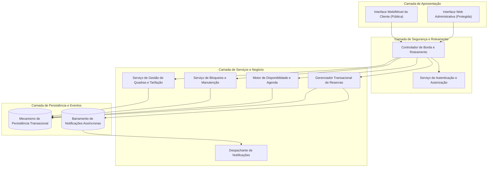
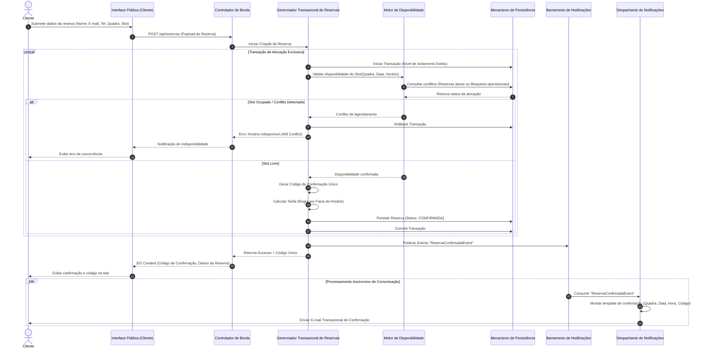
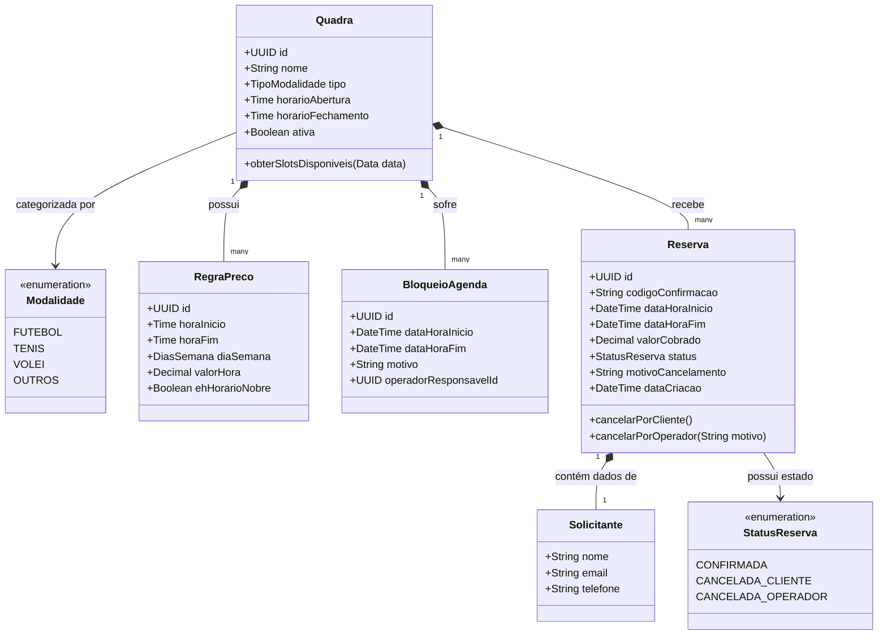

# Relatório Técnico de Arquitetura de Software

## 1. Identificação das HUs

Abaixo está o mapeamento das Histórias de Usuário identificadas, correlacionando atores, escopos funcionais, critérios de aceite e requisitos associados:

| ID | Título | Ator | Descrição Sucinta | Requisitos Vinculados | Critérios de Aceite Chave |
| :--- | :--- | :--- | :--- | :--- | :--- |
| **HU01** | Cadastrar quadra | Operador | Cadastrar quadra com tipo, horário de funcionamento e valor da hora. | RF01, RF12, RNF07 | Campos obrigatórios validados; disponibilidade imediata no catálogo. |
| **HU02** | Bloquear horários para manutenção | Operador | Bloquear horários específicos de uma quadra para manutenção ou feriados. | RF03, RNF05 | Horários bloqueados ficam indisponíveis para clientes; desbloqueio a qualquer momento. |
| **HU03** | Visualizar agenda consolidada | Operador | Visualizar a agenda diária consolidada de todas as quadras em visão única. | RF11, RNF01, RNF02 | Exibição de horários livres/ocupados de todas as quadras; navegação por data. |
| **HU04** | Cancelar reserva com justificativa | Operador | Cancelar reserva de cliente mediante registro obrigatório de motivo. | RF09, RF10, RNF05 | Justificativa mandatória; disparo de notificação de cancelamento por e-mail ao cliente. |
| **HU05** | Consultar disponibilidade sem cadastro | Cliente | Consultar grade de horários livres por quadra e data sem exigência de autenticação. | RF04, RNF01, RNF02, RNF06 | Acesso anônimo via navegador; renderização em até 2s; horários ocupados/bloqueados ocultos ou desabilitados. |
| **HU06** | Realizar reserva | Cliente | Efetuar reserva informando dados pessoais e recebendo código localizador único. | RF05, RF06, RF07, RF10, RNF05 | Bloqueio atômico anti-colisão; geração de código único; confirmação em tela e envio por e-mail. |
| **HU07** | Cancelar minha reserva | Cliente | Cancelar reserva ativa utilizando o código de confirmação gerado. | RF08, RNF05 | Validação estrita do código; liberação transacional imediata do horário. |

---

## 2. Diagramas de Arquitetura (Mermaid)

### 2.1. Visão de Componentes e Estrutura Lógica

---

### 2.2. Diagrama de Sequência: Realização de Reserva Atômica (HU06, RF05, RF06, RF07, RF10, RNF05)

---

### 2.3. Diagrama de Classes Conceituais do Domínio

---

## 3. Decisões de Arquitetura

### DA01: Segregação de Contextos e Acessibilidade Livre vs. Protegida
- **Contexto:** RF04 estabelece acesso irrestrito para consulta de disponibilidade sem cadastro/autenticação, enquanto RF03 e RNF03 demandam proteção e controle para operações administrativas.
- **Decisão:** Segmentar a arquitetura lógica em duas zonas de fronteira via *Controlador de Borda*:
  1. **Zona Pública (Guest):** Acessa rotas de leitura de disponibilidade (`Availability_Service`) e submissão/cancelamento pontual de reservas (`Booking_Service`).
  2. **Zona Administrativa:** Requer validação prévia de tokens criptográficos e perfis de operador gerenciados pelo `Serviço de Autenticação e Autorização`.

### DA02: Controle Transacional e Garantia Anti-Double Booking
- **Contexto:** RF07 e RNF05 exigem atomicidade absoluta para impedir duplo agendamento de um mesmo slot em caso de acessos simultâneos concorrentes.
- **Decisão:** Implementar mecanismo de isolamento transacional com bloqueio pessimista ou restrição única composta no Mecanismo de Persistência Transacional (Ex.: `Constraint(quadra_id, slot_inicio, slot_fim, data, status_ativo)`). Tentativas de alocação concorrente para o mesmo intervalo são rejeitadas atomicamente no nível de persistência, disparando tratamento de exceção estruturado na camada de negócio.

### DA03: Desacoplamento Assíncrono do Subsistema de Notificação
- **Contexto:** RF10 e HU04 exigem disparos de e-mail na confirmação e cancelamento de reservas, sem prejudicar a meta de desempenho de resposta de até 2 segundos (RNF02).
- **Decisão:** O `Gerenciador Transacional de Reservas` emite eventos de domínio para um `Barramento de Notificações Assíncronas`. O `Despachante de Notificações` processa a fila de forma desacoplada, garantindo que latências do canal de e-mail não bloqueiem a transação principal do cliente.

### DA04: Flexibilidade de Precificação e Extensibilidade de Modalidades
- **Contexto:** RF12 e RNF07 demandam suporte a faixas de horário diferenciadas (horário nobre) e inclusão modular de novas modalidades esportivas.
- **Decisão:** O cálculo tarifário é desacoplado da entidade básica da quadra por meio de uma estrutura associativa de `RegraPreco`, permitindo parametrização dinâmica de faixas horárias sem alterar o núcleo do sistema. A tipagem de modalidades opera de forma desacoplada para permitir expansão sem refatoração estrutural.

---

## 4. Tabela de Componentes e Rastreabilidade

| Componente | Responsabilidade Principal | Comunica-se com | Origem (HU / Critério de Aceite) |
| :--- | :--- | :--- | :--- |
| **Interface Pública (UI Cliente)** | Exibição de horários, formulário de reserva e cancelamento autônomo sem autenticação. | Controlador de Borda | HU05, HU06, HU07, RF04, RF05, RF08, RNF01, RNF06 |
| **Interface Administrativa (UI Operador)** | Gestão de quadras, bloqueios operacionais, cancelamento com justificativa e visão de agenda consolidada. | Controlador de Borda | HU01, HU02, HU03, HU04, RF01, RF02, RF03, RF09, RF11, RF12, RNF01, RNF03 |
| **Controlador de Borda e Roteamento** | Ponto único de entrada, terminação segura, limitação de taxa (rate limiting) e roteamento. | Serviço de Autenticação, Camada de Serviços | RNF01, RNF02, RNF03, RNF04 |
| **Serviço de Autenticação e Autorização** | Validação de credenciais, geração e validação de tokens de sessão do operador. | Controlador de Borda, Mecanismo de Persistência | RNF03 |
| **Serviço de Gestão de Quadras e Tarifação** | Manutenção de quadras (CRUD) e motor de regras de precificação horária/nobre. | Mecanismo de Persistência | HU01, RF01, RF02, RF12, RNF07 |
| **Serviço de Bloqueios e Manutenção** | Alocação e desalocação de períodos de indisponibilidade técnica/feriados. | Mecanismo de Persistência, Motor de Disponibilidade | HU02, RF03 |
| **Motor de Disponibilidade e Agenda** | Cálculo dinâmico de slots livres, consolidação diária multiquadra. | Mecanismo de Persistência, Interface do Operador | HU03, HU05, RF04, RF11, RNF02 |
| **Gerenciador Transacional de Reservas** | Criação, confirmação, cancelamento e verificação de integridade concorrencial. | Motor de Disponibilidade, Mecanismo de Persistência, Barramento de Notificações | HU04, HU06, HU07, RF05, RF06, RF07, RF08, RF09, RNF05 |
| **Despachante de Notificações** | Consumo de eventos e envio confiável de comunicados de agendamento/cancelamento. | Barramento de Notificações, Cliente (E-mail Externo) | HU04, HU06, RF10 |
| **Mecanismo de Persistência Transacional** | Armazenamento seguro, controle de integridade referencial e transacionalidade ACID. | Serviços da Camada de Domínio | RNF02, RNF04, RNF05 |

---

## 5. Bloqueios e Pendências

1. **Janela Limite para Cancelamento pelo Cliente:**
   - *Descrição:* O RF08 e a HU07 não estipulam antecedência mínima para cancelamento autônomo.
   - *Impacto:* Risco de cancelamentos de última hora sem tempo hábil para reocupação da quadra.
   - *Ação:* Validar com as partes interessadas a necessidade de uma regra de negócio que defina prazo limite (ex.: até 2 horas antes do horário).

2. **Horizonte Temporal Máximo para Agendamentos Futuros:**
   - *Descrição:* Não há definição de antecedência máxima permitida para reservas públicas (ex.: 30 dias).
   - *Impacto:* Degradação de desempenho por consultas de períodos excessivamente longos e risco de reservas para períodos com tarifas desatualizadas.
   - *Ação:* Estabelecer parâmetro global de limite de abertura de agenda.

3. **Política de Notificação no Cancelamento por Parte do Cliente:**
   - *Descrição:* A HU04 explicita notificação por e-mail no cancelamento feito pelo operador, mas a HU07/RF08 não explicita envio de e-mail quando o cancelamento parte do cliente.
   - *Ação:* Padronizar o envio de comprovante de cancelamento por e-mail em ambos os fluxos operacionais.

4. **Tratamento de Exclusão de Quadras com Histórico:**
   - *Descrição:* O RF02 define remoção de quadras, mas não aborda o impacto sobre o histórico financeiro e reservas passadas.
   - *Ação:* Adotar desativação lógica (*soft delete*) para assegurar integridade histórica.

---

## 6. Cobertura de Requisitos

| Requisito | Tipo | Atendido por (Artefato Arquitetural) | Evidência de Cobertura |
| :--- | :--- | :--- | :--- |
| **RF01** | Funcional | Serviço de Gestão de Quadras e Tarifação | Cadastro e parametrização de quadras e horários operacionais. |
| **RF02** | Funcional | Serviço de Gestão de Quadras e Tarifação | Edição e exclusão (com validação de dependências ativas). |
| **RF03** | Funcional | Serviço de Bloqueios e Manutenção | Bloqueio de horários com reflexo imediato na agenda. |
| **RF04** | Funcional | Interface Pública + Motor de Disponibilidade | Consulta pública e anônima de slots por quadra e data. |
| **RF05** | Funcional | Gerenciador Transacional de Reservas | Registro de dados do solicitante atrelados à reserva. |
| **RF06** | Funcional | Gerenciador Transacional de Reservas | Geração de identificador alfanumérico único por reserva. |
| **RF07** | Funcional | Gerenciador Transacional de Reservas + DB | Bloqueio transacional de concorrência anti-double booking. |
| **RF08** | Funcional | Gerenciador Transacional de Reservas (Módulo Cancelamento) | Cancelamento por cliente via validação de código único. |
| **RF09** | Funcional | Gerenciador Transacional de Reservas (Módulo Admin) | Cancelamento por operador exigindo campo de justificativa. |
| **RF10** | Funcional | Barramento de Eventos + Despachante de Notificações | Envio assíncrono de e-mails contendo os metadados do agendamento. |
| **RF11** | Funcional | Motor de Disponibilidade + UI Operador | Agregação multiquadra para a visão consolidada da agenda. |
| **RF12** | Funcional | Motor de Tarifação / RegraPreco | Associação de tabelas de preço variáveis por faixa de horário. |
| **RNF01** | Não Funcional | Interfaces Web/Móvel (UI Cliente / Operador) | Design adaptativo para múltiplos dispositivos. |
| **RNF02** | Não Funcional | Motor de Disponibilidade + Índices de Persistência | Otimização de consultas para resposta inferior a 2s. |
| **RNF03** | Não Funcional | Controlador de Borda + Serviço de Autenticação | Proteção da rota administrativa por controle de acesso baseado em tokens. |
| **RNF04** | Não Funcional | Arquitetura Modular e Desacoplada | Estrutura stateless nos serviços para alta disponibilidade 24/7. |
| **RNF05** | Não Funcional | Gerenciador Transacional de Reservas (Transações ACID) | Execução atômica e consistente no fechamento do agendamento. |
| **RNF06** | Não Funcional | Camada de Apresentação | Uso de padrões web universais compatíveis com navegadores modernos. |
| **RNF07** | Não Funcional | Catálogo Desacoplado / Modelo de Entidades | Arquitetura extensível a novas modalidades esportivas sem quebra de contrato. |

---

## 7. Gap Analysis

| Item / Lacuna Identificada | Risco / Impacto Arquitetural | Mitigação Arquitetural Proposta |
| :--- | :--- | :--- |
| **1. Vetor de Abuso em Endpoints Públicos (Denial of Service / Scraping)** | Clientes maliciosos ou scripts automatizados podem sobrecarregar a consulta pública de horários (RF04) ou esgotar slots com reservas falsas (RF05). | Incorporar no **Controlador de Borda** políticas de *Rate Limiting* por endereço IP e mecanismos de validação anti-automação (captchas invisíveis) no endpoint de confirmação de reserva. |
| **2. Privacidade e Conformidade de Dados (LGPD)** | Dados pessoais (Nome, E-mail, Telefone) de clientes anônimos armazenados sem mecanismo explícito de expurgo após o término do evento esportivo. | Definir uma rotina periódica no Mecanismo de Persistência para anonimização dos dados de contato do cliente após determinado período da realização do jogo, mantendo apenas dados contábeis/estatísticos. |
| **3. Padronização de Fusos Horários e Horário de Verão** | Inconsistências na agenda caso o servidor, o operador e o cliente estejam em fusos horários distintos ou sob transições de horário de verão. | Padronizar o Mecanismo de Persistência e todos os serviços de domínio para operar estritamente em **UTC**, convertendo para o fuso local da instalação esportiva na camada de visualização. |
| **4. Concorrência na Interface de Visualização da Agenda (Operador)** | O operador pode visualizar uma agenda desatualizada no painel consolidado (RF11) enquanto novas reservas públicas são confirmadas em tempo real. | Implementar mecanismo de atualização periódica ou envio de notificações de atualização de estado da agenda para o painel do operador via canal de comunicação bidirecional de eventos. |