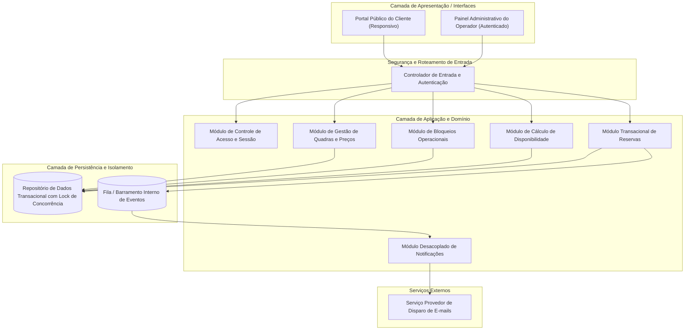
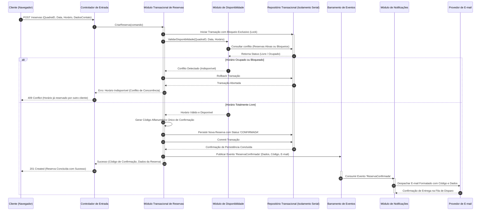

# Relatório Técnico de Arquitetura de Software

## 1. Identificação das HUs

Abaixo estão identificadas as Histórias de Usuário (HUs) mapeadas a partir das necessidades dos perfis de **Operador** e **Cliente**, relacionando-as aos Requisitos Funcionais (RF) e Requisitos Não Funcionais (RNF) correspondentes.

| ID | Título da HU | Ator Principal | Descrição Sucinta | Requisitos Relacionados |
| :--- | :--- | :--- | :--- | :--- |
| **HU01** | Cadastrar quadra | Operador | Cadastrar quadras com tipos, valores base e horários de funcionamento. | RF01, RF02, RF12, RNF03, RNF07 |
| **HU02** | Bloquear horários para manutenção | Operador | Inserir e remover bloqueios de horários pontuais por motivo operacional/feriado. | RF03, RNF03, RNF05 |
| **HU03** | Visualizar agenda consolidada | Operador | Consultar grade horária consolidada com status de todas as quadras por data. | RF11, RNF02, RNF03 |
| **HU04** | Cancelar reserva com justificativa | Operador | Cancelar agendamentos com registro obrigatório de justificativa e aviso ao cliente. | RF09, RF10, RNF03, RNF05 |
| **HU05** | Consultar disponibilidade sem cadastro | Cliente | Acessar a grade de disponibilidade em tempo real sem autenticação prévia. | RF04, RNF01, RNF02, RNF06 |
| **HU06** | Realizar reserva | Cliente | Criar reserva com validação de unicidade de horário e geração de código identificador. | RF05, RF06, RF07, RF10, RF12, RNF01, RNF05 |
| **HU07** | Cancelar minha reserva | Cliente | Desmarcar reserva previamente realizada utilizando o código de confirmação. | RF08, RNF01, RNF05 |

---

## 2. Diagramas de Arquitetura (Mermaid)

### 2.1. Diagrama Estrutural de Componentes do Sistema

O diagrama abaixo apresenta os subsistemas conceituais, serviços centrais da aplicação, mecanismos de controle de concorrência e integrações de notificação.

---

### 2.2. Diagrama de Sequência: Processamento Atômico de Reserva (HU06 / RNF05)

O diagrama a seguir especifica a interação temporal necessária para garantir a atomicidade da reserva, o bloqueio contra agendamento simultâneo e a emissão de código de confirmação com disparo assíncrono de e-mail.

---

## 3. Decisões de Arquitetura

1. **Garantia de Atomicidade e Mitigação de Concorrência (RNF05 / RF07):**
   - **Decisão:** A reserva de horários deve operar sob isolamento transacional rígido no repositório de persistência. Antes da inserção da reserva, deve ser estabelecido um bloqueio pessimista ou controle transacional serializável no intervalo de tempo da quadra solicitada.
   - **Justificativa:** Previne anomalias de duplo agendamento (*race conditions*) quando dois ou mais clientes tentam reservar a mesma fração de horário simultaneamente.

2. **Comunicação Assíncrona para Notificações (RF10 / RNF02):**
   - **Decisão:** O módulo de envio de e-mails deve ser desacoplado da transação principal de reserva através de um barramento de eventos/mensagens interno.
   - **Justificativa:** Isola o tempo de resposta do cliente da latência de conexão de serviços externos de telecomunicação/e-mail, garantindo que o tempo de resposta do sistema permaneça abaixo de 2 segundos.

3. **Arquitetura de Domínio Aberto para Leitura e Fechado para Administração (RF04 / RNF03):**
   - **Decisão:** Segregação estrita no controlador de entrada entre rotas públicas e rotas administrativas. As consultas de disponibilidade e criação de reservas não exigem identificadores de sessão prévios do usuário, enquanto todas as operações de cadastro, cancelamento operacional e bloqueio exigem autenticação criptograficamente assinada.
   - **Justificativa:** Atende ao requisito de uso imediato sem atrito pelo cliente final (sem necessidade de criação de conta), preservando a integridade administrativa da organização.

4. **Motor de Precificação Dinâmica por Faixas Temporais (RF12 / RF01):**
   - **Decisão:** O cálculo de valor da reserva é determinado por um resolvedor de regras de tarifação que cruza o valor base da quadra com faixas horárias parametrizadas (ex.: horário comercial vs. horário nobre) no momento da consulta e da confirmação.
   - **Justificativa:** Permite flexibilidade comercial sem acoplar regras de negócio financeiras aos modelos básicos de cadastro de infraestrutura física.

---

## 4. Tabela de Componentes e Rastreabilidade

| Componente | Responsabilidade Principal | Comunica-se com | Origem (HU / Critério de Aceite) |
| :--- | :--- | :--- | :--- |
| **Portal Público do Cliente** | Interface responsiva para navegação nas datas, visualização de grades de horários e formulário de reserva/cancelamento. | Controlador de Entrada | HU05, HU06, HU07, RNF01, RNF06 |
| **Painel do Operador** | Interface protegida para gestão de quadras, parametrização de valores, bloqueios e acompanhamento da agenda consolidada. | Controlador de Entrada | HU01, HU02, HU03, HU04, RNF03 |
| **Controlador de Entrada e Autenticação** | Roteamento de tráfego, validação de requisições e verificação de tokens/sessões para endpoints administrativos. | Módulo de Autenticação, Módulos de Domínio | RNF03, HU01, HU02, HU03, HU04, HU05 |
| **Módulo de Gestão de Quadras e Preços** | Cadastro, atualização, inativação de quadras esportivas e associação de faixas de precificação horária. | Repositório Transacional | RF01, RF02, RF12, HU01 |
| **Módulo de Bloqueios Operacionais** | Registro e liberação de períodos de indisponibilidade de quadras (manutenções, feriados, reformas). | Repositório Transacional | RF03, HU02 |
| **Módulo de Disponibilidade** | Consolidação em tempo real dos intervalos ocupados (reservas ativas e bloqueios) contra os horários operacionais. | Repositório Transacional | RF04, RF11, HU03, HU05, RNF02 |
| **Módulo Transacional de Reservas** | Orquestração da criação, validação atômica de concorrência, geração de código único e cancelamentos com auditoria. | Repositório Transacional, Barramento de Eventos, Módulo de Disponibilidade | RF05, RF06, RF07, RF08, RF09, HU04, HU06, HU07, RNF05 |
| **Módulo de Notificações** | Processamento de eventos de reserva/cancelamento e renderização de mensagens para despacho ao cliente. | Barramento de Eventos, Provedor de E-mail | RF10, HU04, HU06 |

---

## 5. Bloqueios e Pendências

1. **Política e Janela Limite para Cancelamento de Clientes (HU07 / RF08):**
   - *Pendência:* O requisito não define antecedência mínima para o cancelamento pelo cliente (ex.: até 2 horas antes do início da partida). Sem essa definição, um cliente pode desmarcar minutos antes, inviabilizando a reocupação da quadra.
2. **Definição de Granularidade das Faixas de Horário (RF01 / RF12):**
   - *Pendência:* Não está especificado se os intervalos de reserva são de duração fixa (ex.: blocos rígidos de 60 minutos) ou se o cliente pode alugar frações personalizadas (ex.: 90 minutos ou horários quebrados como 18h15 às 19h15).
3. **Mecanismo de Retenção de Dados e Privacidade (RF05):**
   - *Pendência:* Coleta de dados pessoais de clientes (nome, e-mail, telefone) sem autenticação requer especificação sobre políticas de retenção, expiração e conformidade com diretrizes de proteção de dados.
4. **Política de Reembolso ou Cobrança:**
   - *Bloqueio de Domínio:* Não foi definido se o sistema prevê gateway de pagamento prévio ou se o pagamento é exclusivamente presencial/operacional. A ausência de cobrança prévia aumenta o risco de cancelamentos deliberados (*no-show*).

---

## 6. Cobertura de Requisitos

A matriz a seguir mapeia a totalidade dos Requisitos Funcionais e Não Funcionais aos elementos arquiteturais concebidos.

| Requisito | Componente(s) Responsável(is) | Estratégia de Atendimento |
| :--- | :--- | :--- |
| **RF01** | Módulo de Gestão de Quadras e Preços | Entidade de domínio 'Quadra' contendo atributos físicos, tipos esportivos e horários base. |
| **RF02** | Módulo de Gestão de Quadras e Preços | Operações de ciclo de vida (edição e marcação de remoção/inativação). |
| **RF03** | Módulo de Bloqueios Operacionais | Criação de registros temporais de exclusão com sobreposição na grade de disponibilidade. |
| **RF04** | Módulo de Disponibilidade / Portal Público | Endpoint público otimizado para cálculo de matriz de slots horários livres. |
| **RF05** | Módulo Transacional de Reservas | Criação da entidade 'Reserva' vinculando dados de contato ao horário. |
| **RF06** | Módulo Transacional de Reservas | Algoritmo gerador de identificadores alfanuméricos unívocos de alta entropia. |
| **RF07** | Módulo Transacional de Reservas / BD | Bloqueio transacional de concorrência impedindo reservas com mesmo par (Quadra, Horário). |
| **RF08** | Módulo Transacional de Reservas | Transição de estado da reserva para 'CANCELADA' mediante validação do código unívoco. |
| **RF09** | Módulo Transacional de Reservas | Transição de estado da reserva por operador exigindo preenchimento de campo de auditoria/motivo. |
| **RF10** | Módulo de Notificações / Provedor de E-mail | Despacho orientado a eventos contendo resumo da reserva e código identificador. |
| **RF11** | Módulo de Disponibilidade / Painel Operador | Mecanismo de agregação multidimensional (Quadra x Horários x Status) por data. |
| **RF12** | Módulo de Gestão de Quadras e Preços | Tabela de tarifação horária combinada com o motor de cálculo no momento da consulta. |
| **RNF01** | Portal Público / Painel Operador | Interfaces responsivas com design adaptável para dispositivos móveis e desktop. |
| **RNF02** | Módulo de Disponibilidade / BD | Índices estruturados sobre data/horário e processamento assíncrono para garantir SLA < 2s. |
| **RNF03** | Controlador de Entrada / Módulo de Auth | Controle de autenticação obrigatório para o Painel do Operador. |
| **RNF04** | Arquitetura Geral / Camada de Persistência | Camada de serviços desacoplada com tolerância a falhas para suportar 99% de disponibilidade 24/7. |
| **RNF05** | Módulo Transacional de Reservas | Transações atômicas com nível de isolamento estrito no repositório de dados. |
| **RNF06** | Portal Público do Cliente | Aderência a padrões Web padronizados compatíveis com navegadores modernos. |
| **RNF07** | Camada de Aplicação | Estrutura modular e extensível para inclusão simplificada de novos tipos esportivos e regras. |

---

## 7. Gap Analysis

| Item Lacunar | Impacto Arquitetural | Ação Recomendada para o Time de Engenharia |
| :--- | :--- | :--- |
| **Ausência de limite de tentativas no cancelamento (Força Bruta)** | Um agente malicioso poderia tentar adivinhar códigos de confirmação públicos e cancelar reservas de outros clientes. | Implementar mecanismo de limitação de taxa (*rate limiting*) no endpoint público de cancelamento e utilizar códigos de confirmação com entropia mínima segura. |
| **Comportamento em caso de falha no envio de e-mail** | Se o provedor de e-mail falhar, o cliente pode ficar sem o código de confirmação gerado. | Implementar fila de re-tentativa (*retry queue*) com política de recuo exponencial no Módulo de Notificações e sempre exibir o código na tela de sucesso imediato. |
| **Regra para Bloqueios em cima de Reservas Existentes** | Se um operador precisar bloquear uma quadra por emergência (ex.: infiltração), mas já existirem reservas no horário. | Criar fluxo de exceção no Módulo de Bloqueios que alerte o operador sobre conflitos existentes, disparando cancelamento automático com justificativa e aviso aos clientes afetados. |
| **Formatação de Fuso Horário (*Timezone*)** | Risco de divergência entre a hora do navegador do cliente e o fuso horário físico do complexo esportivo. | Padronizar todas as datas/horas internas em padrão universal (UTC) e converter no cliente explicitando a hora local do estabelecimento. |