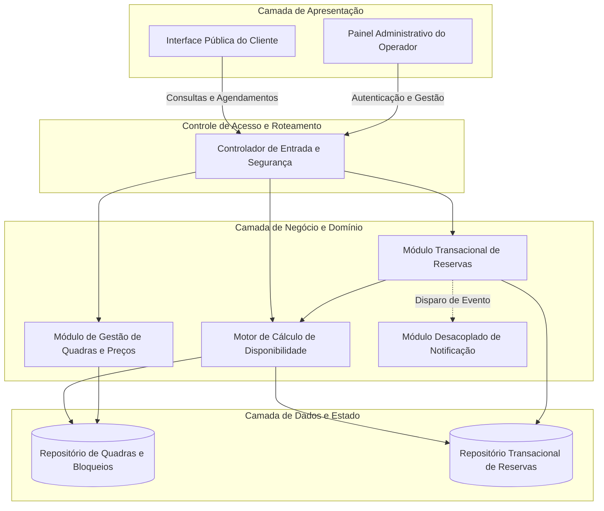
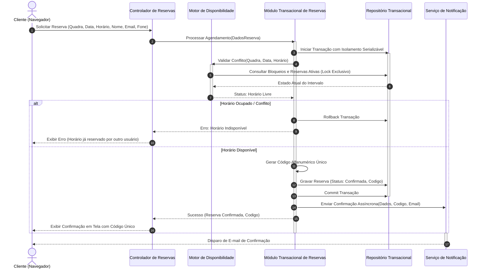
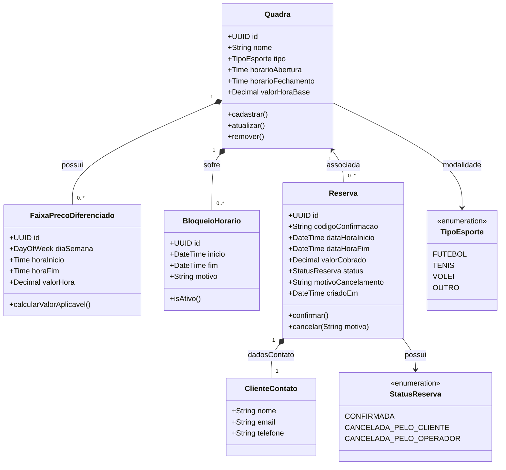

# Relatório Técnico de Arquitetura de Software

## 1. Identificação das HUs

Abaixo está o mapeamento das Histórias de Usuário identificadas no domínio do sistema, categorizadas por perfil de acesso e objetivos de negócio:

| ID | Perfil | Título | Descrição Resumida | Requisitos Associados |
| :--- | :--- | :--- | :--- | :--- |
| **HU01** | Operador | Cadastrar quadra | Permite o registro de novas quadras com tipo de esporte, horários e tarifação base. | RF01, RNF07 |
| **HU02** | Operador | Bloquear horários para manutenção | Permite a indisponibilização temporária de faixas de horários por motivos operacionais/feriados. | RF03 |
| **HU03** | Operador | Visualizar agenda consolidada | Painel unificado diário multi-quadra para controle operacional de ocupação. | RF11 |
| **HU04** | Operador | Cancelar reserva com justificativa | Cancelamento administrativo de agendamentos com preenchimento obrigatório de motivo e disparo de notificação. | RF09, RF10 |
| **HU05** | Cliente | Consultar disponibilidade sem cadastro | Consulta pública, em tempo real e sem autenticação, dos horários livres e ocupados por data/quadra. | RF04, RNF01, RNF02, RNF06 |
| **HU06** | Cliente | Realizar reserva | Agendamento de horário mediante preenchimento de dados de contato, garantindo reserva atômica e geração de código. | RF05, RF06, RF07, RF10, RNF05 |
| **HU07** | Cliente | Cancelar reserva própria | Liberação de horário agendado mediante fornecimento de código identificador único. | RF08 |

---

## 2. Diagramas de Arquitetura (Mermaid)

### 2.1. Visão Lógica de Componentes do Sistema

---

### 2.2. Diagrama de Sequência: Realização de Reserva com Garantia de Atomicidade (HU06)

---

### 2.3. Diagrama de Classes do Domínio

---

## 3. Decisões de Arquitetura

### D1: Mecanismo de Prevenção de Concorrência e Duplo Agendamento (RNF05, RF07)
* **Contexto:** Clientes simultâneos podem tentar reservar exatamente o mesmo intervalo de tempo para uma mesma quadra esportiva.
* **Decisão:** A operação de reserva deve ser encapsulada em uma transação com isolamento estrito (*Serializable*) ou bloqueio pessimista (*Pessimistic Locking*) no nível do intervalo de horário da quadra. Se duas requisições simultâneas competirem pela mesma tupla de horário/quadra, a primeira obtém a trava e consolida o registro, enquanto a segunda falha deterministicamente, retornando status de indisponibilidade sem risco de inconsistência no estado final.

### D2: Separação de Contextos de Segurança e Acesso Anônimo (RF04, RNF03)
* **Contexto:** A consulta de disponibilidade e a reserva precisam ser totalmente públicas para reduzir atrito de conversão do cliente (sem necessidade de criação de conta), enquanto operações administrativas exigem controle de acesso.
* **Decisão:** A arquitetura segregará a borda de aplicação em duas zonas:
  1. *Zona Pública:* Acesso liberado para rotas de leitura de disponibilidade (`MotorDisponibilidade`), criação de reserva com dados pontuais de contato e cancelamento estrito por chave (`codigoConfirmacao`).
  2. *Zona Administrativa:* Protegida por barreira de autenticação e autorização mandatórias, cobrindo criação/edição de quadras, bloqueios de manutenção, cancelamento com justificativa e visualização consolidada da agenda.

### D3: Desacoplamento do Serviço de Notificação (RF10, HU04, HU06)
* **Contexto:** O envio de e-mails de confirmação e cancelamento depende de canais externos e não deve degradar o tempo de resposta das transações de reserva (RNF02).
* **Decisão:** O envio de e-mails será acionado via comunicação assíncrona orientada a eventos. O fluxo transacional grava a reserva com sucesso, devolve a resposta imediata à interface com o código e publica um evento para o `Serviço de Notificação` consumir e realizar a entrega externa.

### D4: Mecanismo Flexível de Tarifação e Extensibilidade Modular (RF12, RNF07)
* **Contexto:** O valor do horário varia conforme tipo de esporte, dia da semana e faixas de pico (horário nobre), além de suportar inclusão de novas modalidades.
* **Decisão:** Emprego de um modelo baseado em regras desacopladas (`FaixaPrecoDiferenciado`), associadas a um enumerador extensível ou catálogo dinâmico de modalidades esportivas (`TipoEsporte`), permitindo recalcular dinamicamente o valor sem alterar as regras de transação de agendamento.

---

## 4. Tabela de Componentes e Rastreabilidade

| Componente | Responsabilidade Principal | Comunica-se com | Origem (HU / Critério de Aceite) |
| :--- | :--- | :--- | :--- |
| **Interface Pública do Cliente** | Interface web responsiva para consulta anônima de horários, preenchimento de reserva e auto-cancelamento via código. | Controlador de Entrada e Segurança | HU05, HU06, HU07, RNF01, RNF06 |
| **Painel Administrativo do Operador** | Interface de gestão autenticada para CRUD de quadras, parametrização de preços, visualização de agenda consolidada e bloqueios. | Controlador de Entrada e Segurança | HU01, HU02, HU03, HU04, RNF03 |
| **Controlador de Entrada e Segurança** | Ponto único de roteamento, controle de sessão/credenciais administrativas e sanitização de requisições públicas. | Todos os Módulos de Domínio | RNF03, RNF04 |
| **Motor de Cálculo de Disponibilidade** | Computar a interseção de horário de funcionamento, bloqueios ativos e reservas vigentes para expor faixas livres/ocupadas em < 2s. | Repositório de Quadras, Repositório de Reservas | HU02, HU03, HU05, RF04, RNF02 |
| **Módulo Transacional de Reservas** | Coordenar a criação atômica de reservas, geração do código único, validação de unicidade de horário e cancelamentos. | Repositório de Reservas, Motor de Disponibilidade, Módulo de Notificação | HU04, HU06, HU07, RF05, RF06, RF07, RF08, RF09, RNF05 |
| **Módulo de Gestão de Quadras e Preços** | Administrar o ciclo de vida das quadras esportivas, faixas de horários de funcionamento, bloqueios e regras de precificação nobre. | Repositório de Quadras e Bloqueios | HU01, HU02, RF01, RF02, RF03, RF12, RNF07 |
| **Módulo Desacoplado de Notificação** | Montar templates de e-mail e despachar confirmações/cancelamentos de reservas para os clientes de forma não bloqueante. | Módulo Transacional de Reservas, Infraestrutura Externa de E-mail | HU04, HU06, RF10 |
| **Repositório Transacional** | Camada de persistência que assegura consistência ACID, bloqueio atômico de horários e persistência das entidades do domínio. | Camada de Negócio e Domínio | RF07, RNF04, RNF05 |

---

## 5. Bloqueios e Pendências

1. **Definição de Política de Cancelamento com Antecedência Mínima:**
   * *Pendência:* O requisito RF08/HU07 não especifica se o cliente pode cancelar a reserva minutos antes do horário de início. É necessário definir uma janela limite para cancelamento autônomo (ex.: até 2 horas antes).
2. **Tratamento de Falha no Envio de Notificação:**
   * *Pendência:* Como a reserva é atômica e o e-mail assíncrono, deve-se padronizar a política de retentativas (*retries*) e exibição visual do código diretamente na tela para garantir que o cliente obtenha o identificador mesmo se informar e-mail inexistente ou houver falha de rede externa.
3. **Mecanismo de Proteção contra *Spam* / *DDoS* no Cadastro Público:**
   * *Pendência:* Por não haver login para o cliente (RF04/RF05), a ausência de uma taxa limite (*Rate Limiting*) ou desafio de verificação automatizada (ex.: captcha) pode permitir scripts que realizem o esgotamento artificial de horários (*denial of inventory*).

---

## 6. Cobertura de Requisitos

A matriz abaixo comprova a sustentação de todos os Requisitos Funcionais e Não Funcionais pelo design arquitetural proposto:

| Requisito | Atendido por Componente / Estratégia | Mapeamento no Modelo |
| :--- | :--- | :--- |
| **RF01** | Módulo de Gestão de Quadras e Preços | Entidade `Quadra`, Métodos de CRUD |
| **RF02** | Módulo de Gestão de Quadras e Preços | Entidade `Quadra` (Atualização / Exclusão lógica) |
| **RF03** | Módulo de Gestão de Quadras e Preços | Entidade `BloqueioHorario` e validação no Motor de Disponibilidade |
| **RF04** | Motor de Cálculo de Disponibilidade + UI Pública | Endpoint público de consulta de grade consolidada |
| **RF05** | Módulo Transacional de Reservas + UI Pública | Agendamento atômico contendo `ClienteContato` |
| **RF06** | Módulo Transacional de Reservas | Atributo `codigoConfirmacao` gerado deterministicamente |
| **RF07** | Mecanismo de Lock Transacional / Repositório | Decisão Arquitetural D1 e Isolamento Serializável |
| **RF08** | Módulo Transacional de Reservas | Cancelamento do cliente validando `codigoConfirmacao` |
| **RF09** | Módulo Transacional de Reservas + Painel Operador | Cancelamento administrativo exigindo `motivoCancelamento` |
| **RF10** | Módulo Desacoplado de Notificação | Processamento de eventos de confirmação/cancelamento |
| **RF11** | Painel do Operador + Motor de Disponibilidade | Visão consolidada multi-quadra por data |
| **RF12** | Módulo de Gestão de Quadras e Preços | Entidade `FaixaPrecoDiferenciado` (Decisão D4) |
| **RNF01** | Interface Pública do Cliente e Painel Admin | Interfaces desenhadas para adaptação responsiva (Mobile/Desktop) |
| **RNF02** | Motor de Cálculo de Disponibilidade | Consultas otimizadas indexadas por quadra e intervalo de data |
| **RNF03** | Controlador de Entrada e Segurança | Barreira de autenticação para endpoints de operadores |
| **RNF04** | Repositório Transacional e Camada de Domínio | Arquitetura desacoplada e redundante sem ponto único de falha crítico |
| **RNF05** | Repositório Transacional | Transações ACID e controle de concorrência estrito (Decisão D1) |
| **RNF06** | Camada de Apresentação (UI Pública / Admin) | Conformidade com padrões web agnósticos de navegador |
| **RNF07** | Modelo de Domínio | Modularidade via abstração de `TipoEsporte` e entidades desacopladas |

---

## 7. Gap Analysis

| Item Analisado | Lacuna Detectada | Impacto Arquitetural | Recomendação para o Time de Engenharia |
| :--- | :--- | :--- | :--- |
| **Tarifação Diferenciada (RF12)** | O requisito RF12 consta na listagem formal, porém não possui uma História de Usuário (HU) dedicada nos requisitos de entrada. | O time de produto pode despriorizar a interface de configuração de horários nobres por falta de critério de aceite explícito. | Formalizar uma História de Usuário específica para parametrização de faixas de preço e implementar o componente `FaixaPrecoDiferenciado`. |
| **Notificação de Cancelamento pelo Operador (HU04 vs RF09/RF10)** | O critério de aceite da HU04 exige notificar o cliente por e-mail em caso de cancelamento pelo operador, mas o RF10 cita apenas confirmação de reserva. | O serviço de notificação precisa estar conectado a ambos os fluxos (criação e cancelamento). | Expandir os eventos de mensageria para cobrir `ReservaConfirmadaEvento` e `ReservaCanceladaEvento`, garantindo o envio do motivo cadastrado pelo operador. |
| **Segurança e Identificador de Cancelamento (HU07 / RF08)** | Uso isolado do código de confirmação como chave única de cancelamento sem autenticação do cliente. | Códigos curtos ou sequenciais podem ser passíveis de adivinhação (*brute force*), permitindo que terceiros cancelem reservas alheias. | Gerar códigos alfanuméricos com entropia suficiente (ex.: alta dispersão pseudoaleatória com no mínimo 8 a 10 caracteres) e aplicar bloqueio temporário por tentativas incorretas (*rate limiting*). |
| **Regime de Pagamento** | Os requisitos determinam cadastro de preço e cálculo de faixas (RF01, RF12), mas não especificam se há gateway de pagamento online ou se a cobrança é realizada presencialmente no local. | Ausência de estados intermediários de reserva (ex.: *Aguardando Pagamento*). | Assumir arquiteturalmente que a reserva é confirmada diretamente no agendamento, registrando o `valorCobrado` consolidado para quitação no local pelo operador, mantendo a arquitetura extensível caso um gateway seja integrado no futuro. |