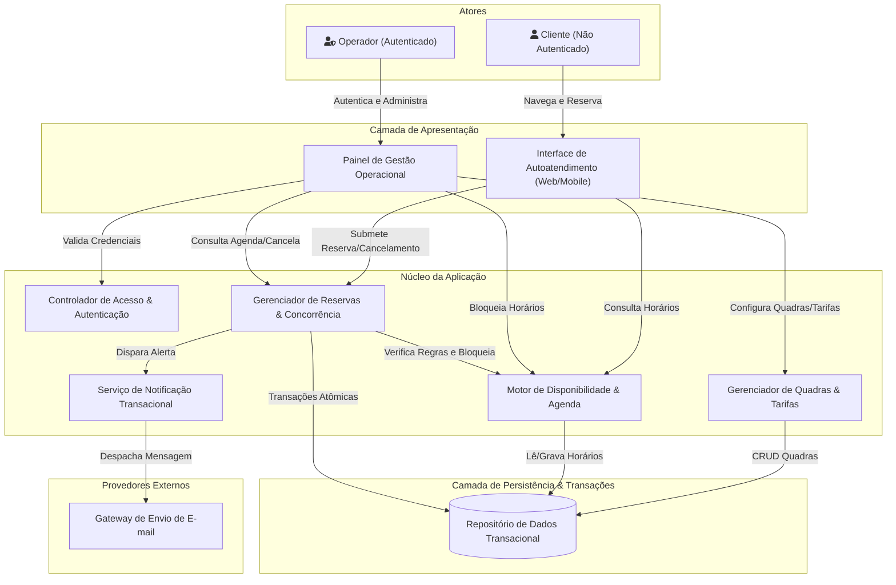
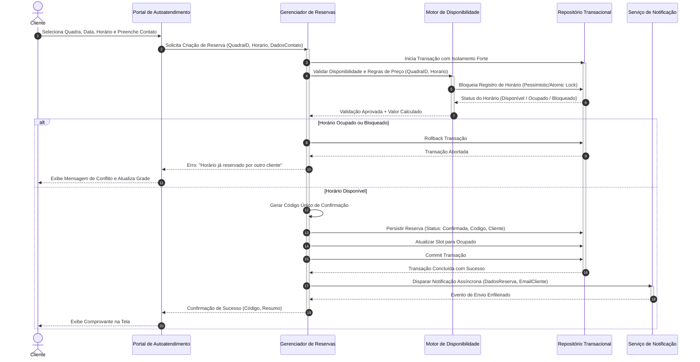
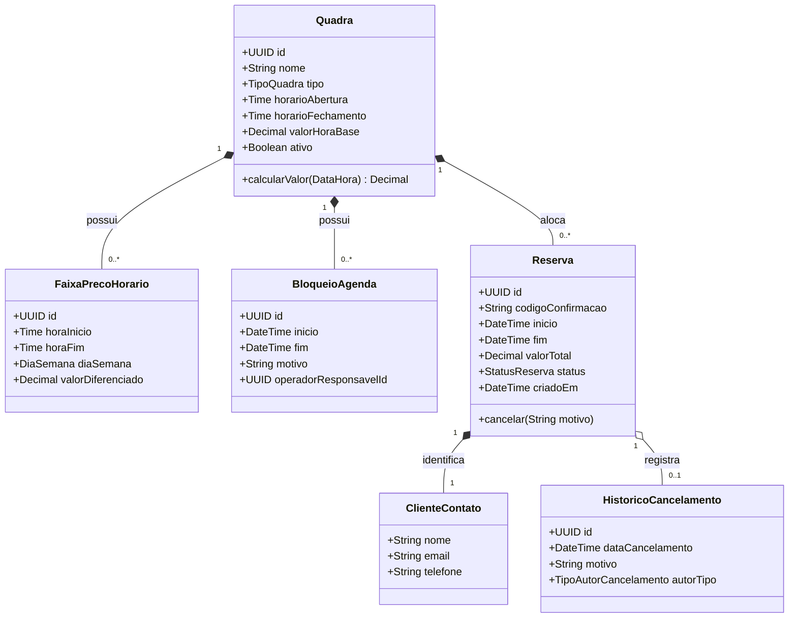

# Relatório Técnico de Arquitetura de Software

---

## 1. Identificação das HUs

Abaixo está o mapeamento consolidado das Histórias de Usuário (HUs) com seus respectivos atores, requisitos associados e critérios de aceite fundamentais.

| ID | Título | Ator | Descrição Sumária | Requisitos Vinculados | Critérios de Aceite Principais |
| :--- | :--- | :--- | :--- | :--- | :--- |
| **HU01** | Cadastrar quadra | Operador | Cadastrar quadras com tipo, horário de funcionamento e valor base da hora. | RF01, RF02, RF12, RNF07 | - Campos obrigatórios: nome, tipo e valor da hora. - Disponibilização imediata no motor de busca de horários. |
| **HU02** | Bloquear horários para manutenção | Operador | Bloquear intervalos de tempo de quadras para manutenções ou feriados. | RF03, RNF05 | - Horários bloqueados ficam indisponíveis para clientes. - Remoção de bloqueio reflete imediatamente no calendário. |
| **HU03** | Visualizar agenda consolidada | Operador | Consultar grade diária de todas as quadras em visão unificada. | RF11, RNF02 | - Visão unificada com status (livre, reservado, bloqueado). - Navegação fluida entre datas. |
| **HU04** | Cancelar reserva com justificativa | Operador | Cancelar agendamentos registrando a respectiva justificativa formal. | RF09, RF10 | - Justificativa textual obrigatória. - Notificação automática de cancelamento enviada ao cliente. |
| **HU05** | Consultar disponibilidade sem cadastro | Cliente | Navegar e buscar horários livres por data e quadra sem autenticação. | RF04, RNF01, RNF02, RNF06 | - Acesso público direto sem login. - Ocultação ou marcação clara de horários indisponíveis em até 2s. |
| **HU06** | Realizar reserva | Cliente | Efetuar reserva informando dados de contato (nome, e-mail, telefone). | RF05, RF06, RF07, RF10, RNF05 | - Garantia atômica contra duplo agendamento. - Geração de código alfanumérico único e envio de e-mail. |
| **HU07** | Cancelar minha reserva | Cliente | Cancelar uma reserva ativa mediante validação do código de confirmação. | RF08, RNF05 | - Validação estrita do código único. - Liberação imediata do horário para nova reserva. |

---

## 2. Diagramas de Arquitetura (Mermaid)

### 2.1. Diagrama de Contexto e Componentes do Sistema

### 2.2. Diagrama de Sequência: Realização de Reserva com Controle de Concorrência

### 2.3. Diagrama do Modelo de Domínio Conceitual

---

## 3. Decisões de Arquitetura

* **DA01 — Concorrência e Atomicidade na Reserva (RNF05, RF07):**
  * *Decisão:* Adotar isolamento transacional estrito no repositório de persistência com retenção de bloqueio em nível de recurso (slot de horário da quadra) durante o ciclo de confirmação.
  * *Justificativa:* Garante a prevenção de *double-booking* em cenários de alta demanda simultânea, satisfazendo a integridade do agendamento sem corromper a grade horária.

* **DA02 — Segregação de Contextos de Execução (Público vs. Administrativo) (RF04, RNF03):**
  * *Decisão:* Segmentar as rotas e componentes de execução em dois domínios: um de autoatendimento público (sem retenção de sessão/login) e outro de retaguarda corporativa (protegido por autenticação e autorização por tokens/sessões seguras).
  * *Justificativa:* Permite escalabilidade independente para as consultas públicas volumosas (RNF02) enquanto mantém a blindagem de segurança para as funções restritas do operador (RNF03).

* **DA03 — Desacoplamento do Envio de Notificações (RF10, HU04, HU06):**
  * *Decisão:* O disparo de comunicações por e-mail deve ser delegado para processamento assíncrono após a confirmação transacional da reserva/cancelamento.
  * *Justificativa:* Evita que eventuais lentidões ou indisponibilidades temporárias do gateway de mensageria impactem o tempo de resposta do cliente ou a integridade da reserva.

* **DA04 — Motor de Precificação Dinâmica Baseado em Regras Temporais (RF12, RNF07):**
  * *Decisão:* Desacoplar o cálculo do valor da hora em uma estrutura hierárquica (Preço Base da Quadra $\rightarrow$ Regras de Sobrescrita por Faixa de Horário/Dia).
  * *Justificativa:* Facilita a manutenção e expansão de planos de preços sazonais (horário nobre) sem necessidade de alterar o esquema estrutural das reservas já confirmadas.

* **DA05 — Validação de Autonomia do Cliente por Código Criptográfico/Randômico Único (RF06, RF08, HU07):**
  * *Decisão:* Utilizar um identificador alfanumérico único de alta entropia atrelado à reserva como credencial suficiente para consulta e auto-cancelamento.
  * *Justificativa:* Dispensa a obrigatoriedade de criação de conta e senha pelo cliente, atendendo integralmente ao requisito de simplicidade e anonimato de cadastro prévio.

---

## 4. Tabela de Componentes e Rastreabilidade

| Componente | Responsabilidade Principal | Comunica-se com | Origem (HU / Requisito) |
| :--- | :--- | :--- | :--- |
| **Portal de Autoatendimento** | Interface responsiva para o cliente consultar horários, submeter reservas e solicitar cancelamentos. | *Motor de Disponibilidade*, *Gerenciador de Reservas* | HU05, HU06, HU07, RNF01, RNF06 |
| **Painel de Gestão Operacional** | Interface administrativa para operadores gerenciarem quadras, bloqueios e agenda diária consolidada. | *Controlador de Acesso*, *Gerenciador de Quadras*, *Motor de Disponibilidade*, *Gerenciador de Reservas* | HU01, HU02, HU03, HU04, RNF03 |
| **Controlador de Acesso & Autenticação** | Garantir autenticação segura, renovação de credenciais e permissões para operadores. | *Painel de Gestão Operacional*, *Repositório de Dados* | RNF03 |
| **Gerenciador de Quadras & Tarifas** | Manter o ciclo de vida das quadras (CRUD) e as tabelas de preços por faixa de horário. | *Repositório de Dados* | HU01, RF01, RF02, RF12, RNF07 |
| **Motor de Disponibilidade & Agenda** | Processar grades de horários livres, ocupados e bloqueados por período; consolidar visão diária multi-quadras. | *Repositório de Dados*, *Gerenciador de Quadras* | HU02, HU03, HU05, RF03, RF04, RF11, RNF02 |
| **Gerenciador de Reservas & Concorrência** | Orquestrar a criação e cancelamento de reservas, aplicando travas transacionais de atomicidade e geração de códigos únicos. | *Motor de Disponibilidade*, *Serviço de Notificação*, *Repositório de Dados* | HU04, HU06, HU07, RF05, RF06, RF07, RF08, RF09, RNF05 |
| **Serviço de Notificação Transacional** | Compor e despachar e-mails de confirmação e cancelamento aos clientes através de provedor externo. | *Gateway de Envio de E-mail* | HU04, HU06, RF10 |
| **Repositório de Dados Transacional** | Garantir a persistência confiável, integridade relacional e suporte a bloqueios transacionais concorrentes. | *Todos os Serviços de Domínio* | RNF04, RNF05 |

---

## 5. Bloqueios e Pendências

1. **Janela Limite para Cancelamento pelo Cliente:**
   * *Pendência:* O RF08 e a HU07 não estipulam prazo limite de antecedência para o auto-cancelamento (ex.: até 2 horas antes do início). A ausência dessa regra pode gerar ociosidade súbita da quadra sem tempo hábil para reocupação.
2. **Tempo de Retenção de Slot Provisório (*Holding Lock*):**
   * *Pendência:* Falta definição sobre a retenção temporária do horário enquanto o cliente preenche os dados cadastrais, prevenindo condições de corrida antes do clique final de confirmação.
3. **Política de Resolução de Conflitos em Bloqueios Operacionais:**
   * *Pendência:* Não está especificado o comportamento do sistema caso um operador tente registrar um bloqueio de manutenção (RF03/HU02) em um horário que já possui reservas de clientes confirmadas.
4. **Resiliência e Políticas de Reenvio de Notificações:**
   * *Pendência:* Definição de estratégia de retentativa (*retry policy*) e canal alternativo em caso de falha de entrega pelo provedor de e-mail.

---

## 6. Cobertura de Requisitos

A matriz a seguir mapeia a correspondência entre todos os Requisitos (RF/RNF), Componentes do Sistema e Histórias de Usuário:

| Requisito | Tipo | Componente(s) Responsável(is) | História de Usuário (HU) | Cobertura Arquitetural |
| :--- | :--- | :--- | :--- | :--- |
| **RF01** | Funcional | Gerenciador de Quadras & Tarifas | HU01 | Total |
| **RF02** | Funcional | Gerenciador de Quadras & Tarifas | HU01 | Total |
| **RF03** | Funcional | Motor de Disponibilidade & Agenda | HU02 | Total |
| **RF04** | Funcional | Motor de Disponibilidade & Agenda, Portal Autoatendimento | HU05 | Total |
| **RF05** | Funcional | Gerenciador de Reservas & Concorrência | HU06 | Total |
| **RF06** | Funcional | Gerenciador de Reservas & Concorrência | HU06 | Total |
| **RF07** | Funcional | Gerenciador de Reservas & Concorrência | HU06 | Total |
| **RF08** | Funcional | Gerenciador de Reservas & Concorrência | HU07 | Total |
| **RF09** | Funcional | Gerenciador de Reservas & Concorrência | HU04 | Total |
| **RF10** | Funcional | Serviço de Notificação Transacional | HU04, HU06 | Total |
| **RF11** | Funcional | Motor de Disponibilidade & Agenda, Painel de Gestão | HU03 | Total |
| **RF12** | Funcional | Gerenciador de Quadras & Tarifas | HU01 | Total |
| **RNF01** | Não Funcional | Portal de Autoatendimento | HU05, HU06, HU07 | Total |
| **RNF02** | Não Funcional | Motor de Disponibilidade, Repositório de Dados | HU03, HU05 | Total |
| **RNF03** | Não Funcional | Controlador de Acesso & Autenticação, Painel de Gestão | HU01, HU02, HU03, HU04 | Total |
| **RNF04** | Não Funcional | Camada de Persistência, Infraestrutura Geral | Todas | Total |
| **RNF05** | Não Funcional | Gerenciador de Reservas (Locks Transacionais) | HU06, HU07 | Total |
| **RNF06** | Não Funcional | Portal de Autoatendimento, Painel de Gestão | Todas | Total |
| **RNF07** | Não Funcional | Gerenciador de Quadras (Modelagem Extensível) | HU01 | Total |

---

## 7. Gap Analysis

| Item | Lacuna Identificada | Impacto Arquitetural | Ação Recomendada para o Time |
| :--- | :--- | :--- | :--- |
| **GAP-01** | Ausência de regras de conformidade de privacidade de dados (ex.: retenção e expurgo de dados de contato do cliente após a realização da partida). | Risco legal e ausência de rotina de limpeza de dados sensíveis na base transacional. | Projetar rotina periódica de anonimização/expurgo para contatos atrelados a reservas passadas e concluídas. |
| **GAP-02** | Inexistência de política para sobreposição de Bloqueio Operacional sobre Reservas Ativas. | Risco de inconsistência de estado ou cancelamento silencioso de reservas de clientes sem reembolso/aviso prévio. | Estabelecer regra no *Motor de Disponibilidade*: se houver reservas no período de bloqueio, exigir confirmação explícita do operador para cancelamento em lote com disparo automático de justificativa. |
| **GAP-03** | Falta de especificação de política de tolerância ou *timeout* durante o fluxo de checkout. | Dois clientes podem tentar submeter o mesmo horário simultaneamente, gerando frustração frequente por rejeição tardia. | Implementar mecanismo de pré-reserva com tempo de expiração curto (ex.: 5 minutos) com liberação automática caso o formulário não seja submetido. |
| **GAP-04** | Canal único de notificação restrito a e-mail (sem contingência para falhas de entrega). | Falha no gateway externo pode deixar o cliente sem o código único de confirmação (RF06, RF10). | Tornar a exibição em tela do código imediata e autossuficiente (como comprovante textual baixável/copiável), tratando o e-mail como via complementar assíncrona. |