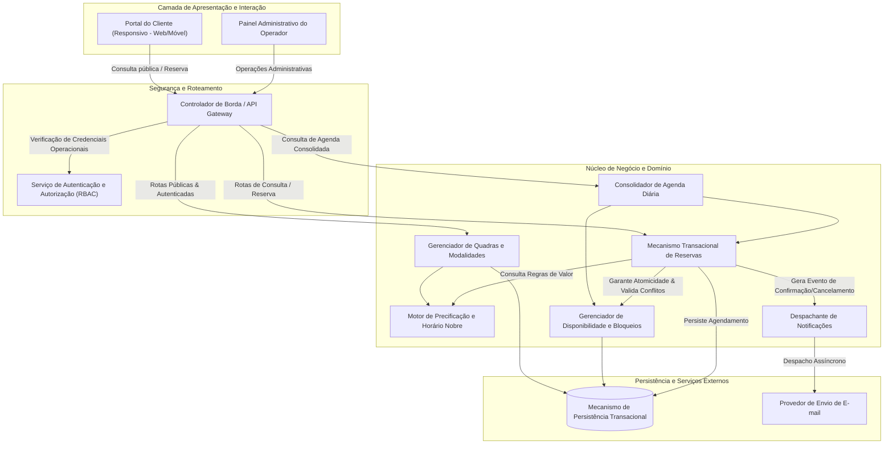
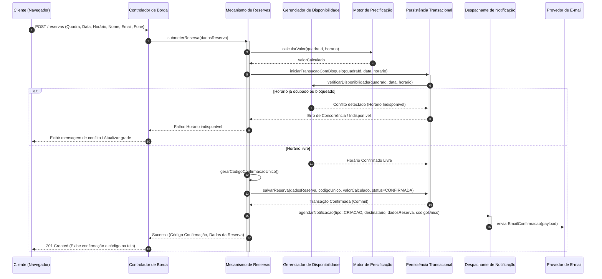
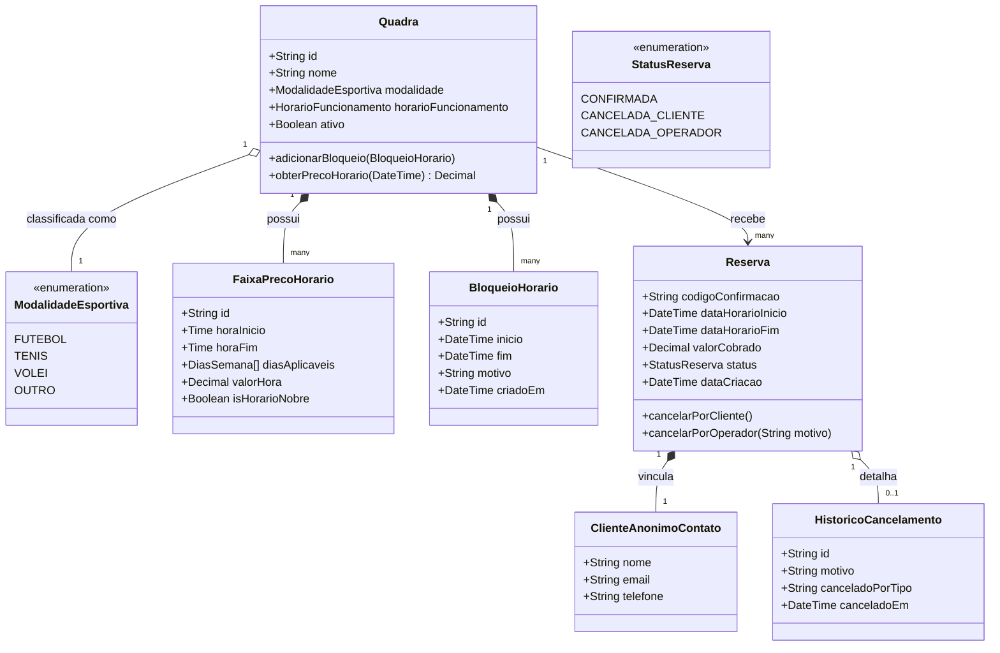

# Relatório Técnico de Arquitetura de Software

## 1. Identificação das HUs

A tabela a seguir consolida as Histórias de Usuário identificadas, seus respectivos atores primários e critérios de aceite essenciais para o direcionamento arquitetural:

| ID | Título | Ator | Descrição Sucinta | Critérios Chave de Aceite |
| :--- | :--- | :--- | :--- | :--- |
| **HU01** | Cadastrar quadra | Operador | Cadastra quadra com tipo, funcionamento e valor/hora. | Campos obrigatórios preenchidos; disponibilidade imediata para consulta de clientes. |
| **HU02** | Bloquear horários para manutenção | Operador | Bloqueia intervalos específicos de quadras (manutenção/feriados). | Horários bloqueados ficam indisponíveis ao cliente; desbloqueio reversível a qualquer momento. |
| **HU03** | Visualizar agenda consolidada | Operador | Visualiza a ocupação diária de todas as quadras em tela única. | Exibição de horários livres e ocupados por data; navegação entre datas. |
| **HU04** | Cancelar reserva com justificativa | Operador | Cancela reservas existentes registrando obrigatoriamente o motivo. | Registro compulsório de justificativa; disparo de notificação por e-mail ao cliente; liberação do horário. |
| **HU05** | Consultar disponibilidade sem cadastro | Cliente | Consulta grade de horários disponíveis sem necessidade de login. | Acesso público direto via interface; sinalização explícita de horários indisponíveis/ocupados. |
| **HU06** | Realizar reserva | Cliente | Reserva horário fornecendo dados de contato (nome, e-mail, telefone). | Validação atômica de disponibilidade no ato da confirmação; geração de código único; disparo de e-mail. |
| **HU07** | Cancelar minha reserva | Cliente | Cancela reserva própria informando o código de confirmação único. | Validação estrita do código; liberação imediata do horário para nova reserva. |

---

## 2. Diagramas de Arquitetura (Mermaid)

### 2.1. Visão de Componentes e Estrutura Lógica

### 2.2. Diagrama de Sequência: Realização de Reserva com Garantia de Atomicidade (HU05, HU06 / RNF02, RNF05)

### 2.3. Diagrama do Modelo Conceitual de Classes de Domínio

---

## 3. Decisões de Arquitetura

*   **ADR 01: Controle Estrito de Concorrência e Transacionalidade Atômica (RF07, RNF05)**
    *   *Contexto:* O sistema permite reservas públicas simultâneas sem pré-autenticação, elevando o risco de colisão (duplo agendamento do mesmo slot físico de quadra e horário).
    *   *Decisão:* Adotar isolamento transacional estrito na camada de persistência com controle de concorrência pessimista ou otimista com versionamento de slot temporal no ato da confirmação. A reserva só é finalizada se o intervalo estiver estritamente no estado "Livre".
    *   *Consequências:* Previne sobreposição de horários; requisições concorrentes perdedoras recebem notificação imediata de indisponibilidade com tempo de resposta determinístico.
*   **ADR 02: Desacoplamento do Fluxo de Notificações por E-mail (RF10, RNF02, RNF04)**
    *   *Contexto:* O envio síncrono de mensagens para serviços de e-mail pode introduzir latência no fechamento da reserva e falhas em cascata se o provedor externo estiver instável.
    *   *Decisão:* Isolar o envio de e-mails em um despachante assíncrono interno. O fluxo transacional principal persiste a reserva, retorna o código na interface e enfileira o evento de disparo de notificação.
    *   *Consequências:* Garante que o tempo de resposta percebido pelo cliente seja inferior a 2 segundos (RNF02) e que falhas externas de correio eletrônico não impeçam a concretização da reserva.
*   **ADR 03: Separação Arquitetural de Acesso Público vs. Administrativo (RF04, RNF03)**
    *   *Contexto:* Clientes operam de forma anônima/desconectada (apenas informando dados de contato), enquanto operadores manipulam entidades sensíveis (preços, cancelamentos com justificativa, bloqueios de segurança).
    *   *Decisão:* O sistema implementa uma camada de controle de acesso baseada em papéis (RBAC). Endpoints de consulta de disponibilidade e submissão de reservas são públicos e protegidos por limitação de taxa (*rate limiting* conceitual), enquanto endpoints de administração de quadras, visualização da agenda consolidada e cancelamentos administrativos exigem autenticação obrigatória.
    *   *Consequências:* Atende à simplicidade do fluxo de clientes (HU05) sem comprometer a integridade e segurança do ambiente gerencial (RNF03).
*   **ADR 04: Motor de Precificação Parametrizável por Faixas Temporais (RF12, RNF07)**
    *   *Contexto:* O valor das quadras pode variar de acordo com o dia da semana e horário (horário nobre vs. horário padrão), além da modalidade esportiva.
    *   *Decisão:* Implementar um componente de domínio desacoplado (*PricingEngine*) baseado em regras de faixas horárias associadas à quadra, resolvendo dinamicamente o valor vigente no momento da montagem da grade e no ato da reserva.
    *   *Consequências:* Facilita a manutenção e expansão de novas políticas tarifárias sem impacto nos componentes de agendamento e reserva.

---

## 4. Tabela de Componentes e Rastreabilidade

| Componente | Responsabilidade Principal | Comunica-se com | Origem (HU / Critério de Aceite) |
| :--- | :--- | :--- | :--- |
| **Controlador de Borda (Gateway)** | Roteamento de requisições, terminação de segurança, validação de cabeçalhos e direcionamento público/privado. | `UI_Cliente`, `UI_Operador`, `AuthService`, `BookingService`, `CourtService` | RNF01, RNF03, RNF06 |
| **Serviço de Autenticação (AuthService)** | Autenticar credenciais de operadores, gerenciar sessões e validar permissões de acesso administrativo. | `Gateway`, `StorageEngine` | RNF03, HU01, HU02, HU03, HU04 |
| **Gerenciador de Quadras e Modalidades** | Manutenção do ciclo de vida das quadras (cadastro, alteração, inativação) e parametrização de tipos esportivos. | `PricingEngine`, `StorageEngine`, `Gateway` | RF01, RF02, RNF07, HU01 |
| **Motor de Precificação** | Cálculo e recuperação do valor da hora com base em regras de faixas horárias e status de horário nobre. | `CourtService`, `BookingService`, `StorageEngine` | RF01, RF12 |
| **Gerenciador de Disponibilidade e Bloqueios** | Cálculo dinâmico de slots livres, gestão de bloqueios manuais para manutenção/feriados e desimpedimentos. | `StorageEngine`, `BookingService`, `ConsolidatedViewService` | RF03, RF04, HU02, HU05 |
| **Mecanismo Transacional de Reservas** | Execução da reserva atômica, geração de código alfanumérico único, cancelamento por cliente e por operador. | `ScheduleService`, `PricingEngine`, `NotificationDispatcher`, `StorageEngine` | RF05, RF06, RF07, RF08, RF09, RNF05, HU06, HU07, HU04 |
| **Consolidador de Agenda Diária** | Agregação multidimensional das grades de todas as quadras cadastradas para exibição consolidada por data. | `ScheduleService`, `BookingService`, `StorageEngine` | RF11, HU03 |
| **Despachante de Notificações** | Orquestração do envio assíncrono de confirmações de reserva e avisos de cancelamento para os clientes. | `ExternalMailProvider`, `BookingService` | RF10, HU04, HU06 |
| **Mecanismo de Persistência Transacional** | Prover persistência confiável garantindo propriedades ACID para agendamentos, bloqueios e auditoria de cancelamentos. | `CourtService`, `ScheduleService`, `BookingService`, `AuthService` | RNF04, RNF05 |

---

## 5. Bloqueios e Pendências

1.  **Política de Janela de Cancelamento pelo Cliente:**
    *   *Pendência:* Os requisitos (RF08, HU07) não definem o tempo limite de antecedência mínima para que o cliente realize o cancelamento autônomo (ex.: até 2 horas antes do início).
    *   *Impacto Arquitetural:* Sem essa regra, cancelamentos podem ocorrer com a partida em andamento, gerando ociosidade irrecuperável da quadra.
2.  **Mecanismo de Recuperação de Código de Reserva:**
    *   *Pendência:* O cliente depende unicamente do código para cancelar (HU07). Se o e-mail não for recebido ou o código for esquecido, não há fluxo autoatendido de recuperação sem login.
    *   *Impacto Arquitetural:* Risco de aumento de chamados operacionais manuais para cancelamento.
3.  **Mecanismo Anti-Abuso / Proteção contra DoS em Consultas e Reservas:**
    *   *Pendência:* Como a consulta e a reserva são públicas e sem cadastro (RF04, RF05), existe a possibilidade de scripts automatizados realizarem bloqueios em massa preenchendo dados falsos.
    *   *Impacto Arquitetural:* Exige a inclusão de políticas de proteção perimetral (validações de integridade, captcha ou limites por IP/e-mail) na camada de borda.

---

## 6. Cobertura de Requisitos

A matriz abaixo estabelece a conformidade integral entre os requisitos formais e a arquitetura delineada:

| Requisito | Tipo | Componente Responsável | Decisão de Arquitetura / Diagrama |
| :--- | :--- | :--- | :--- |
| **RF01** | Funcional | Gerenciador de Quadras e Modalidades | ADR 04 / Diagrama Conceitual (2.3) |
| **RF02** | Funcional | Gerenciador de Quadras e Modalidades | ADR 03 / Diagrama de Componentes (2.1) |
| **RF03** | Funcional | Gerenciador de Disponibilidade e Bloqueios | Diagrama de Componentes (2.1) |
| **RF04** | Funcional | Gerenciador de Disponibilidade e Bloqueios | ADR 03 / Diagrama Sequência (2.2) |
| **RF05** | Funcional | Mecanismo Transacional de Reservas | ADR 01 / Diagrama Sequência (2.2) |
| **RF06** | Funcional | Mecanismo Transacional de Reservas | Diagrama Sequência (2.2) |
| **RF07** | Funcional | Mecanismo Transacional de Reservas | ADR 01 / Diagrama Sequência (2.2) |
| **RF08** | Funcional | Mecanismo Transacional de Reservas | Diagrama Conceitual (2.3) |
| **RF09** | Funcional | Mecanismo Transacional de Reservas | ADR 03 / Diagrama Conceitual (2.3) |
| **RF10** | Funcional | Despachante de Notificações | ADR 02 / Diagrama Sequência (2.2) |
| **RF11** | Funcional | Consolidador de Agenda Diária | Diagrama de Componentes (2.1) |
| **RF12** | Funcional | Motor de Precificação | ADR 04 / Diagrama Conceitual (2.3) |
| **RNF01** | Não Funcional | Controlador de Borda / Camada de Apresentação | Diagrama de Componentes (2.1) |
| **RNF02** | Não Funcional | Persistência Transacional / Despachante Assíncrono | ADR 02 / Diagrama Sequência (2.2) |
| **RNF03** | Não Funcional | Serviço de Autenticação (RBAC) | ADR 03 / Diagrama de Componentes (2.1) |
| **RNF04** | Não Funcional | Arquitetura Global e Camada de Persistência | Diagrama de Componentes (2.1) |
| **RNF05** | Não Funcional | Mecanismo Transacional de Reservas / Persistência | ADR 01 / Diagrama Sequência (2.2) |
| **RNF06** | Não Funcional | Camada de Apresentação e Roteamento Web | Diagrama de Componentes (2.1) |
| **RNF07** | Não Funcional | Gerenciador de Quadras e Modalidades | ADR 04 / Diagrama Conceitual (2.3) |

---

## 7. Gap Analysis

| Item Identificado | Lacuna / Omissão nos Requisitos | Impacto no Sistema / Arquitetura | Ação Recomendada para o Time |
| :--- | :--- | :--- | :--- |
| **GAP-01: Modelo Financeiro e Pagamentos** | Não há especificação sobre cobrança, sinal ou pagamento antecipado no ato da reserva. | A reserva é confirmada sem garantia financeira de comparecimento (*no-show*). | Alinhar com o Product Owner se haverá integração com gateway de pagamentos no fluxo de confirmação. |
| **GAP-02: Granularidade dos Horários (Slots)** | Não está explícito se os horários são fixos de 60 minutos fechados (ex: 14:00-15:00) ou se permitem frações/múltiplas horas contínuas. | Impacta o algoritmo de busca e alocação de disponibilidade na persistência. | Padronizar inicialmente a alocação em blocos modulares de 60 minutos, configuráveis na quadra. |
| **GAP-03: Auditoria de Operações Administrativas** | Não foi especificado requisito não funcional para trilha de auditoria sobre criação/remoção de bloqueios e cancelamentos. | Risco de conformidade e falta de rastreabilidade sobre quem executou alterações críticas na agenda. | Incluir interceptor de auditoria no Gateway/Controlador para registrar log com identificador do operador autenticado. |
| **GAP-04: Resiliência no Envio de Notificação** | Inexistência de política para tratamento de e-mails devolvidos (*bounces*) ou caixas inexistentes. | Falhas externas silenciosas podem deixar o cliente sem o código de cancelamento. | Implementar mecanismo de retentativa automática com recuo exponencial e exibir obrigatoriamente o código na tela final de sucesso da reserva. |