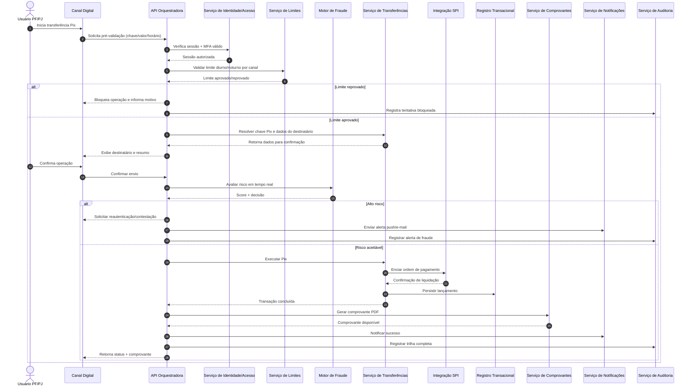

# Relatório Técnico de Arquitetura de Software

## 1. Identificação das HUs

### 1.1 Escopo funcional consolidado por persona

**Pessoa Física (PF)**
- **HU01**: Onboarding digital com validação de identidade.
- **HU02**: Autenticação multifator obrigatória.
- **HU03**: Transferência Pix com confirmação, limites e comprovante.
- **HU04**: Pagamento/agendamento de boletos com lembrete.
- **HU05**: Gestão de cartão de crédito (fatura, pagamento, limite, bloqueio).
- **HU06**: Contestação de transações não reconhecidas.
- **HU07**: Aplicação/resgate em renda fixa e posição consolidada.
- **HU08**: Gestão de consentimentos Open Finance.
- **HU09**: Alertas de fraude e resposta do usuário.

**Pessoa Jurídica (PJ)**
- **HU10**: Onboarding PJ com validação societária e KYC de sócios.
- **HU11**: TED para fornecedores com validações regulatórias.

**Gerente de Relacionamento**
- **HU12**: Visão consolidada da carteira com consentimento do cliente.
- **HU13**: Abertura de solicitações de serviço em nome do cliente com auditoria.

---

### 1.2 Macrodomínios funcionais derivados
1. **Identidade, Acesso e Consentimento** (HU01, HU02, HU08, HU12, HU13)  
2. **Core Transacional** (HU03, HU04, HU11)  
3. **Cartões e Faturas** (HU05, HU06)  
4. **Investimentos** (HU07)  
5. **Fraude e Segurança Operacional** (HU09 + transversal)  
6. **Atendimento e Relacionamento** (HU12, HU13)  

---

## 2. Diagramas de Arquitetura (Mermaid)

### 2.1 Diagrama de Componentes (visão lógica)

```mermaid
flowchart LR
    U[Usuário PF/PJ] --> CH[Canal Digital\n(App/Portal)]
    G[Gerente] --> CHG[Portal do Gerente]

    CH --> API[Camada de API e Orquestração]
    CHG --> API

    API --> IAM[Serviço de Identidade e Acesso]
    API --> ONB[Serviço de Onboarding/KYC]
    API --> CONS[Serviço de Consentimentos]
    API --> ACC[Serviço de Contas e Saldos]
    API --> TRX[Serviço de Transferências\n(Pix/TED/Agendamentos)]
    API --> BLT[Serviço de Boletos]
    API --> CRD[Serviço de Cartões e Faturas]
    API --> INV[Serviço de Investimentos]
    API --> FRAUD[Motor de Risco e Fraude]
    API --> NOTIF[Serviço de Notificações]
    API --> REC[Serviço de Comprovantes]
    API --> RM[Serviço de Relacionamento]
    API --> TKT[Serviço de Solicitações]
    API --> AUD[Serviço de Auditoria Imutável]
    API --> OPEN[Gateway Open Finance]
    API --> LIMIT[Serviço de Limites por Canal/Horário]

    TRX --> SPI[Integração Arranjo de Pagamentos Instantâneos]
    TRX --> TEDNET[Integração Rede de Transferência Interbancária]
    BLT --> BILLNET[Integração de Cobrança/Boleto]
    CRD --> CARDPROC[Processador de Cartões Certificado PCI-DSS]
    OPEN --> OFNET[Ecossistema Open Finance Brasil]
    ONB --> DOCVAL[Validação Documental e Cadastral]
    FRAUD --> CASE[Gestão de Casos de Fraude]

    ACC --> LEDGER[(Registro Transacional)]
    TRX --> LEDGER
    BLT --> LEDGER
    CRD --> LEDGER
    INV --> LEDGER
    AUD --> AUDSTORE[(Trilha de Auditoria Imutável)]
    CONS --> CONSSTORE[(Repositório de Consentimentos)]
    NOTIF --> MSG[(Fila/Eventos de Notificação)]
```

### 2.2 Diagrama de Sequência — Pix com validação de risco e comprovante



---

## 3. Decisões de Arquitetura

| ID | Decisão | Motivação | Consequências |
|---|---|---|---|
| DA-01 | Arquitetura modular por domínios (identidade, transações, cartões, investimentos, fraude, consentimento). | Alto número de capacidades e regras regulatórias distintas. | Evolução independente de módulos e melhor isolamento de risco. |
| DA-02 | Camada de orquestração de APIs separada dos serviços de domínio. | Uniformizar autenticação, autorização, rate limiting e auditoria transversal. | Padroniza governança e reduz duplicidade de regras críticas. |
| DA-03 | MFA obrigatório em todos os acessos e reautenticação adaptativa em operações de risco. | RF03, RF37, RNF segurança. | Aumenta segurança; exige UX clara para não degradar conversão. |
| DA-04 | Motor de fraude em linha (síncrono) para autorizações críticas e assíncrono para investigação/casos. | Necessidade de resposta imediata + trilha de investigação (RF36-40). | Balanceia latência e efetividade de detecção. |
| DA-05 | Trilha de auditoria imutável e centralizada para operações, acessos e configurações. | RNF12, conformidade BACEN/LGPD. | Facilita auditoria; impõe governança de retenção e consulta controlada. |
| DA-06 | Ledger transacional único como fonte de verdade para saldos, extrato e comprovantes. | RF09, RF10, RF13, consistência financeira. | Simplifica reconciliação e relatórios; requer alta confiabilidade. |
| DA-07 | Integrações reguladas desacopladas por adaptadores (Pix, TED, boleto, Open Finance, processador de cartões). | Mudança frequente de especificações externas. | Menor impacto de alterações regulatórias/protocolares. |
| DA-08 | Consentimento explícito como pré-condição de acesso do gerente à visão do cliente. | RF07, RF45, HU12. | Reduz risco de acesso indevido; exige gestão de ciclo de vida do consentimento. |
| DA-09 | Processamento de dados de cartão delegado a entidade certificada PCI-DSS; sem retenção local de PAN. | RNF06. | Reduz escopo de conformidade interna de cartão; depende de SLA externo. |
| DA-10 | Estratégia de resiliência com fallback, retentativas idempotentes e recuperação de transações. | RNF17, RNF13. | Aumenta robustez operacional; requer desenho cuidadoso de idempotência. |

---

## 4. Tabela de Componentes e Rastreabilidade

| Componente | Responsabilidade Principal | Comunica-se com | Origem (HU / Critério de Aceite) |
|---|---|---|---|
| Canal Digital (App/Portal) | UI de operações financeiras, confirmações críticas e consulta. | API Orquestradora, Notificações | HU03, HU04, HU05, HU07, HU08, RNF21 |
| Portal do Gerente | Interface de carteira, interações e solicitações de serviço. | API, Serviço de Relacionamento, Solicitações | HU12, HU13 |
| API Orquestradora | Entrada única, roteamento, políticas transversais, composição de serviços. | Todos os serviços de domínio | Todas as HUs (transversal) |
| Serviço de Identidade e Acesso | Login, MFA, gestão de sessão, bloqueio/desbloqueio de acesso. | API, Auditoria, Notificações | HU02, RF03, RF04, RF06 |
| Serviço de Onboarding/KYC | Cadastro PF/PJ, validação documental e KYC/PLD. | API, Validação Cadastral, Notificações, Auditoria | HU01, HU10, RF02, RNF08 |
| Serviço de Consentimentos | Conceder/listar/revogar consentimentos; autorização de acesso de terceiros/gerente. | API, Open Finance, Relacionamento, Auditoria | HU08, HU12, RF41, RF42 |
| Serviço de Contas e Saldos | Gestão de contas corrente/poupança, saldo em tempo real, extrato. | API, Ledger, Comprovantes | RF08-RF13 |
| Serviço de Transferências (Pix/TED) | Execução e agendamento de transferências, validação do destinatário e horários. | API, Limites, Fraude, Integrações Pix/TED, Ledger, Comprovantes | HU03, HU11, RF22-RF27 |
| Serviço de Limites | Regras de limites diurno/noturno por canal e perfil. | API, Transferências, Auditoria | HU03 (bloqueio noturno), RF27 |
| Serviço de Boletos | Leitura/digitação, validação, pagamento/agendamento, lembretes. | API, Rede de Cobrança, Ledger, Notificações | HU04, RF28-RF31 |
| Serviço de Cartões e Faturas | Emissão/gestão de cartões, faturas, pagamentos, limites, bloqueio. | API, Processador PCI-DSS, Ledger, Notificações | HU05, RF14-RF21 |
| Serviço de Contestação | Abertura e acompanhamento de contestações com evidências. | API, Cartões/Extrato, Gestão de Casos, Notificações | HU06, RF21, RF39 |
| Motor de Fraude | Monitoramento em tempo real, scoring e bloqueio preventivo. | API, Transferências, Cartões, Notificações, Casos, Auditoria | HU09, RF36-RF40 |
| Serviço de Investimentos | Catálogo, aplicação/resgate, posição consolidada e informe de rendimentos. | API, Ledger, Notificações | HU07, RF32-RF35 |
| Gateway Open Finance | Exposição/consumo de APIs padronizadas e iniciação de pagamento. | API, Consentimentos, Ecossistema Open Finance | RF43, RF44, RNF11 |
| Serviço de Relacionamento | Carteira consolidada, anotações e histórico de interações. | Portal Gerente, API, Consentimentos, Auditoria | HU12, RF45, RF46 |
| Serviço de Solicitações | Fluxo de solicitações em nome do cliente com trilha de responsabilidade. | Portal Gerente, Relacionamento, Notificações, Auditoria | HU13, RF47 |
| Serviço de Comprovantes | Geração e disponibilização de comprovantes em PDF. | Transferências, Boletos, API | HU03, HU11, RF13 |
| Serviço de Notificações | Push/e-mail para eventos de segurança, transações e lembretes. | API, Fraude, Boletos, Cartões, Onboarding | HU01, HU05, HU08, HU09 |
| Serviço de Auditoria Imutável | Registro inviolável de acessos, operações e alterações de configuração. | Todos os serviços | HU13 (auditoria), RNF12 |

---

## 5. Bloqueios e Pendências

1. **SLA regulatório detalhado por operação externa**  
   - Falta especificação de tempos máximos para TED, boletos e iniciação Open Finance além do Pix.
2. **Política de limites por perfil/canal**  
   - Regras exatas de valor, janelas de horário e critérios de alteração ainda não definidas.
3. **Modelo de consentimento do gerente**  
   - Necessário definir granularidade (produto, período, escopo de dados) e renovação.
4. **Fluxo de disputa/chargeback**  
   - Prazo de análise, estados do processo e integração com processador de cartões não detalhados.
5. **Regras de investimento em renda fixa**  
   - Falta formalizar cálculo de rentabilidade/projeção e disponibilidade por perfil de risco.
6. **Critérios de detecção de fraude**  
   - Não há baseline de score, thresholds de bloqueio e política de falso positivo.
7. **Requisitos de relatórios BACEN (RNF09)**  
   - Frequência, layout e janela de envio não especificados no requisito atual.
8. **LGPD operacional**  
   - Necessário detalhar bases legais por tratamento, prazos de retenção por dado e fluxo de anonimização.

---

## 6. Cobertura de Requisitos

### 6.1 Cobertura dos Requisitos Funcionais (RF)

| RF | Cobertura Arquitetural | Status |
|---|---|---|
| RF01-RF07 | Identidade/Acesso, Onboarding/KYC, Consentimentos, Relacionamento | Coberto |
| RF08-RF13 | Contas e Saldos + Ledger + Comprovantes | Coberto |
| RF14-RF21 | Cartões/Faturas + Processador PCI-DSS + Contestação + Notificações | Coberto |
| RF22-RF27 | Transferências Pix/TED + Limites + Agendamentos + Integrações reguladas | Coberto |
| RF28-RF31 | Boletos + Agendamento + Notificações de vencimento | Coberto |
| RF32-RF35 | Investimentos + Posição consolidada + Informe de rendimentos | Coberto |
| RF36-RF40 | Motor de Fraude + Bloqueio preventivo + Resposta do usuário + Auditoria | Coberto |
| RF41-RF44 | Consentimentos + Gateway Open Finance + APIs padronizadas | Coberto |
| RF45-RF47 | Relacionamento + Solicitações de Serviço + Auditoria | Coberto |

### 6.2 Cobertura dos Requisitos Não Funcionais (RNF)

| RNF | Estratégia Arquitetural | Status |
|---|---|---|
| RNF01-RNF06 (Segurança) | TLS, criptografia em repouso, hash seguro, rate limiting, testes periódicos, terceirização PCI-DSS | Coberto (detalhar políticas operacionais) |
| RNF07-RNF12 (Conformidade) | KYC/PLD, trilha imutável, governança regulatória, consentimento/LGPD, Open Finance | Parcial (depende de normativos e layouts finais) |
| RNF13-RNF17 (Disponibilidade/Desempenho/Resiliência) | Multi-zona, escalabilidade horizontal, idempotência, recuperação de transações, observabilidade | Coberto (com metas de capacidade a validar) |
| RNF18-RNF21 (Usabilidade/Acessibilidade) | Canais mobile/web responsivos, WCAG 2.1 AA, confirmação explícita em operações críticas | Coberto |
| RNF22-RNF24 (Backup/Infra/Operação) | Backup contínuo com RPO/RTO alvo, monitoramento em tempo real, redundância geográfica | Coberto |

---

## 7. Gap Analysis

| Lacuna | Impacto Arquitetural | Ação Recomendada |
|---|---|---|
| Ausência de detalhamento de jornadas de exceção (timeouts, indisponibilidade externa, reversões). | Pode gerar inconsistência entre estado do cliente e liquidação financeira. | Definir matriz de falhas por integração e política de compensação/idempotência por operação. |
| Falta de especificação de autorização granular para gerente (escopos finos). | Risco de acesso excessivo e não conformidade LGPD. | Criar modelo de consentimento por escopo de dado, validade e evidência de aceite. |
| Requisitos de fraude sem metas de precisão (FP/FN) e tempo de decisão. | Dificulta dimensionamento e priorização de regras/modelos. | Definir KPIs mínimos (ex.: tempo de decisão, taxa de bloqueio indevido) e governança de tuning. |
| Contestação de transações sem SLA ponta a ponta. | Fricção com cliente e risco reputacional/regulatório. | Especificar SLA de triagem, análise, comunicação e resolução por tipo de disputa. |
| RNF09 (relatórios BACEN) genérico. | Retrabalho em dados, trilhas e integrações regulatórias. | Definir catálogo de relatórios, periodicidade, formato e dono de cada entrega. |
| Ausência de política formal de retenção/expurgo por domínio de dado. | Exposição LGPD e custo operacional desnecessário. | Publicar política de ciclo de vida de dados (retenção legal, anonimização e descarte seguro). |
| Metas de desempenho amplas, sem orçamento de latência por componente. | Risco de não cumprir RNF14/RNF15 em pico. | Estabelecer SLO por serviço (entrada, decisão de fraude, integração externa, persistência). |

---

Se quiser, no próximo passo eu já posso transformar este relatório em:
1) **backlog técnico priorizado (épicos/features/enablers)** e  
2) **ADR formal (Architecture Decision Records)** pronto para governança do time.