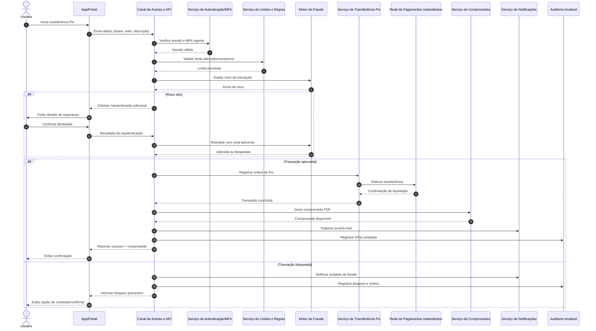

# Relatório Técnico de Arquitetura de Software

## 1. Identificação das HUs

| HU | Perfil | Objetivo de Negócio | RF Relacionados | RNF Relacionados |
|---|---|---|---|---|
| HU01 | PF | Abrir conta digital com validação documental | RF01, RF02, RF08 | RNF07, RNF08, RNF10 |
| HU02 | PF/PJ | Acesso seguro com MFA obrigatório | RF03, RF04, RF05, RF06 | RNF01, RNF03, RNF04, RNF12 |
| HU03 | PF/PJ | Transferir via Pix com confirmação e comprovante | RF22, RF24, RF27, RF13 | RNF14, RNF15, RNF21 |
| HU04 | PF/PJ | Pagar/agendar boletos com lembrete | RF28, RF29, RF30, RF31 | RNF21 |
| HU05 | PF/PJ | Gestão de cartão de crédito (fatura, limite, bloqueio) | RF16, RF17, RF18, RF19, RF20 | RNF06, RNF14 |
| HU06 | PF/PJ | Contestar transações não reconhecidas | RF21, RF40 | RNF12 |
| HU07 | PF/PJ | Investir/resgatar renda fixa com posição consolidada | RF32, RF33, RF34, RF35 | RNF07, RNF10 |
| HU08 | PF/PJ | Gerenciar consentimentos Open Finance | RF41, RF42, RF44 | RNF10, RNF11, RNF12 |
| HU09 | PF/PJ | Receber alerta e responder suspeita de fraude | RF36, RF37, RF38, RF39, RF40 | RNF12, RNF17 |
| HU10 | PJ | Onboarding PJ com validação societária | RF01, RF02, RF08 | RNF07, RNF08, RNF10 |
| HU11 | PJ | Realizar TED para fornecedores | RF25, RF26, RF27, RF13 | RNF14, RNF21 |
| HU12 | Gerente | Acompanhar carteira com consentimento | RF07, RF45, RF46 | RNF10, RNF12 |
| HU13 | Gerente | Abrir solicitação em nome do cliente | RF47 | RNF12, RNF21 |

---

## 2. Diagramas de Arquitetura (Mermaid)

### 2.1 Diagrama de Componentes (visão lógica)

```mermaid
flowchart LR
    C[Clientes: App Mobile / Portal Web] --> G[Canal de Acesso e API]
    G --> IAM[Identidade, Autenticação e MFA]
    G --> USR[Gestão de Usuários e Perfis]
    G --> ACC[Contas, Saldo e Extrato]
    G --> PAY[Pagamentos e Transferências]
    G --> CRD[Cartões e Faturas]
    G --> INV[Investimentos Renda Fixa]
    G --> OF[Open Finance e Consentimentos]
    G --> RM[Módulo Gerente de Relacionamento]
    G --> FRA[Detecção e Resposta a Fraudes]
    G --> DOC[Comprovantes e Documentos]
    G --> NOTI[Notificações Push/E-mail]
    G --> CASE[Contestações e Solicitações]

    PAY --> SPI[Integração Institucional de Pagamentos Instantâneos]
    PAY --> TEDNET[Integração Institucional de Transferências]
    PAY --> BILL[Integração de Boletos]
    CRD --> CARDP[Processador Externo de Cartão (PCI-DSS)]
    OF --> OFEXT[Instituições Participantes Open Finance]
    FRA --> AUD[Trilha de Auditoria Imutável]
    IAM --> AUD
    ACC --> AUD
    PAY --> AUD
    CRD --> AUD
    RM --> AUD
    CASE --> AUD
    OF --> AUD
```

### 2.2 Diagrama de Sequência — Transferência Pix com validação antifraude e comprovante



---

## 3. Decisões de Arquitetura

1. **Arquitetura modular por domínios de negócio**  
   - Domínios: Identidade, Contas, Pagamentos, Cartões, Investimentos, Fraude, Open Finance, Relacionamento, Notificações, Auditoria.  
   - **Motivo:** reduzir acoplamento e facilitar evolução regulatória contínua.

2. **Separação explícita entre canal de acesso e serviços de negócio**  
   - Camada de API centraliza autenticação, autorização, rate limiting e observabilidade.  
   - **Motivo:** uniformizar políticas de segurança e experiência entre app e portal.

3. **Autenticação forte e contextual em operações críticas**  
   - MFA obrigatório no login e reautenticação em transações de risco elevado.  
   - **Motivo:** atender RF03, RF37, RNF04 e reduzir fraude.

4. **Motor de fraude em tempo real no fluxo transacional**  
   - Avaliação síncrona antes da liquidação; bloqueio preventivo quando necessário.  
   - **Motivo:** cumprir RF36–RF39 sem perder rastreabilidade.

5. **Trilha de auditoria imutável transversal**  
   - Registro de acessos, transações, mudanças de consentimento e ações de gerente.  
   - **Motivo:** conformidade RNF12, investigações e relatórios regulatórios.

6. **Gestão de consentimento como capacidade central de autorização de dados**  
   - Qualquer acesso de terceiro (open finance ou gerente) validado contra consentimento ativo.  
   - **Motivo:** RF07, RF41, RF42, RNF10, RNF11.

7. **Integrações externas encapsuladas por adaptadores institucionais**  
   - Pix/SPI, TED, boletos, processador de cartão, instituições Open Finance.  
   - **Motivo:** isolar volatilidade de protocolos e facilitar conformidade.

8. **Geração de comprovante desacoplada do processamento financeiro**  
   - Transação primeiro; emissão de PDF imediatamente após confirmação.  
   - **Motivo:** resiliência e rastreabilidade (RF13, HU03/HU11).

9. **Modelo de resiliência orientado a continuidade operacional**  
   - Fallback, retentativas controladas e recuperação sem perda de transação.  
   - **Motivo:** RNF13, RNF17, RNF22, RNF23.

---

## 4. Tabela de Componentes e Rastreabilidade

| Componente | Responsabilidade Principal | Comunica-se com | Origem (HU / Critério de Aceite) |
|---|---|---|---|
| Canal de Acesso e API | Orquestrar requisições, aplicar políticas de segurança e expor interfaces | App/Portal, todos os serviços internos | HU02, HU03, HU04, HU11 (confirmação explícita e segurança) |
| Identidade, Sessão e MFA | Login, MFA, expiração de sessão, gestão de métodos | API, Auditoria, Notificações | HU02 (MFA obrigatório, gerenciamento e alertas) |
| Gestão de Usuários e Onboarding | Cadastro PF/PJ/gerente, KYC documental, ativação de conta | API, Auditoria, Notificações | HU01, HU10 (validação CPF/CNPJ/sócios e prazo de análise) |
| Contas e Saldos | Conta corrente/poupança, saldo em tempo real, extrato e transferências internas | API, Auditoria, Documentos | RF08–RF12, HU01 |
| Rendimentos de Poupança | Cálculo e crédito automático conforme regra regulatória | Contas e Saldos, Auditoria | RF11 |
| Pagamentos e Transferências | Pix, TED, agendamentos, limites por canal/horário | API, Limites, Fraude, Integrações, Documentos | HU03, HU11; RF22–RF27 |
| Limites e Regras Transacionais | Validar limites diários e noturnos por perfil/canal | Pagamentos, Cartões, Fraude | HU03 (bloqueio por limite noturno), HU11 |
| Gestão de Boletos | Leitura/validação de boleto, agendamento e execução | API, Pagamentos, Notificações, Auditoria | HU04 (confirmação e lembrete) |
| Cartões e Faturas | Emissão/gestão de débito e crédito, faturas, pagamento parcial/total, bloqueio | API, Processador de Cartão, Notificações, Auditoria | HU05, HU06; RF14–RF21 |
| Processador Externo de Cartão | Autorizar/capturar transações de cartão sem armazenar PAN internamente | Cartões e Faturas | RNF06 |
| Investimentos Renda Fixa | Catálogo de produtos, aplicação/resgate, posição consolidada, informe de rendimentos | API, Contas, Auditoria, Documentos | HU07; RF32–RF35 |
| Motor de Fraude | Monitoramento em tempo real, score de risco, bloqueio preventivo | Pagamentos, Cartões, API, Notificações, Auditoria | HU09; RF36–RF40 |
| Contestações e Casos | Registrar contestação de transações e ciclo de resolução | Cartões, Contas, Fraude, Auditoria, Notificações | HU06, HU09 |
| Open Finance e Consentimentos | Conceder/revogar consentimentos, expor APIs padronizadas, iniciação de pagamento | API, Auditoria, Instituições Externas, Notificações | HU08; RF41–RF44 |
| Relacionamento (Gerente) | Carteira consolidada, anotações, abertura de solicitações em nome do cliente | API, Consentimentos, Auditoria, Notificações | HU12, HU13 |
| Notificações | Envio de push/e-mail para eventos críticos | Todos os domínios | HU01, HU02, HU04, HU05, HU08, HU09, HU13 |
| Comprovantes e Documentos | Gerar comprovantes PDF, informes e documentos transacionais | Pagamentos, Cartões, Investimentos, API | HU03, HU11, HU07 |
| Auditoria Imutável | Trilha de auditoria de operações, acessos e configurações | Todos os domínios | RNF12; HU13 (identificador do gerente) |
| Relatórios Regulatórios | Consolidar e transmitir relatórios obrigatórios ao regulador | Auditoria, domínios financeiros | RNF09 |

---

## 5. Bloqueios e Pendências

1. **Política detalhada de limites transacionais**  
   - Falta matriz completa por perfil (PF/PJ), canal e faixa horária.  
   - Impacto: regras incompletas para RF27 e HU03/HU11.

2. **Definição formal de SLA por fluxo além do Pix**  
   - Há meta explícita para Pix e consulta, mas não para TED, boleto, contestação e solicitações do gerente.  
   - Impacto: risco de divergência entre áreas.

3. **Critérios operacionais do motor de fraude**  
   - Não há limiares de risco, estratégia de falso positivo e tempos de reanálise.  
   - Impacto: bloqueios excessivos ou risco residual alto.

4. **Escopo de consentimento do gerente de relacionamento**  
   - Necessário detalhar granularidade do consentimento (produto, período, dados sensíveis).  
   - Impacto: risco LGPD e acesso indevido.

5. **Regras de retenção e descarte por tipo de dado**  
   - Existe retenção mínima para auditoria, mas não para anexos de contestação/documentação KYC.  
   - Impacto: conformidade incompleta com LGPD.

6. **Fluxo de contingência para indisponibilidade de integrações externas**  
   - Falta especificação de comportamento em falhas de SPI, TED e processador de cartão.  
   - Impacto: afeta RNF17, experiência do usuário e reconciliação.

---

## 6. Cobertura de Requisitos

### 6.1 Requisitos Funcionais (visão consolidada)

| Faixa RF | Cobertura Arquitetural | Status |
|---|---|---|
| RF01–RF07 (Usuários/Auth/Gerente com consentimento) | Onboarding, IAM/MFA, Sessão, Histórico de acesso, Consentimento, Relacionamento | **Coberto** |
| RF08–RF13 (Contas/Poupança/Comprovantes) | Contas e Saldos, Rendimentos, Transferência interna, Documentos PDF | **Coberto** |
| RF14–RF21 (Cartões) | Cartões e Faturas + Processador Externo + Contestações + Notificações | **Coberto** |
| RF22–RF27 (Pix/TED/Agendamento/Limites) | Pagamentos e Transferências + Limites + Fraude + Integrações externas | **Coberto** |
| RF28–RF31 (Boletos) | Gestão de Boletos + Agendamento + Notificações | **Coberto** |
| RF32–RF35 (Investimentos) | Serviço de Investimentos + Posição + Informe | **Coberto** |
| RF36–RF40 (Fraude) | Motor de Fraude + Resposta do Usuário + Auditoria | **Coberto** |
| RF41–RF44 (Open Finance) | Consentimentos + APIs padronizadas + iniciação de pagamento | **Coberto** |
| RF45–RF47 (Gerente) | Carteira consolidada + anotações + solicitações com auditoria | **Coberto** |

### 6.2 Requisitos Não Funcionais

| RNF | Tratamento Arquitetural | Status |
|---|---|---|
| RNF01–RNF06 Segurança | Criptografia em trânsito/repouso, hash seguro, rate limiting, segregação de cartão | **Coberto** |
| RNF07–RNF12 Conformidade | KYC/PLD, Open Finance, LGPD, auditoria imutável, relatórios regulatórios | **Parcial** (regras detalhadas pendentes) |
| RNF13–RNF17 Disponibilidade/Desempenho/Resiliência | Multi-zona, escalabilidade horizontal, fallback e recuperação | **Parcial** (SLOs por serviço pendentes) |
| RNF18–RNF21 Usabilidade/Acessibilidade | Canais mobile/web, confirmação explícita, acessibilidade | **Coberto** |
| RNF22–RNF24 Infra/Dados/Observabilidade | Backup contínuo, RPO/RTO, monitoramento operacional em tempo real | **Parcial** (plano de testes de recuperação pendente) |

---

## 7. Gap Analysis

| Gap | Impacto Arquitetural | Recomendação |
|---|---|---|
| Ausência de catálogo de eventos de auditoria obrigatório por domínio | Pode gerar trilha incompleta para fiscalizações e disputas | Definir esquema canônico de auditoria (evento, ator, origem, correlação, retenção) |
| Falta de modelo de autorização fina (RBAC/ABAC) para gerente e operações sensíveis | Risco de privilégio excessivo e não conformidade LGPD | Especificar matriz de permissões por perfil, contexto e consentimento |
| Inexistência de política de idempotência para pagamentos/transferências | Risco de duplicidade em retentativas e falhas de rede | Definir chave idempotente obrigatória em operações financeiras |
| Critérios de conciliação financeira não descritos | Diferenças entre estado interno e integrações externas | Definir processo de reconciliação periódica e tratamento de divergências |
| Falta de SLA de notificações (push/e-mail) | Pode comprometer HU09 e experiência em eventos críticos | Estabelecer tempos máximos de disparo e confirmação por canal |
| Requisitos de anexos em contestações não detalhados (tipos/tamanho/segurança) | Impacta armazenamento, segurança e LGPD | Definir política de anexos, classificação e ciclo de vida |
| Open Finance sem detalhamento de escopos/versionamento de API | Risco de retrabalho e não aderência regulatória | Criar backlog regulatório contínuo por fase e versão de especificação |
| Ausência de estratégia de testes de resiliência e recuperação | Risco de não cumprimento de RNF13/RNF17/RNF22 | Definir plano recorrente de testes de continuidade, backup restore e caos controlado |

---

Se quiser, no próximo passo eu posso gerar uma **matriz HU × RF × Componentes** em formato pronto para governança (usável em backlog/ALM) e uma versão deste relatório com **IDs de decisão (ADR-001, ADR-002...)** para controle de arquitetura.