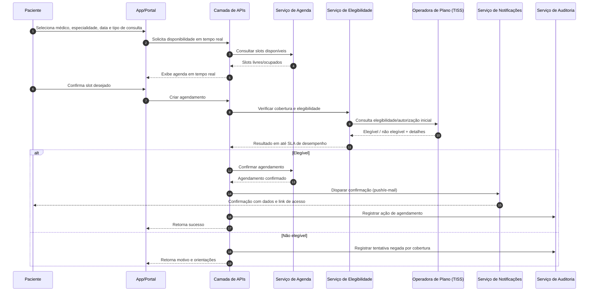
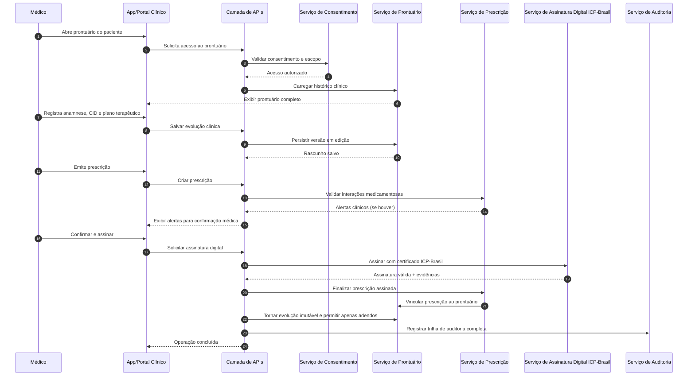

# Relatório Técnico de Arquitetura de Software

## 1. Identificação das HUs

### 1.1 Inventário das Histórias de Usuário
| HU | Perfil | Objetivo |
|---|---|---|
| HU01 | Paciente | Cadastro + consentimento LGPD |
| HU02 | Paciente | Agendar consulta presencial/remota |
| HU03 | Paciente | Ingressar em videochamada segura |
| HU04 | Paciente | Visualizar prontuário e exames |
| HU05 | Paciente | Acessar/compartilhar prescrição digital |
| HU06 | Paciente | Receber notificação de exame disponível |
| HU07 | Médico | Cadastro com validação de CRM |
| HU08 | Médico | Registrar evolução clínica com assinatura e imutabilidade |
| HU09 | Médico | Emitir prescrição digital ICP-Brasil |
| HU10 | Médico | Solicitar exame e receber alertas críticos |
| HU11 | Médico | Acessar prontuário compartilhado com consentimento |
| HU12 | Admin Clínica/Hospital | Gerenciar médicos/agendas e ocupação |
| HU13 | Admin Clínica/Hospital | Acompanhar faturamento por convênio |
| HU14 | Operador Plano | Processar autorização prévia no padrão TISS |

### 1.2 Agrupamento por Domínio Arquitetural
- **Identidade, Acesso e Consentimento:** HU01, HU07, HU11  
- **Agenda e Atendimento:** HU02, HU03, HU12  
- **Prontuário e Documentação Clínica:** HU04, HU08, HU10, HU11  
- **Prescrição Digital:** HU05, HU09  
- **Integrações Assistenciais e Convênios:** HU06, HU10, HU14, HU13  
- **Administração e Analytics:** HU12, HU13  

---

## 2. Diagramas de Arquitetura (Mermaid)

### 2.1 Diagrama de Componentes (visão lógica)
```mermaid
flowchart LR
    U[Apps/Portal dos Usuários] --> API[Camada de APIs e Orquestração]

    API --> IAM[Serviço de Identidade e Acesso]
    API --> CONS[Serviço de Consentimento e Privacidade]
    API --> AGE[Serviço de Agenda e Consultas]
    API --> VID[Serviço de Sessão de Videochamada]
    API --> PEP[Serviço de Prontuário Eletrônico]
    API --> RX[Serviço de Prescrição Digital]
    API --> EXM[Serviço de Exames e Laboratórios]
    API --> PLN[Serviço de Elegibilidade e Autorizações]
    API --> FAT[Serviço de Faturamento/TISS]
    API --> NOTI[Serviço de Notificações]
    API --> AUD[Serviço de Auditoria Imutável]
    API --> REL[Serviço de Relatórios e Indicadores]
    API --> ADM[Serviço de Administração de Unidades]

    IAM --> AUD
    CONS --> AUD
    AGE --> AUD
    PEP --> AUD
    RX --> AUD
    EXM --> AUD
    PLN --> AUD
    FAT --> AUD

    PEP --> OBJ[Armazenamento de Documentos Clínicos]
    RX --> PEP
    EXM --> PEP

    PLN <--> OPS[Operadoras de Plano (TISS)]
    EXM <--> LAB[Laboratórios Parceiros (FHIR/HL7)]
    IAM <--> CFM[Validação de CRM no CFM]
```

### 2.2 Diagrama de Sequência — Agendamento com elegibilidade e notificação


### 2.3 Diagrama de Sequência — Evolução clínica e prescrição assinada


---

## 3. Decisões de Arquitetura

1. **Arquitetura modular por domínios de negócio**  
   Separação em serviços lógicos (identidade, agenda, prontuário, prescrição, exames, convênios etc.) para suportar escalabilidade horizontal (RNF17), governança e isolamento de responsabilidades.

2. **Controle de acesso com RBAC + políticas contextuais (ABAC leve)**  
   Perfis (RF01, RF04) combinados com contexto clínico (consentimento, unidade, especialidade, justificativa) para acesso ao prontuário (RF23, HU11).

3. **Consentimento como capacidade central de autorização**  
   Registro, revogação e versionamento de consentimento (HU01, RF23, RNF07, RNF12), impactando leitura/compartilhamento de dados clínicos.

4. **Prontuário com imutabilidade por assinatura + adendos encadeados**  
   Entradas bloqueadas após assinatura (RF25, HU08), com trilha auditável de longo prazo (RNF11).

5. **Auditoria imutável transversal**  
   Todo acesso e alteração clínica, incluindo tentativas negadas, com retenção mínima exigida (RF06, RNF11).

6. **Integração por padrões regulatórios e interoperáveis**  
   Convênios via TISS (RF38-40, RNF09) e laboratórios via padrões abertos de saúde (RF31, RNF26).

7. **Videochamada integrada com segurança reforçada**  
   Acesso autenticado (RF15), E2EE e sem gravação (RNF04), com UX de ingresso simplificado (RNF22).

8. **Segurança by design**  
   TLS em trânsito, criptografia em repouso, hash robusto de senha, limitação de taxa e detecção de anomalias (RNF01-05).

9. **Resiliência de dados clínicos**  
   Armazenamento de documentos em serviço de objetos com redundância geográfica + backup contínuo (RNF18, RNF23, RNF24).

10. **Observabilidade orientada a SLA/SLO**  
    Métricas por módulo (RNF25) e alarmes para metas críticas: elegibilidade ≤5s (RNF14), prontuário ≤3s (RNF15), disponibilidade 99,9% (RNF13).

---

## 4. Tabela de Componentes e Rastreabilidade

| Componente | Responsabilidade Principal | Comunica-se com | Origem (HU / Critério de Aceite) |
|---|---|---|---|
| Serviço de Identidade e Acesso | Cadastro, MFA, sessão, perfis e permissões | Apps/Portal, Auditoria, Validador CRM | HU01, HU07; RF01, RF03, RF04, RF05 |
| Serviço de Validação de CRM | Validar situação do CRM e revalidação periódica | Identidade, CFM, Notificações | HU07; RF02 |
| Serviço de Consentimento e Privacidade | Coletar/revogar consentimento, base legal, portabilidade | APIs, Prontuário, Auditoria | HU01, HU04, HU11; RF23; RNF07, RNF12 |
| Serviço de Agenda e Consultas | Agenda em tempo real, agendamento, remarcação, encaixe | APIs, Elegibilidade, Notificações, Auditoria | HU02, HU12; RF07-13 |
| Serviço de Elegibilidade e Autorizações | Elegibilidade em tempo real e pré-autorização | Agenda, Operadoras, Faturamento | HU02, HU14; RF09, RF37, RF39; RNF14 |
| Serviço de Videochamada | Sessões remotas seguras, duração, compartilhamento | Agenda, Notificações, Auditoria | HU03; RF14-18; RNF04, RNF16, RNF22 |
| Serviço de Prontuário Eletrônico | Registro clínico, histórico unificado, acesso do paciente | Consentimento, Prescrição, Exames, Auditoria | HU04, HU08, HU11; RF19-25 |
| Serviço de Prescrição Digital | Emissão, validação de interação, assinatura ICP-Brasil | Prontuário, Assinatura, Apps | HU05, HU09; RF26-30; RNF06 |
| Serviço de Assinatura Digital | Aplicação e validação de assinatura jurídica | Prescrição, Prontuário, Auditoria | HU08, HU09; RF25, RF27 |
| Serviço de Exames e Laboratórios | Solicitação de exames, recebimento de laudos, alerta crítico | Prontuário, Notificações, Laboratórios | HU06, HU10; RF31-35 |
| Serviço de Notificações | Push/e-mail para eventos clínicos e operacionais | Agenda, Exames, CRM, Videochamada | HU02, HU03, HU06, HU10; RF11, RF18, RF32 |
| Serviço de Faturamento/TISS | Guias, envio de faturamento, coparticipação | Elegibilidade, Operadoras, Relatórios | HU13, HU14; RF38-41 |
| Serviço de Administração de Unidades | Gestão de clínicas/hospitais, médicos, salas e equipamentos | Agenda, Relatórios | HU12; RF42, RF43, RF45 |
| Serviço de Relatórios e Indicadores | Indicadores operacionais e gerenciais exportáveis | Administração, Faturamento, Auditoria | HU13; RF44, RF46 |
| Serviço de Auditoria Imutável | Trilhas de acesso/alteração com retenção regulatória | Todos os serviços | HU08, HU11; RF06; RNF11 |
| Armazenamento de Documentos Clínicos | Guardar laudos/imagens com redundância e criptografia | Prontuário, Exames | HU04, HU06; RF21, RF33; RNF02, RNF18 |

---

## 5. Bloqueios e Pendências

| Tipo | Item | Impacto Arquitetural | Ação Recomendada |
|---|---|---|---|
| Externo | Interface oficial de consulta de CRM/CFM não detalhada | Pode afetar HU07 e prazo de validação | Definir contrato de integração, frequência de revalidação e fallback |
| Regra de Negócio | Política de prazo para cancelamento/remarcação (RF10) não parametrizada | Inconsistência por unidade/plano | Definir matriz de regras por perfil, convênio e tipo de consulta |
| Regra Clínica | Faixas críticas de exames (RF35) sem fonte normativa por laboratório | Alertas potencialmente incorretos | Definir catálogo de parâmetros críticos por exame/lab |
| Jurídico | Modelo de consentimento granular (por especialidade/unidade/finalidade) | Risco LGPD e acesso indevido | Aprovar taxonomia de consentimento com jurídico/compliance |
| Segurança | Gestão de chaves para E2EE da videochamada não especificada | Risco de não conformidade RNF04 | Definir modelo de distribuição/rotação de chaves e evidências |
| Operacional | Estratégia de contingência para indisponibilidade (RNF13) não descrita | Risco de não cumprir 99,9% | Elaborar plano de continuidade por módulo crítico |
| Interoperabilidade | Versões de TISS e eventos obrigatórios por operadora | Retrabalho em faturamento e autorização | Definir adaptadores versionados por operadora |
| Dados | Política de retenção/expurgo além de 20 anos e portabilidade LGPD | Risco legal e de custo | Definir ciclo de vida de dados, exportação e anonimização |

---

## 6. Cobertura de Requisitos

### 6.1 Cobertura de RF (resumo por domínio)

| Domínio | RFs | Cobertura Arquitetural | Status |
|---|---|---|---|
| Usuários e Acesso | RF01–RF06 | Identidade/MFA/RBAC, sessão, auditoria imutável, validação CRM | **Atendido** |
| Agendamento | RF07–RF13 | Agenda em tempo real, elegibilidade prévia, notificações, encaixe urgente | **Atendido** |
| Videochamada | RF14–RF18 | Sessão integrada autenticada, E2EE, duração, compartilhamento, alertas | **Atendido** |
| Prontuário | RF19–RF25 | PEP unificado, consentimento, acesso do paciente, imutabilidade com adendos | **Atendido** |
| Prescrição | RF26–RF30 | Emissão digital, assinatura ICP-Brasil, interação medicamentosa, controle especial | **Atendido** |
| Laboratórios | RF31–RF35 | Solicitação/retorno eletrônico, vínculo ao PEP, notificação, alerta crítico | **Atendido** |
| Planos de Saúde | RF36–RF41 | Gestão de convênios, elegibilidade real-time, TISS, autorização e faturamento | **Atendido** |
| Administrativo | RF42–RF46 | Cadastro de unidades, gestão de agendas, relatórios e painéis | **Atendido** |

### 6.2 Cobertura de RNF

| RNF | Diretriz Arquitetural Correspondente | Status |
|---|---|---|
| RNF01–RNF06 | Segurança em trânsito/repouso, hash seguro, E2EE, detecção anômala, assinatura ICP-Brasil | Atendido |
| RNF07–RNF12 | Motor de consentimento, auditoria, conformidade CFM/ANS/SBIS, portabilidade titular | Parcial* |
| RNF13–RNF18 | Escalabilidade horizontal, redundância multi-zona, backup, object storage georredundante | Parcial* |
| RNF19–RNF22 | Compatibilidade web/mobile e UX de videochamada ≤2 cliques | Atendido (depende de validação de UX) |
| RNF23–RNF26 | Backup com RPO/RTO, observabilidade, interoperabilidade FHIR/TISS | Parcial* |

\* **Parcial** indica dependência de definições operacionais (runbooks, testes de DR, contratos externos, políticas finais de dados/compliance).

---

## 7. Gap Analysis

| Gap | Evidência | Impacto | Recomendação |
|---|---|---|---|
| Granularidade do consentimento insuficientemente especificada | RF23, HU01, HU11 | Risco de bloqueio indevido ou exposição indevida de prontuário | Definir modelo de consentimento por finalidade, unidade, especialidade e prazo |
| Critérios de “acesso controlado” do paciente ao próprio prontuário não detalhados | RF24 | Ambiguidade de escopo de dados visíveis | Criar matriz de visibilidade por tipo de documento/resultado |
| Justificativa clínica obrigatória em acessos externos sem vocabulário padrão | HU11 | Baixa auditabilidade e dificuldade de fiscalização | Definir catálogo padronizado de justificativas + campo livre complementar |
| Política de timeout por perfil sem valores base | RF05 | Inconsistência de segurança/usabilidade | Definir baseline por perfil e contexto (web/mobile) |
| SLA de integração com operadoras e laboratórios heterogêneo | RNF14, HU14, RF31 | Risco de degradação em cascata no agendamento | Estabelecer timeouts, retentativas, filas de compensação e resposta degradada |
| Estratégia de não gravação de videochamada sem mecanismo de evidência | RNF04 | Risco de questionamento regulatório | Definir logs técnicos e atestados de configuração sem retenção de mídia |
| Regras de controle especial em prescrição sem tabela normativa operacional | RF30, HU09 | Erro regulatório na emissão | Manter catálogo regulatório versionado e validado por compliance clínico |
| DR/BCP ainda conceitual | RNF13, RNF23, RNF24 | Risco de não cumprimento de disponibilidade e RTO/RPO | Planejar testes periódicos de contingência e restauração com evidência |

---

Se quiser, eu posso gerar uma **versão 2** deste relatório com:
1) matriz HU ↔ RF/RNF detalhada linha a linha, e  
2) backlog técnico priorizado (épicos e capacidades arquiteturais) pronto para planejamento.