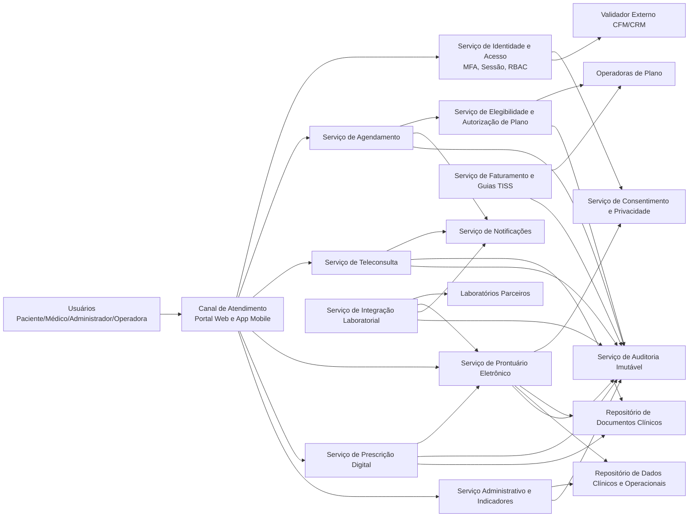
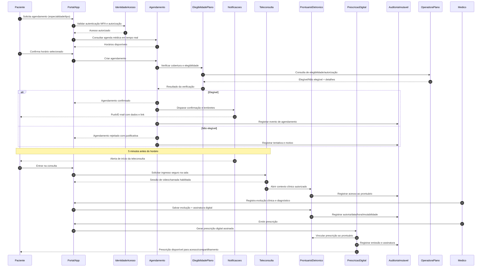

# Relatório Técnico de Arquitetura de Software

## 1. Identificação das HUs

### 1.1 Escopo funcional identificado
O lote cobre uma **plataforma integrada de telemedicina** com os seguintes macrodomínios:

1. Gestão de Identidade, Acesso e Consentimento (RF01–RF06, HU01, HU07, HU11)  
2. Agendamento e Operação Assistencial (RF07–RF13, HU02, HU12)  
3. Teleconsulta por Videochamada (RF14–RF18, HU03)  
4. Prontuário Eletrônico e Documentos Clínicos (RF19–RF25, HU04, HU08, HU11)  
5. Prescrição Digital (RF26–RF30, HU05, HU09)  
6. Integração Laboratorial (RF31–RF35, HU06, HU10)  
7. Cobertura, Elegibilidade e Faturamento em Saúde Suplementar (RF36–RF41, HU14, HU13)  
8. Administração da Rede e Indicadores Operacionais (RF42–RF46, HU12, HU13)

---

### 1.2 Mapa HU ↔ RF principal
| HU | Objetivo | RFs principais relacionados |
|---|---|---|
| HU01 | Cadastro + consentimento LGPD | RF01, RF03, RF04, RF23, RF24 |
| HU02 | Agendamento presencial/remoto | RF07, RF08, RF09, RF11 |
| HU03 | Participação em videochamada | RF14, RF15, RF17, RF18 |
| HU04 | Visualização de prontuário e exames | RF22, RF23, RF24, RF33 |
| HU05 | Acesso e compartilhamento de prescrição | RF26, RF27, RF29, RF30 |
| HU06 | Notificação de resultado de exame | RF31, RF32, RF33 |
| HU07 | Cadastro médico com CRM válido | RF02, RF01 |
| HU08 | Evolução clínica com imutabilidade pós-assinatura | RF20, RF25, RF06 |
| HU09 | Prescrição digital jurídica | RF26, RF27, RF28, RF30 |
| HU10 | Solicitação de exame + alerta crítico | RF34, RF32, RF35 |
| HU11 | Acesso compartilhado ao prontuário com consentimento | RF19, RF23, RF06 |
| HU12 | Gestão de médicos e agendas da unidade | RF12, RF42, RF43 |
| HU13 | Relatórios de faturamento por convênio | RF40, RF41, RF44 |
| HU14 | Autorização prévia no padrão TISS | RF38, RF39, RF40 |

---

## 2. Diagramas de Arquitetura (Mermaid)

### 2.1 Diagrama de componentes (visão lógica)

---

### 2.2 Diagrama de sequência (agendamento + elegibilidade + teleconsulta + prontuário/prescrição)

---

## 3. Decisões de Arquitetura

| ID | Decisão | Justificativa | Trade-off |
|---|---|---|---|
| DA-01 | Separar a solução por **serviços de domínio** (identidade, agenda, prontuário, teleconsulta, prescrição, integrações, faturamento). | Reduz acoplamento e facilita evolução regulatória por domínio. | Maior complexidade de orquestração e observabilidade distribuída. |
| DA-02 | Adotar **controle de acesso por perfil + permissão contextual** (RBAC + políticas de consentimento). | Atende RF04, RF23 e RNF07 com granularidade por finalidade e vínculo assistencial. | Exige motor de políticas e governança contínua de regras. |
| DA-03 | Tratar **consentimento** como capacidade central, versionada e auditável. | Requisito legal LGPD (RNF07, RNF12) e acesso compartilhado do prontuário (RF23/HU11). | Fluxos com validação extra podem aumentar latência percebida. |
| DA-04 | Implementar **auditoria imutável transversal** para todos os eventos clínicos e acessos. | Necessário para RF06, RF25 e RNF11 (retenção mínima e rastreabilidade legal). | Armazenamento e retenção de longo prazo elevam custo operacional. |
| DA-05 | Prontuário com modelo de **registro imutável + adendo** após assinatura. | Alinha-se ao requisito legal e clínico de integridade documental (RF25, HU08). | Corrigir erros demanda fluxo formal de adendo, mais rigor operacional. |
| DA-06 | Videochamada integrada com entrada autenticada e criptografia ponta a ponta. | Cumpre RF14–RF18 e RNF04, além de experiência simplificada (RNF22). | Restrições de infraestrutura podem limitar recursos avançados sem comprometer segurança. |
| DA-07 | Integrações externas orientadas a **padrões abertos** (TISS e HL7 FHIR). | Atende RNF26 e simplifica onboarding de novos parceiros. | Parceiros com baixa aderência exigem adaptadores e homologação adicional. |
| DA-08 | Notificações por canal desacoplado (push/e-mail) orientado a eventos de negócio. | Garante entrega para RF11, RF32 e HU06 com menor dependência do fluxo síncrono. | Gestão de consistência eventual entre evento e percepção do usuário. |
| DA-09 | Resiliência por implantação em múltiplas zonas, backup contínuo e contingência formal. | Atende RNF13, RNF23 e RNF24 para continuidade assistencial. | Exige disciplina de testes de recuperação e operação 24x7. |
| DA-10 | Observabilidade nativa com métricas de latência, erro e disponibilidade por módulo. | Necessário para RNF25 e SLOs de desempenho (RNF14–RNF16). | Maior esforço de instrumentação desde o início do ciclo. |

---

## 4. Tabela de Componentes e Rastreabilidade

| Componente | Responsabilidade Principal | Comunica-se com | Origem (HU / Critério de Aceite) |
|---|---|---|---|
| Canal de Atendimento (Web/Mobile) | Experiência do usuário, fluxos de cadastro, agendamento, consulta e visualização clínica | Identidade, Agendamento, Teleconsulta, Prontuário, Prescrição, Notificações | HU01–HU13; RNF19–RNF22 |
| Serviço de Identidade e Acesso | Autenticação MFA, sessão, autorização por perfil, bloqueio por regra | Canal, Consentimento, Auditoria, Validador CFM | HU01, HU07, HU11; RF03–RF05 |
| Serviço de Validação CRM | Consulta e revalidação periódica de situação profissional | Identidade, CFM externo, Auditoria | HU07; RF02 |
| Serviço de Consentimento e Privacidade | Registro, revisão, revogação e verificação de consentimento por finalidade | Identidade, Prontuário, Auditoria | HU01, HU04, HU11; RF23; RNF07, RNF12 |
| Serviço de Agendamento | Agenda em tempo real, criação/cancelamento/remarcação, encaixe urgente | Canal, Elegibilidade, Notificações, Auditoria | HU02, HU12; RF07–RF13 |
| Serviço de Elegibilidade e Autorização de Plano | Verificação de cobertura, elegibilidade e autorização prévia | Agendamento, Faturamento, Operadoras, Auditoria | HU02, HU14; RF09, RF37, RF39 |
| Serviço de Teleconsulta | Sessão de videochamada segura, controle de ingresso e duração, compartilhamento de arquivos | Canal, Notificações, Prontuário, Auditoria, Repositório de Documentos | HU03; RF14–RF18 |
| Serviço de Prontuário Eletrônico | Registro clínico longitudinal, histórico assistencial, consulta por perfis autorizados | Canal, Consentimento, Prescrição, Laboratórios, Auditoria, Repositórios | HU04, HU08, HU11; RF19–RF25 |
| Serviço de Prescrição Digital | Emissão, assinatura digital, validação de interação medicamentosa e controle especial | Canal, Prontuário, Auditoria, Repositório de Documentos | HU05, HU09; RF26–RF30 |
| Serviço de Integração Laboratorial | Encaminhamento de solicitações, recebimento de resultados, vínculo automático ao prontuário | Prontuário, Notificações, Laboratórios, Auditoria | HU06, HU10; RF31–RF35 |
| Serviço de Faturamento e Guias TISS | Geração/transmissão de guias e faturamento eletrônico, cálculo de coparticipação | Elegibilidade, Operadoras, Administração, Auditoria | HU13, HU14; RF38–RF41 |
| Serviço Administrativo e Indicadores | Gestão de unidades, médicos, recursos, relatórios e painéis operacionais | Canal, Repositório de dados, Auditoria | HU12, HU13; RF42–RF46 |
| Serviço de Notificações | Entrega de confirmação, lembrete, cancelamento e resultados por push/e-mail | Agendamento, Teleconsulta, Laboratórios, Canal | HU02, HU03, HU06, HU10; RF11, RF18, RF32 |
| Serviço de Auditoria Imutável | Trilha inviolável de acesso, alteração, assinatura e eventos críticos | Todos os serviços de domínio | HU08, HU11; RF06, RF25; RNF11 |
| Repositório de Dados Clínicos e Operacionais | Persistência de dados estruturados de negócio e histórico | Prontuário, Administração, Faturamento | HU04, HU08, HU13 |
| Repositório de Documentos Clínicos | Armazenamento de laudos, imagens, prescrições e anexos | Prontuário, Prescrição, Teleconsulta, Laboratórios | HU04, HU05, HU10; RF21, RF33; RNF18 |

---

## 5. Bloqueios e Pendências

| Tema | Pendência | Impacto Arquitetural | Prioridade |
|---|---|---|---|
| Política de timeout por perfil | RF05 cita tempo configurável, mas sem valores por perfil e contexto (web/mobile). | Define estratégia de sessão, reautenticação e UX. | Alta |
| Regra de cancelamento/remarcação | RF10 não define janela exata por tipo de consulta/convênio. | Afeta motor de regras de agenda e notificação. | Alta |
| Escopo de consentimento | RF23/HU11 não especifica granularidade (por profissional, especialidade, unidade, período). | Impacta modelo de políticas e UI de consentimento. | Alta |
| Assinatura digital clínica além de prescrição | HU08 pede assinatura do registro clínico, mas RNF06 foca prescrição. | Necessário definir padrão legal/técnico para evolução clínica. | Alta |
| Integração CFM | RF02 exige validação, mas não define SLA técnico do provedor externo. | Requer fallback, fila de reprocesso e estado “pendente”. | Média |
| Critérios de valor crítico laboratorial | RF35/HU10 não definem faixas por exame/laboratório/especialidade. | Regras clínicas e alertas podem divergir entre parceiros. | Alta |
| Política de não gravação da teleconsulta | RNF04 veta gravação de conteúdo, mas não define retenção de metadados mínimos. | Ajusta limites de auditoria e privacidade. | Média |
| Regras de coparticipação/particular | RF41 sem detalhar fórmulas, exceções e arredondamentos contratuais. | Impacta cálculo financeiro e reconciliação. | Média |
| Exportação e portabilidade LGPD | RNF12 sem formato/escopo temporal e SLA de atendimento ao titular. | Define APIs de exportação e governança de atendimento. | Média |
| Retenção de 20 anos | RNF11 exige retenção longa; falta política de arquivamento e descarte após prazo legal. | Planejamento de ciclo de vida de dados e custo. | Média |

---

## 6. Cobertura de Requisitos

### 6.1 Cobertura funcional (RF)

| Bloco RF | Status de Cobertura Arquitetural | Observação |
|---|---|---|
| RF01–RF06 (Usuários/Acesso) | Coberto | Identidade, MFA, RBAC, sessão e auditoria definidos. |
| RF07–RF13 (Agendamento) | Coberto parcial | Fluxo completo previsto; falta regra detalhada de prazo de cancelamento/remarcação. |
| RF14–RF18 (Videochamada) | Coberto | Ingresso autenticado, alerta prévio, compartilhamento e duração previstos. |
| RF19–RF25 (Prontuário) | Coberto parcial | Modelo imutável + adendo definido; pendente formalização da assinatura clínica do registro. |
| RF26–RF30 (Prescrição) | Coberto | Assinatura ICP-Brasil, interação medicamentosa e controle especial contemplados. |
| RF31–RF35 (Laboratórios) | Coberto parcial | Integração e notificação previstas; falta taxonomia clínica unificada para “valor crítico”. |
| RF36–RF41 (Planos/Faturamento) | Coberto parcial | Elegibilidade, autorização e TISS previstos; faltam regras detalhadas de coparticipação. |
| RF42–RF46 (Administrativo) | Coberto | Gestão de unidades/agenda, indicadores e relatórios contemplados. |

---

### 6.2 Cobertura não funcional (RNF)

| RNF | Status | Evidência na arquitetura |
|---|---|---|
| RNF01–RNF03 | Coberto | Segurança de comunicação, repouso e credenciais tratada em decisões de segurança. |
| RNF04 | Coberto parcial | E2E e não gravação previstos; pendente definição formal de metadados retidos. |
| RNF05 | Coberto parcial | Auditoria/anomalia prevista conceitualmente; faltam limiares operacionais. |
| RNF06 | Coberto | Prescrição com ICP-Brasil explicitada. |
| RNF07–RNF12 | Coberto parcial | Consentimento e trilha previstos; pendências de portabilidade e detalhe de base legal por finalidade. |
| RNF13, RNF17, RNF18, RNF24 | Coberto | Resiliência e escalabilidade horizontais e redundância geográfica contempladas. |
| RNF14–RNF16 | Coberto parcial | SLOs reconhecidos; exigem validação por testes de carga e rede. |
| RNF19–RNF22 | Coberto parcial | Canais e UX previstos; faltam critérios objetivos de acessibilidade por jornada. |
| RNF23 | Coberto parcial | Backup contínuo contemplado; falta detalhar testes recorrentes de restauração. |
| RNF25 | Coberto | Observabilidade por módulo prevista. |
| RNF26 | Coberto | Integrações padronizadas com TISS/HL7 FHIR previstas. |

---

## 7. Gap Analysis

| Gap identificado | Impacto arquitetural | Ação recomendada |
|---|---|---|
| Granularidade de consentimento insuficiente (escopo, duração, revogação parcial) | Risco de bloqueio indevido de acesso clínico ou exposição excessiva de dados sensíveis | Definir matriz de consentimento por finalidade, ator, unidade e prazo; validar com jurídico/DPO |
| Assinatura digital do registro clínico (não apenas prescrição) sem padrão explícito | Pode comprometer validade probatória de evoluções clínicas (HU08/RF25) | Formalizar política de assinatura clínica e carimbo temporal com área regulatória |
| Falta de dicionário clínico para alertas críticos de exames | Alertas inconsistentes e potencial risco assistencial | Criar catálogo de parâmetros críticos por exame, com governança médica e versionamento |
| Regras de cancelamento/remarcação não parametrizadas | Inconsistência operacional entre unidades e convênios | Definir tabela de políticas por tipo de consulta/convênio com vigência e histórico |
| Latência-alvo sem orçamento por etapa (RNF14–RNF16) | Dificuldade de garantir SLO fim-a-fim | Estabelecer orçamento de desempenho por serviço e contrato de interface |
| Portabilidade LGPD sem formato e SLA | Risco de não conformidade no atendimento ao titular | Definir pacote de exportação de dados, prazos e trilha de atendimento |
| Ausência de plano de testes de contingência/recuperação | Risco de não cumprir RPO/RTO em incidente real | Instituir rotina de testes de restauração e simulação de desastre com evidências auditáveis |
| Política de auditoria com retenção longa sem ciclo de vida detalhado | Crescimento de custo e risco de gestão documental | Definir estratégia de arquivamento, indexação e descarte pós-prazo legal |
| Revalidação periódica de CRM sem periodicidade definida | Pode permitir atuação clínica com status desatualizado | Fixar periodicidade e eventos de rechecagem (login, emissão de prescrição, etc.) |
| Critérios de UX acessível (WCAG 2.1 AA) não traduzidos em requisitos verificáveis | Risco de baixa aderência de acessibilidade na entrega | Criar checklist de conformidade por tela e critérios testáveis no pipeline de qualidade |

---

Se quiser, na próxima etapa eu converto este relatório em:
1) **backlog arquitetural priorizado** (épicos/capacidades/enablers),  
2) **matriz completa RF/RNF ↔ componentes ↔ testes de aceitação**, e  
3) **ADRs formais (Architecture Decision Records)** prontas para governança.