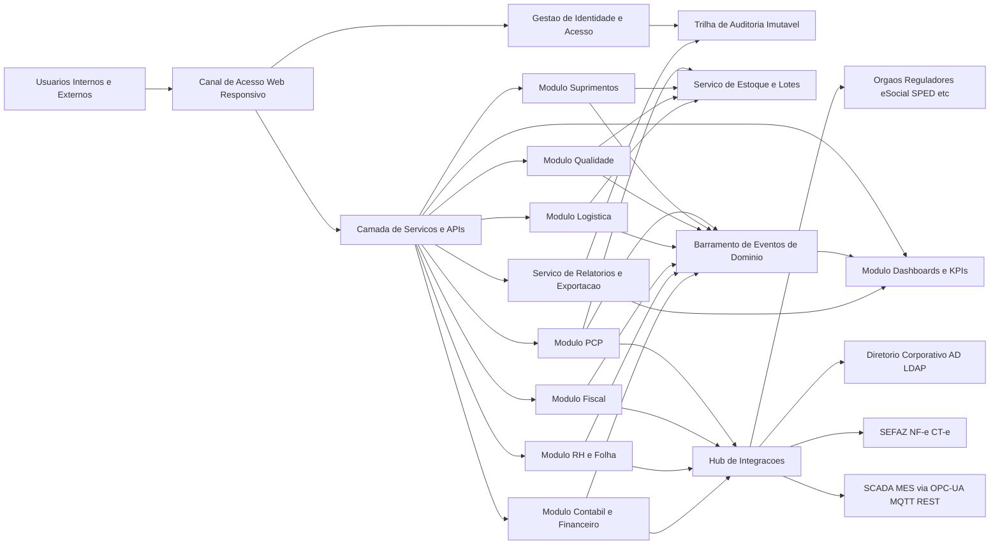
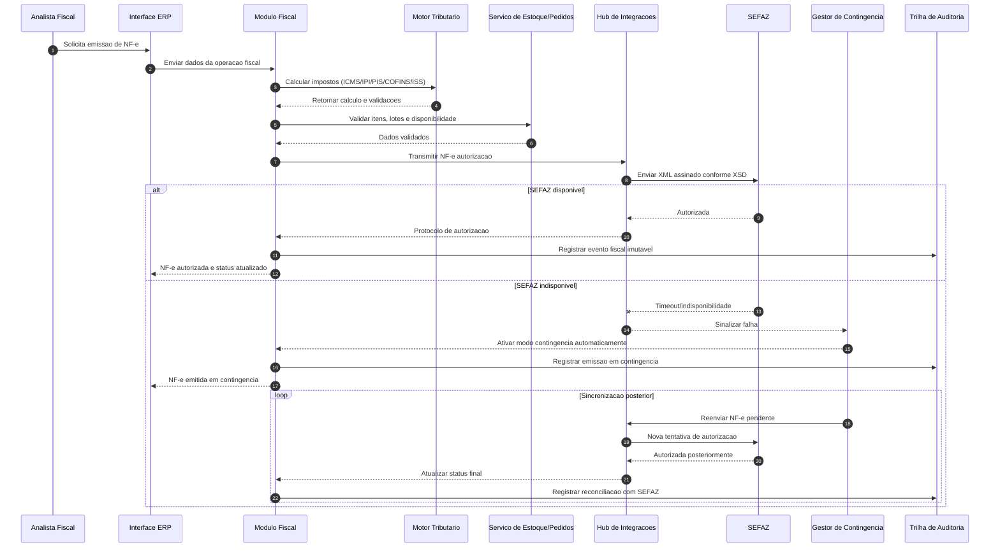
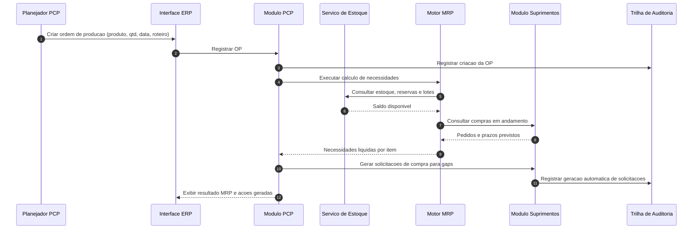

# Relatório Técnico de Arquitetura de Software

## 1. Identificação das HUs

| HU | Persona | Objetivo de Negócio | Módulos/Capacidades Envolvidas | RF Relacionados | RNF Relacionados |
|---|---|---|---|---|---|
| HU01 | Planejador PCP | Criar OP e calcular MRP para garantir materiais | PCP, Estoque, Suprimentos, Alertas | RF05, RF06, RF14 | RNF13, RNF16 |
| HU02 | Planejador PCP | Monitorar OEE e desvios em tempo real | PCP, Integração chão de fábrica, Dashboards, Notificações | RF10, RF11, RF12, RF52 | RNF14, RNF18, RNF23 |
| HU03 | Comprador | Cotar com múltiplos fornecedores e aprovar OC | Suprimentos, Workflow de aprovação, Notificações | RF13, RF15, RF16 | RNF03, RNF19 |
| HU04 | Gestor de Suprimentos | Acompanhar desempenho de fornecedores | Suprimentos, Analytics, Relatórios | RF19, RF53 | RNF14, RNF20 |
| HU05 | Analista de Qualidade | Inspecionar lote e bloquear reprovados | Qualidade, Estoque, Notificações | RF20, RF21, RF22 | RNF10, RNF23 |
| HU06 | Analista de Qualidade | Rastrear lote ponta-a-ponta | Qualidade, Produção, Fiscal, Logística, Relatórios | RF23, RF25, RF28, RF31 | RNF10, RNF20 |
| HU07 | Analista Fiscal | Emitir NF-e com impostos e contingência | Fiscal, Motor Tributário, Integração SEFAZ, Alertas | RF31, RF32, RF34 | RNF06, RNF07, RNF15, RNF17 |
| HU08 | Analista Fiscal | Gerar SPED Fiscal automaticamente | Fiscal, Contábil, Validação fiscal | RF36, RF48 | RNF08, RNF10 |
| HU09 | Analista RH | Processar folha com encargos e ponto | RH, Ponto, Folha, Obrigações | RF38, RF39, RF40, RF42 | RNF08, RNF11 |
| HU10 | Analista RH | Gerar e validar eSocial/CAGED/RAIS/DIRF | RH, Compliance trabalhista, Agenda legal | RF40 | RNF08, RNF11 |
| HU11 | Controller | Visualizar DRE e fluxo de caixa em tempo real | Contábil/Financeiro, Consolidação, Drill-down | RF43, RF45, RF46, RF47, RF52 | RNF14, RNF16 |
| HU12 | Diretor/CEO | Acompanhar KPIs executivos e desvios | BI/KPIs, Dashboards, Alertas, Drill-down | RF50, RF51, RF52, RF53 | RNF14, RNF24 |

---

## 2. Diagramas de Arquitetura (Mermaid)

### 2.1 Visão de Componentes Lógicos (alto nível)

### 2.2 Sequência — Emissão de NF-e com contingência automática (HU07)

### 2.3 Sequência — OP + MRP + Geração de Solicitação de Compra (HU01)

---

## 3. Decisões de Arquitetura

1. **Arquitetura modular por domínio de negócio**  
   Separação em módulos (PCP, Suprimentos, Qualidade, Logística, Fiscal, RH, Contábil, KPI) para reduzir acoplamento e permitir evolução regulatória por domínio.

2. **Camada de APIs e contratos canônicos**  
   Todos os módulos expõem interfaces de serviço padronizadas para garantir interoperabilidade interna e externa (RNF19, RNF20).

3. **Integração síncrona + assíncrona orientada a eventos**  
   - Síncrona para transações críticas imediatas (ex.: autorização NF-e).  
   - Assíncrona por eventos de domínio para consolidação contábil, KPIs e alertas em tempo real (RF43, RF50, RNF14).

4. **Controle de acesso centralizado com RBAC + SoD + escopo organizacional**  
   Permissões por módulo/função/unidade e restrição hierárquica de dados (RF01, RF04, RNF03).

5. **Trilha de auditoria imutável e retenção prolongada**  
   Registro de operações críticas com carimbo temporal, usuário, ação e contexto para exigências legais (RF03, RNF10).

6. **Motor de regras regulatórias versionável**  
   Regras fiscais, trabalhistas e de obrigações acessórias isoladas do núcleo transacional para atualização contínua sem ruptura (RNF06, RNF08, RNF11).

7. **Segregação de dados por unidade fabril com consolidação corporativa**  
   Suporta múltiplas unidades com isolamento operacional e visão consolidada executiva/contábil (RNF16).

8. **Resiliência fiscal com contingência automática**  
   Fluxo de fallback para indisponibilidade externa (SEFAZ), fila de sincronização e reconciliação auditável (RF34, RNF17).

9. **Observabilidade e operação assistida**  
   Métricas técnicas e funcionais por módulo, monitoramento em tempo real e alertas operacionais (RNF23, RNF12).

10. **Segurança em profundidade**  
   Criptografia em trânsito e repouso, limitação de tentativas, bloqueio de conta e auditorias periódicas (RNF01–RNF05, RNF09).

---

## 4. Tabela de Componentes e Rastreabilidade

| Componente | Responsabilidade Principal | Comunica-se com | Origem (HU / Critério de Aceite) |
|---|---|---|---|
| Gestão de Identidade e Acesso | SSO, RBAC, SoD, escopo por unidade | Diretório corporativo, APIs, Auditoria | HU geral; RF01, RF02, RF04; RNF03 |
| Trilha de Auditoria Imutável | Registrar eventos críticos e retenção legal | Todos os módulos | HU05/HU07/HU11; RF03; RNF10 |
| Módulo PCP | OP, apontamento, capacidade e sequenciamento | Estoque, MRP, Integrações, KPI | HU01, HU02; RF05, RF07, RF08 |
| Motor MRP | Cálculo de necessidades líquidas | PCP, Estoque, Suprimentos | HU01 CA2/CA3; RF06; RNF13 |
| Serviço de Estoque e Lotes | Saldos, consumo em tempo real, bloqueio de lotes | PCP, Suprimentos, Qualidade, Logística, Fiscal | HU01, HU05, HU06; RF09, RF22, RF26 |
| Hub de Integrações | Conectividade com SCADA/MES, SEFAZ, órgãos | Módulos internos e sistemas externos | HU02, HU07, HU08, HU09; RF11, RF31, RF40; RNF18, RNF19 |
| Módulo de Suprimentos | Cadastro fornecedores, cotação, OC, recebimento, devolução | Estoque, MRP, Aprovação, KPI | HU03, HU04; RF13–RF19 |
| Workflow de Aprovação por Alçada | Aprovação de OC e atos críticos | Suprimentos, IAM, Notificações | HU03 CA3; RF16; RNF03 |
| Módulo de Qualidade | Planos de inspeção, resultados, NC e rastreabilidade | Estoque, PCP, Logística, Relatórios | HU05, HU06; RF20–RF25 |
| Módulo Logístico | Expedição, romaneio, tracking, RMA | Estoque, Fiscal, Qualidade | HU06, HU12; RF27–RF30 |
| Módulo Fiscal | NF-e/CT-e, cancelamento/inutilização, contingência, SPED | Motor tributário, Integrações, Contábil | HU07, HU08; RF31–RF36 |
| Motor Tributário | Cálculo de impostos por operação/NCM/UF | Fiscal, Cadastro fiscal | HU07 CA1; RF32; RNF06 |
| Módulo RH/Folha | Ponto, folha, benefícios, férias, rescisões e obrigações | Integrações de ponto, Contábil, Órgãos | HU09, HU10; RF37–RF42; RNF11 |
| Módulo Contábil/Financeiro | Lançamentos automáticos, DRE, balanço, fluxo de caixa | Fiscal, RH, Compras, Vendas, KPI | HU11; RF43–RF49 |
| Módulo Dashboards e KPIs | Painéis em tempo real, metas, alertas, drill-down | Todos os módulos, Relatórios | HU02, HU04, HU11, HU12; RF50–RF52; RNF14 |
| Serviço de Relatórios/Exportação | Exportar PDF/Excel e evidências de auditoria | KPI, Qualidade, Suprimentos, Fiscal | HU04 CA3, HU06 CA3; RF53 |

---

## 5. Bloqueios e Pendências

1. **Matriz detalhada de SoD não definida**  
   Impacto: risco de desenho incompleto de perfis críticos (financeiro/fiscal).  
   Necessário: catálogo de conflitos de função por processo.

2. **Política de dados multiunidade incompleta**  
   Impacto: ambiguidades entre isolamento e visão corporativa (RNF16).  
   Necessário: regras de visibilidade por papel, unidade e centro de custo.

3. **Critérios de cálculo de OEE e thresholds por contexto**  
   Impacto: inconsistência entre plantas/turnos e alertas ruidosos.  
   Necessário: padrão corporativo + parametrização local governada.

4. **Regras de contingência fiscal e reconciliação operacional**  
   Impacto: divergência entre documento emitido e autorizado posteriormente.  
   Necessário: procedimento formal de fila de pendências, prazos e exceções.

5. **Regras de tributação e trabalhistas com atualização contínua**  
   Impacto: alto risco de não conformidade sem processo de governança de atualização.  
   Necessário: esteira de atualização normativa, testes de regressão e homologação.

6. **Volumes e picos operacionais por módulo não informados**  
   Impacto: dimensionamento impreciso para RNF12/RNF13/RNF14/RNF15.  
   Necessário: perfil de carga por hora, turnos e fechamento mensal/fiscal.

7. **Política LGPD detalhada (base legal, retenção por dado, anonimização)**  
   Impacto: risco regulatório no tratamento de dados pessoais (RNF09).  
   Necessário: matriz de dados pessoais e ciclo de vida por categoria.

---

## 6. Cobertura de Requisitos

### 6.1 Cobertura Funcional (RF)

| Domínio | RFs | Cobertura Arquitetural |
|---|---|---|
| Usuários e Acesso | RF01–RF04 | **Coberto** (IAM central, RBAC/SoD, escopo por unidade, auditoria) |
| PCP | RF05–RF12 | **Coberto** (OP, MRP, apontamento, OEE, integração SCADA/MES, alertas) |
| Suprimentos | RF13–RF19 | **Coberto** (fornecedores, cotação, OC com alçada, recebimento, devolução, desempenho) |
| Qualidade por Lote | RF20–RF25 | **Coberto** (inspeção, bloqueio lote, rastreabilidade, NC, relatórios) |
| Logística | RF26–RF30 | **Coberto** (estoque endereçado, expedição, romaneio, tracking, RMA) |
| Fiscal e NF-e/CT-e | RF31–RF36 | **Coberto** (emissão, tributos, SEFAZ, contingência, SPED) |
| RH e Folha | RF37–RF42 | **Coberto** (cadastro, ponto, folha, obrigações, férias/rescisões, benefícios) |
| Contábil e DRE | RF43–RF49 | **Coberto** (lançamentos automáticos, DRE em tempo real, fluxo e multimoeda) |
| Dashboards e KPIs | RF50–RF53 | **Coberto** (painéis, metas/alertas, drill-down, exportação) |

### 6.2 Cobertura Não Funcional (RNF)

| Categoria | RNFs | Cobertura Arquitetural |
|---|---|---|
| Segurança | RNF01–RNF05 | **Coberto** (criptografia trânsito/repouso, RBAC/SoD, rate limiting, auditorias) |
| Conformidade | RNF06–RNF11 | **Coberto com governança contínua** (motor regulatório versionável, trilha imutável) |
| Disponibilidade/Desempenho | RNF12–RNF17 | **Coberto parcialmente** (arquitetura prevista; falta baseline volumétrica para validação final) |
| Integração | RNF18–RNF20 | **Coberto** (hub de integrações + APIs + formatos padrão) |
| Infraestrutura e Dados | RNF21–RNF24 | **Coberto parcialmente** (diretriz prevista; pendente detalhar estratégia operacional de backup/DR e SLO por módulo) |

---

## 7. Gap Analysis

| Gap | Impacto Arquitetural | Ação Recomendada | Prioridade |
|---|---|---|---|
| Ausência de catálogo formal de papéis e conflitos SoD | Falhas de segregação e risco de fraude/não conformidade | Definir matriz RBAC+SoD por processo crítico e trilha de aprovação | Alta |
| Falta de SLA interno por integração externa (SEFAZ, eSocial, SCADA/MES) | Quebra de previsibilidade em processos de tempo real | Estabelecer contratos de integração com timeout, retentativa e fallback por conector | Alta |
| Não definição de modelo de dados mestre (produto, lote, fornecedor, plano de contas) | Inconsistência entre módulos e drill-down quebrado | Implantar governança de dados mestres e dicionário corporativo | Alta |
| Regras de OEE e qualidade podem variar entre unidades sem padrão | Indicadores não comparáveis no dashboard executivo | Criar baseline corporativo com parâmetros locais versionados | Média |
| Requisitos de retenção existem, mas sem política de arquivamento/expurgo detalhada | Crescimento de custo e risco LGPD | Definir política de ciclo de vida de dados por domínio | Média |
| Performance alvo definida, mas sem cenários de carga homologados | Risco de não atingir RNF13/14/15 em produção | Planejar testes de desempenho por jornada crítica (MRP, dashboard, NF-e) | Alta |
| Processo de mudança regulatória não explicitado | Alto risco em fiscal/RH | Estabelecer comitê de compliance sistêmico e calendário de atualização | Alta |

---

Se quiser, no próximo passo eu também posso gerar uma **matriz HU ↔ RF ↔ RNF detalhada linha a linha** (rastreabilidade completa para auditoria de projeto).