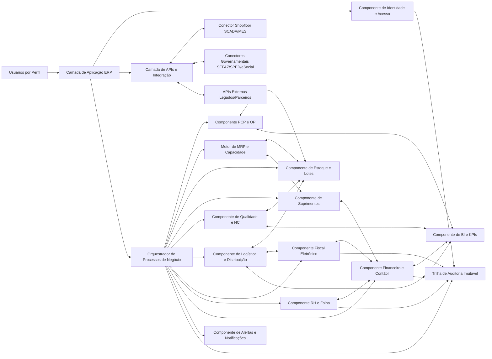
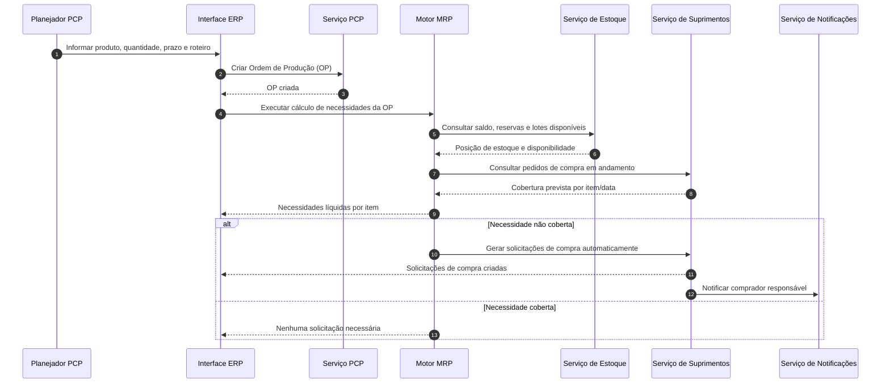
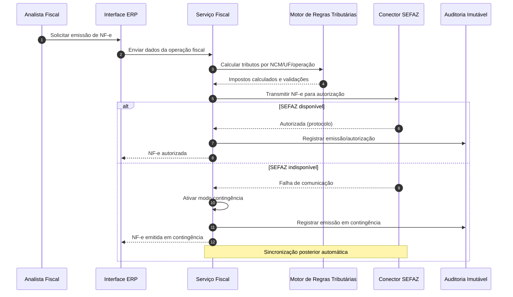

# Relatório Técnico de Arquitetura de Software

## 1. Identificação das HUs

### 1.1 HUs recebidas e domínios funcionais
| HU | Perfil | Objetivo de Negócio | Domínio Arquitetural Primário |
|---|---|---|---|
| HU01 | Planejador PCP | Criar OP e executar MRP com geração de necessidade | PCP + Estoque + Suprimentos |
| HU02 | Planejador PCP | Monitorar OEE e desvios em tempo real | PCP + Shopfloor + KPIs/Alertas |
| HU03 | Comprador | Cotar com múltiplos fornecedores e aprovar OC | Suprimentos + Workflow de Aprovação |
| HU04 | Gestor de Suprimentos | Acompanhar desempenho de fornecedores | Suprimentos + Analytics |
| HU05 | Analista de Qualidade | Inspecionar lote e bloquear reprovados | Qualidade + Estoque + Notificações |
| HU06 | Analista de Qualidade | Rastrear lote ponta a ponta | Qualidade + Produção + Fiscal + Logística |
| HU07 | Analista Fiscal | Emitir NF-e com cálculo automático e contingência | Fiscal + Regras Tributárias + Integração SEFAZ |
| HU08 | Analista Fiscal | Gerar SPED Fiscal automaticamente | Fiscal + Contábil + Compliance |
| HU09 | Analista RH | Processar folha mensal integrada ao ponto | RH/Folha + Encargos + Integração bancária/obrigações |
| HU10 | Analista RH | Gerar obrigações acessórias RH | RH + Compliance regulatório |
| HU11 | Controller | Visualizar DRE e fluxo de caixa em tempo real | Contábil/Financeiro + Analytics |
| HU12 | Diretor/CEO | Dashboard executivo com drill-down | BI/KPI + Camada analítica transversal |

### 1.2 Macrocapacidades arquiteturais derivadas
1. **Plataforma ERP modular integrada por eventos e APIs** (sincronismo + assincronismo).
2. **Controle de acesso corporativo e trilha de auditoria imutável**.
3. **Orquestração de processos críticos** (produção, fiscal, folha, contábil).
4. **Camada de conformidade regulatória contínua** (fiscal, trabalhista, LGPD, SPED/eSocial).
5. **Observabilidade operacional e executiva em tempo real**.

---

## 2. Diagramas de Arquitetura (Mermaid)

### 2.1 Diagrama de componentes (visão lógica)

### 2.2 Diagrama de sequência — HU01 (OP + MRP + Solicitação de Compra)

### 2.3 Diagrama de sequência — HU07 (NF-e com contingência)

---

## 3. Decisões de Arquitetura

### DA-01 — Arquitetura modular por domínios
- **Decisão:** decompor o ERP em componentes de negócio coesos (PCP, Suprimentos, Qualidade, Fiscal, RH, Contábil etc.).
- **Motivo:** reduzir acoplamento e facilitar evolução regulatória/fabril.
- **Atende:** RF05–RF53, RNF16, RNF23.

### DA-02 — Integração híbrida (API + eventos)
- **Decisão:** usar integração síncrona para operações transacionais e assíncrona para atualização de KPIs, alertas e consolidações.
- **Motivo:** equilíbrio entre consistência operacional e escalabilidade.
- **Atende:** RF11, RF12, RF50–RF52, RNF13–RNF15, RNF18–RNF20.

### DA-03 — Segurança centralizada com RBAC + SoD + auditoria imutável
- **Decisão:** controle de acesso central com restrição por unidade fabril e trilha inviolável.
- **Motivo:** conformidade fiscal, financeira, RH e LGPD.
- **Atende:** RF01–RF04, RNF03, RNF09, RNF10.

### DA-04 — Motor de regras parametrizáveis
- **Decisão:** separar regras tributárias, trabalhistas, qualidade e alçadas em configuração versionada.
- **Motivo:** alta mutabilidade legal e operacional.
- **Atende:** RF16, RF20, RF32–RF36, RF39–RF42, RNF06–RNF08, RNF11.

### DA-05 — Camada de interoperabilidade industrial e governamental
- **Decisão:** conectores dedicados para SCADA/MES e órgãos oficiais.
- **Motivo:** reduzir impacto de variações de protocolo/layout.
- **Atende:** RF11, RF31, RF35, RF36, RF40, RNF18, RNF19.

### DA-06 — Observabilidade e SLOs operacionais
- **Decisão:** telemetria por módulo, tempos de resposta críticos e painéis técnicos.
- **Motivo:** sustentar disponibilidade mínima e metas de desempenho.
- **Atende:** RNF12, RNF13, RNF14, RNF15, RNF23.

### DA-07 — Estratégia de resiliência para fiscal eletrônico
- **Decisão:** contingência automática para NF-e e reconciliação posterior.
- **Motivo:** continuidade do faturamento em indisponibilidade externa.
- **Atende:** RF34, HU07, RNF17.

---

## 4. Tabela de Componentes e Rastreabilidade

| Componente | Responsabilidade Principal | Comunica-se com | Origem (HU / Critério de Aceite) |
|---|---|---|---|
| Identidade e Acesso | SSO, RBAC, SoD, bloqueio por tentativas, escopo por unidade | UI, Auditoria, Todos os módulos | HU transversais; RF01–RF04; RNF03–RNF04 |
| Auditoria Imutável | Registrar operações críticas com retenção e rastreabilidade legal | IAM, Fiscal, RH, Financeiro, Orquestrador | HU07, HU08, HU09, HU10, HU11; RNF10 |
| PCP e Ordens de Produção | Cadastro/gestão de OP, apontamentos, execução operacional | MRP, Estoque, Shopfloor, BI | HU01, HU02; RF05, RF08 |
| Motor MRP e Capacidade | Cálculo de necessidade líquida e capacidade de centros | PCP, Estoque, Suprimentos | HU01; RF06, RF07; RNF13 |
| Conector Shopfloor | Receber dados em tempo real de máquinas/sistemas fabris | PCP, BI, Alertas, APIs | HU02; RF11; RNF18 |
| Estoque e Lotes | Controle de saldos, consumo em tempo real, bloqueios, endereçamento | PCP, Qualidade, Logística, Suprimentos | HU01, HU05, HU06; RF09, RF22, RF26 |
| Suprimentos e Cotações | Solicitações, cotações, comparação, OC e aprovação por alçada | MRP, Estoque, Financeiro, Alertas | HU03, HU04, HU01; RF13–RF19 |
| Qualidade e NC | Planos de inspeção, resultados por lote, NC e ações corretivas | Estoque, PCP, BI, Notificações | HU05, HU06; RF20–RF25 |
| Logística e Distribuição | Expedição, romaneio, entrega, devolução cliente (RMA) | Estoque, Fiscal, Qualidade | HU06, HU12; RF27–RF30 |
| Fiscal Eletrônico | NF-e/CT-e, cálculo fiscal, contingência, SPED Fiscal | Motor Tributário, Conector Governamental, Financeiro, Auditoria | HU07, HU08; RF31–RF36 |
| Motor de Regras Tributárias | Aplicar regras por NCM/UF/operação e validações | Fiscal, Contábil | HU07, HU08; RF32; RNF06–RNF08 |
| RH e Folha | Cadastro colaborador, ponto, folha, benefícios e obrigações RH | Financeiro, Conector Governamental, Auditoria | HU09, HU10; RF37–RF42 |
| Financeiro e Contábil | Lançamentos automáticos, DRE, balanço, fluxo de caixa, câmbio | Fiscal, RH, Suprimentos, BI | HU11; RF43–RF49 |
| BI e KPIs | Dashboards, metas, alertas visuais, drill-down e exportação | PCP, Qualidade, Financeiro, Logística | HU02, HU04, HU11, HU12; RF50–RF53 |
| Alertas e Notificações | Alertas de desvio, prazos legais e eventos críticos | PCP, Suprimentos, Qualidade, RH, BI | HU02, HU03, HU05, HU10, HU12; RF12, RF51 |
| Camada de APIs e Integração | Exposição REST, importação/exportação padrões, integração legados | UI, Conectores, módulos de domínio | HU transversais; RNF19, RNF20 |

---

## 5. Bloqueios e Pendências

| Tipo | Item | Impacto Arquitetural | Ação Recomendada |
|---|---|---|---|
| Bloqueio externo | Definição formal de políticas fiscais por UF e exceções operacionais | Sem regra completa, cálculo tributário pode divergir | Formalizar catálogo fiscal corporativo versionado |
| Bloqueio externo | Disponibilidade e padrão efetivo dos equipamentos de chão de fábrica por planta | Risco de atraso em telemetria/OEE em tempo real | Levantamento por unidade: protocolo, frequência, qualidade do dado |
| Bloqueio externo | Matrizes de convenções coletivas aplicáveis por sindicato/categoria | Afeta precisão da folha e obrigações | Consolidar base jurídica parametrizável antes de go-live |
| Pendência funcional | Regras de SoD (combinações proibidas de funções) não detalhadas | Risco de não conformidade e fraude | Definir matriz SoD com áreas Fiscal/Financeiro/RH/Auditoria |
| Pendência não funcional | RTO não especificado (apenas RPO parcial) | Plano de continuidade incompleto | Definir RTO por processo crítico (fiscal, produção, folha) |
| Pendência de dados | Volumetria por módulo e crescimento histórico de 10 anos | Dimensionamento e custo incertos | Estimar transações/dia por unidade e estratégia de retenção |
| Pendência operacional | Critérios de priorização de alertas (criticidade/escalonamento) | Sobrecarga operacional e ruído | Definir taxonomia de alertas e SLAs de resposta |

---

## 6. Cobertura de Requisitos

### 6.1 Cobertura funcional (RF) por bloco
| Bloco RF | Status | Evidência na Arquitetura |
|---|---|---|
| RF01–RF04 (Usuários/Acesso) | **Coberto** | Componente IAM + Auditoria Imutável + escopo por unidade |
| RF05–RF12 (PCP) | **Coberto** | PCP, MRP, Conector Shopfloor, Alertas, BI |
| RF13–RF19 (Suprimentos) | **Coberto** | Suprimentos/Cotações + aprovação por alçada + analytics fornecedor |
| RF20–RF25 (Qualidade) | **Coberto** | Qualidade/NC + bloqueio de lote + rastreabilidade integrada |
| RF26–RF30 (Logística) | **Coberto** | Estoque endereçado + Expedição + RMA + vínculo fiscal |
| RF31–RF36 (Fiscal) | **Coberto** | Fiscal Eletrônico + Motor Tributário + contingência + SPED |
| RF37–RF42 (RH/Folha) | **Coberto** | RH/Folha + integração ponto + obrigações acessórias |
| RF43–RF49 (Contábil/Financeiro) | **Coberto** | Lançamentos automáticos + DRE/Fluxo/Balanço + multimoeda |
| RF50–RF53 (Dashboards/KPIs) | **Coberto** | BI/KPIs + drill-down + exportação + metas/alertas |

### 6.2 Cobertura não funcional (RNF) por categoria
| Categoria RNF | Status | Observação |
|---|---|---|
| Segurança (RNF01–RNF05) | **Parcialmente detalhado** | Controles previstos; faltam políticas operacionais finais (pentest, hardening, rate limits por canal) |
| Conformidade (RNF06–RNF11) | **Parcialmente detalhado** | Estrutura pronta; depende de catálogos legais/versionamento normativo |
| Disponibilidade/Desempenho (RNF12–RNF17) | **Parcialmente detalhado** | SLOs mapeados; falta fechar RTO e plano de capacidade por unidade |
| Interoperabilidade (RNF18–RNF20) | **Coberto** | Camada de APIs + conectores industriais/governamentais |
| Infraestrutura e Dados (RNF21–RNF24) | **Parcialmente detalhado** | Requisitos claros, mas faltam runbooks e critérios de operação detalhados |

---

## 7. Gap Analysis

1. **Lacuna: especificação insuficiente de governança de dados mestre** (produto, NCM, plano de contas, centros de custo).  
   **Impacto:** inconsistência entre módulos e erro em DRE/SPED/NF-e.  
   **Recomendação:** instituir domínio de dados mestre com fluxo de aprovação, versionamento e trilha.

2. **Lacuna: regras de conflito de função (SoD) não formalizadas.**  
   **Impacto:** risco regulatório em operações fiscais e financeiras críticas.  
   **Recomendação:** publicar matriz SoD por perfil e processo antes da homologação integrada.

3. **Lacuna: ausência de metas de latência por integração externa além da NF-e.**  
   **Impacto:** risco de degradação em OEE real-time, folha e obrigações legais.  
   **Recomendação:** definir SLAs/SLOs por conector (shopfloor, eSocial, SPED, diretório corporativo).

4. **Lacuna: critérios de retenção/arquivamento para histórico de 10 anos sem estratégia de consulta.**  
   **Impacto:** custo e performance podem conflitar com dashboards em tempo real.  
   **Recomendação:** política de ciclo de vida de dados (quente/morno/frio) com trilha auditável.

5. **Lacuna: modelo de contingência detalhado para operações não fiscais.**  
   **Impacto:** continuidade parcial (fiscal coberto, demais fluxos críticos não).  
   **Recomendação:** plano de continuidade por domínio (produção, logística, RH, financeiro), com testes periódicos.

6. **Lacuna: sem definição explícita de critérios de qualidade de dados do chão de fábrica.**  
   **Impacto:** OEE e alertas podem gerar falso positivo/negativo.  
   **Recomendação:** contrato de dados industrial com validação, reconciliação e monitor de integridade.

---

**Conclusão:** a arquitetura proposta cobre integralmente o escopo funcional em nível canônico e estabelece fundações para conformidade regulatória, operação multiunidade e gestão em tempo real. As principais pendências concentram-se em **detalhamento operacional e governança** (SoD, dados mestre, SLAs e continuidade), que devem ser tratadas antes da fase de construção incremental.