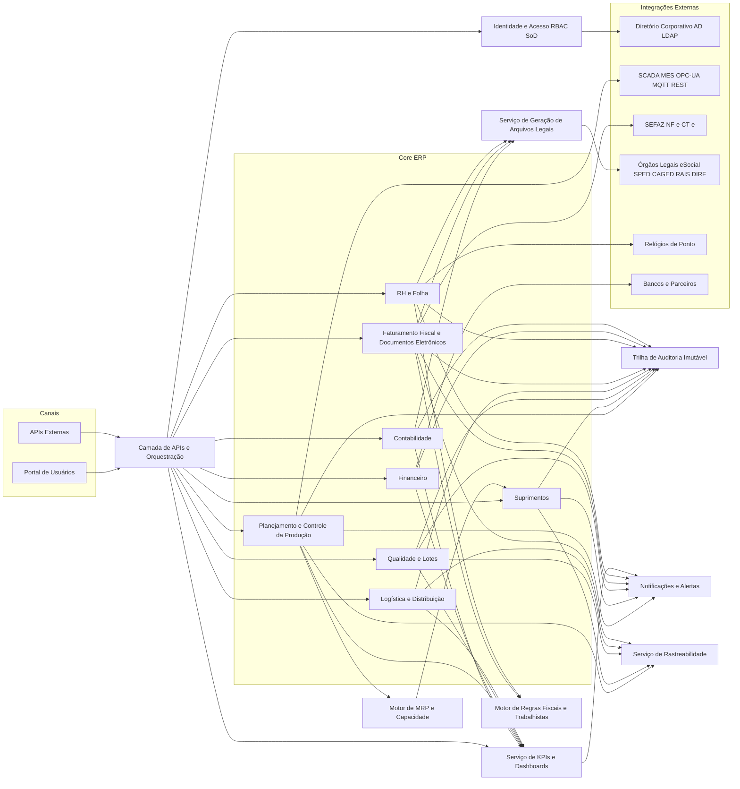
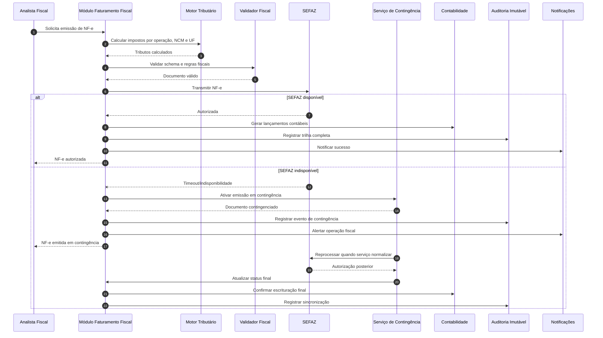

# Relatório Técnico de Arquitetura de Software

## 1. Identificação das HUs

| HU | Perfil | Objetivo de Negócio | Módulos/Capacidades Arquiteturais Envolvidas | RF/RNF Principalmente Relacionados |
|---|---|---|---|---|
| HU01 | Planejador PCP | Gerar OP e MRP automático | PCP, Estoque, Suprimentos, Motor de Planejamento, Alertas | RF05, RF06, RF14, RNF13 |
| HU02 | Planejador PCP | Monitorar OEE e desvios em tempo real | PCP, Integração Chão de Fábrica, KPI/BI, Alertas | RF10, RF11, RF12, RF52, RNF18, RNF14 |
| HU03 | Comprador | Cotação multi-fornecedor com alçada | Suprimentos, Fornecedores, Workflow de Aprovação, Notificações | RF13, RF15, RF16 |
| HU04 | Gestor Suprimentos | Acompanhar desempenho de fornecedores | Suprimentos, Qualidade de Fornecedor, KPI/Relatórios | RF19, RF53 |
| HU05 | Analista Qualidade | Registrar inspeção e bloquear lote reprovado | Qualidade, Lotes, Estoque, Notificações | RF20, RF21, RF22 |
| HU06 | Analista Qualidade | Rastreabilidade ponta a ponta de lote | Qualidade, Lotes, PCP, Fiscal/Expedição, Relatórios | RF23, RF25, RF28 |
| HU07 | Analista Fiscal | Emitir NF-e com imposto automático e contingência | Fiscal, Motor Tributário, Integração Governamental, Contingência | RF31, RF32, RF34, RNF15, RNF17, RNF07 |
| HU08 | Analista Fiscal | SPED Fiscal automático e consistente | Fiscal, Escrituração Digital, Validação de Arquivos | RF36, RF48, RNF08 |
| HU09 | Analista RH | Processar folha mensal integrada ao ponto | RH, Ponto, Folha, Encargos, Remessa | RF38, RF39, RF42, RNF11 |
| HU10 | Analista RH | Gerar obrigações acessórias RH | RH, Motor Legal Trabalhista, Geração/Validação de Arquivos | RF40, RNF08, RNF11 |
| HU11 | Controller | DRE e fluxo de caixa em tempo real | Contabilidade, Financeiro, Consolidação, Drill-down | RF43, RF45, RF46, RF47 |
| HU12 | Diretor/CEO | Dashboard executivo com drill-down | KPI/BI, Consolidação multiunidade, Alertas visuais | RF50, RF51, RF52, RNF14, RNF16 |

---

## 2. Diagramas de Arquitetura (Mermaid)

### 2.1 Visão de Componentes Lógicos

### 2.2 Diagrama de Sequência — HU07 (Emissão NF-e com contingência)

---

## 3. Decisões de Arquitetura

1. **Arquitetura modular por domínios de negócio**  
   - **Motivo:** alto acoplamento funcional entre áreas ERP, mas com responsabilidades distintas.  
   - **Efeito:** facilita evolução por módulo e rastreabilidade RF↔componente.

2. **Camada única de API e autorização central**  
   - **Motivo:** padronizar segurança, auditoria e governança de acesso entre canais e integrações.  
   - **Efeito:** reforça RNF01, RNF03, RNF04, RNF19.

3. **Controle de acesso com RBAC + SoD + escopo por unidade fabril**  
   - **Motivo:** segregação de funções e isolamento multiunidade (RF04, RNF16).  
   - **Efeito:** reduz risco de fraude/erro operacional e fiscal.

4. **Trilha de auditoria imutável transversal**  
   - **Motivo:** requisitos legais de retenção e rastreabilidade de operações críticas.  
   - **Efeito:** atende RNF10 e suporta auditorias (RNF05).

5. **Integração híbrida síncrona/assíncrona**  
   - **Motivo:** alguns fluxos exigem resposta imediata (NF-e), outros toleram processamento desacoplado (KPIs, consolidações).  
   - **Efeito:** melhora resiliência e desempenho sem perder consistência funcional.

6. **Serviço dedicado de MRP e capacidade**  
   - **Motivo:** cálculo intensivo com SLA definido (RNF13).  
   - **Efeito:** isolamento de carga e previsibilidade de execução.

7. **Motor de regras legais configurável (fiscal e trabalhista)**  
   - **Motivo:** frequentes mudanças regulatórias (RNF06, RNF08, RNF11).  
   - **Efeito:** reduz retrabalho estrutural e acelera adequação legal.

8. **Mecanismo automático de contingência fiscal**  
   - **Motivo:** continuidade operacional em indisponibilidade da SEFAZ (RF34, RNF17).  
   - **Efeito:** reduz indisponibilidade de faturamento e risco de bloqueio logístico.

9. **Serviço de rastreabilidade de lotes ponta a ponta**  
   - **Motivo:** garantir investigação rápida de NC/recall (RF23, HU06).  
   - **Efeito:** visão unificada entre recebimento, produção, qualidade e expedição.

10. **Camada de KPIs com drill-down transacional**  
    - **Motivo:** suporte a decisão executiva com rastreamento até origem (RF52).  
    - **Efeito:** melhora transparência e governança analítica.

11. **Consolidação contábil em tempo real por eventos de negócio**  
    - **Motivo:** DRE/fluxo de caixa em atualização contínua (RF45, RF46).  
    - **Efeito:** reduz fechamento manual e latência de informação gerencial.

12. **Observabilidade operacional padronizada para todos os módulos**  
    - **Motivo:** requisito explícito de monitoramento em tempo real (RNF23).  
    - **Efeito:** melhora diagnóstico, operação e cumprimento de SLA.

---

## 4. Tabela de Componentes e Rastreabilidade

| Componente | Responsabilidade Principal | Comunica-se com | Origem (HU / Critério de Aceite) |
|---|---|---|---|
| Gestão de Identidade e Acesso | SSO, RBAC, SoD, escopo por unidade | API, Diretório corporativo, Auditoria | HU geral; RF01–RF04 |
| Camada de APIs e Orquestração | Expor serviços internos/externos com políticas comuns | Canais, módulos ERP, APIs externas | HU12; RF52, RNF19 |
| Auditoria Imutável | Registro inviolável de ações críticas | Todos os módulos | HU07/HU10/HU11; RF03, RNF10 |
| PCP | Gestão de OP, apontamento e execução | MRP, Estoque, SCADA/MES, KPI | HU01, HU02; RF05, RF08, RF11 |
| Motor de MRP e Capacidade | Necessidade líquida e sequenciamento | PCP, Suprimentos, Estoque | HU01; RF06, RF07, RF14, RNF13 |
| Serviço de OEE e Desvios | Cálculo OEE e alertas por threshold | PCP, SCADA/MES, KPI, Notificações | HU02; RF10, RF12 |
| Suprimentos | Cotação, OC, aprovação, recebimento, devolução | Fornecedores, Estoque, Financeiro, Qualidade | HU03, HU04; RF13–RF19 |
| Workflow de Aprovação | Regras de alçada e trilha de decisão | Suprimentos, Financeiro, Notificações | HU03; RF16 |
| Qualidade e NC | Inspeção por lote, bloqueio, não conformidade | Estoque, PCP, Suprimentos, Notificações | HU05; RF20–RF25 |
| Serviço de Rastreabilidade de Lotes | Encadear lote de entrada até saída | Qualidade, PCP, Logística, Fiscal | HU06; RF23 |
| Estoque e Armazém | Saldo, endereçamento, bloqueio por status | PCP, Suprimentos, Qualidade, Logística | HU01/HU05; RF09, RF22, RF26 |
| Logística e Distribuição | Expedição, romaneio, tracking, RMA | Vendas, Fiscal, Estoque, Qualidade | HU06/HU12; RF27–RF30 |
| Faturamento Fiscal | Emissão NF-e/CT-e, cancelamento, inutilização | Motor tributário, SEFAZ, Contingência | HU07; RF31, RF33, RF35 |
| Motor Tributário | Cálculo de impostos por regra fiscal | Faturamento, Contabilidade | HU07; RF32, RNF06 |
| Contingência Fiscal | Emissão offline e sincronização posterior | Faturamento, SEFAZ, Auditoria | HU07; RF34, RNF17 |
| Escrituração Digital | Geração de SPED/ECD/EFD e validações | Fiscal, Contabilidade, RH, Órgãos | HU08, HU10; RF36, RF48 |
| RH e Folha | Cadastro, ponto, folha, benefícios, férias/rescisão | Relógios de ponto, Financeiro, Obrigações | HU09, HU10; RF37–RF42 |
| Financeiro | Contas a pagar/receber, fluxo projetado/realizado | Contabilidade, Bancos, Dashboard | HU11; RF47 |
| Contabilidade | Lançamentos automáticos, plano de contas, DRE/BP | Todos os módulos, KPI, Escrituração | HU11; RF43–RF46, RF49 |
| KPI e Dashboards | Painéis em tempo real, metas, drill-down, exportação | Módulos ERP, Notificações, Relatórios | HU02, HU04, HU12; RF50–RF53 |
| Notificações e Alertas | Alertas operacionais e regulatórios | PCP, Fiscal, RH, Suprimentos, KPI | HU02/HU03/HU10; critérios de alertas |

---

## 5. Bloqueios e Pendências

| Tema | Lacuna/Pendência | Impacto Arquitetural | Ação Recomendada |
|---|---|---|---|
| Regras fiscais por UF | Não há detalhamento de fonte/versionamento de tabelas fiscais | Risco de cálculo incorreto e não conformidade | Definir processo formal de atualização e vigência de regras |
| Convenções coletivas RH | Escopo de sindicatos/categorias não especificado | Motor trabalhista pode ficar incompleto | Levantar matriz sindicato × unidade × cargo |
| Modelo de dados mestre | Sem política explícita de governança de cadastros (item, NCM, centro custo, fornecedor) | Inconsistência entre módulos e KPIs | Definir domínio de dados mestres, responsáveis e qualidade |
| Política de SoD | Conflitos de função críticos não listados | Exposição a fraude e falhas de controle | Criar matriz de conflitos e fluxo de exceção auditável |
| Thresholds e escalonamento de alertas | Critérios de prioridade/canais não detalhados | Excesso de ruído ou perda de alertas críticos | Definir taxonomia de alertas, SLA e escalonamento |
| RPO/RTO por módulo | Apenas RPO máximo informado | Recuperação não previsível em incidentes | Definir RTO por processo crítico (fiscal, folha, produção) |
| Integrações legadas | Contratos de API/eventos não padronizados | Retrabalho e falhas de interoperabilidade | Publicar especificação canônica de contratos e versionamento |
| LGPD operacional | Bases legais e regras de retenção por dado pessoal não detalhadas | Risco regulatório | Definir políticas de minimização, anonimização e ciclo de vida |

---

## 6. Cobertura de Requisitos

### 6.1 Cobertura dos RFs (consolidada por domínio)

| Escopo RF | Cobertura | Evidência Arquitetural |
|---|---|---|
| RF01–RF04 (Usuários e acesso) | **Coberto** | IAM central, RBAC/SoD, escopo por unidade, auditoria |
| RF05–RF12 (PCP) | **Coberto** | PCP + MRP + OEE + integração SCADA/MES + alertas |
| RF13–RF19 (Suprimentos) | **Coberto** | Suprimentos, workflow de alçada, desempenho de fornecedor |
| RF20–RF25 (Qualidade) | **Coberto** | Qualidade/NC, bloqueio de lotes, rastreabilidade, relatórios |
| RF26–RF30 (Logística) | **Coberto** | Estoque endereçado, expedição, tracking, RMA integrado |
| RF31–RF36 (Fiscal) | **Coberto** | Faturamento fiscal, motor tributário, contingência, escrituração |
| RF37–RF42 (RH/Folha) | **Coberto** | RH/Folha, ponto integrado, obrigações acessórias |
| RF43–RF49 (Contábil/Financeiro) | **Coberto** | Lançamento automático, DRE/BP/fluxo, multimoeda |
| RF50–RF53 (Dashboards/KPI) | **Coberto** | KPI em tempo real, metas, drill-down, exportação |

### 6.2 Cobertura dos RNFs

| RNF | Cobertura | Observação |
|---|---|---|
| RNF01–RNF05 (Segurança) | **Coberto Parcial** | Controles previstos; faltam parâmetros operacionais finais (hardening, cadência de pentest) |
| RNF06–RNF11 (Conformidade) | **Coberto Parcial** | Arquitetura suporta; depende de governança contínua de atualização legal |
| RNF12–RNF17 (Disponibilidade/Desempenho/Resiliência) | **Coberto Parcial** | Desenho contempla, porém requer plano de capacidade e testes de carga formais |
| RNF18–RNF20 (Interoperabilidade) | **Coberto** | Integração por protocolos padrão e APIs documentadas |
| RNF21–RNF24 (Infraestrutura/Dados) | **Coberto Parcial** | Direcionado no desenho; pendente detalhar estratégia de recuperação e UX operacional |

---

## 7. Gap Analysis

| Gap | Descrição | Impacto | Recomendação |
|---|---|---|---|
| GA01 | Ausência de catálogo formal de eventos de negócio intermodular | Inconsistência em DRE/KPI em tempo real | Definir contratos canônicos de eventos e política de versionamento |
| GA02 | Falta de critérios de qualidade de dados mestres | Erros em MRP, tributação e relatórios executivos | Instituir governança de dados mestres com validações obrigatórias |
| GA03 | Não definição de estratégia de testes de conformidade legal contínua | Risco de não conformidade fiscal/trabalhista | Pipeline de validação legal por versão de regra antes de produção |
| GA04 | Ambiguidade sobre prioridade entre consistência e latência em dashboards | Divergência de números entre operacional e executivo | Definir SLA de atualização por KPI e política de reconciliação |
| GA05 | Não há matriz de criticidade para incidentes por módulo | Resposta operacional desigual e impacto em SLA | Estabelecer plano de continuidade por processo crítico |
| GA06 | Regras de retenção LGPD versus retenção fiscal de 10 anos não harmonizadas | Risco jurídico e de auditoria | Classificar dados por base legal e aplicar retenção diferenciada |
| GA07 | Fluxo detalhado de exceções (rejeições SEFAZ, erro SPED, rejeição eSocial) incompleto | Retrabalho manual e atrasos legais | Modelar processos de exceção com responsabilidades e prazos |
| GA08 | Requisitos de observabilidade não trazem SLO por serviço | Dificulta gestão de desempenho e disponibilidade | Definir indicadores operacionais mínimos por componente (latência, falha, backlog) |

**Conclusão:** a arquitetura proposta cobre integralmente o escopo funcional e endereça os RNFs em nível de desenho lógico. Para execução segura, o próximo passo é fechar as pendências de governança (dados, regras legais, SLO/SLA e continuidade), convertendo-as em backlog arquitetural com prioridade alta.