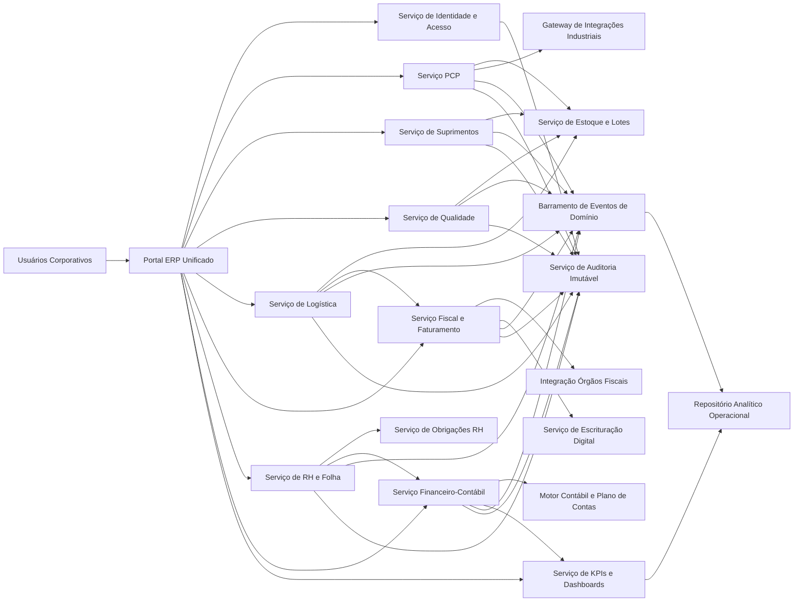
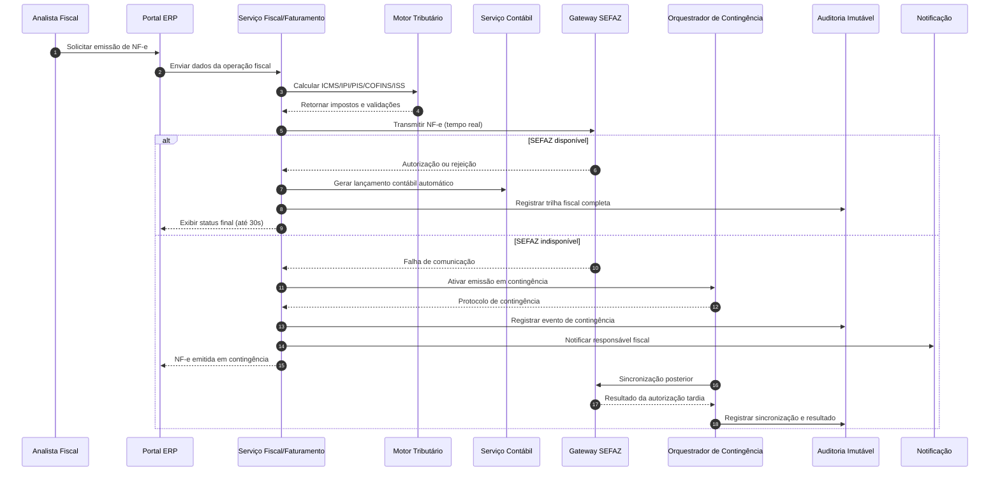
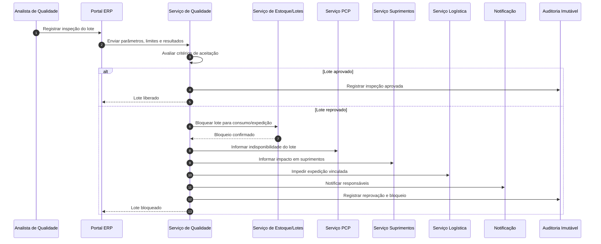

# Relatório Técnico de Arquitetura de Software

## 1. Identificação das HUs

| HU | Persona | Objetivo de Negócio | Capacidades Arquiteturais Necessárias |
|---|---|---|---|
| HU01 | Planejador de Produção | Criar OP e executar MRP | Gestão de OP, motor MRP, integração com estoque e suprimentos, geração automática de solicitações |
| HU02 | Planejador de Produção | Monitorar OEE e desvios | Coleta em tempo real (chão de fábrica + apontamentos), cálculo de KPI, alertas, drill-down |
| HU03 | Comprador | Cotação multipfornecedor | Workflow de cotação, comparação por critérios, aprovação por alçada |
| HU04 | Gestor de Suprimentos | Acompanhar desempenho de fornecedores | Data mart operacional de suprimentos, KPI de fornecedores, filtros e exportação |
| HU05 | Analista de Qualidade | Inspecionar lote e bloquear reprovados | Gestão de inspeção, regra de bloqueio de estoque, notificações intermodulares |
| HU06 | Analista de Qualidade | Rastrear lote ponta a ponta | Cadeia de rastreabilidade entre recebimento, produção, qualidade e expedição/fiscal |
| HU07 | Analista Fiscal | Emitir NF-e com cálculo automático | Motor fiscal, orquestração de emissão, integração SEFAZ, contingência automática |
| HU08 | Analista Fiscal | Manter SPED Fiscal atualizado | Escrituração automática, validação de consistência, geração por período histórico |
| HU09 | Analista de RH | Processar folha mensal | Integração ponto, cálculo trabalhista, encargos e remessa bancária |
| HU10 | Analista de RH | Gerar obrigações acessórias | Geração por leiaute vigente, alerta de prazos, validação pré-envio |
| HU11 | Controller | DRE e fluxo em tempo real | Lançamentos automáticos multi-módulo, consolidação contábil, drill-down |
| HU12 | Diretor/CEO | Dashboard executivo em tempo real | Camada analítica operacional, metas/KPIs, navegação temporal e por unidade |

---

## 2. Diagramas de Arquitetura (Mermaid)

### 2.1 Visão de Componentes (macro)

### 2.2 Diagrama de Sequência — Emissão de NF-e com contingência (HU07)

### 2.3 Diagrama de Sequência — Inspeção e bloqueio de lote (HU05/HU06)

---

## 3. Decisões de Arquitetura

| ID | Decisão | Justificativa | Requisitos Atendidos |
|---|---|---|---|
| ADR-01 | Arquitetura modular por domínios (PCP, Suprimentos, Qualidade, Logística, Fiscal, RH, Financeiro, BI) | Reduz acoplamento e viabiliza evolução regulatória/fabril por módulo | RF05–RF53, RNF16, RNF23 |
| ADR-02 | Controle de acesso centralizado com RBAC + SoD + escopo por unidade fabril | Atende segregação de funções e restrição por hierarquia organizacional | RF01, RF04, RNF03 |
| ADR-03 | Trilha de auditoria imutável e transversal | Necessária para conformidade fiscal/RH/financeira com retenção longa | RF03, RNF10 |
| ADR-04 | Processamento orientado a eventos de domínio para atualização near real-time | Suporta dashboards em tempo real, OEE e DRE com baixa latência | RF10, RF45, RF50, RNF14 |
| ADR-05 | Camada dedicada de integração externa (SEFAZ, relógio de ponto, SCADA/MES, parceiros) | Isola volatilidade de protocolos e reduz impacto no núcleo de negócio | RF11, RF31, RF38, RNF18–RNF20 |
| ADR-06 | Motor de regras parametrizável para fiscal/trabalhista | Facilita aderência a mudanças legais sem reescrever módulos centrais | RF32, RF40, RF41, RNF06, RNF08, RNF11 |
| ADR-07 | Mecanismo automático de contingência fiscal e sincronização posterior | Mitiga indisponibilidade externa mantendo operação | RF34, RNF17 |
| ADR-08 | Modelo de dados com rastreabilidade de lote ponta a ponta | Garante recall/auditoria e bloqueio de não conformes | RF22, RF23, HU06 |
| ADR-09 | Camada analítica com drill-down transacional | Permite KPI executivo com navegação até origem em poucos cliques | RF52, HU02, HU11, HU12 |
| ADR-10 | Estratégia de segurança em profundidade (TLS, criptografia em repouso, rate limiting, bloqueio de conta) | Mitiga riscos de acesso indevido e vazamento de dados sensíveis | RNF01, RNF02, RNF04, RNF09 |

---

## 4. Tabela de Componentes e Rastreabilidade

| Componente | Responsabilidade Principal | Comunica-se com | Origem (HU / Critério de Aceite) |
|---|---|---|---|
| Portal ERP Unificado | Interface responsiva, navegação, filtros, drill-down, exportação | Todos os serviços de domínio | HU02, HU04, HU11, HU12 |
| Serviço de Identidade e Acesso | SSO, RBAC, SoD, escopo por unidade | Diretório corporativo, Portal, Auditoria | RF01, RF02, RF04 |
| Serviço de Auditoria Imutável | Registro inviolável de operações críticas | Todos os serviços | RF03, RNF10 |
| Serviço PCP | OP, sequenciamento, capacidade, apontamentos | Estoque, Integração Industrial, BI, Auditoria | HU01, HU02 |
| Motor MRP | Cálculo de necessidades líquidas e geração de solicitações | PCP, Estoque, Suprimentos | HU01 (critérios 2 e 3), RNF13 |
| Gateway de Integrações Industriais | Recepção de dados SCADA/MES via protocolos padrão | PCP, OEE/KPI | RF11, RNF18 |
| Serviço OEE/Desvios | Cálculo OEE e detecção de desvios por threshold | PCP, BI, Notificação | HU02 |
| Serviço de Suprimentos | Fornecedores, cotação, OC, aprovações | Estoque, Financeiro, Auditoria | HU03, HU04 |
| Motor de Aprovação por Alçada | Fluxo de aprovação configurável | Suprimentos, Fiscal, Notificação | HU03 (critério 3), RF16 |
| Serviço de Estoque e Lotes | Saldos, endereçamento, bloqueios, consumo em tempo real | PCP, Qualidade, Logística, Suprimentos | RF09, RF22, RF26 |
| Serviço de Qualidade | Planos de inspeção, NC, aprovação/reprovação | Estoque, PCP, Suprimentos, Logística | HU05, HU06 |
| Serviço de Logística e RMA | Expedição, romaneio, rastreio, devolução cliente | Estoque, Fiscal, Qualidade | RF27–RF30 |
| Serviço Fiscal/Faturamento | Emissão NF-e/CT-e, cancelamento, inutilização | Motor Tributário, Gateway SEFAZ, Contábil | HU07, HU08 |
| Motor Tributário | Cálculo de impostos por operação/NCM/UF | Fiscal/Faturamento | HU07 (critério 1), RF32 |
| Orquestrador de Contingência Fiscal | Comutação automática offline/online e sincronização | Fiscal/Faturamento, Gateway SEFAZ, Auditoria | HU07 (critério 4), RNF17 |
| Serviço de Escrituração Digital | SPED Fiscal/Contribuições/ECD/EFD | Fiscal, Financeiro, RH | HU08, RF36, RF48 |
| Serviço RH e Folha | Cadastro colaborador, ponto, folha, benefícios | Obrigações RH, Financeiro, Auditoria | HU09, HU10 |
| Serviço de Obrigações RH | eSocial, CAGED, RAIS, DIRF, alertas de prazo | RH/Folha, Notificação | HU10 |
| Serviço Financeiro-Contábil | AP/AR, fluxo de caixa, lançamentos automáticos | Todos os módulos, BI | HU11, RF43–RF47 |
| Motor Contábil/Plano de Contas | Regras de contabilização e consolidação | Financeiro, Fiscal, RH | RF44, RF45 |
| Serviço de KPIs e Dashboards | Indicadores em tempo real, metas, alertas visuais | Repositório analítico, Portal | HU02, HU04, HU12 |
| Serviço de Notificação | Alertas por evento (desvio, reprovação, prazos) | PCP, Qualidade, RH, Fiscal | HU02, HU05, HU10 |
| Repositório Analítico Operacional | Visões consolidadas para dashboards e drill-down | Serviços de domínio, BI | RF50–RF52, RNF14 |

---

## 5. Bloqueios e Pendências

| Tema | Pendência | Impacto Arquitetural | Prioridade |
|---|---|---|---|
| Governança SoD | Matriz detalhada de segregação por função crítica não definida | Risco de não conformidade em financeiro/fiscal | Alta |
| Multi-unidade | Regras exatas de consolidação x isolamento por filial/unidade | Define estratégia de particionamento e autorização | Alta |
| Fiscal | Escopo de cenários tributários especiais (substituição, benefícios, regimes) | Complexidade do motor tributário e testes | Alta |
| RH legal | Convenções coletivas por sindicato/categoria não detalhadas | Risco de cálculo incorreto de folha | Alta |
| OEE | Fórmulas operacionais para perdas específicas e calendário de turnos | Divergência de KPI entre áreas | Média |
| Integração chão de fábrica | Contratos de dados por unidade (tags, frequência, qualidade de sinal) | Pode degradar cálculo em tempo real | Média |
| LGPD | Política de consentimento, base legal e anonimização para analytics | Exige controles adicionais de privacidade | Alta |
| Retenção documental | Política completa de arquivamento de XML fiscais e comprovantes | Exigência legal e auditoria externa | Média |

---

## 6. Cobertura de Requisitos

### 6.1 Cobertura de RF (visão consolidada)

| Faixa RF | Domínio | Cobertura Arquitetural | Status |
|---|---|---|---|
| RF01–RF04 | Usuários e Acesso | IAM central, RBAC/SoD, escopo por unidade, auditoria | Coberto |
| RF05–RF12 | PCP | Serviço PCP + MRP + OEE + integração industrial + alertas | Coberto |
| RF13–RF19 | Suprimentos | Cadastro fornecedor, cotação, OC por alçada, desempenho | Coberto |
| RF20–RF25 | Qualidade | Planos/inspeção, bloqueio lote, NC, rastreabilidade e relatórios | Coberto |
| RF26–RF30 | Logística | Estoque endereçado, expedição, rastreio, RMA | Coberto |
| RF31–RF36 | Fiscal | Emissão NF-e/CT-e, contingência, impostos, SPED | Coberto |
| RF37–RF42 | RH/Folha | Cadastro, ponto, folha, obrigações e benefícios | Coberto |
| RF43–RF49 | Contábil/Financeiro | Lançamento automático, DRE, balanço, fluxo, multi-moeda | Coberto (detalhe de política cambial pendente) |
| RF50–RF53 | Dashboards/KPI | Painéis em tempo real, metas, drill-down e exportação | Coberto |

### 6.2 Cobertura de RNF

| RNF | Cobertura | Status |
|---|---|---|
| RNF01–RNF05 (Segurança) | TLS, criptografia em repouso, RBAC/SoD, limitação de tentativas, auditoria periódica | Coberto |
| RNF06–RNF11 (Conformidade) | Motor parametrizável legal, validação de schemas oficiais, trilha imutável, LGPD (parcial em políticas) | Parcial |
| RNF12–RNF17 (Disponibilidade/Desempenho) | Modularização, processamento assíncrono, contingência fiscal, metas de latência | Coberto com necessidade de testes de capacidade |
| RNF18–RNF20 (Integração) | Gateway de integrações e APIs REST documentadas + import/export padrão | Coberto |
| RNF21–RNF24 (Infraestrutura/Dados) | Requisitos contemplados em operação e observabilidade; dependem de plano de implantação | Parcial (operacionalização) |

---

## 7. Gap Analysis

| Lacuna de Especificação | Impacto | Recomendação |
|---|---|---|
| Matriz SoD não detalhada por transação | Pode liberar combinações de acesso proibidas | Definir matriz SoD por processo crítico (fiscal, financeiro, folha) antes da implementação |
| Regras fiscais avançadas não explicitadas | Risco de rejeição de documentos e cálculo incorreto | Levantar catálogo tributário completo por UF, operação e regime |
| Política de contingência NF-e/CT-e (limites, prazos, reconciliação) incompleta | Inconsistência entre emissão offline e autorização posterior | Formalizar procedimento operacional e regras automáticas de reconciliação |
| Modelo de rastreabilidade de lote para coproductos/perdas não especificado | Consulta de recall pode ficar incompleta | Definir gramática de genealogia de lote (split/merge/reprocesso) |
| Critérios formais de cálculo OEE por planta/turno | KPI inconsistente entre unidades | Publicar dicionário corporativo de KPI com fórmulas e exceções |
| Regras de multi-moeda (fonte de câmbio, horário de corte, reavaliação) ausentes | Distorções em DRE e fluxo consolidado | Definir política cambial corporativa e trilha de auditoria de taxas |
| LGPD: retenção, anonimização e direitos do titular | Risco regulatório e jurídico | Definir política de ciclo de vida de dados pessoais e fluxos de atendimento ao titular |
| Metas de volume para testes de carga por módulo não definidas | Risco de não cumprir RNF13/14/15 | Estabelecer plano de testes não funcionais com cenários de pico por unidade fabril |

**Conclusão:** a arquitetura proposta cobre integralmente o escopo funcional do ERP industrial e a maior parte dos RNFs, com lacunas concentradas em políticas corporativas (SoD, fiscal detalhado, LGPD e operação). Essas pendências devem ser tratadas como pré-condições de desenho detalhado e planejamento de testes de aceitação.