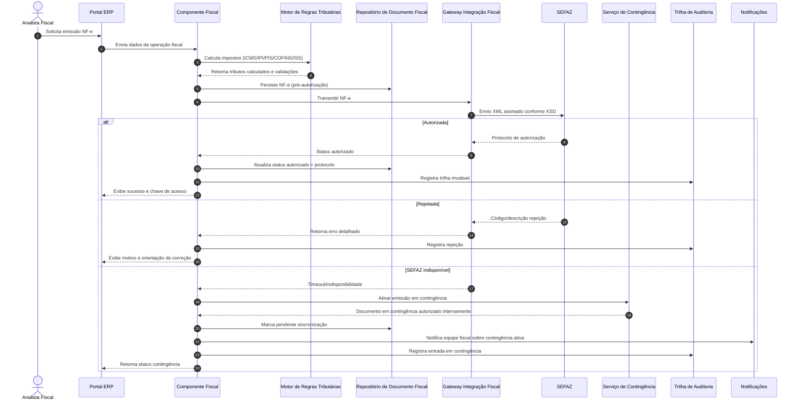

# Relatório Técnico de Arquitetura de Software

## 1. Identificação das HUs

| HU | Perfil | Objetivo de Negócio | Módulos/Domínios Envolvidos | RF Relacionados | RNF Relacionados |
|---|---|---|---|---|---|
| HU01 | Planejador PCP | Criar OP e executar MRP com geração de demanda de compras | PCP, Estoque, Suprimentos | RF05, RF06, RF14 | RNF13, RNF16 |
| HU02 | Planejador PCP | Monitorar OEE e desvios em tempo real com drill-down | PCP, Chão de Fábrica, Dashboards, Alertas | RF08, RF10, RF11, RF12, RF52 | RNF14, RNF18, RNF23 |
| HU03 | Comprador | Cotar com múltiplos fornecedores e aprovar OC por alçada | Suprimentos/Compras, Workflow de Aprovação | RF13, RF15, RF16 | RNF03, RNF19 |
| HU04 | Gestor Suprimentos | Acompanhar performance de fornecedores e exportar relatórios | Suprimentos, Analytics | RF19, RF53 | RNF14, RNF20 |
| HU05 | Analista Qualidade | Inspecionar lote e bloquear reprovados | Qualidade, Estoque, Notificações | RF20, RF21, RF22 | RNF10, RNF23 |
| HU06 | Analista Qualidade | Rastrear lote ponta a ponta para auditoria/recall | Qualidade, Produção, Fiscal, Logística | RF23, RF25, RF53 | RNF10, RNF20 |
| HU07 | Analista Fiscal | Emitir NF-e com cálculo tributário e contingência automática | Fiscal/Faturamento, Tributação, Integração SEFAZ | RF31, RF32, RF34 | RNF06, RNF07, RNF15, RNF17 |
| HU08 | Analista Fiscal | Gerar SPED Fiscal automaticamente e validar consistência | Fiscal, Contábil | RF36, RF48 | RNF08, RNF10 |
| HU09 | Analista RH | Processar folha com ponto, encargos e remessa | RH, Ponto, Folha, Obrigações | RF38, RF39 | RNF08, RNF11 |
| HU10 | Analista RH | Gerar e validar eSocial/CAGED/RAIS/DIRF com alertas de prazo | RH/DP, Compliance | RF40 | RNF08, RNF11 |
| HU11 | Controller | Visualizar DRE e fluxo de caixa em tempo real com drill-down | Contábil/Financeiro, Dashboards | RF43, RF45, RF46, RF47, RF52 | RNF14, RNF16 |
| HU12 | Diretor/CEO | Acompanhar KPIs executivos em tempo real por unidade/período | BI/KPIs, Consolidação Multiplanta | RF50, RF51, RF52, RF53 | RNF14, RNF16, RNF24 |

---

## 2. Diagramas de Arquitetura (Mermaid)

### 2.1 Visão de Componentes (lógica de alto nível)

```mermaid
flowchart LR
    U[Usuários de Negócio] --> UI[Portal ERP / API de Experiência]
    UI --> IAM[Serviço de Identidade e Acesso]
    UI --> ORQ[Orquestrador de Processos de Negócio]

    ORQ --> PCP[Componente PCP/MRP/OEE]
    ORQ --> SUP[Componente Suprimentos e Compras]
    ORQ --> QLT[Componente Qualidade e Rastreabilidade]
    ORQ --> LOG[Componente Logística e Expedição]
    ORQ --> FIS[Componente Fiscal (NF-e/CT-e/SPED)]
    ORQ --> RH[Componente RH/Folha/Obrigações]
    ORQ --> FIN[Componente Contábil e Financeiro]
    ORQ --> KPI[Componente Dashboards e KPIs]

    PCP --> EST[Componente Estoques e Lotes]
    SUP --> EST
    QLT --> EST
    LOG --> EST

    PCP <--> INT[Gateway de Integração Externa]
    FIS <--> INT
    RH <--> INT
    LOG <--> INT

    INT --> EX1[Diretório Corporativo SSO]
    INT --> EX2[SCADA/MES]
    INT --> EX3[SEFAZ]
    INT --> EX4[Relógio de Ponto]
    INT --> EX5[Sistemas Legados / Parceiros]

    ORQ --> AUD[Trilha de Auditoria Imutável]
    ORQ --> NOTI[Serviço de Alertas e Notificações]
    KPI --> DWH[Camada Analítica e Consolidação]
    FIN --> DWH
    PCP --> DWH
    QLT --> DWH
    SUP --> DWH
    LOG --> DWH
    RH --> DWH
    FIS --> DWH
```

### 2.2 Sequência — Emissão de NF-e com contingência automática (HU07)



---

## 3. Decisões de Arquitetura

1. **Arquitetura modular por domínios de negócio (bounded contexts)**  
   - **Motivo:** reduzir acoplamento entre PCP, Fiscal, RH, Qualidade, etc.  
   - **Impacto:** facilita evolução regulatória (fiscal/RH) sem degradar produção.  
   - **Rastreabilidade:** RF05–RF53, RNF23.

2. **Controle de acesso centralizado com RBAC + SoD + escopo por unidade fabril**  
   - **Motivo:** requisitos de segregação e isolamento multiunidade.  
   - **Impacto:** autorização em duas camadas: perfil funcional e abrangência organizacional.  
   - **Rastreabilidade:** RF01, RF04, RNF03, RNF16.

3. **Integração híbrida: síncrona para transações críticas, assíncrona para telemetria/eventos**  
   - **Motivo:** NF-e exige resposta imediata; dados de chão de fábrica e alertas têm alto volume.  
   - **Impacto:** melhor resiliência e escalabilidade.  
   - **Rastreabilidade:** RF11, RF31, RF34, RNF15, RNF17, RNF18, RNF19.

4. **Trilha de auditoria imutável para operações financeiras, fiscais e RH**  
   - **Motivo:** conformidade legal e rastreabilidade de longo prazo.  
   - **Impacto:** todo evento crítico é carimbado com usuário, data/hora, módulo, ação e contexto.  
   - **Rastreabilidade:** RF03, RNF10, RNF09.

5. **Motor parametrizável de regras fiscais e trabalhistas**  
   - **Motivo:** legislação brasileira dinâmica (SEFAZ, SPED, eSocial, CLT).  
   - **Impacto:** atualização de regras com baixo impacto no núcleo transacional.  
   - **Rastreabilidade:** RF32, RF36, RF40, RF41, RNF06, RNF08, RNF11.

6. **Rastreabilidade fim a fim por lote com encadeamento de documentos e movimentos**  
   - **Motivo:** suporte a recall, auditoria e bloqueio de não conformes.  
   - **Impacto:** modelo de dados orientado a genealogia de lotes.  
   - **Rastreabilidade:** RF22, RF23, HU05, HU06.

7. **Camada analítica com drill-down transacional**  
   - **Motivo:** dashboards em tempo real e análise executiva acionável.  
   - **Impacto:** KPIs consolidados + link reverso para evidência operacional.  
   - **Rastreabilidade:** RF50–RF52, HU02, HU11, HU12, RNF14.

8. **Estratégia de disponibilidade com contingência fiscal e recuperação de dados**  
   - **Motivo:** operação fabril contínua e obrigação fiscal sem interrupção.  
   - **Impacto:** operação degradada controlada + sincronização posterior + RPO definido.  
   - **Rastreabilidade:** RNF12, RNF17, RNF21.

---

## 4. Tabela de Componentes e Rastreabilidade

| Componente | Responsabilidade Principal | Comunica-se com | Origem (HU / Critério de Aceite) |
|---|---|---|---|
| Portal ERP / API de Experiência | Interface unificada, navegação, filtros, exportações | IAM, Orquestrador, Dashboards | HU02, HU04, HU06, HU11, HU12 |
| Serviço de Identidade e Acesso | SSO, RBAC, SoD, escopo por unidade | Diretório corporativo, Portal, todos os módulos | HU transversais; RF01, RF02, RF04 |
| Trilha de Auditoria Imutável | Registro auditável de ações críticas | Todos os módulos, Compliance | HU07/CA3-4, HU09, HU10 |
| Orquestrador de Processos de Negócio | Coordenação entre módulos e fluxos de aprovação | PCP, Suprimentos, Fiscal, RH, etc. | HU01, HU03, HU07, HU09 |
| PCP/MRP/OEE | OP, MRP, capacidade, apontamento, OEE, desvios | Estoques, Integração SCADA/MES, Dashboards | HU01/CA1-3, HU02/CA1-3 |
| Estoques e Lotes | Saldos, endereçamento, movimentos e bloqueios | PCP, Suprimentos, Qualidade, Logística | HU01, HU05, HU06 |
| Suprimentos e Compras | Fornecedores, cotação, OC, alçada, recebimento | Estoques, Financeiro, Notificações | HU03/CA1-3, HU04 |
| Qualidade e Rastreabilidade | Plano de inspeção, NC, bloqueio e genealogia de lotes | Estoques, PCP, Fiscal, Logística | HU05/CA1-3, HU06/CA1-3 |
| Logística e Distribuição | Expedição, romaneio, rastreio entrega, devolução cliente | Estoques, Fiscal, Integrações transportadoras | RF27–RF30; HU06 |
| Fiscal (NF-e/CT-e/SPED) | Emissão/autorização/cancelamento, SPED, contingência | Motor tributário, SEFAZ, Contábil | HU07/CA1-4, HU08/CA1-3 |
| Motor de Regras Tributárias | Cálculo e validação de impostos por operação/NCM/UF | Fiscal, Catálogo fiscal | HU07/CA1; RF32 |
| RH/Folha/Obrigações | Cadastro colaborador, ponto, folha, obrigações acessórias | Relógio de ponto, Financeiro, Compliance | HU09/CA1-3, HU10/CA1-3 |
| Contábil e Financeiro | Lançamentos automáticos, DRE, balanço, fluxo caixa, AP/AR | Todos módulos transacionais, Dashboards | HU11/CA1-3 |
| Dashboards e KPIs | Indicadores operacionais/financeiros/qualidade, metas e alertas | Camada analítica, Notificações | HU02, HU04, HU11, HU12 |
| Gateway de Integração Externa | APIs REST, protocolos industriais, import/export | SCADA/MES, SEFAZ, parceiros, legados | RF11, RNF18, RNF19, RNF20 |
| Notificações e Alertas | Alertas visuais, e-mail e lembretes de prazo | Todos módulos, Portal | HU02/CA2, HU10/CA2, HU05/CA3 |
| Compliance e Governança de Dados | LGPD, retenção, mascaramento e evidências legais | IAM, Auditoria, todos módulos | RNF09, RNF10 |

---

## 5. Bloqueios e Pendências

1. **Matriz detalhada de SoD não especificada** (ex.: quem pode criar/aprovar/cancelar NF-e, OC, pagamentos).  
2. **Regras de alçada de aprovação incompletas** (valores, moedas, exceções por unidade).  
3. **Critérios e pesos de comparação de cotação** (RF15) não formalizados por categoria de item.  
4. **Catálogo fiscal e política de atualização legal** (NCM, alíquotas, regras por UF) sem SLA de manutenção.  
5. **Volumetria real de integração SCADA/MES** (taxa de eventos/segundo, latência esperada por planta).  
6. **Política de contingência fiscal operacional** (limites de fila, reconciliação, tratativa de divergências pós-retorno SEFAZ).  
7. **Parâmetros de desempenho de dashboards por cardinalidade** (número de usuários simultâneos e filtros complexos).  
8. **Regras de retenção/anonimização LGPD por tipo de dado de RH e clientes** além do mínimo fiscal de 10 anos.  
9. **Calendário de obrigações RH/fiscais e variações por convenção coletiva** precisa de governança contínua.  
10. **Definição formal de RTO por módulo crítico** (além do RPO já definido).

---

## 6. Cobertura de Requisitos

### 6.1 Cobertura por blocos funcionais (RF)

| Bloco | RF | Status de Cobertura Arquitetural | Observação |
|---|---|---|---|
| Usuários e Acesso | RF01–RF04 | **Coberto** | IAM + escopo organizacional + auditoria |
| PCP | RF05–RF12 | **Coberto (parcial em RF11)** | RF11 depende de matriz de protocolos por planta |
| Suprimentos | RF13–RF19 | **Coberto (parcial em RF15)** | Falta política de pesos/score de cotação |
| Qualidade | RF20–RF25 | **Coberto** | Bloqueio de lote e genealogia ponta a ponta |
| Logística | RF26–RF30 | **Coberto** | Inclui devolução cliente (RMA) |
| Fiscal | RF31–RF36 | **Coberto** | Contingência e integração SEFAZ previstas |
| RH/Folha | RF37–RF42 | **Coberto** | Dependente de atualização contínua legal |
| Contábil/Financeiro | RF43–RF49 | **Coberto** | Lançamento automático e multi-moeda |
| Dashboards/KPIs | RF50–RF53 | **Coberto** | Drill-down e exportação incluídos |

### 6.2 Cobertura não funcional (RNF)

| Categoria | RNF | Status | Observação |
|---|---|---|---|
| Segurança | RNF01–RNF05 | **Coberto (parcial RNF05)** | Periodicidade/escopo de auditoria de segurança pendente |
| Conformidade | RNF06–RNF11 | **Coberto (parcial RNF06/RNF08/RNF11)** | Requer processo de atualização normativa contínua |
| Disponibilidade/Desempenho | RNF12–RNF17 | **Coberto (parcial RNF13/RNF14)** | Necessária prova de carga com volumetria real |
| Interoperabilidade | RNF18–RNF20 | **Coberto** | Gateway e contratos de integração definidos |
| Infraestrutura/Dados | RNF21–RNF24 | **Coberto (parcial RNF22)** | Topologia alvo (on-prem/privada/híbrida) ainda em decisão |

---

## 7. Gap Analysis

| Gap | Impacto Arquitetural | Risco | Ação Recomendada |
|---|---|---|---|
| Ausência de matriz SoD detalhada | Falhas de segregação em fluxos críticos | Alto (compliance/fraude) | Definir matriz de papéis-ação por módulo antes do build |
| Critérios de cotação sem fórmula oficial | Decisão de compra inconsistente | Médio | Formalizar score de fornecedores por categoria e peso |
| Volumetria SCADA/MES não conhecida | Subdimensionamento de integração/OEE | Alto (performance) | Executar levantamento por planta + testes de pico |
| Governança de atualização legal não definida | Não conformidade fiscal/RH | Alto (multas) | Criar processo de gestão regulatória com calendário e responsável |
| Política de contingência fiscal incompleta | Retrabalho e divergência documental | Alto | Especificar workflow de reconciliação pós-SEFAZ |
| Requisitos de retenção LGPD x fiscal não harmonizados | Exposição de dados pessoais | Alto | Definir política de minimização, mascaramento e ciclo de vida |
| Metas de disponibilidade sem RTO por módulo | Recuperação inconsistente em incidentes | Médio | Estabelecer RTO/RPO por domínio e criticidade |
| Critérios de qualidade de dados para DRE/KPI não formalizados | Indicadores divergentes entre áreas | Médio | Definir dicionário corporativo de KPIs e regras de consolidação |

**Conclusão:** a arquitetura proposta cobre integralmente o escopo funcional e a maior parte dos RNFs, com lacunas concentradas em **governança de regras (SoD, legal, cotação)** e **parâmetros operacionais (volumetria, RTO, carga)**. O próximo passo recomendado é um ciclo curto de detalhamento dessas pendências antes da implementação incremental por domínio.