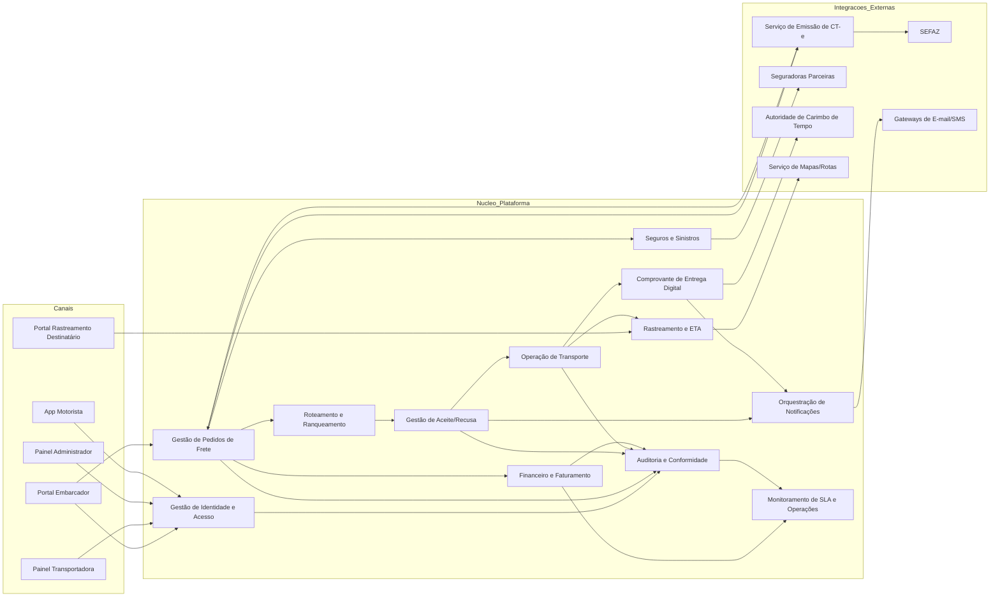
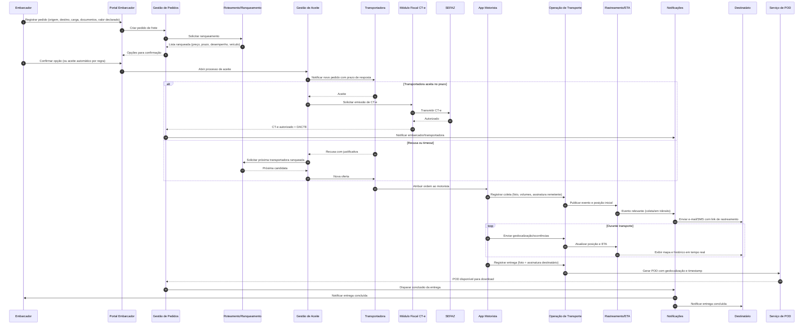

# Relatório Técnico de Arquitetura de Software

## 1. Identificação das HUs

| HU | Perfil | Objetivo de Negócio | Principais RF/RNF Relacionados |
|---|---|---|---|
| HU01 | Embarcador | Registrar pedido de frete com dados completos e documentos | RF05, RF06, RF09, RF10, RF13, RNF13 |
| HU02 | Embarcador | Selecionar transportadora ranqueada e contratar seguro no mesmo fluxo | RF11, RF12, RF41, RF45, RF17 |
| HU03 | Embarcador | Acompanhar fretes e baixar POD após entrega | RF07, RF31, RF37, RF39, RF34 |
| HU04 | Embarcador | Abrir e acompanhar sinistro | RF42, RF43, RF44 |
| HU05 | Transportadora | Aceitar/recusar pedidos e gerir capacidade operacional | RF03, RF13, RF14, RF15, RF35 |
| HU06 | Transportadora | Monitorar motoristas e ocorrências em tempo real | RF25, RF26, RF31, RF32 |
| HU07 | Transportadora | Consultar demonstrativo financeiro de repasse | RF46, RF48 |
| HU08 | Motorista | Registrar coleta com evidências | RF23, RF24, RF26, RF28 |
| HU09 | Motorista | Registrar entrega com assinatura e gerar POD | RF27, RF37, RF38, RF40, RNF21 |
| HU10 | Motorista | Registrar ocorrências com fotos e alerta imediato | RF26, RF34, RF35 |
| HU11 | Destinatário | Rastrear carga sem cadastro | RF30, RF31, RF32, RNF05 |
| HU12 | Destinatário | Receber notificações por status e gerenciar preferências | RF33, RF31 |
| HU13 | Administrador | Monitorar SLA e acionar contingência operacional | RF36, RF15, RNF25 |
| HU14 | Administrador | Acompanhar painel financeiro consolidado | RF49, RF47, RF48 |

---

## 2. Diagramas de Arquitetura (Mermaid)

### 2.1 Visão de Componentes (macro)

### 2.2 Sequência ponta a ponta (pedido → aceite → execução → entrega)

---

## 3. Decisões de Arquitetura

1. **Arquitetura modular por domínios de negócio**  
   Separação em módulos: Pedidos, Roteamento, Operação, Rastreamento, Fiscal CT-e, Seguros, Financeiro, Notificações, Auditoria.  
   **Motivo:** reduzir acoplamento e facilitar evolução regulatória/fiscal sem impactar operação.

2. **Fluxos orientados a eventos de status logístico**  
   Mudanças de estado (coleta, trânsito, ocorrência, entrega) propagam para rastreamento, notificações, auditoria e financeiro.  
   **Motivo:** atender atualização quase em tempo real (RNF15/RNF16) e desacoplar consumidores.

3. **Controle de acesso por perfil + políticas de autorização por frete**  
   Perfis formais (embarcador, transportadora, motorista, destinatário, administrador) com regras de escopo de dados por frete/empresa.  
   **Motivo:** RF01/RF02 e proteção de geolocalização (RNF06).

4. **Trilha de auditoria imutável para operações críticas**  
   Registro inviolável para operações fiscais, financeiras, aceite/recusa, alteração de status e ações administrativas.  
   **Motivo:** RF04, RNF11 e governança de compliance.

5. **Mobile do motorista com estratégia offline-first**  
   Captura local de eventos (coleta/entrega/ocorrência/geolocalização), fila de sincronização, reenvio com idempotência.  
   **Motivo:** RF28 e RNF17 (não perder eventos sem conectividade).

6. **Camada de integração externa por contratos versionados**  
   Adaptadores isolados para SEFAZ, emissão de CT-e, seguradoras e mensageria de comunicação.  
   **Motivo:** RNF24, manutenção e troca independente de integrações.

7. **Mecanismo de contingência fiscal (CT-e offline + sincronização posterior)**  
   Emissão em contingência com posterior transmissão e reconciliação de status/autorização.  
   **Motivo:** RF19 e continuidade operacional.

8. **Rastreamento com modelo temporal-geoespacial**  
   Armazenamento e consulta otimizados para séries temporais e localização com atualização de ETA dinâmica.  
   **Motivo:** RNF23, RF32 e escalabilidade de telemetria (RNF16).

9. **POD com validade jurídica**  
   Geração de comprovante com assinatura digital, evidências, geolocalização e carimbo de tempo.  
   **Motivo:** RF37/RF38 e RNF10.

10. **Observabilidade operacional orientada a SLOs**  
    Métricas de latência de roteamento, disponibilidade de integrações, risco de SLA e taxa de aceite.  
    **Motivo:** RNF25, RNF12–RNF15.

---

## 4. Tabela de Componentes e Rastreabilidade

| Componente | Responsabilidade Principal | Comunica-se com | Origem (HU / Critério de Aceite) |
|---|---|---|---|
| Gestão de Identidade e Acesso | Autenticação, MFA, sessões, autorização por perfil e escopo | Portais, App Motorista, Auditoria | HU01, HU05, HU13 / RF01, RF02, RNF03, RNF04 |
| Gestão de Usuários/Frota | Cadastro de transportadoras, motoristas e veículos vinculados | Painel Transportadora, Operação | HU05 / RF03 |
| Gestão de Pedidos de Frete | Criar, alterar, cancelar pedido, anexar documentos, visão consolidada | Portal Embarcador, Roteamento, Fiscal, Seguros, Financeiro | HU01, HU03 / RF05–RF09 |
| Roteamento e Ranqueamento | Elegibilidade de transportadoras, scoring e ordenação por critérios | Gestão de Pedidos, Aceite | HU01, HU02 / RF10–RF12, RNF13 |
| Gestão de Aceite/Recusa | Janela de resposta, recusa com justificativa, escalonamento automático | Transportadora, Roteamento, Notificações | HU05 / RF13–RF15 |
| Índice de Desempenho de Transportadora | Atualiza KPI operacional por entregas, prazos e ocorrências | Operação, Roteamento, Monitoramento | HU02, HU13 / RF16 |
| Módulo Fiscal CT-e | Emissão, transmissão, contingência, cancelamento/inutilização, DACTE | Gestão de Pedidos, SEFAZ, Auditoria | HU02 / RF17–RF22, RNF07, RNF08 |
| Operação de Transporte | Ordens de coleta/entrega, eventos de execução e ocorrências | App Motorista, Rastreamento, POD, Notificações | HU08, HU09, HU10 / RF23–RF29 |
| Sincronização Offline Mobile | Persistência local, fila de envio, deduplicação de eventos | App Motorista, Operação | HU09 / critério offline, RF28, RNF17 |
| Rastreamento e ETA | Histórico de eventos, posição atual, previsão dinâmica, link público tokenizado | Portal Destinatário, Notificações, Operação | HU11, HU12 / RF30–RF32, RNF05, RNF15 |
| Orquestração de Notificações | Regras de disparo, preferências de canal, envio de e-mail/SMS | Pedidos, Aceite, Operação, Rastreamento, Canais externos | HU12, HU03, HU05 / RF33–RF36 |
| POD Digital | Consolidar assinatura, foto, data/hora, geolocalização e timestamp | Operação, Gestão de Pedidos, Notificações | HU03, HU09 / RF37–RF40, RNF10 |
| Seguros e Sinistros | Cotação/contratação, abertura e acompanhamento de sinistro, dossiê documental | Gestão de Pedidos, Seguradoras, Notificações | HU02, HU04 / RF41–RF44 |
| Financeiro e Faturamento | Cálculo frete, comissão, faturas, repasses, painel financeiro | Pedidos, Operação, Painéis, Auditoria | HU07, HU14 / RF45–RF49 |
| Auditoria e Conformidade | Logs críticos imutáveis, retenção, trilhas fiscal/financeira | Todos os módulos centrais | HU13, HU14 / RF04, RNF09, RNF11 |
| Monitoramento SLA/Operação | Alertas de risco de atraso, pedidos sem aceite, saúde de integrações | Rastreamento, Aceite, Notificações, Painel Admin | HU13 / RF36, RNF25 |

---

## 5. Bloqueios e Pendências

1. **Política de cancelamento de pedido (RF08)**: faltam regras detalhadas (janelas, multas, exceções).  
2. **Critérios e pesos de ranqueamento (RF11/RF12)**: não definidos por tipo de carga/rota.  
3. **Timeout de aceite e escalonamento (RF15)**: falta parametrização padrão e por transportadora.  
4. **Modalidades fiscais CT-e (RNF08)**: faltam fluxos de negócio para complementar/anulação/substituto.  
5. **Regra de expiração do link de rastreamento (HU11/RNF05)**: prazo exato pós-entrega não definido.  
6. **Contato direto transportadora ↔ motorista (HU06)**: não especifica canais permitidos e requisitos de privacidade.  
7. **Modelo de inadimplência (RF49/HU14)**: critérios de classificação não detalhados.  
8. **Governança LGPD (RNF09)**: ausência de requisitos operacionais de consentimento, anonimização e direitos do titular.

---

## 6. Cobertura de Requisitos

### 6.1 Cobertura dos RF

| Bloco de RF | Cobertura Arquitetural | Status |
|---|---|---|
| RF01–RF04 (Usuários/Acesso/Auditoria) | IAM + Gestão de Usuários/Frota + Auditoria | Coberto |
| RF05–RF09 (Pedidos de frete) | Gestão de Pedidos + Documentos + Regras de cancelamento | Coberto (com pendência de política detalhada) |
| RF10–RF16 (Roteamento/seleção) | Roteamento/Ranqueamento + Aceite/Recusa + Índice de desempenho | Coberto |
| RF17–RF22 (CT-e) | Módulo Fiscal CT-e + Integração SEFAZ + Auditoria | Coberto (pendência de fluxos por modalidade) |
| RF23–RF29 (Operação motorista) | App Motorista + Operação + Sync Offline + Rotas | Coberto |
| RF30–RF32 (Rastreamento real time) | Rastreamento/ETA + Portal público tokenizado | Coberto |
| RF33–RF36 (Notificações) | Orquestração de notificações + regras por evento/perfil | Coberto |
| RF37–RF40 (POD) | Serviço POD + timestamp jurídico + evidências de recusa | Coberto |
| RF41–RF44 (Seguros/Sinistros) | Módulo Seguros e Sinistros + dossiê documental | Coberto |
| RF45–RF49 (Financeiro) | Cálculo frete/comissão + faturamento + repasse + painel admin | Coberto |

### 6.2 Cobertura dos RNF

| RNF | Tratamento Arquitetural | Status |
|---|---|---|
| RNF01–RNF06 (Segurança) | Canal seguro, criptografia em repouso, MFA, token de sessão e token de rastreio | Coberto |
| RNF07–RNF11 (Conformidade) | Validação fiscal por schema vigente, trilha imutável, LGPD e validade jurídica POD | Parcial (LGPD operacional detalhar) |
| RNF12 (Disponibilidade 99,5%) | Redundância lógica de serviços críticos + monitoramento | Coberto |
| RNF13–RNF15 (Desempenho) | Fluxos assíncronos + metas de latência nos módulos de roteamento/CT-e/rastreamento | Coberto |
| RNF16 (Escalabilidade geolocalização) | Ingestão desacoplada e armazenamento temporal-geoespacial | Coberto |
| RNF17 (Resiliência offline) | Estratégia offline-first + sincronização idempotente | Coberto |
| RNF18–RNF21 (Usabilidade/Compatibilidade) | Requisitos de UX mobile e web responsivo + fluxo de entrega curto | Coberto |
| RNF22 (Backup/RPO) | Rotina de backup diário + recuperação com RPO máximo definido | Coberto (detalhar plano DR) |
| RNF23 (Dados geolocalização) | Repositório otimizado para séries temporais/geoespacial | Coberto |
| RNF24 (Interoperabilidade) | Adaptadores com contratos versionados | Coberto |
| RNF25 (Métricas operacionais) | Módulo de monitoramento com painel em tempo real | Coberto |

---

## 7. Gap Analysis

| Lacuna | Impacto Arquitetural | Ação Recomendada |
|---|---|---|
| Política de cancelamento pouco detalhada (RF08) | Ambiguidade de regras e disputas comerciais | Definir matriz de cancelamento por estágio do pedido e perfis |
| Pesos de ranqueamento não definidos (RF11/RF12) | Resultado inconsistente entre rotas/cargas | Formalizar política de scoring configurável por segmento |
| Parâmetros de timeout e reoferta (RF15) | Risco de atraso no aceite | Definir SLA por tipo de frete + fallback administrativo |
| Fluxos completos de CT-e por modalidade (RNF08) | Não conformidade fiscal parcial | Elaborar casos de uso e sequência por modalidade fiscal |
| LGPD em nível operacional (RNF09) | Risco regulatório e jurídico | Especificar ciclo de vida de dados pessoais, consentimento e atendimento ao titular |
| Critérios de “SLA em risco” (RF36/HU13) | Alertas falsos/insuficientes | Definir algoritmo e limiares de risco por rota/região |
| Requisitos jurídicos de assinatura (RNF10) | Possível contestação do POD | Fixar tipo de assinatura eletrônica por cenário e evidências mínimas |
| Estratégia de reconciliação offline (RF28/RNF17) | Duplicidade/perda de eventos | Definir chave idempotente, ordenação temporal e política de conflito |
| Preferências de notificação do destinatário (HU12) | UX incompleta e falhas de comunicação | Especificar modelo de consentimento e alteração via link seguro |
| Regras de retenção/arquivamento de documentos (RF44/RNF11) | Custos e risco de não conformidade | Definir classes documentais, prazos e política de descarte seguro |

--- 

Se quiser, na próxima interação eu posso transformar este relatório em **backlog arquitetural priorizado (épicos + enablers + critérios de pronto)** para execução incremental do time.