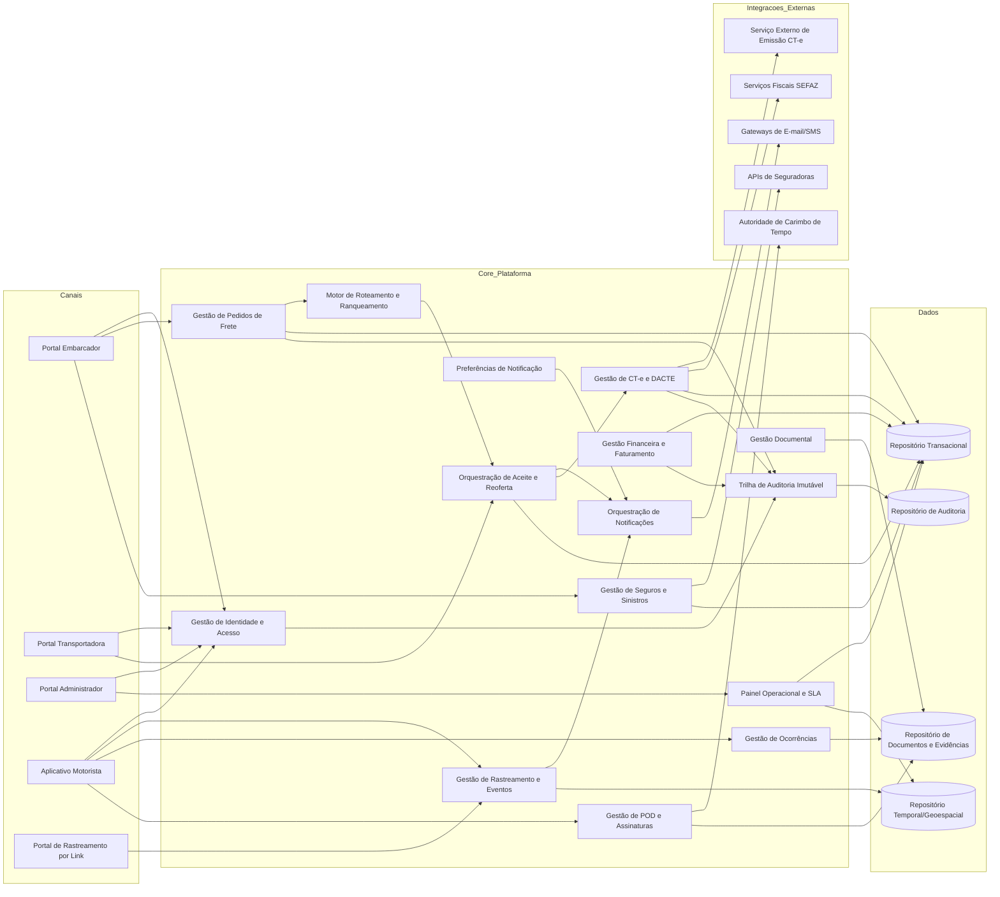
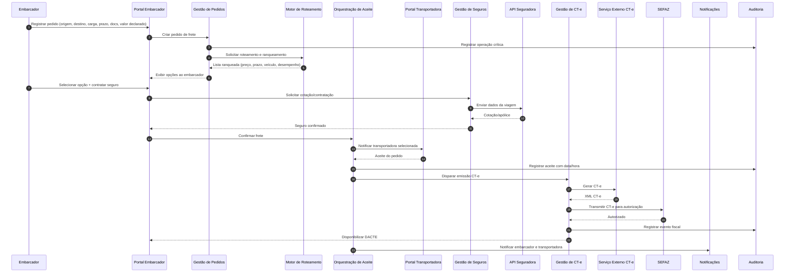
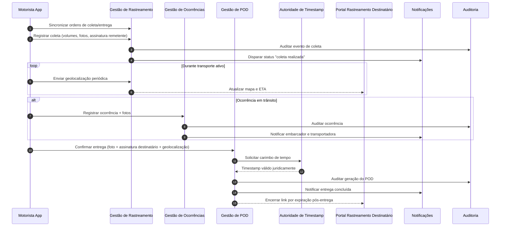

# Relatório Técnico de Arquitetura de Software

## 1. Identificação das HUs

Abaixo, a identificação consolidada das 14 histórias de usuário, com vínculo funcional e não funcional mais crítico para arquitetura.

| HU | Ator | Objetivo de Negócio | RF Principais | RNF Críticos |
|---|---|---|---|---|
| HU01 | Embarcador | Registrar pedido de frete com dados e documentos | RF05, RF06, RF09, RF10 | RNF13, RNF24 |
| HU02 | Embarcador | Selecionar transportadora ranqueada e contratar seguro | RF11, RF12, RF41, RF17 | RNF13, RNF24 |
| HU03 | Embarcador | Acompanhar fretes e obter POD | RF07, RF31, RF39 | RNF12, RNF15 |
| HU04 | Embarcador | Abrir e acompanhar sinistro | RF42, RF43, RF44 | RNF09, RNF24 |
| HU05 | Transportadora | Aceitar/recusar fretes e gerenciar frota | RF03, RF13, RF14, RF15 | RNF13, RNF25 |
| HU06 | Transportadora | Monitorar motoristas e ocorrências em tempo real | RF25, RF26, RF31, RF32 | RNF15, RNF16, RNF23 |
| HU07 | Transportadora | Consultar demonstrativo financeiro | RF48, RF45, RF46 | RNF11, RNF25 |
| HU08 | Motorista | Registrar coleta com evidências | RF23, RF24, RF26 | RNF17, RNF18, RNF21 |
| HU09 | Motorista | Registrar entrega com assinatura e POD | RF27, RF37, RF38, RF40 | RNF10, RNF17, RNF21 |
| HU10 | Motorista | Registrar ocorrência em trânsito | RF26, RF34, RF35 | RNF17, RNF15 |
| HU11 | Destinatário | Rastrear carga por link sem cadastro | RF30, RF31, RF32 | RNF05, RNF06, RNF12 |
| HU12 | Destinatário | Receber notificações e gerenciar preferências | RF33, RF31 | RNF12, RNF25 |
| HU13 | Administrador | Monitorar SLA e contingências | RF36, RF15, RF16 | RNF12, RNF25 |
| HU14 | Administrador | Monitorar painel financeiro consolidado | RF49, RF47, RF46 | RNF11, RNF25 |

---

## 2. Diagramas de Arquitetura (Mermaid)

### 2.1 Diagrama de Componentes (visão lógica)

### 2.2 Diagrama de Sequência — Contratação do Frete até CT-e autorizado

### 2.3 Diagrama de Sequência — Operação do Motorista, Rastreamento e POD

---

## 3. Decisões de Arquitetura

1. **Arquitetura modular por domínios de negócio**  
   Separação em contextos: Frete, Roteamento, Aceite, CT-e, Rastreamento, POD, Seguros/Sinistros, Financeiro, Notificação e Auditoria.  
   **Motivo:** alta coesão funcional e evolução independente (RF05–RF49).

2. **Orquestração de fluxos críticos com eventos de domínio**  
   Mudanças de status (coleta, trânsito, ocorrência, entrega, aceite, CT-e autorizado) disparam notificações e atualizações em cadeia.  
   **Motivo:** reduzir acoplamento e atender tempo real (RF31–RF36, RNF15, RNF16).

3. **Controle de acesso por perfil e políticas de autorização**  
   Perfis explícitos (embarcador, transportadora, motorista, destinatário, admin), com MFA onde exigido.  
   **Motivo:** RF01, RF02, RNF03, RNF06.

4. **Trilha de auditoria imutável para eventos críticos**  
   Registro de operações fiscais, financeiras e operacionais com retenção mínima regulatória.  
   **Motivo:** RF04, RNF11.

5. **Design offline-first no aplicativo do motorista**  
   Coleta local de eventos e sincronização confiável após reconexão.  
   **Motivo:** RF28, HU09, RNF17.

6. **Canal de rastreamento público com token de acesso limitado**  
   Link sem cadastro com escopo por frete e expiração controlada.  
   **Motivo:** RF30, HU11, RNF05.

7. **Camada de integração externa via contratos versionados**  
   Adaptadores independentes para SEFAZ, emissão CT-e, seguradoras, notificadores.  
   **Motivo:** RF17–RF22, RF41–RF44, RNF24.

8. **Persistência especializada por tipo de dado**  
   Dados transacionais, trilha fiscal/financeira imutável, documentos/evidências e séries temporais geoespaciais.  
   **Motivo:** RNF23, RNF22, RF44.

9. **Observabilidade orientada a SLA e negócio**  
   Métricas de latência de roteamento, taxa de aceite, integrações externas e risco de SLA.  
   **Motivo:** RNF25, HU13, HU14.

---

## 4. Tabela de Componentes e Rastreabilidade

| Componente | Responsabilidade Principal | Comunica-se com | Origem (HU / Critério de Aceite) |
|---|---|---|---|
| Gestão de Identidade e Acesso | Autenticação, MFA, autorização por perfil | Portais, App Motorista, Auditoria | HU01–HU14 / RNF03, RNF04 |
| Gestão de Usuários e Entidades Operacionais | Cadastro de usuários, motoristas, veículos e vínculos | IAM, Portal Transportadora, Repositório Transacional | HU05 / RF01, RF03 |
| Gestão de Pedidos de Frete | Criar, consultar e cancelar pedidos; anexar documentos | Portal Embarcador, Documentos, Roteamento, Auditoria | HU01, HU03 / RF05, RF07, RF08, RF09 |
| Motor de Roteamento e Ranqueamento | Filtrar elegibilidade e rankear transportadoras | Pedidos, Aceite, Índice de Desempenho | HU01, HU02 / RF10, RF11, RF12 |
| Orquestração de Aceite e Reoferta | Notificar, registrar aceite/recusa, escalonar próxima transportadora | Portal Transportadora, Notificações, CT-e | HU05 / RF13, RF14, RF15 |
| Gestão de Desempenho de Transportadoras | Calcular índice de performance contínuo | Roteamento, Painel Admin | HU02, HU13 / RF16 |
| Gestão de CT-e e DACTE | Validar NF-e, emitir/transmitir CT-e, contingência, cancelamento/inutilização, disponibilizar DACTE | Serviço CT-e, SEFAZ, Pedidos, Auditoria | HU02 / RF17–RF22 |
| Gestão de Rastreamento e ETA | Receber posições, calcular ETA, expor histórico e mapa | App Motorista, Portal Destinatário, Notificações | HU06, HU11 / RF25, RF31, RF32 |
| Gestão de Ocorrências | Registrar ocorrências operacionais com evidências | App Motorista, Notificações, Sinistros | HU10 / RF26 |
| Gestão de POD e Assinaturas | Gerar POD com assinatura, foto, geolocalização e timestamp | App Motorista, Timestamp, Documentos, Notificações | HU09 / RF37, RF38, RF39, RF40 |
| Gestão de Seguros e Sinistros | Cotação/contratação e abertura/acompanhamento de sinistro | APIs Seguradoras, Pedidos, Ocorrências, Documentos | HU02, HU04 / RF41–RF44 |
| Gestão Financeira e Faturamento | Cálculo de frete, comissão, fatura embarcador, repasse transportadora, painel financeiro | Pedidos, Aceite, Admin, Auditoria | HU07, HU14 / RF45–RF49 |
| Orquestração de Notificações | Envio de e-mail/SMS por evento e perfil | Rastreamento, Aceite, Ocorrências, POD, Gateways | HU12 / RF33–RF36 |
| Gestão de Preferências de Notificação | Preferências de canal por destinatário | Portal Rastreamento, Notificações | HU12 / critério “gerenciar preferências” |
| Painel Operacional e SLA | Alertas de SLA em risco e pedidos sem aceite | Rastreamento, Aceite, Admin | HU13 / RF36 |
| Gestão Documental e Evidências | Armazenar NF-e, fotos, BO, laudos, POD, DACTE | Pedidos, Ocorrências, POD, Sinistros | HU01, HU04, HU09 / RF09, RF44 |
| Trilha de Auditoria Imutável | Log inviolável de operações críticas | Todos domínios críticos | HU13, HU14 / RF04, RNF11 |

---

## 5. Bloqueios e Pendências

| Tema | Pendência | Impacto Arquitetural | Ação Recomendada |
|---|---|---|---|
| Política de cancelamento (RF08) | Regras não detalhadas (janela, multas, exceções) | Fluxo de estado de pedido e faturamento pode divergir | Definir matriz de políticas por perfil/etapa |
| Critérios e pesos de ranqueamento (RF11/RF12) | Não há fórmula oficial nem governança de alteração | Resultado pode ser contestado por parceiros | Formalizar política versionada e auditável |
| Contingência CT-e (RF19) | Sem critérios de entrada/saída do modo contingência | Risco fiscal e retrabalho de reconciliação | Definir playbook fiscal-operacional |
| Validade jurídica da assinatura (RNF10) | Tipo de assinatura eletrônica não explicitado por cenário | Risco de questionamento jurídico do POD | Validar com jurídico e mapear níveis de assinatura |
| Preferências do destinatário (HU12) | Sem definição de UX e confirmação de consentimento | Risco LGPD/comunicação indevida | Especificar fluxo de consentimento e opt-out |
| Contato direto com motorista (HU06/HU13) | Canal de contato não definido | Pode expor dados pessoais sensíveis | Definir mediação de contato e políticas de privacidade |
| SLA “em risco” (HU13) | Regra de risco não formalizada | Alertas falsos positivos/negativos | Definir algoritmo e limiares por rota/tipo de carga |
| Exportações financeiras (HU07/HU14) | Escopo e segurança dos arquivos não detalhados | Risco de vazamento e inconsistência contábil | Definir layout, trilha de exportação e controle de acesso |

---

## 6. Cobertura de Requisitos

### 6.1 Cobertura de RF (por blocos)

| Bloco RF | Cobertura Arquitetural | Componentes-chave | Status |
|---|---|---|---|
| RF01–RF04 (Usuários/Acesso/Auditoria) | Perfis, autorização, logs imutáveis | IAM, Gestão de Usuários, Auditoria | Coberto |
| RF05–RF09 (Pedidos de Frete) | Registro, valor declarado, documentos, cancelamento | Pedidos, Documental, Auditoria | Coberto (política RF08 pendente) |
| RF10–RF16 (Roteamento/Aceite) | Match, ranking, notificação, reoferta, desempenho | Roteamento, Aceite, Notificação, Desempenho | Coberto |
| RF17–RF22 (CT-e) | Emissão, validação NF-e, transmissão, contingência, DACTE | Gestão CT-e, Integrações fiscais | Coberto (detalhes contingência pendentes) |
| RF23–RF29 (Operação Motorista) | Ordens, coleta/entrega, geolocalização, offline, rotas | App Motorista, Rastreamento, POD, Ocorrências | Coberto |
| RF30–RF32 (Rastreamento) | Link público tokenizado, histórico e ETA | Portal Rastreamento, Rastreamento | Coberto |
| RF33–RF36 (Notificações/Alertas) | Notificações multicanal e alertas administrativos | Notificações, SLA | Coberto |
| RF37–RF40 (POD) | Geração jurídica de comprovante e recusa com evidências | POD, Timestamp, Documental | Coberto |
| RF41–RF44 (Seguro/Sinistro) | Cotação, contratação, abertura e acompanhamento | Seguros/Sinistros, Documental | Coberto |
| RF45–RF49 (Financeiro) | Cálculo de frete, comissão, faturamento e painéis | Financeiro, Auditoria, Admin | Coberto |

### 6.2 Cobertura de RNF (resumo)

| RNF | Diretriz Arquitetural de Atendimento | Status |
|---|---|---|
| RNF01–RNF06 (Segurança) | Criptografia em trânsito/repouso, MFA, tokenização de link, autorização contextual por frete | Coberto |
| RNF07–RNF11 (Conformidade) | Camada fiscal versionada, trilha imutável, LGPD, timestamp jurídico | Coberto (detalhes legais pendentes) |
| RNF12–RNF17 (Disponibilidade/Performance/Resiliência) | Processamento assíncrono orientado a eventos, monitoração de SLA, offline-first | Coberto |
| RNF18–RNF21 (Usabilidade/Compatibilidade) | Requisitos de UX mobile e web responsivo incorporados em diretrizes de canal | Parcial (depende de design de interface) |
| RNF22–RNF25 (Infraestrutura/Dados) | Estratégia de backup, repositório geoespacial temporal, APIs versionadas, observabilidade | Coberto |

---

## 7. Gap Analysis

| Lacuna | Impacto | Risco | Recomendação |
|---|---|---|---|
| Modelo de estados do frete não formalizado ponta a ponta | Inconsistência entre módulos (pedido, aceite, CT-e, rastreamento, POD, financeiro) | Alto | Definir máquina de estados canônica com transições válidas e eventos |
| Política de exceções operacionais (roubo, avaria grave, recusa, devolução) incompleta | Fluxos de sinistro, financeiro e SLA podem divergir | Alto | Especificar fluxos de exceção e responsabilidades por perfil |
| Sem SLA interno por integração externa (SEFAZ/seguradoras/notificação) | Dificulta cumprir RNF12/RNF14 com previsibilidade | Médio/Alto | Definir contratos de tempo, retentativas e fallback por integração |
| Governança de dados LGPD não detalhada (retenção, anonimização, base legal) | Exposição regulatória | Alto | Criar matriz de dados pessoais + políticas de retenção/expurgo |
| Critérios de ETA e recalculo dinâmico não especificados | Pode comprometer HU11/HU12 e alertas de SLA | Médio | Definir algoritmo de ETA, qualidade de dados e frequência de atualização |
| Regras contábeis/fiscais da comissão e inadimplência pouco detalhadas | Divergência de faturamento e repasse | Médio | Formalizar regras financeiras versionadas e auditáveis |
| Estratégia de reconciliação offline do app não detalhada | Possível duplicidade/perda lógica de eventos | Alto | Definir idempotência, ordenação e resolução de conflitos na sincronização |

**Conclusão:** a arquitetura proposta cobre integralmente os domínios funcionais e não funcionais do lote, com riscos concentrados em **regras de negócio ainda abertas** (fiscal, jurídico, financeiro e exceções operacionais). A próxima etapa recomendada é um **refinamento de requisitos orientado a estados, políticas e contratos operacionais** para reduzir ambiguidade antes da construção.