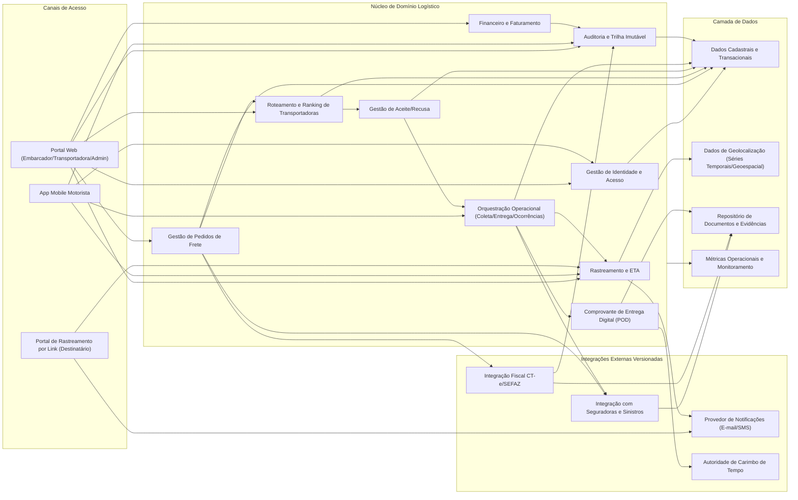
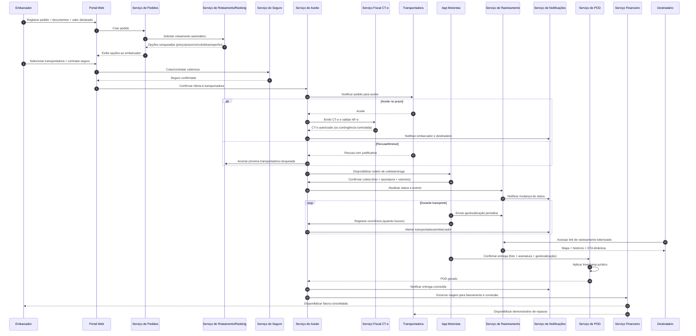

# Relatório Técnico de Arquitetura de Software

## 1. Identificação das HUs

### 1.1 Visão consolidada de atores e objetivos
- **Embarcador (HU01–HU04)**: abrir e gerir fretes, selecionar transportadora, contratar seguro, acompanhar operação, receber POD, abrir sinistro.
- **Transportadora (HU05–HU07)**: aceitar/recusar fretes, gerir frota e motoristas, monitorar operação em tempo real, conciliar repasses.
- **Motorista (HU08–HU10)**: executar coleta/entrega com evidências, registrar ocorrências, operar offline com sincronização posterior.
- **Destinatário (HU11–HU12)**: rastrear sem cadastro via link tokenizado e receber notificações multicanal.
- **Administrador (HU13–HU14)**: monitorar SLA/contingência e saúde financeira da plataforma.

### 1.2 Mapeamento funcional por jornada
1. **Jornada Comercial/Operacional de Frete**
   - HU01, HU02, HU05, HU08, HU09, HU10, HU11, HU12, HU13
2. **Jornada Fiscal/Regulatória**
   - HU02 (disparo CT-e), HU03 (POD), HU09 (validade jurídica), HU13 (contingência operacional)
3. **Jornada de Pós-entrega e Financeiro**
   - HU03, HU04, HU07, HU14

### 1.3 Observações arquiteturais iniciais
- Forte orientação a **eventos de domínio** (mudança de status, ocorrência, aceite/recusa, emissão fiscal, entrega).
- Necessidade de **controle de acesso por perfil** e rastreabilidade/auditoria imutável.
- Dependência relevante de integrações externas (SEFAZ, seguradoras, canais de notificação).

---

## 2. Diagramas de Arquitetura (Mermaid)

### 2.1 Diagrama de Componentes (alto nível)

### 2.2 Diagrama de Sequência (fluxo ponta a ponta com aceite, execução e fechamento)

---

## 3. Decisões de Arquitetura

1. **Arquitetura modular por domínios de negócio**  
   Separação em contextos: Identidade, Pedidos, Roteamento, Operação, Fiscal, Rastreamento, Seguro/Sinistro, Financeiro, Notificações, Auditoria.  
   - Suporta RF01–RF49 e reduz acoplamento para RNF25.

2. **Integrações externas por contratos versionados**  
   Adaptadores versionados para SEFAZ/CT-e, seguradoras e notificações, com isolamento de mudanças externas.  
   - Atende RNF24, RF17–RF22, RF41–RF44.

3. **Modelo orientado a eventos de status logístico**  
   Cada mudança relevante gera evento auditável (coleta, em trânsito, ocorrência, entrega etc.).  
   - Fundamenta RF31–RF36, RF37–RF40, RNF11.

4. **Controle de acesso robusto com RBAC + políticas contextuais**  
   Permissões por perfil e por vínculo ao frete (incluindo rastreamento tokenizado do destinatário).  
   - Atende RF02, RNF03, RNF05, RNF06, LGPD (RNF09).

5. **Operação offline-first no app do motorista**  
   Captura local de eventos críticos com fila de sincronização, idempotência e resolução de conflitos.  
   - Atende RF28, HU09/HU10, RNF17.

6. **Camada de rastreamento otimizada para geodados temporais**  
   Separação lógica entre transacional de negócios e dados massivos de posição/telemetria.  
   - Atende RNF16, RNF23, RF25, RF30–RF32.

7. **Auditoria imutável e trilha fiscal/financeira de longo prazo**  
   Registro inviolável das operações críticas com retenção mínima exigida.  
   - Atende RF04, RNF11.

8. **Orquestração de SLA e contingência operacional**  
   Monitoramento de aceite, risco de atraso e regras de escalonamento manual/automático.  
   - Atende RF15, RF36, HU13, RNF12–RNF15.

9. **Conformidade jurídica embutida em CT-e e POD**  
   Validação de schema vigente, modalidades fiscais e timestamp jurídico no POD.  
   - Atende RNF07, RNF08, RNF10, RF17–RF22, RF38.

---

## 4. Tabela de Componentes e Rastreabilidade

| Componente | Responsabilidade Principal | Comunica-se com | Origem (HU / Critério de Aceite) |
|---|---|---|---|
| Gestão de Identidade e Acesso | Autenticação, MFA, sessão, autorização por perfil e contexto do frete | Portais, App Motorista, serviços de domínio | HU01–HU14; RF01, RF02; RNF03, RNF04, RNF05, RNF06 |
| Cadastro de Transportadora/Frota | Gestão de motoristas e veículos vinculados | Identidade, Operação, Pedidos | HU05, HU06; RF03 |
| Gestão de Pedidos de Frete | Criação, edição, cancelamento e status consolidado do pedido | Roteamento, Seguro, Fiscal, Notificação, Auditoria | HU01, HU03; RF05–RF09 |
| Gestão Documental de Carga | Upload/armazenamento de NF-e e documentos especiais | Pedidos, Fiscal, Sinistro | HU01, HU04; RF09, RF20, RF44 |
| Roteamento e Ranking | Seleção automática e ranking de transportadoras por critérios configuráveis | Pedidos, Aceite, Métricas | HU02, HU05; RF10–RF12, RF16, RNF13 |
| Gestão de Aceite/Recusa | Janela de aceite, recusa com motivo, fallback para próxima opção | Roteamento, Transportadora, Notificação | HU05; RF13–RF15 |
| Integração Fiscal CT-e/SEFAZ | Validação NF-e, emissão, transmissão, contingência, cancelamento, DACTE | Pedidos, Documentos, Auditoria | HU02; RF17–RF22; RNF07, RNF08, RNF14 |
| Orquestração Operacional | Ordens diárias de coleta/entrega, status operacional | App Motorista, Rastreamento, POD, Notificação | HU08–HU10; RF23, RF24, RF26, RF27, RF29 |
| Captura Offline e Sincronização | Persistir eventos offline e sincronizar sem perda | App Motorista, Orquestração, Rastreamento | HU09, HU10; RF28; RNF17 |
| Rastreamento e ETA | Mapa em tempo real, histórico de eventos, previsão dinâmica | App Motorista, Portal Destinatário, Notificação | HU11, HU12, HU06; RF25, RF30–RF32; RNF15, RNF16, RNF23 |
| Notificações Multicanal | Disparo de alertas por status/evento e preferências do destinatário | Pedidos, Aceite, Rastreamento, Sinistro | HU12, HU13; RF33–RF36 |
| POD Digital | Geração de comprovante com evidências e assinatura + timestamp | App Motorista, Documentos, Notificações | HU03, HU09; RF37–RF40; RNF10, RNF21 |
| Seguros e Sinistros | Cotação/contratação por viagem e gestão de sinistro | Pedidos, Ocorrências, Documentos, Notificações | HU02, HU04; RF41–RF44 |
| Financeiro e Faturamento | Cálculo do frete, comissão, faturas, repasse e painel financeiro | Pedidos, POD, Auditoria | HU07, HU14; RF45–RF49 |
| Auditoria Imutável | Registro de operações críticas com retenção legal | Todos os serviços centrais | HU13, HU14; RF04; RNF11 |
| Observabilidade e Métricas | Painéis de latência, aceitação, SLA, disponibilidade de integrações | Todos os serviços e admin | HU13, HU14; RNF25, RNF12 |

---

## 5. Bloqueios e Pendências

1. **Política de cancelamento (RF08)**: regras exatas de multa, janela temporal e exceções não detalhadas.
2. **Critérios e pesos de ranking (RF11/RF12)**: falta definição formal de pesos, desempate e governança de alteração.
3. **Regras de timeout de aceite (RF15)**: valores por tipo de frete/rota não definidos.
4. **Regras de ETA dinâmica (RF32/HU11)**: fórmula e variáveis obrigatórias não especificadas.
5. **Lista padronizada de motivos de recusa/ocorrência (RF14/RF26/RF40)**: dicionário de dados pendente.
6. **Detalhes jurídicos de assinatura/timestamp (RNF10/RF38)**: grau de assinatura exigido por caso de uso.
7. **Regras fiscais avançadas de CT-e (RNF08)**: cenários de substituição/anulação por UF precisam detalhamento.
8. **Política de retenção LGPD vs. retenção fiscal (RNF09/RNF11)**: necessidade de matriz de retenção por tipo de dado.
9. **Inadimplência e conciliação financeira (RF49)**: critérios de “inadimplência” não formalizados.
10. **Contato direto com motorista (HU06)**: canal funcional (somente registro ou comunicação síncrona) não definido.

---

## 6. Cobertura de Requisitos

### 6.1 Cobertura de RF (resumo por domínio)

| Bloco | RFs | Cobertura Arquitetural |
|---|---|---|
| Usuários e acesso | RF01–RF04 | Coberto por Gestão de Identidade, Cadastro de Frota, Auditoria |
| Pedidos de frete | RF05–RF09 | Coberto por Gestão de Pedidos + Gestão Documental |
| Roteamento/seleção | RF10–RF16 | Coberto por Roteamento, Aceite/Recusa, Métricas |
| CT-e | RF17–RF22 | Coberto por Integração Fiscal + Gestão Documental + Auditoria |
| Operação motorista | RF23–RF29 | Coberto por Orquestração Operacional + Offline/Sincronização |
| Rastreamento | RF30–RF32 | Coberto por Rastreamento/ETA + Portal por token |
| Notificações | RF33–RF36 | Coberto por Notificações Multicanal + Monitor SLA |
| POD | RF37–RF40 | Coberto por POD Digital + Documentos |
| Seguros/sinistros | RF41–RF44 | Coberto por Seguros e Sinistros |
| Financeiro | RF45–RF49 | Coberto por Financeiro/Faturamento + Auditoria |

### 6.2 Cobertura de RNF (resumo)

| Categoria | RNFs | Cobertura Arquitetural |
|---|---|---|
| Segurança | RNF01–RNF06 | Canal seguro, criptografia em repouso, MFA, sessão móvel, token de rastreio, autorização contextual |
| Conformidade | RNF07–RNF11 | Módulo fiscal versionado, trilha imutável, controles LGPD, POD com validade jurídica |
| Dispon./Desemp. | RNF12–RNF17 | Monitoramento SLA, desenho escalável para geolocalização, fluxo offline-first |
| Usabilidade/Compat. | RNF18–RNF21 | Requisitos direcionadores para UX móvel e web responsiva (dependente de design de interface) |
| Infraestrutura/Dados | RNF22–RNF25 | Estratégia de backup/retensão, separação lógica de geodados, contratos versionados, observabilidade |

**Status geral:** cobertura arquitetural **alta**, com pendências de parametrização de negócio e detalhamento regulatório (ver Seções 5 e 7).

---

## 7. Gap Analysis

| Lacuna | Impacto Arquitetural | Ação Recomendada |
|---|---|---|
| Ausência de política detalhada de cancelamento (RF08) | Regras inconsistentes entre portal, financeiro e auditoria | Definir matriz de cancelamento por etapa do frete e impacto financeiro |
| Pesos de ranking não definidos (RF11) | Resultado de seleção pode ser contestável/auditável de forma insuficiente | Criar política versionada de ranking com trilha de alterações |
| Sem SLA por tipo de rota/carga | Dificulta alertas de risco e priorização operacional (HU13) | Definir catálogo de SLA por perfil de operação |
| Contingência CT-e pouco detalhada (RF19) | Risco de não conformidade fiscal em indisponibilidade externa | Especificar fluxos de contingência, reconciliação e prazos por cenário |
| Regras de retenção de dados pessoais vs fiscais | Risco LGPD/contábil por retenção inadequada | Elaborar política de retenção e anonimização por classe de dado |
| Canal de contato com motorista indefinido (HU06) | Ambiguidade de escopo e impacto em segurança/compliance | Delimitar MVP: contato indireto por ocorrência ou comunicação direta |
| Critérios de inadimplência sem definição (RF49) | Painel financeiro inconsistente | Definir evento gerador, aging e tratamento de exceções |
| Governança de templates de notificação | Mensagens inconsistentes e risco legal/comercial | Catálogo de notificações com versionamento, aprovação e auditoria |
| Sincronização offline sem política de conflito | Risco de duplicidade/ordem incorreta de eventos | Definir estratégia de idempotência, ordenação e reconciliação de eventos |

**Conclusão de Gap:** o desenho arquitetural está apto para implementação incremental, porém depende de **refino de regras de negócio parametrizáveis** e **detalhamento regulatório/fiscal** para reduzir risco de retrabalho em fases avançadas.