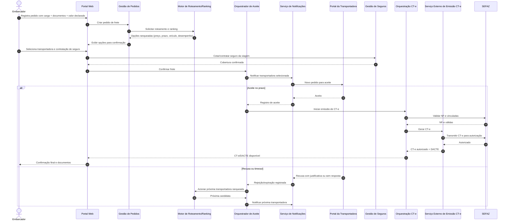

# Relatório Técnico de Arquitetura de Software

## 1. Identificação das HUs

### 1.1 Visão por domínio funcional

| Domínio | HUs | Objetivo arquitetural |
|---|---|---|
| Gestão de Frete (Embarcador) | HU01, HU02, HU03, HU04 | Registrar pedido, selecionar transportadora, contratar seguro, acompanhar execução, abrir sinistro |
| Operação da Transportadora | HU05, HU06, HU07 | Aceite/recusa, monitoramento operacional em tempo real, conciliação financeira |
| Operação do Motorista | HU08, HU09, HU10 | Coleta/entrega com evidência jurídica, ocorrências, operação offline |
| Experiência do Destinatário | HU11, HU12 | Rastreamento público por link seguro e notificações multicanal |
| Governança da Plataforma | HU13, HU14 | Monitoramento de SLA/contingências e painel financeiro consolidado |

### 1.2 Atores e fronteiras

- **Atores autenticados:** embarcador, transportadora, motorista, administrador (RF01, RF02, RNF03, RNF04).
- **Ator sem cadastro:** destinatário via link tokenizado (RF30, RNF05).
- **Sistemas externos:** SEFAZ, serviço de emissão CT-e, seguradoras, serviços de comunicação (e-mail/SMS), carimbo de tempo jurídico.

### 1.3 Macrofluxos críticos identificados

1. **Pedido → Roteamento → Aceite → CT-e** (HU01, HU02, HU05; RF05–RF22).  
2. **Execução logística com telemetria e offline** (HU08–HU10; RF23–RF32; RNF15–RNF17).  
3. **Entrega com POD jurídico e rastreabilidade** (HU03, HU09, HU11; RF37–RF40; RNF10).  
4. **Sinistro e ciclo de seguro** (HU04; RF41–RF44).  
5. **Fechamento financeiro e governança operacional** (HU07, HU13, HU14; RF45–RF49; RNF25).

---

## 2. Diagramas de Arquitetura (Mermaid)

### 2.1 Diagrama de componentes (visão lógica)

```mermaid
flowchart LR
    A[Portal Web\nEmbarcador/Transportadora/Admin]
    B[App Mobile Motorista]
    C[Portal de Rastreamento\nDestinatário (link tokenizado)]

    subgraph Core[Plataforma Logística - Núcleo]
        I[Gestão de Identidade e Acesso]
        P[Gestão de Pedidos de Frete]
        R[Motor de Roteamento e Ranking]
        O[Orquestrador de Aceite]
        T[Gestão Operacional de Viagem]
        G[Serviço de Geolocalização e ETA]
        E[Gestão de Eventos e Ocorrências]
        D[Gestão Documental e Evidências]
        CTE[Orquestração Fiscal CT-e]
        POD[Serviço de POD e Assinatura]
        S[Gestão de Seguros e Sinistros]
        F[Financeiro e Faturamento]
        N[Notificações]
        M[Monitoramento e SLA]
        AU[Auditoria Imutável]
    end

    subgraph EXT[Ecossistema Externo]
        X1[SEFAZ]
        X2[Serviço de Emissão CT-e]
        X3[Seguradoras Parceiras]
        X4[Canais de E-mail/SMS]
        X5[Serviço de Carimbo de Tempo]
    end

    A --> I
    B --> I
    C --> N

    A --> P
    P --> R
    R --> O
    O --> N
    O --> CTE
    CTE --> X2
    CTE --> X1

    B --> T
    T --> E
    T --> G
    T --> D
    T --> POD
    POD --> X5

    A --> S
    S --> X3
    S --> D

    A --> F
    F --> AU
    CTE --> AU
    P --> AU
    T --> AU
    S --> AU

    G --> C
    E --> N
    N --> X4
    M --> A
    M --> N
```

### 2.2 Diagrama de sequência — fluxo principal de contratação e emissão fiscal



---

## 3. Decisões de Arquitetura

| ID | Decisão | Motivação | Consequências |
|---|---|---|---|
| DA-01 | Arquitetura modular por capacidades de negócio | Alto acoplamento funcional (fiscal, rastreamento, financeiro, seguros) exige separação clara | Evolução independente, rastreabilidade por domínio |
| DA-02 | Orquestração assíncrona de eventos críticos (status, geolocalização, ocorrências, notificações) | Baixa latência e escala para RNF15/RNF16 | Consistência eventual em painéis; necessidade de idempotência |
| DA-03 | Controle de acesso baseado em perfil + escopo por frete | Múltiplos perfis e restrição de dados sensíveis (RNF06, RNF09) | Políticas de autorização granulares por recurso |
| DA-04 | Canal público de rastreio com token de acesso temporário | Acesso sem cadastro ao destinatário (RF30, RNF05) | Gestão de expiração/revogação de token |
| DA-05 | Camada de integração externa por contratos versionados | RNF24 exige desacoplamento com SEFAZ/seguradoras/CT-e | Menor impacto em mudanças de parceiros e leiautes |
| DA-06 | Persistência especializada para telemetria e trilha transacional/fiscal | RNF23 + RNF11 | Estratégia de dados híbrida e governança de retenção |
| DA-07 | Modo offline first no app do motorista com sincronização confiável | RNF17 e RF28 | Fila local, reconciliação de conflitos e ordenação temporal |
| DA-08 | Trilha de auditoria imutável para operações críticas | RF04, RNF11 | Maior custo de armazenamento, mas garante conformidade |
| DA-09 | Serviço de POD com assinatura e timestamp jurídico | RF37–RF39 e RNF10 | Necessidade de validação legal e preservação de evidências |
| DA-10 | Observabilidade operacional com métricas de negócio e técnica | RNF25, HU13, HU14 | Resposta proativa a SLA em risco |

---

## 4. Tabela de Componentes e Rastreabilidade

| Componente | Responsabilidade Principal | Comunica-se com | Origem (HU / Critério de Aceite) |
|---|---|---|---|
| Gestão de Identidade e Acesso | Autenticação, MFA, autorização por perfil e escopo | Portais, App Motorista, Auditoria | HU05, HU13 / RF01, RF02, RNF03, RNF04 |
| Gestão de Pedidos de Frete | Cadastro/consulta/cancelamento de pedidos e documentos | Portal Web, Roteamento, Documentos, Auditoria | HU01, HU03 / RF05–RF09 |
| Motor de Roteamento e Ranking | Elegibilidade e ranking por critérios configuráveis | Pedidos, Orquestrador de Aceite, Monitoramento | HU01, HU02 / RF10–RF12, RNF13 |
| Orquestrador de Aceite | Ciclo de oferta, aceite/recusa, timeout e fallback | Roteamento, Notificações, CT-e | HU05 / RF13–RF15 |
| Gestão de Desempenho de Transportadora | Cálculo contínuo de índice de desempenho | Operação, Financeiro, Roteamento | HU02 / RF16 |
| Orquestração Fiscal CT-e | Validação NF-e, emissão, transmissão, contingência, cancelamento/inutilização, DACTE | SEFAZ, serviço emissor, Portal | HU02 / RF17–RF22, RNF07, RNF08, RNF14 |
| Operação do Motorista | Ordens de coleta/entrega, execução de etapas | App Motorista, Geolocalização, POD, Ocorrências | HU08, HU09, HU10 / RF23, RF24, RF27, RF29 |
| Serviço de Geolocalização e ETA | Ingestão de posições, cálculo ETA, histórico geoespacial | App Motorista, Rastreamento, Monitoramento | HU06, HU11 / RF25, RF31, RF32, RNF15, RNF23 |
| Gestão de Ocorrências | Registro categorizado com evidências e alertas | Operação, Notificações, Sinistros | HU10 / RF26, RF40 |
| Portal de Rastreamento do Destinatário | Exposição de mapa, eventos e preferências de notificação via link | Geolocalização, Notificações | HU11, HU12 / RF30–RF33, RNF05 |
| Serviço de Notificações | Disparo e gestão de preferências por evento | Todos os domínios + canais externos | HU12, HU13 / RF33–RF36 |
| Serviço de POD e Assinatura | Consolidação de evidências de entrega com timestamp jurídico | Operação, Documentos, Portal, serviço de timestamp | HU03, HU09 / RF37–RF39, RNF10, RNF21 |
| Gestão de Seguros e Sinistros | Cotação/contratação de seguro e abertura/acompanhamento de sinistro | Seguradoras, Ocorrências, Documentos, Notificações | HU02, HU04 / RF41–RF44 |
| Financeiro e Faturamento | Cálculo de frete, comissão, faturas, repasse e painel | Pedidos, Operação, Auditoria, Portal Admin | HU07, HU14 / RF45–RF49 |
| Auditoria Imutável | Registro inviolável de operações críticas | Todos os componentes críticos | HU13 / RF04, RNF11 |
| Monitoramento e SLA | Métricas operacionais, risco de atraso, alertas de contingência | Geolocalização, Aceite, Notificações, Admin | HU13 / RF36, RNF12, RNF25 |

---

## 5. Bloqueios e Pendências

1. **Política de cancelamento (RF08):** regras não detalhadas (janela, multa, exceções).  
2. **Critérios de ranking (RF11/RF12):** faltam pesos, algoritmo de desempate e governança de configuração.  
3. **Contingência CT-e (RF19):** fluxo operacional e gatilhos de entrada/saída não especificados.  
4. **Assinatura digital no POD (RF38/RNF10):** tipo de assinatura eletrônica e cadeia de validação jurídica precisam definição formal.  
5. **Recálculo de ETA (RF32):** não há regra de cálculo (trânsito, parada, janelas de entrega).  
6. **Preferências de notificação do destinatário (HU12):** política de opt-in/opt-out e prova de consentimento LGPD pendente.  
7. **Contato transportadora ↔ motorista (HU06):** canal funcional existe, mas falta definição de auditoria e retenção dessa comunicação.  
8. **Inadimplência (RF49/HU14):** ausência de regra de cálculo e origem dos dados financeiros de cobrança.

---

## 6. Cobertura de Requisitos

### 6.1 Cobertura funcional (RF)

| Bloco RF | Cobertura arquitetural |
|---|---|
| RF01–RF04 | Gestão de Identidade e Acesso + Auditoria Imutável |
| RF05–RF09 | Gestão de Pedidos + Gestão Documental |
| RF10–RF16 | Motor de Roteamento/Ranking + Orquestrador de Aceite + Desempenho de Transportadora |
| RF17–RF22 | Orquestração Fiscal CT-e + Integração SEFAZ/Emissor |
| RF23–RF29 | Operação do Motorista + Geolocalização/ETA + Modo Offline |
| RF30–RF32 | Portal de Rastreamento + Geolocalização/ETA |
| RF33–RF36 | Serviço de Notificações + Monitoramento/SLA |
| RF37–RF40 | Serviço de POD + Ocorrências + Evidências |
| RF41–RF44 | Gestão de Seguros e Sinistros |
| RF45–RF49 | Financeiro e Faturamento + Painel Administrativo |

### 6.2 Cobertura não funcional (RNF)

| Bloco RNF | Cobertura arquitetural |
|---|---|
| RNF01–RNF06 | Segurança transversal: criptografia em trânsito/repouso, MFA, tokens temporários, autorização por escopo |
| RNF07–RNF11 | Compliance fiscal, LGPD, assinatura eletrônica, auditoria com retenção |
| RNF12–RNF17 | Alta disponibilidade, baixa latência, escala de telemetria, resiliência offline |
| RNF18–RNF21 | UX mobile de campo, compatibilidade web/mobile, fluxo de entrega simplificado |
| RNF22–RNF25 | Backup/RPO, armazenamento geoespacial temporal, integração versionada, observabilidade |

**Status geral:** arquitetura proposta cobre integralmente os requisitos RF/RNF em nível de desenho lógico; pendências da Seção 5 afetam detalhamento de implementação e critérios de aceite testáveis.

---

## 7. Gap Analysis

| Lacuna | Impacto arquitetural | Ação recomendada | Prioridade |
|---|---|---|---|
| Regras de negócio de cancelamento e multas não formalizadas | Inconsistência entre embarcador/transportadora e risco financeiro | Especificar matriz de políticas por estágio do frete | Alta |
| Falta de especificação de algoritmo de ranking | Decisão opaca e possível contestação comercial | Definir modelo de score versionado + explicabilidade do ranking | Alta |
| Jornada de contingência CT-e incompleta | Risco regulatório/fiscal em indisponibilidade externa | Modelar fluxos de contingência e reconciliação obrigatória | Alta |
| Requisitos jurídicos da assinatura eletrônica sem detalhamento técnico-jurídico | POD pode perder força probatória | Definir padrão de assinatura, evidências e validação temporal | Alta |
| Sem política explícita de retenção e anonimização LGPD por tipo de dado | Exposição regulatória e sobrecusto de armazenamento | Criar política de ciclo de vida de dados pessoais e sensíveis | Média |
| Métricas de SLA “em risco” sem fórmula | Alertas inconsistentes para operação/admin | Definir indicadores, limiares e janela de cálculo | Média |
| Escopo do módulo de comunicação em incidente crítico | Perda de rastreabilidade em ações emergenciais | Incluir requisitos de trilha auditável para comunicações operacionais | Média |
| Modelo de inadimplência não especificado | Painel financeiro pode divergir da realidade contábil | Definir eventos financeiros fonte e regra de reconhecimento | Média |

---

Se quiser, posso gerar uma **versão 2** deste relatório com:
- matriz HU → RF/RNF detalhada item a item,
- contratos conceituais de API por componente,
- e plano de testes de arquitetura (desempenho, resiliência, conformidade).