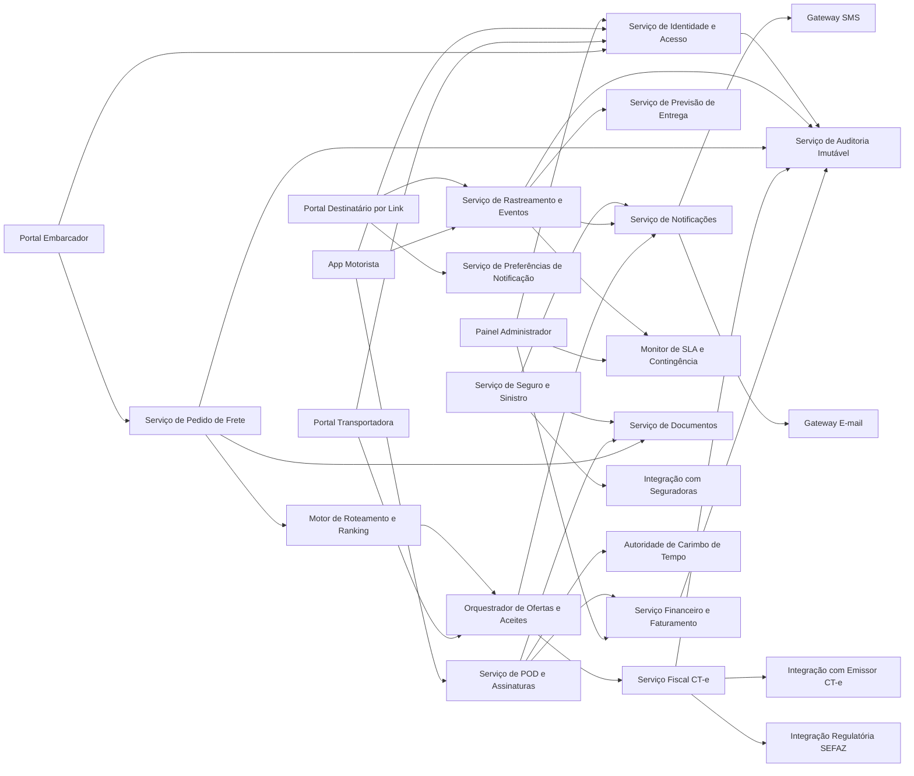
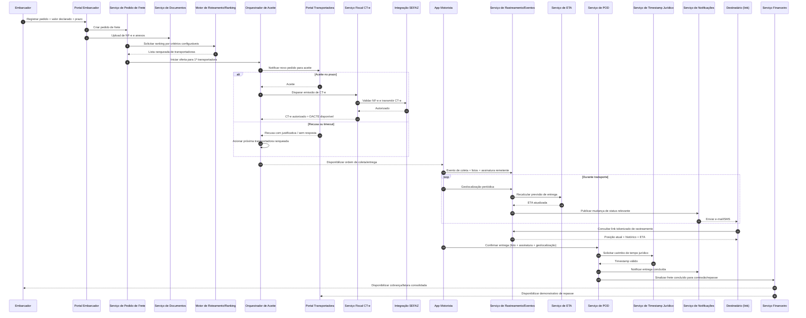

# Relatório Técnico de Arquitetura de Software

## 1. Identificação das HUs

### 1.1 Escopo funcional consolidado por domínio

| Domínio | HUs | Objetivo de negócio |
|---|---|---|
| Cadastro, Identidade e Acesso | HU05 (parcial), HU13 (parcial) | Governar perfis, autenticação, autorização e trilha de auditoria. |
| Pedido de Frete e Orquestração | HU01, HU02, HU05 | Registrar pedido, ranquear transportadoras, aceitar/recusar, reoferta automática. |
| Operação de Transporte (Motorista) | HU08, HU09, HU10 | Coleta/entrega com evidências, ocorrências, operação offline e sincronização. |
| Rastreamento e Experiência do Destinatário | HU11, HU12 | Rastreamento em tempo real sem cadastro, histórico, ETA dinâmico e notificações. |
| Fiscal (CT-e) | HU02 (disparo), HU13 (monitoramento) | Emissão/autorização/cancelamento/inutilização com conformidade regulatória. |
| Seguro e Sinistro | HU02 (contratação), HU04 | Cotação/contratação por viagem, abertura e acompanhamento de sinistro. |
| Financeiro e Repasse | HU07, HU14 | Comissão da plataforma, fatura embarcador, demonstrativo transportadora, painel financeiro. |
| Monitoramento Operacional e SLA | HU03 (status consolidado), HU06, HU13 | Visibilidade ponta a ponta, alertas de risco, intervenção manual e comunicação. |

### 1.2 Atores principais

- **Embarcador**
- **Transportadora**
- **Motorista**
- **Destinatário (acesso por link tokenizado)**
- **Administrador da plataforma**
- **Sistemas externos regulatórios/parceiros** (SEFAZ, serviço CT-e, seguradoras, canais de notificação)

### 1.3 Macrofluxo de valor (E2E)

1. Embarcador registra pedido + documentos + valor declarado.  
2. Motor de roteamento ranqueia transportadoras e aplica regra de aceite/manual.  
3. Transportadora aceita; sistema aciona emissão CT-e e validações fiscais.  
4. Motorista executa coleta/transporte/entrega com telemetria e evidências.  
5. Destinatário acompanha por link e recebe notificações.  
6. POD é gerado com timestamp jurídico; financeiro consolida comissão/repasse/faturamento.  
7. Em caso de ocorrência grave, fluxo de sinistro é aberto e acompanhado.

---

## 2. Diagramas de Arquitetura (Mermaid)

### 2.1 Diagrama de componentes (visão lógica)

### 2.2 Diagrama de sequência (fluxo crítico ponta a ponta)

---

## 3. Decisões de Arquitetura

| ID | Decisão | Justificativa | Requisitos atendidos |
|---|---|---|---|
| ADR-01 | Arquitetura modular por domínios de negócio (frete, fiscal, rastreamento, financeiro etc.) | Reduz acoplamento e facilita evolução independente. | RF01–RF49, RNF25 |
| ADR-02 | Controle de acesso baseado em perfil + políticas por recurso | Necessário para múltiplos perfis e segregação de dados. | RF01, RF02, RNF03, RNF06 |
| ADR-03 | Orquestração assíncrona para oferta/aceite e notificações | Suporta timeout, reoferta automática e resiliência. | RF13–RF15, RF33–RF36, RNF16 |
| ADR-04 | Trilha de auditoria imutável para ações críticas financeiras/fiscais/operacionais | Exigência de conformidade e rastreabilidade legal. | RF04, RNF11 |
| ADR-05 | Camada de integração externa com contratos versionados | Isola mudanças em SEFAZ, CT-e e seguradoras. | RF17–RF22, RF41–RF43, RNF24 |
| ADR-06 | Persistência especializada para telemetria geoespacial e séries temporais | Alto volume e consultas de posição em tempo real. | RF25, RF30–RF32, RNF16, RNF23 |
| ADR-07 | Estratégia offline-first no app do motorista com sincronização idempotente | Evita perda de eventos em baixa conectividade. | RF28, HU09/HU10, RNF17 |
| ADR-08 | Segurança ponta a ponta: TLS, criptografia em repouso, tokens temporários por contexto | Proteção de dados sensíveis e links públicos de rastreio. | RNF01, RNF02, RNF05, RNF09 |
| ADR-09 | Geração de POD com assinatura e timestamp jurídico | Requisito de validade jurídica e disponibilização imediata. | RF37–RF40, RNF10 |
| ADR-10 | Monitoramento operacional com indicadores de SLA e risco | Permite intervenção proativa administrativa. | RF36, HU13, RNF12, RNF25 |

---

## 4. Tabela de Componentes e Rastreabilidade

| Componente | Responsabilidade Principal | Comunica-se com | Origem (HU / Critério de Aceite) |
|---|---|---|---|
| Serviço de Identidade e Acesso | Autenticação, MFA, autorização por perfil e sessão | Portais/App, Auditoria | HU05/HU13 (acesso), RF01, RF02, RNF03, RNF04 |
| Serviço de Pedido de Frete | Cadastro e gestão de pedidos, cancelamento por política | Documentos, Roteamento, Auditoria | HU01, HU03; RF05–RF09 |
| Serviço de Documentos | Upload, armazenamento e recuperação de anexos | Pedido, POD, Sinistro, Fiscal | HU01, HU04, HU08, HU09; RF09, RF44 |
| Motor de Roteamento e Ranking | Seleção/ranking de transportadoras por critérios | Pedido, Orquestrador | HU02, HU05; RF10–RF12, RNF13 |
| Orquestrador de Aceite | Envio de ofertas, timeout, recusa, reoferta automática | Portal Transportadora, Notificações, Fiscal | HU05; RF13–RF15 |
| Serviço de Índice de Desempenho | Atualiza score de transportadoras | Roteamento, Rastreamento, Financeiro | HU02; RF11, RF16 |
| Serviço Fiscal CT-e | Emissão, transmissão, contingência, cancelamento/inutilização, DACTE | Orquestrador, Integrações fiscais, Documentos, Auditoria | HU02; RF17–RF22, RNF07, RNF08, RNF14 |
| Serviço de Rastreamento e Eventos | Ingestão de localização/status, histórico cronológico | App Motorista, ETA, Notificações, Portal Destinatário | HU06, HU11, HU12; RF25, RF30–RF32 |
| Serviço de ETA | Cálculo dinâmico de previsão de entrega | Rastreamento, Portais | HU11; RF32 |
| Serviço de Operação Mobile | Ordens do dia, coleta, entrega, ocorrência, offline | Rastreamento, POD, Documentos | HU08–HU10; RF23–RF29, RNF17, RNF21 |
| Serviço de POD e Assinaturas | Geração de POD com evidências e timestamp jurídico | App Motorista, Timestamp, Documentos, Notificações | HU09; RF37–RF40, RNF10 |
| Serviço de Seguro e Sinistro | Cotação/contratação e gestão de sinistro | Pedido, Integração seguradoras, Documentos, Notificações | HU02, HU04; RF41–RF44 |
| Serviço de Notificações | Disparo multicanal por evento e preferências | Rastreamento, Orquestrador, Sinistro, Gateways | HU12, HU03, HU13; RF33–RF36 |
| Serviço de Preferências do Destinatário | Gestão de opt-in/out e canais por link | Portal Destinatário, Notificações | HU12 (preferências) |
| Serviço Financeiro e Faturamento | Cálculo frete/comissão, faturas, repasses, indicadores | Pedido, POD, Auditoria, Painel Admin | HU07, HU14; RF45–RF49 |
| Monitor de SLA e Contingência | Detecção de risco de atraso e sem aceite | Rastreamento, Orquestrador, Painel Admin, Notificações | HU13; RF36 |
| Serviço de Auditoria Imutável | Registro inviolável de operações críticas | Todos os serviços críticos | RF04, RNF11 |

---

## 5. Bloqueios e Pendências

1. **Política de ranqueamento não detalhada**  
   - Falta peso/normalização dos critérios (preço, prazo, veículo, desempenho).  
   - Impacto: comportamento inconsistente no RF11/RF12.

2. **Política de cancelamento (RF08) indefinida**  
   - Não há regras de janela temporal, multas, exceções.

3. **Especificação incompleta de contingência CT-e (RF19)**  
   - Não define limites de operação offline fiscal, reconciliação e tratamento de rejeições pós-sincronização.

4. **Regras jurídicas de assinatura/timestamp do POD**  
   - Necessário definir nível de assinatura eletrônica aceito por tipo de operação/cliente.

5. **Gestão de consentimento LGPD (RNF09)**  
   - Falta detalhar bases legais, retenção por tipo de dado e processos de anonimização/eliminação.

6. **Parâmetros de SLA em risco (HU13)**  
   - Fórmula de risco e limiares de alerta não especificados.

7. **Fluxo de comunicação direta com motorista (HU06/HU13)**  
   - Não definido se canal é interno, externo ou ambos; ausência de requisitos de registro/auditoria dessa comunicação.

---

## 6. Cobertura de Requisitos

### 6.1 Cobertura funcional (RF)

| Faixa RF | Cobertura arquitetural | Componentes principais | Status |
|---|---|---|---|
| RF01–RF04 | Usuários, perfis e auditoria | Identidade e Acesso, Auditoria | Coberto |
| RF05–RF09 | Registro e gestão de pedidos | Pedido de Frete, Documentos | Coberto |
| RF10–RF16 | Roteamento, aceite e desempenho transportadora | Roteamento, Orquestrador, Índice Desempenho | Coberto |
| RF17–RF22 | CT-e e conformidade fiscal | Fiscal CT-e, Integrações Regulatórias | Coberto (depende de regras pendentes) |
| RF23–RF29 | Operação motorista e offline | Operação Mobile, Rastreamento, POD | Coberto |
| RF30–RF32 | Rastreamento em tempo real | Rastreamento, ETA, Portal Destinatário | Coberto |
| RF33–RF36 | Notificações e alertas operacionais | Notificações, SLA/Contingência | Coberto |
| RF37–RF40 | POD e recusa de recebimento | POD e Assinaturas, Documentos | Coberto |
| RF41–RF44 | Seguro e sinistro | Seguro/Sinistro, Documentos, Notificações | Coberto |
| RF45–RF49 | Financeiro e faturamento | Financeiro, Painel Admin, Auditoria | Coberto |

### 6.2 Cobertura não funcional (RNF)

| RNF | Estratégia arquitetural | Status |
|---|---|---|
| RNF01–RNF06 | Criptografia em trânsito/repouso, controle de acesso contextual, tokens temporários | Coberto |
| RNF07–RNF11 | Camada fiscal versionada + trilha imutável + requisitos legais POD | Coberto (com validações jurídicas pendentes) |
| RNF12 | Desenho com componentes desacoplados e monitoramento contínuo | Coberto |
| RNF13–RNF16 | Processamento assíncrono e persistência especializada para telemetria | Coberto |
| RNF17 | Offline-first com sincronização confiável | Coberto |
| RNF18–RNF21 | Diretrizes de UX mobile/web responsivo e fluxo curto de entrega | Parcial (depende de design de UX) |
| RNF22 | Política de backup e recuperação | Parcial (necessita plano operacional detalhado) |
| RNF23 | Armazenamento geoespacial/séries temporais | Coberto |
| RNF24 | Integrações via contratos versionados | Coberto |
| RNF25 | Observabilidade e métricas em tempo real | Coberto |

---

## 7. Gap Analysis

| Lacuna | Impacto Arquitetural | Ação Recomendada |
|---|---|---|
| Critérios de ranking sem pesos e sem política de empate | Resultados inconsistentes, possível contestação comercial | Definir política formal de score (pesos, empate, fallback) e versionamento de regra |
| Cancelamento de frete sem política explícita | Risco financeiro/jurídico entre embarcador e transportadora | Especificar matriz de cancelamento por status e janela de tempo |
| Contingência CT-e insuficientemente detalhada | Não conformidade fiscal em indisponibilidade externa | Definir playbook de contingência, reconciliação e tratamento de rejeição |
| Não há SLA/OLAs para integrações externas (SEFAZ/seguradoras/notificação) | Falhas podem comprometer prazos RNF14/RNF15 | Definir contratos operacionais, retentativas, circuitos de degradação controlada |
| LGPD sem ciclo de vida de dados completo | Exposição regulatória e multas | Criar matriz de dados pessoais: base legal, retenção, anonimização, atendimento ao titular |
| Falta política antifraude para evidências (foto/assinatura/localização) | Questionamento de POD e sinistros | Incluir verificação de integridade de evidências e trilha de custódia digital |
| RNF22 (RPO 1h) sem desenho de continuidade | Risco de perda acima do limite | Especificar arquitetura de recuperação, testes periódicos e critérios de restauração |
| Comunicação com motorista não formalizada | Falta de rastreabilidade em incidentes críticos | Definir canal oficial, registro auditável e retenção de histórico |

---

Se quiser, na próxima etapa eu transformo este relatório em **backlog arquitetural executável** (épicos, capabilities, critérios de pronto e riscos por sprint).