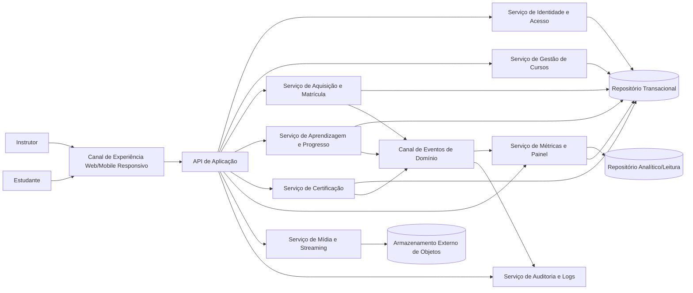
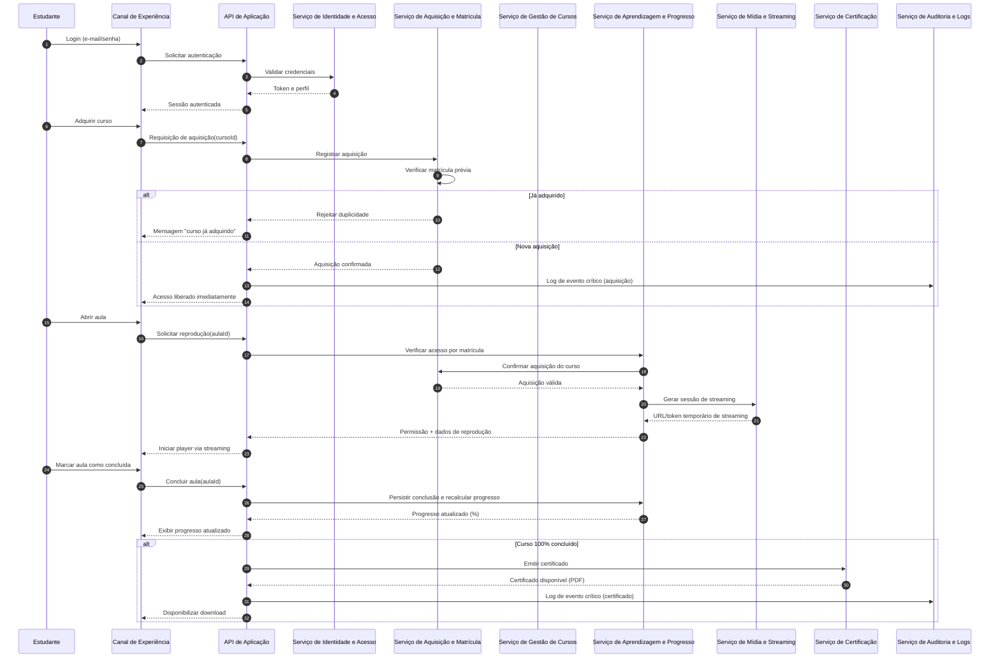

# Relatório Técnico de Arquitetura de Software

## 1. Identificação das HUs

### 1.1 Perfis e objetivos de negócio

- **Instrutor**
  - Criar, estruturar, publicar/despublicar cursos (HU01, HU02)
  - Acompanhar desempenho comercial e pedagógico (HU03, HU04)

- **Estudante**
  - Cadastrar-se e autenticar-se (HU05, HU16 implícita por RF16)
  - Adquirir cursos e consumir conteúdo (HU06, HU07, HU09)
  - Obter certificado de conclusão (HU08)

### 1.2 Agrupamento funcional por domínio

1. **Identidade e Acesso**
   - Cadastro, login/logout, autorização por perfil e por matrícula.
   - HUs: HU05, HU06 (pré-condição), HU07, HU08, HU09, HU16/RF16.

2. **Catálogo e Gestão de Curso**
   - Criação, edição, remoção, estrutura em módulos/aulas, publicação.
   - HUs: HU01, HU02.

3. **Aquisição e Matrícula**
   - Compra/aquisição de curso, bloqueio de recompra, liberação de acesso.
   - HUs: HU06.

4. **Consumo de Conteúdo e Progresso**
   - Streaming de vídeo, marcação de aula concluída, cálculo de percentual.
   - HUs: HU07, HU09.

5. **Certificação**
   - Emissão automática ao concluir curso, download posterior em PDF.
   - HUs: HU08.

6. **Analytics para Instrutor**
   - Matrículas por curso e engajamento por aula (views e taxa de conclusão).
   - HUs: HU03, HU04.

---

## 2. Diagramas de Arquitetura (Mermaid)

### 2.1 Diagrama de Componentes (visão lógica)

### 2.2 Diagrama de Sequência — aquisição, acesso e certificação

---

## 3. Decisões de Arquitetura

1. **Arquitetura modular por capacidades de domínio**
   - Separação em serviços/componentes: Identidade, Curso, Matrícula, Progresso, Certificação, Métricas e Mídia.
   - **Motivo:** reduz acoplamento e facilita evolução por HU.

2. **Controle de acesso orientado a matrícula**
   - Toda solicitação de aula valida autenticação + aquisição do curso.
   - **Atende:** RF08, RNF01.

3. **Fluxo de mídia por streaming com armazenamento externo**
   - Upload e entrega de vídeo desacoplados do núcleo transacional.
   - **Atende:** RF03, RNF03, RNF04.

4. **Modelo de progresso com persistência imediata por conclusão**
   - Marcação manual de conclusão dispara gravação transacional e recálculo instantâneo.
   - **Atende:** RF09, RF10, RF12, RNF07.

5. **Emissão automática de certificado por regra de completude**
   - Gatilho ao atingir 100% das aulas concluídas.
   - **Atende:** RF11, RF15, HU08.

6. **Painel de métricas com visão de leitura otimizada**
   - Dados de engajamento e matrículas consolidados para leitura rápida.
   - **Atende:** RF13, RF14, RNF06, HU03/HU04.

7. **Auditoria de eventos críticos**
   - Registro obrigatório para aquisição, emissão de certificado e falhas de upload.
   - **Atende:** RNF09.

8. **Design responsivo e compatível com navegadores modernos**
   - Camada de experiência preparada para desktop/mobile e compatibilidade cruzada.
   - **Atende:** RNF05, RNF08.

9. **Segurança de credenciais**
   - Senhas armazenadas com hash seguro e política mínima de senha.
   - **Atende:** RNF02, HU05.

---

## 4. Tabela de Componentes e Rastreabilidade

| Componente | Responsabilidade Principal | Comunica-se com | Origem (HU / Critério de Aceite) |
|---|---|---|---|
| Canal de Experiência (Web/Mobile) | Interfaces para instrutor/estudante, responsividade, fluxo de navegação | API de Aplicação | HU01–HU09; RNF05; RNF08 |
| API de Aplicação | Orquestra casos de uso, valida entrada, aplica políticas | Todos os serviços de domínio | Todos os RF/HUs (camada de aplicação) |
| Serviço de Identidade e Acesso | Cadastro, login/logout, hash de senha, sessão e autorização por papel | API, Repositório Transacional | RF06, RF16; HU05; RNF02 |
| Serviço de Gestão de Cursos | CRUD de curso/módulo/aula, ordenação, status publicado/rascunho | API, Repositório, Serviço de Mídia | RF01, RF02, RF04, RF05; HU01, HU02 |
| Serviço de Mídia e Streaming | Upload de vídeos, integração com object storage, sessão de reprodução | API, Gestão de Cursos, Aprendizagem, Armazenamento de Objetos | RF03; HU01/HU07; RNF03, RNF04, RNF10 |
| Serviço de Aquisição e Matrícula | Registrar aquisição, impedir duplicidade, liberar vínculo estudante-curso | API, Repositório, Aprendizagem, Logs | RF07, RF08; HU06; RNF01, RNF09 |
| Serviço de Aprendizagem e Progresso | Marcar aula concluída, calcular percentual, consultar cursos adquiridos | API, Matrícula, Repositório, Certificação, Métricas | RF09, RF10, RF12; HU07, HU09; RNF07 |
| Serviço de Certificação | Emissão automática ao concluir curso, armazenamento e download de PDF | API, Aprendizagem, Repositório, Logs | RF11, RF15; HU08; RNF09 |
| Serviço de Métricas e Painel | Matrículas por curso e engajamento por aula, leitura para dashboard | API, Repositório Transacional, Repositório Analítico | RF13, RF14; HU03, HU04; RNF06 |
| Serviço de Auditoria e Logs | Registro de eventos críticos e erros operacionais | API, Matrícula, Certificação, Mídia | RNF09 |
| Repositório Transacional | Persistência de entidades operacionais (usuários, cursos, matrículas, progresso) | Serviços de domínio | Suporte a RF01–RF16 |
| Repositório Analítico/Leitura | Consulta otimizada para dashboard de instrutor | Serviço de Métricas | RF13, RF14; RNF06 |
| Armazenamento Externo de Objetos | Armazenamento de vídeos desacoplado da aplicação | Serviço de Mídia | RNF04 |

---

## 5. Bloqueios e Pendências

1. **Aquisição sem regra financeira detalhada**
   - Não há definição de pagamento, estorno, moeda, tributos.
   - **Risco:** fluxo de RF07 incompleto em produção.
   - **Pendência:** definir escopo: aquisição “simulada” vs integração financeira real.

2. **Definição de “visualização de aula” para métrica**
   - Não está especificado o que conta como view (início, 30s, 80% etc.).
   - **Risco:** inconsistência em RF14/HU04.
   - **Pendência:** formalizar regra de negócio de engajamento.

3. **Critério de “tempo real” no painel (HU03)**
   - Aceita até 1 hora de defasagem, mas não define por métrica.
   - **Risco:** expectativa divergente entre produto e engenharia.
   - **Pendência:** SLA por indicador (matrículas, views, conclusão).

4. **Política de reordenação concorrente de módulos/aulas**
   - Não há regra para edição simultânea por múltiplas sessões do instrutor.
   - **Risco:** perda de alterações.
   - **Pendência:** definir estratégia de concorrência (bloqueio lógico/versão).

5. **Acessibilidade do player parcialmente definida**
   - Apenas controles básicos listados; faltam requisitos como teclado/legendas.
   - **Risco:** conformidade limitada.
   - **Pendência:** ampliar critérios de acessibilidade.

---

## 6. Cobertura de Requisitos

### 6.1 Requisitos Funcionais (RF)

| RF | Cobertura Arquitetural |
|---|---|
| RF01–RF05 | Serviço de Gestão de Cursos + API + UI |
| RF06, RF16 | Serviço de Identidade e Acesso + UI |
| RF07 | Serviço de Aquisição e Matrícula |
| RF08 | Autorização por matrícula (Aprendizagem + Matrícula + IAM) |
| RF09, RF10, RF12 | Serviço de Aprendizagem e Progresso |
| RF11, RF15 | Serviço de Certificação |
| RF13, RF14 | Serviço de Métricas e Painel |

### 6.2 Requisitos Não Funcionais (RNF)

| RNF | Cobertura Arquitetural |
|---|---|
| RNF01 | Verificação obrigatória de aquisição para acesso ao conteúdo |
| RNF02 | Armazenamento de senha com hash seguro |
| RNF03 | Entrega de vídeo por streaming |
| RNF04 | Armazenamento em serviço externo de objetos |
| RNF05 | Canal de experiência responsivo |
| RNF06 | Camada analítica de leitura otimizada para dashboard |
| RNF07 | Persistência imediata a cada conclusão de aula |
| RNF08 | Compatibilidade com navegadores modernos (estratégia de frontend e testes) |
| RNF09 | Serviço de auditoria para eventos críticos |
| RNF10 | Player com controles básicos de acessibilidade |

### 6.3 Histórias de Usuário (HU)

- **Cobertas integralmente:** HU01, HU02, HU05, HU06, HU07, HU08, HU09.  
- **Cobertura com dependência de definição de SLA/métrica:** HU03, HU04.

---

## 7. Gap Analysis

| Lacuna | Impacto Arquitetural | Recomendação |
|---|---|---|
| Ausência de fluxo de pagamento detalhado na aquisição | Serviço de Matrícula incompleto para cenário real | Definir fronteira do MVP (aquisição sem pagamento x com pagamento), estados da transação e falhas |
| Regra ambígua para “visualização” em engajamento | Métricas podem divergir e comprometer HU04 | Especificar eventos canônicos (play iniciado, tempo mínimo, percentual assistido) |
| Não há política de cancelamento/reembolso | Acesso e certificados podem precisar revogação | Definir regras de reversão: matrícula, progresso, certificado |
| Não há definição de autorização fina por papel em endpoints | Risco de exposição indevida de operações de instrutor | Matriz de autorização por caso de uso (instrutor/estudante) |
| Falta de requisitos de retenção de logs e dados | Pode afetar auditoria e custos operacionais | Definir políticas de retenção, mascaramento e ciclo de vida de logs |
| Falta de requisitos de disponibilidade/backup | Risco para continuidade e recuperação | Estabelecer objetivos de continuidade e estratégia de recuperação |
| Certificado sem regras de validação pública/autenticidade | Baixa confiança externa no documento | Definir identificador único verificável e trilha de emissão |

---

Se quiser, no próximo passo eu converto este relatório em **backlog arquitetural executável** (épicos técnicos + critérios de pronto + ordem de implementação).