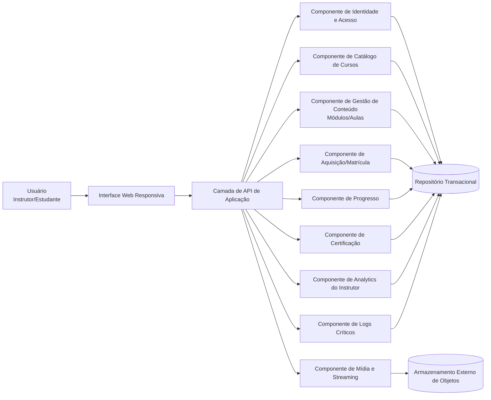
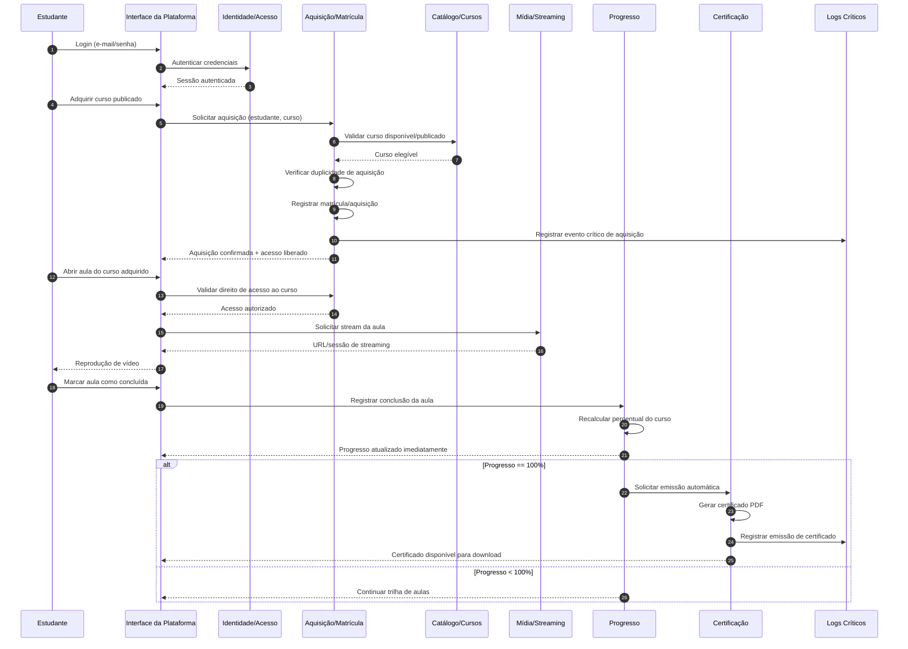

# Relatório Técnico de Arquitetura de Software

## 1. Identificação das HUs

### 1.1 Escopo funcional identificado
A solução cobre dois perfis principais:

- **Instrutor**: criação/estruturação/publicação de cursos, acompanhamento de matrículas e engajamento.
- **Estudante**: cadastro, aquisição, consumo de aulas, progresso e certificado.

### 1.2 Histórias de Usuário mapeadas
- **HU01** — Criar e estruturar curso (curso, módulos, aulas, vídeo)
- **HU02** — Publicar/despublicar curso com controle de visibilidade
- **HU03** — Acompanhar matrículas por curso
- **HU04** — Acompanhar engajamento por aula
- **HU05** — Cadastro de estudante
- **HU06** — Aquisição de curso e liberação imediata de acesso
- **HU07** — Assistir aulas, marcar conclusão e atualizar progresso
- **HU08** — Emissão automática e download de certificado
- **HU09** — Área centralizada de cursos adquiridos com progresso

### 1.3 Domínios lógicos (visão de modelagem ágil)
1. **Identidade e Acesso** (cadastro, login/logout, senha segura, sessão)
2. **Catálogo e Conteúdo** (curso, módulo, aula, publicação)
3. **Mídia** (upload, armazenamento externo, entrega por streaming)
4. **Aquisição e Matrícula** (compra, elegibilidade de acesso, anti-duplicidade)
5. **Aprendizado e Progresso** (conclusão de aula e percentual)
6. **Certificação** (emissão automática e download PDF)
7. **Analytics Instrutor** (matrículas e engajamento por aula)
8. **Observabilidade/Auditoria** (logs críticos)

---

## 2. Diagramas de Arquitetura (Mermaid)

### 2.1 Diagrama de componentes (conceitual)

### 2.2 Diagrama de sequência (aquisição, consumo e certificação)

---

## 3. Decisões de Arquitetura

1. **Arquitetura modular por domínio de negócio**  
   Separação em componentes coesos (Identidade, Catálogo, Aquisição, Progresso, Certificação, Analytics, Mídia) para facilitar evolução e manutenção.  
   **Motivação:** RF01–RF16, RNF09, RNF05.

2. **Controle de acesso baseado em aquisição (matrícula)**  
   Todo acesso a conteúdo de curso exige validação de elegibilidade por matrícula ativa do estudante.  
   **Motivação:** RF08, RNF01, HU06/HU07.

3. **Publicação independente de acesso de alunos já adquirentes**  
   Curso despublicado sai da vitrine, mas alunos com aquisição mantêm acesso.  
   **Motivação:** HU02 (critério de aceite), RF05.

4. **Mídia desacoplada da aplicação transacional**  
   Upload e entrega de vídeo via componente de mídia integrado a **armazenamento externo de objetos** e reprodução por streaming.  
   **Motivação:** RF03, RNF03, RNF04.

5. **Progresso com persistência imediata por evento de conclusão**  
   Ao marcar aula como concluída, o sistema persiste e recalcula progresso sem atraso perceptível.  
   **Motivação:** RF09, RF10, RF12, RNF07, HU07.

6. **Certificação orientada a regra de conclusão total**  
   Emissão automática quando progresso atingir 100%, com disponibilidade contínua para download em PDF.  
   **Motivação:** RF11, RF15, HU08.

7. **Analytics de instrutor por leitura otimizada e atualização periódica**  
   Métricas de matrículas e engajamento por aula com latência máxima de 1h e objetivo de carga do painel em até 3s.  
   **Motivação:** RF13, RF14, RNF06, HU03, HU04.

8. **Observabilidade com trilha de eventos críticos**  
   Registro obrigatório para aquisição, emissão de certificado e falhas de upload.  
   **Motivação:** RNF09.

9. **Diretrizes de segurança e UX transversal**  
   Senhas com hash seguro (ex.: bcrypt), interface responsiva, compatibilidade entre navegadores e controles básicos de acessibilidade no player.  
   **Motivação:** RNF02, RNF05, RNF08, RNF10.

---

## 4. Tabela de Componentes e Rastreabilidade

| Componente | Responsabilidade Principal | Comunica-se com | Origem (HU / Critério de Aceite) |
|---|---|---|---|
| Interface Web Responsiva | Fluxos de instrutor/estudante, navegação, formulários, painel, player | API de Aplicação | HU01–HU09; RNF05; RNF08 |
| API de Aplicação | Orquestrar casos de uso e contratos de integração | Todos os componentes de domínio | Todos os RF (camada de exposição) |
| Identidade e Acesso | Cadastro, login/logout, validação de sessão, política de senha e hash | API, Repositório Transacional | HU05, RF06, RF16, RNF02 |
| Catálogo de Cursos | Dados de curso (título, descrição, capa, preço, status) | API, Gestão de Conteúdo, Aquisição | HU01, HU02, RF01, RF05 |
| Gestão de Conteúdo (Módulos/Aulas) | CRUD, ordenação e remoção de módulos/aulas | API, Catálogo, Mídia | HU01 (reordenar/remover), RF02, RF04 |
| Mídia e Streaming | Upload de vídeo por aula, entrega em streaming, controles de player | API, Armazenamento Externo | HU01, HU07, RF03, RNF03, RNF04, RNF10 |
| Aquisição/Matrícula | Registrar aquisição, impedir duplicidade, liberar acesso ao curso | API, Catálogo, Progresso, Logs | HU06, HU09, RF07, RF08 |
| Progresso | Marcar aula concluída, cálculo de percentual e status de curso | API, Aquisição, Certificação | HU07, HU09, RF09, RF10, RF12, RNF07 |
| Certificação | Emissão automática em conclusão total, download PDF posterior | API, Progresso, Logs | HU08, RF11, RF15 |
| Analytics do Instrutor | Matrículas por curso, visualizações e taxa de conclusão por aula | API, Repositório, Painel | HU03, HU04, RF13, RF14, RNF06 |
| Logs Críticos | Persistir eventos críticos e erros de upload | API, Aquisição, Certificação, Mídia | RNF09 |
| Repositório Transacional | Persistência de usuários, cursos, matrículas, progresso, certificados | Componentes de domínio | Suporte a RF01–RF16 |
| Armazenamento Externo de Objetos | Armazenar arquivos de vídeo desacoplados da aplicação | Mídia e Streaming | RNF04 |

---

## 5. Bloqueios e Pendências

1. **Fluxo de pagamento não especificado**  
   - Impacta HU06 (aquisição) e regras de confirmação/falha.
2. **Política de cancelamento/reembolso ausente**  
   - Impacta manutenção de acesso (RF08/HU02) e métricas.
3. **Definição de “visualização de aula” para analytics**  
   - Falta regra objetiva (ex.: início do play, tempo mínimo assistido).
4. **SLA exato para “tempo real ou até 1 hora”**  
   - HU03 permite duas interpretações; precisa consolidar para arquitetura de atualização.
5. **Regras de certificado (assinatura, validação pública, layout institucional)**  
   - Impacta componente de certificação e requisitos legais.
6. **Limites de upload e formatos de vídeo**  
   - Necessário para validação, UX e capacidade operacional.
7. **Política de autorização de instrutor sobre cursos próprios**  
   - Falta regra explícita de ownership para edição/publicação (RF04/RF05).

---

## 6. Cobertura de Requisitos

### 6.1 Requisitos Funcionais (RF)

| Requisito | Cobertura Arquitetural | Componentes envolvidos | Status |
|---|---|---|---|
| RF01 | Criação de curso com metadados | Catálogo, API, UI | Atendido |
| RF02 | Organização em módulos/aulas | Gestão de Conteúdo, Catálogo, UI | Atendido |
| RF03 | Upload de vídeo por aula | Mídia e Streaming, Armazenamento Externo | Atendido |
| RF04 | Edição/remoção de curso/módulo/aula | Catálogo, Gestão de Conteúdo | Atendido |
| RF05 | Publicar/despublicar visibilidade | Catálogo, UI | Atendido |
| RF06 | Cadastro de estudante | Identidade e Acesso | Atendido |
| RF07 | Aquisição de cursos | Aquisição/Matrícula | Atendido |
| RF08 | Acesso apenas após aquisição | Aquisição/Matrícula, Autorização | Atendido |
| RF09 | Registrar conclusão de aula | Progresso | Atendido |
| RF10 | Controlar progresso por aulas concluídas | Progresso | Atendido |
| RF11 | Emitir certificado ao concluir curso | Certificação, Progresso | Atendido |
| RF12 | Exibir percentual de progresso | Progresso, UI | Atendido |
| RF13 | Painel com matrículas por curso | Analytics do Instrutor | Atendido |
| RF14 | Métricas de engajamento por aula | Analytics do Instrutor | Atendido |
| RF15 | Download de certificado | Certificação, UI | Atendido |
| RF16 | Login/logout estudante e instrutor | Identidade e Acesso | Atendido |

### 6.2 Requisitos Não Funcionais (RNF)

| Requisito | Cobertura Arquitetural | Componentes envolvidos | Status |
|---|---|---|---|
| RNF01 | Autorização por matrícula para acesso ao conteúdo | Aquisição/Matrícula, API | Atendido |
| RNF02 | Senha com hash seguro | Identidade e Acesso | Atendido |
| RNF03 | Reprodução por streaming | Mídia e Streaming | Atendido |
| RNF04 | Vídeo em armazenamento externo de objetos | Mídia, Armazenamento Externo | Atendido |
| RNF05 | Interface responsiva | UI | Atendido |
| RNF06 | Painel até 3s | Analytics + estratégia de leitura otimizada | Parcial (depende metas operacionais e testes de carga) |
| RNF07 | Salvamento automático do progresso | Progresso | Atendido |
| RNF08 | Compatibilidade com navegadores modernos | UI + estratégia de testes de compatibilidade | Parcial (depende plano de testes) |
| RNF09 | Logs de eventos críticos | Logs Críticos | Atendido |
| RNF10 | Controles de acessibilidade no player | Mídia/UI | Atendido |

---

## 7. Gap Analysis

| Lacuna | Impacto Arquitetural | Ação Recomendada |
|---|---|---|
| Ausência de fluxo de pagamento detalhado | Incerteza no gatilho de “aquisição confirmada” e antifraude/estorno | Definir estados da aquisição (pendente, confirmada, falha, cancelada) e eventos |
| Regra de engajamento não formalizada | Métricas inconsistentes (RF14/HU04) | Especificar fórmula de visualização e taxa de conclusão |
| Ambiguidade de atualização “tempo real ou 1h” | Pode superdimensionar ou subdimensionar analytics | Fixar SLA por métrica (ex.: matrículas 5 min, engajamento 1h) |
| Falta de requisitos de governança de certificado | Risco jurídico/operacional (autenticidade) | Definir padrão do PDF, assinatura, identificador único e verificação |
| Sem limites técnicos de mídia (tamanho, duração, codecs) | Risco de falhas de upload e custo imprevisível | Definir política de upload + validações no componente de mídia |
| Regras de autorização do instrutor não explícitas | Possível edição indevida de cursos de terceiros | Definir controle de ownership por curso e permissões por papel |
| Sem metas explícitas de auditoria/retenção de logs | Dificulta conformidade e investigação | Definir retenção mínima, níveis de severidade e trilha de auditoria |

### Prioridade sugerida para próxima iteração
1. Pagamento/aquisição (criticamente bloqueante para HU06).  
2. Definições de analytics e SLA (HU03/HU04 + RNF06).  
3. Governança de certificado (HU08).  
4. Regras de autorização de instrutor e política de mídia.  

--- 

Se quiser, no próximo passo eu transformo este relatório em **backlog técnico priorizado** (épicos, histórias técnicas e critérios de pronto) já alinhado com as lacunas da Seção 7.