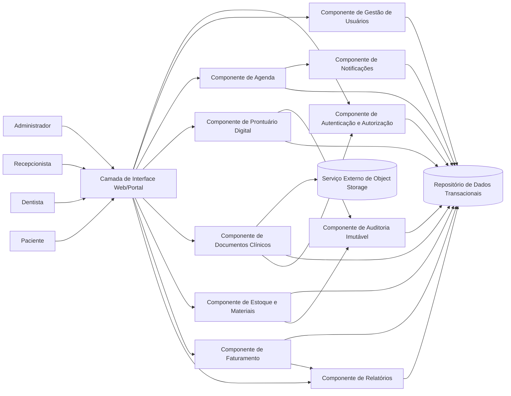
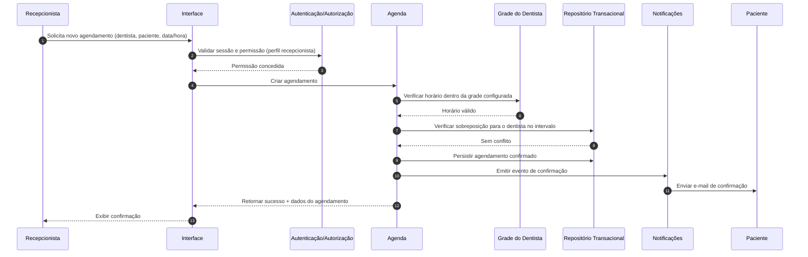
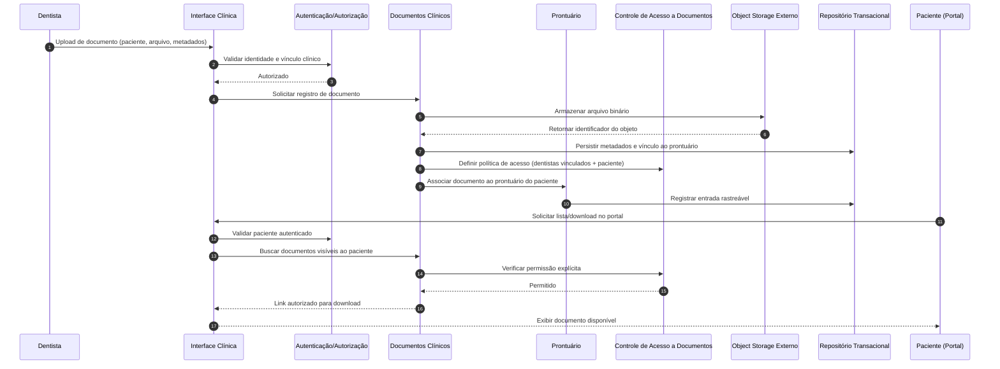

# Relatório Técnico de Arquitetura de Software

## 1. Identificação das HUs

### 1.1 Inventário de Histórias de Usuário por Perfil

| Perfil | HUs | Objetivo de Negócio |
|---|---|---|
| Recepcionista | HU01, HU02, HU03 | Operação centralizada de agenda e recebimentos |
| Dentista | HU04, HU05, HU06, HU07 | Continuidade clínica e geração de cobrança por atendimento |
| Administrador | HU08, HU09, HU10 | Governança operacional (agenda, estoque e faturamento) |
| Paciente | HU11, HU12 | Autoatendimento via portal para agenda e documentos |

### 1.2 Agrupamento por Domínio Funcional

| Domínio | HUs Relacionadas | RF Relacionados |
|---|---|---|
| Acesso e Perfis | HU11, HU12 (autenticação do portal), suporte a todos os perfis | RF01, RF02 |
| Agenda | HU01, HU02, HU08, HU11 | RF03–RF08, RF24 |
| Prontuário Digital | HU04, HU05, HU06, HU12 | RF09–RF13, RF25 |
| Materiais e Equipamentos | HU09 | RF14–RF17 |
| Faturamento | HU03, HU07, HU10 | RF18–RF22 |
| Portal do Paciente | HU11, HU12 | RF23–RF25 |

### 1.3 Restrições Transversais (RNF críticos)

- **Segurança e conformidade**: RNF01, RNF02, RNF03, RNF04  
- **Rastreabilidade clínica**: RNF05  
- **Desempenho de agenda unificada**: RNF06  
- **Escalabilidade de documentos**: RNF07  
- **Disponibilidade e continuidade**: RNF08, RNF11  
- **Experiência de uso e compatibilidade**: RNF09, RNF10  

---

## 2. Diagramas de Arquitetura (Mermaid)

### 2.1 Visão de Componentes (lógica)

### 2.2 Sequência — Agendar consulta com validação de conflito e notificação

### 2.3 Sequência — Upload e acesso a documento clínico

---

## 3. Decisões de Arquitetura

1. **Arquitetura modular por domínios de negócio**  
   Separação lógica em: Acesso/Usuários, Agenda, Prontuário, Documentos, Estoque, Faturamento, Relatórios e Notificações.  
   **Motivo:** reduzir acoplamento e facilitar evolução por HU.

2. **Autorização baseada em papéis e vínculo clínico (RBAC + regra contextual)**  
   Perfis fixos (administrador, recepcionista, dentista, paciente) + validações de vínculo paciente/dentista para dados clínicos.  
   **Motivo:** RF02, RNF03, HU05/HU12.

3. **Regra de agenda com validação síncrona de disponibilidade e não sobreposição**  
   Criação/remarcação passa por validação de grade e conflito no mesmo fluxo transacional.  
   **Motivo:** RF06, HU02, RNF06.

4. **Notificações por e-mail desacopladas por evento de negócio**  
   Agenda publica evento de confirmação/cancelamento/remarcação; Notificações processa envio.  
   **Motivo:** RF08; maior resiliência operacional.

5. **Prontuário com trilha imutável de auditoria**  
   Toda alteração registra autor, data/hora, tipo de alteração e identificador do registro.  
   **Motivo:** RF13, RNF05, conformidade.

6. **Documentos clínicos em armazenamento externo de objetos**  
   Binário fora do repositório transacional; metadados e ACL no sistema.  
   **Motivo:** RNF07, RF11, RF25.

7. **Modelo financeiro orientado a cobrança com status e abatimentos**  
   Cobrança nasce do atendimento; suporta pagamento parcial e saldo em aberto.  
   **Motivo:** RF20, RF21, HU03, HU07.

8. **Estoque com movimentação auditável e alerta por mínimo**  
   Entradas/saídas versionadas, com geração de alerta quando saldo ≤ mínimo.  
   **Motivo:** RF15, RF16, HU09.

9. **Relatórios parametrizados e exportáveis**  
   Agregações por período, dentista e modalidade com saída CSV/PDF.  
   **Motivo:** RF22, HU10.

10. **Sessão com timeout de inatividade**  
    Encerramento automático após 30 min sem interação.  
    **Motivo:** RNF01.

---

## 4. Tabela de Componentes e Rastreabilidade

| Componente | Responsabilidade Principal | Comunica-se com | Origem (HU / Critério de Aceite) |
|---|---|---|---|
| Interface Web Interna | UI para administrador, recepcionista e dentista | Auth, Agenda, Prontuário, Estoque, Faturamento, Relatórios | HU01–HU10 |
| Portal do Paciente | UI de autoatendimento para agenda e documentos | Auth, Agenda, Documentos | HU11, HU12 |
| Autenticação e Autorização | Login, sessão, perfis e políticas de acesso | Interface, Portal, Documentos, Prontuário, Repositório | RF01, RF02, RNF01, RNF03, RNF04 |
| Gestão de Usuários | Cadastro e manutenção de usuários/perfis | Auth, Repositório | RF01 |
| Agenda | Agendamento/cancelamento/remarcação, validação de conflito | Grade de Horário, Repositório, Notificações | HU01, HU02, HU08 / CA de bloqueio de sobreposição |
| Grade de Horário do Dentista | Regras de disponibilidade por profissional | Agenda, Repositório | HU08 / CA dias da semana e horário início/fim |
| Notificações | Envio de e-mails de eventos de agenda | Agenda, Repositório | RF08, HU02 |
| Prontuário Digital | Histórico clínico, registros e edição controlada | Auth, Documentos, Auditoria, Repositório | HU04, HU06 / CA ordem cronológica e rastreabilidade |
| Documentos Clínicos | Upload, metadados, download e controle de visibilidade | Prontuário, Auth, ACL, Object Storage, Repositório | HU05, HU12 / CA tipos de arquivo e download |
| Controle de Acesso a Documentos (ACL) | Restringir acesso a dentistas vinculados e paciente | Auth, Documentos, Repositório | RF25, RNF03, HU05, HU12 |
| Estoque e Materiais | Cadastro, entradas/saídas, saldo mínimo e vínculo com atendimento | Repositório, Auditoria | HU09, RF14–RF17 |
| Faturamento e Cobrança | Geração de cobrança por atendimento, convênio/particular, pagamentos | Repositório, Relatórios | HU03, HU07 / CA pagamento parcial e status |
| Relatórios | Consolidação por período/dentista/modalidade e exportação | Faturamento, Repositório | HU10 / CA exportar CSV/PDF |
| Auditoria Imutável | Registro inviolável de alterações sensíveis | Prontuário, Estoque, Repositório | RNF05, RF13 |
| Repositório de Dados Transacionais | Persistência de entidades de negócio | Todos os componentes de domínio | Base de todos RF |
| Serviço Externo de Object Storage | Armazenamento escalável de arquivos clínicos | Documentos Clínicos | RNF07 |

---

## 5. Bloqueios e Pendências

| Tema | Lacuna/Pendência | Impacto Arquitetural | Ação Recomendada |
|---|---|---|---|
| Vínculo “dentista vinculado ao paciente” | Não está definido se vínculo é por atendimento prévio, plano de cuidado ou atribuição manual | Regras de acesso (RNF03) podem divergir | Formalizar regra de vínculo e exceções |
| Política LGPD/CFO detalhada | Base legal, retenção, anonimização e descarte não detalhados | Risco de não conformidade | Definir política de ciclo de vida de dados clínicos e consentimentos |
| Escopo de “editar prontuário” | Não define limites do que pode ser alterado retroativamente | Pode conflitar com imutabilidade de auditoria | Definir campos editáveis e estratégia de versionamento |
| Regras de convênios | Não detalha glosas, coparticipação, validade de tabela | Risco de cálculo incorreto de cobrança | Especificar motor de regras de convênio |
| Notificação por e-mail | Sem definição de SLA de envio/retentativa | Incerteza operacional em falhas de entrega | Definir política de retentativa, fila e monitoramento |
| Desempenho RNF06 | Não define volume de dentistas/consultas para meta de 3s | Meta não testável sem carga alvo | Definir perfil de carga e cenários de teste |
| Disponibilidade RNF08 | “Horário de funcionamento” não parametrizado | Janela de manutenção e SLO indefinidos | Definir calendário de operação por unidade clínica |
| Backup RNF11 | Sem RPO/RTO explícitos | Estratégia de recuperação incompleta | Definir objetivos de recuperação e testes periódicos |

---

## 6. Cobertura de Requisitos

### 6.1 Requisitos Funcionais (RF)

| RF | Cobertura Arquitetural | Status |
|---|---|---|
| RF01–RF02 | Auth + Gestão de Usuários + RBAC por perfil | Coberto |
| RF03–RF07 | Agenda + Grade de Horário + validação de conflito | Coberto |
| RF08 | Notificações por evento de agenda | Coberto |
| RF09–RF13 | Prontuário + Auditoria + vínculo com dentista/data/hora | Coberto |
| RF14–RF17 | Estoque + Movimentações + Alertas + vínculo com atendimento | Coberto |
| RF18–RF22 | Faturamento/Cobrança + Pagamentos + Relatórios | Coberto |
| RF23–RF25 | Portal do Paciente + Documentos com ACL | Coberto |

### 6.2 Requisitos Não Funcionais (RNF)

| RNF | Cobertura Arquitetural | Status |
|---|---|---|
| RNF01 | Sessão autenticada com timeout de 30 min | Coberto |
| RNF02 | Governança de dados clínicos e controles de acesso/auditoria | Parcial (depende de política operacional) |
| RNF03 | ACL por vínculo clínico + paciente autenticado | Coberto (regra de vínculo pendente) |
| RNF04 | Armazenamento de senha com hash seguro | Coberto |
| RNF05 | Log imutável em alterações de prontuário | Coberto |
| RNF06 | Arquitetura otimizada para consulta unificada | Parcial (depende de metas de carga) |
| RNF07 | Object storage externo para documentos | Coberto |
| RNF08 | Requisitos de disponibilidade previstos em operação | Parcial (SLO detalhado pendente) |
| RNF09 | Camada UI responsiva | Coberto |
| RNF10 | Compatibilidade navegadores modernos | Coberto |
| RNF11 | Backup diário com retenção mínima | Parcial (RPO/RTO pendentes) |

---

## 7. Gap Analysis

| Gap | Evidência | Impacto | Recomendação |
|---|---|---|---|
| Regra de autorização clínica incompleta | RNF03/HU05/HU12 não definem todas as exceções | Risco de vazamento ou bloqueio indevido de documentos | Especificar matriz de autorização por cenário (primeira consulta, troca de dentista, multi-especialidade) |
| Conformidade LGPD/CFO em nível operacional | RNF02 genérico | Não conformidade regulatória | Criar requisitos de retenção, consentimento, revogação, descarte e trilhas de acesso |
| Escalabilidade/performance sem baseline | RNF06 sem parâmetros quantitativos de volume | Arquitetura não verificável em teste | Definir N (dentistas), M (consultas/dia), P95 de latência e metas por tela |
| Faturamento de convênio subespecificado | RF19/RF20/HU07 sem regras avançadas | Divergência financeira e retrabalho | Detalhar vigência de tabela, coparticipação, glosa e reajustes |
| Versionamento de prontuário não explicitado | RF12 permite edição; RNF05 exige imutabilidade de log | Ambiguidade jurídica e clínica | Adotar modelo “registro + correção” com histórico completo visível |
| Política de continuidade de negócio incompleta | RNF08 e RNF11 sem RTO/RPO | Recuperação incerta após incidente | Definir plano de continuidade com testes de restauração e evidências periódicas |

---

Se quiser, na próxima interação eu converto este relatório em **backlog arquitetural executável** (épicos técnicos + critérios de pronto + testes de arquitetura por requisito).