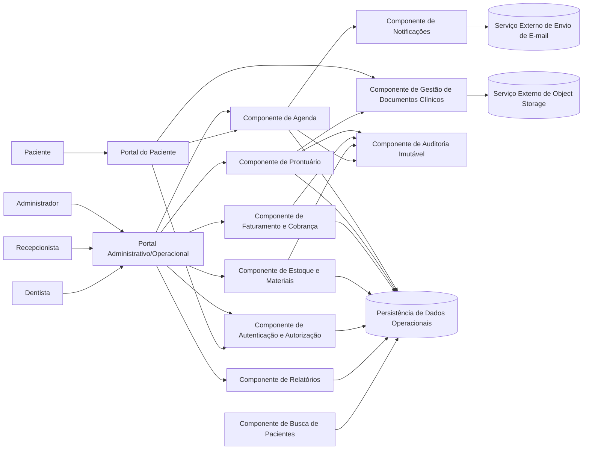
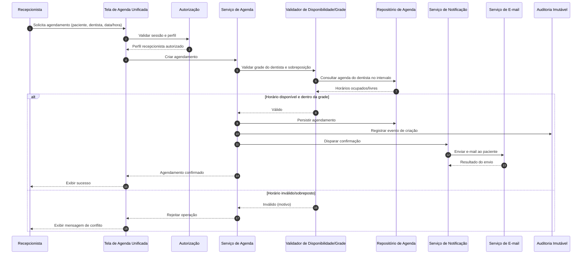
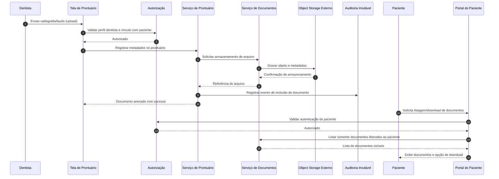

# Relatório Técnico de Arquitetura de Software

## 1. Identificação das HUs

### 1.1 Inventário consolidado de Histórias de Usuário

| HU | Perfil | Objetivo | RFs principalmente atendidos |
|---|---|---|---|
| HU01 | Recepcionista | Visualizar agenda unificada (diária/semanal, filtros por dentista) | RF03, RF04, RF06, RF07 |
| HU02 | Recepcionista | Agendar, cancelar e remarcar consulta com notificação ao paciente | RF05, RF06, RF07, RF08 |
| HU03 | Recepcionista | Registrar pagamento (total/parcial) e atualizar status de cobrança | RF21 |
| HU04 | Dentista | Registrar procedimentos no prontuário com rastreabilidade | RF09, RF10, RF13 |
| HU05 | Dentista | Anexar radiografias/documentos ao prontuário com acesso restrito | RF11, RF12, RNF03, RNF07 |
| HU06 | Dentista | Consultar prontuário completo com busca por nome/CPF | RF09, RF12 |
| HU07 | Dentista | Gerar cobrança por atendimento com convênio/particular | RF18, RF19, RF20 |
| HU08 | Administrador | Cadastrar dentistas e configurar grade de horários | RF01, RF07 |
| HU09 | Administrador | Gerenciar materiais e alertas de estoque mínimo | RF14, RF15, RF16, RF17 |
| HU10 | Administrador | Consultar relatório de faturamento e exportar CSV/PDF | RF22 |
| HU11 | Paciente | Acessar portal para visualizar agenda futura e histórico | RF23, RF24 |
| HU12 | Paciente | Acessar/download de documentos clínicos liberados | RF23, RF25, RNF03 |

### 1.2 Observações de escopo funcional
- O sistema é **multiperfil** com controle de acesso por papel (administrador, recepcionista, dentista, paciente).
- Existem **4 macrodomínios críticos**: Agenda, Prontuário, Faturamento e Estoque.
- Requisitos não funcionais de **segurança, rastreabilidade e conformidade regulatória** impactam transversalmente todos os módulos.

---

## 2. Diagramas de Arquitetura (Mermaid)

### 2.1 Diagrama de componentes lógicos

### 2.2 Diagrama de sequência — Agendamento, validação de conflito e notificação

### 2.3 Diagrama de sequência — Upload e acesso a documento clínico

---

## 3. Decisões de Arquitetura

| Decisão | Motivação | Impacto arquitetural | Requisitos relacionados |
|---|---|---|---|
| Separar módulos por domínio (Agenda, Prontuário, Faturamento, Estoque, Portal) | Reduzir acoplamento e facilitar evolução | Contratos claros entre componentes e rastreabilidade por domínio | RF03–RF25 |
| Controle de acesso centralizado por perfil e vínculo clínico | Segurança e privacidade clínica | Autorização aplicada em todas as operações sensíveis | RF02, RNF01, RNF03 |
| Auditoria imutável para alterações críticas | Conformidade e rastreabilidade legal | Registro obrigatório de quem, quando e o que mudou | RF13, RNF05 |
| Validação de disponibilidade antes de persistir agendamento | Evitar conflitos de agenda | Regra transacional para bloqueio de sobreposição | RF06, HU02 |
| Notificação assíncrona de eventos de agenda por e-mail | Desacoplar agendamento de comunicação | Falha de e-mail não impede persistência do agendamento | RF08 |
| Documentos clínicos em object storage externo | Escalabilidade e desacoplamento de arquivos | Metadados no domínio clínico e binários fora do servidor de aplicação | RF11, RNF07 |
| Prontuário com separação entre dados clínicos internos e itens compartilháveis | Privacidade do paciente | Portal exibe somente artefatos explicitamente liberados | HU12, RNF03 |
| Cobrança derivada de atendimento e procedimentos cadastrados | Integridade financeira | Regra de cálculo por modalidade (convênio/particular) | RF18, RF19, RF20 |
| Estoque com eventos de entrada/saída e alerta por mínimo | Controle operacional | Painel de alertas e vínculo opcional a atendimento | RF15, RF16, RF17 |
| Relatórios com filtros dimensionais e exportação | Governança financeira | Camada de consulta agregada e formato de exportação | RF22, HU10 |

---

## 4. Tabela de Componentes e Rastreabilidade

| Componente | Responsabilidade Principal | Comunica-se com | Origem (HU / Critério de Aceite) |
|---|---|---|---|
| Autenticação e Autorização | Autenticar usuário, controlar sessão e permissões por perfil/vínculo | Portais, todos os serviços de domínio | HU11 (portal exige autenticação), RF01, RF02, RNF01, RNF04 |
| Gestão de Agenda | Manter agendas por dentista, criar/cancelar/remarcar consultas | Autorização, Notificação, Persistência, Auditoria | HU01, HU02, RF03–RF08 |
| Validador de Disponibilidade/Grade | Aplicar grade do dentista e bloquear sobreposição | Gestão de Agenda, Persistência | HU02 (somente horários disponíveis), RF06, RF07 |
| Notificações | Enviar e-mails de confirmação/cancelamento/remarcação | Agenda, Serviço externo de e-mail | HU02, RF08 |
| Prontuário Digital | Registrar histórico clínico, edição e consulta controlada | Documentos, Busca de pacientes, Auditoria, Persistência | HU04, HU06, RF09, RF10, RF12, RF13 |
| Gestão de Documentos Clínicos | Upload/download e controle de visibilidade de documentos | Prontuário, Portal do Paciente, Object storage | HU05, HU12, RF11, RF25, RNF03, RNF07 |
| Busca de Pacientes | Busca por nome/CPF para contexto clínico | Prontuário, Persistência | HU06 (localizar por nome/CPF) |
| Faturamento e Cobrança | Gerar cobrança por atendimento, aplicar tabela convênio/particular, controlar aberto/pago | Persistência, Auditoria, Relatórios | HU03, HU07, RF18–RF21 |
| Gestão de Convênios e Tabelas | Manter convênios, procedimentos e valores | Faturamento, Persistência | HU07, RF19 |
| Estoque e Materiais | Cadastro, movimentações, alerta de mínimo, vínculo com atendimento | Persistência, Painel administrativo, Auditoria | HU09, RF14–RF17 |
| Relatórios de Faturamento | Consolidar faturamento por período/dentista/modalidade e exportar | Faturamento, Persistência | HU10, RF22 |
| Portal do Paciente | Exibir agendamentos, histórico e documentos liberados | Autorização, Agenda, Documentos | HU11, HU12, RF23, RF24, RF25 |
| Auditoria Imutável | Registro inviolável de ações críticas | Agenda, Prontuário, Faturamento, Estoque | HU04 (rastreabilidade), RNF05 |
| Persistência de Dados Operacionais | Armazenar dados transacionais e referenciais | Todos os domínios | Suporte transversal a RFs |
| Serviço Externo de Object Storage | Armazenar binários clínicos em escala | Gestão de Documentos | RNF07 |
| Serviço Externo de E-mail | Entrega de notificações de agenda | Notificações | RF08 |

---

## 5. Bloqueios e Pendências

### 5.1 Bloqueios atuais
- **Nenhum bloqueio impeditivo absoluto** para desenho arquitetural lógico.

### 5.2 Pendências de detalhamento (necessárias antes da implementação)
1. **Política de consentimento e base legal LGPD** por tipo de dado clínico.  
2. **Regras de vínculo “dentista do paciente”** (quem pode acessar quando há atendimento compartilhado ou substituição).  
3. **Política de retenção de documentos clínicos** (prazo legal, descarte, anonimização).  
4. **Definição operacional de pagamentos parciais** (rateio por procedimentos, multas, ajustes).  
5. **Formato e conteúdo de exportação PDF/CSV** para relatórios (layout, assinatura, cabeçalhos).  
6. **Estratégia de contingência para indisponibilidade de e-mail** (reenvio, fila de tentativas, monitoramento).  
7. **Critério exato do SLA de 99,5%** (janela mensal, exclusões de manutenção).  
8. **Escopo de backup diário** (inclui metadados + restauração de referências de object storage).

---

## 6. Cobertura de Requisitos

### 6.1 Cobertura de RF

| RF | Cobertura arquitetural | Evidência |
|---|---|---|
| RF01–RF02 | Coberto | Componente de Autenticação/Autorização |
| RF03–RF08 | Coberto | Gestão de Agenda + Validador + Notificação |
| RF09–RF13 | Coberto | Prontuário + Auditoria + Documentos |
| RF14–RF17 | Coberto | Estoque e Materiais |
| RF18–RF22 | Coberto | Faturamento/Cobrança + Convênios + Relatórios |
| RF23–RF25 | Coberto | Portal do Paciente + Documentos |

### 6.2 Cobertura de RNF

| RNF | Cobertura arquitetural | Observação |
|---|---|---|
| RNF01 | Parcialmente detalhado | Sessão e autenticação cobertos; falta política completa de expiração e renovação |
| RNF02 | Parcialmente detalhado | Princípios incorporados; faltam diretrizes operacionais/jurídicas internas |
| RNF03 | Coberto | Controle de acesso por perfil e vínculo + segregação de documentos |
| RNF04 | Coberto | Armazenamento de senha com hash seguro previsto no componente de identidade |
| RNF05 | Coberto | Auditoria imutável transversal |
| RNF06 | Parcialmente detalhado | Meta de 3s conhecida; faltam critérios de carga/volume para dimensionamento |
| RNF07 | Coberto | Object storage externo desacoplado |
| RNF08 | Parcialmente detalhado | Meta de disponibilidade definida; falta plano de operação/monitoramento |
| RNF09 | Parcialmente detalhado | Responsividade prevista na interface; falta padrão de design de UI |
| RNF10 | Parcialmente detalhado | Compatibilidade prevista; falta matriz de testes por navegador |
| RNF11 | Parcialmente detalhado | Backup diário previsto; falta estratégia formal de restauração/teste |

---

## 7. Gap Analysis

| Lacuna | Impacto Arquitetural | Ação Recomendada |
|---|---|---|
| Definição incompleta de regras LGPD/CFO aplicadas ao fluxo clínico | Risco de não conformidade e retrabalho em segurança | Elaborar matriz de dados sensíveis, base legal, perfis de acesso e trilha de consentimento |
| Critério ambíguo de “dentista vinculado ao paciente” | Pode gerar acesso indevido ou bloqueio indevido de prontuário | Formalizar regra de vínculo (ativo por consulta, por prontuário, por unidade clínica) |
| Falta de política de versionamento de prontuário e documentos | Dificuldade de auditoria clínica em correções | Definir estratégia de versionamento lógico e rastreio de alterações |
| Não há detalhamento de concorrência de agendamento | Possível dupla marcação em alta simultaneidade | Definir mecanismo transacional de reserva/confirmacão atômica |
| Relatório financeiro sem definição semântica completa | Inconsistência entre visão administrativa e operacional | Especificar dicionário de métricas (faturado, recebido, em aberto, estornado) |
| Backup sem RTO/RPO explícitos | Risco operacional em incidente | Definir objetivos de recuperação e testes periódicos de restauração |
| RNF06 sem perfil de carga | Meta de desempenho pode não ser atingida em produção | Definir volume esperado (dentistas, consultas/dia, janela de pico) e testes de capacidade |
| Política de disponibilização de documentos ao paciente não detalhada | Vazamento ou ocultação indevida de informação | Incluir estado explícito “liberado ao paciente” com trilha de auditoria |
| Falta de tratamento de falhas de notificação | Perda de comunicação com pacientes | Definir reprocessamento, tentativas, monitoramento e alerta operacional |

---

Se quiser, no próximo passo eu também posso gerar uma versão **“pronta para backlog técnico”**, quebrando esta arquitetura em **épicos, features e tarefas** com critérios de pronto (DoD) por componente.