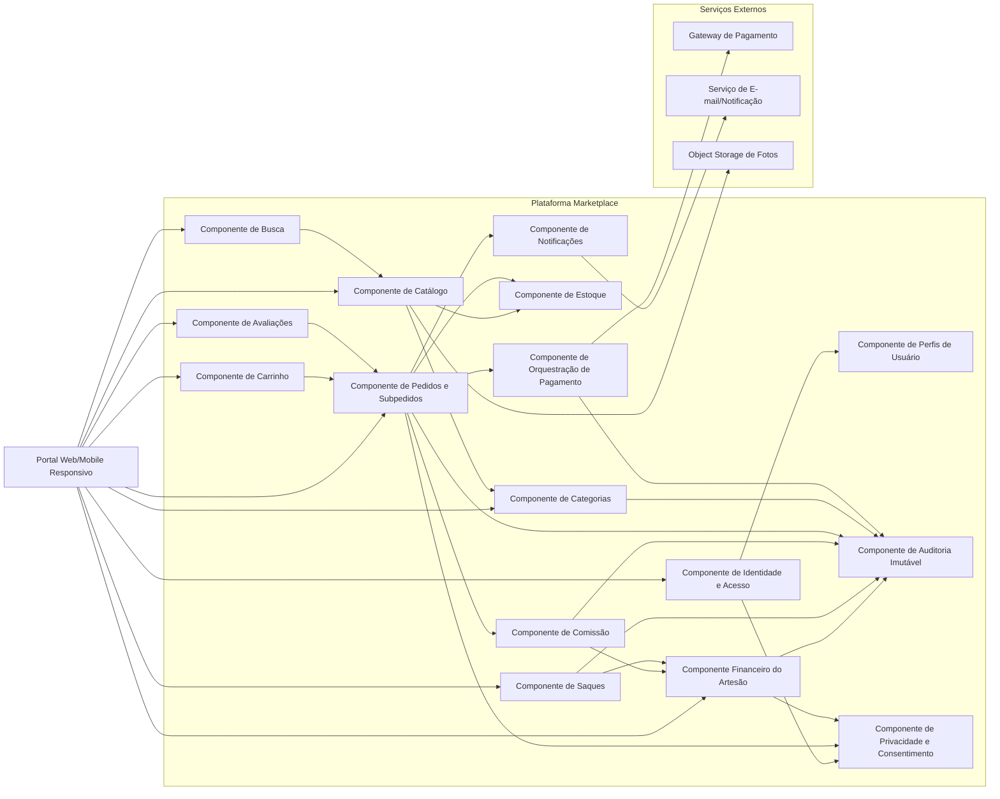
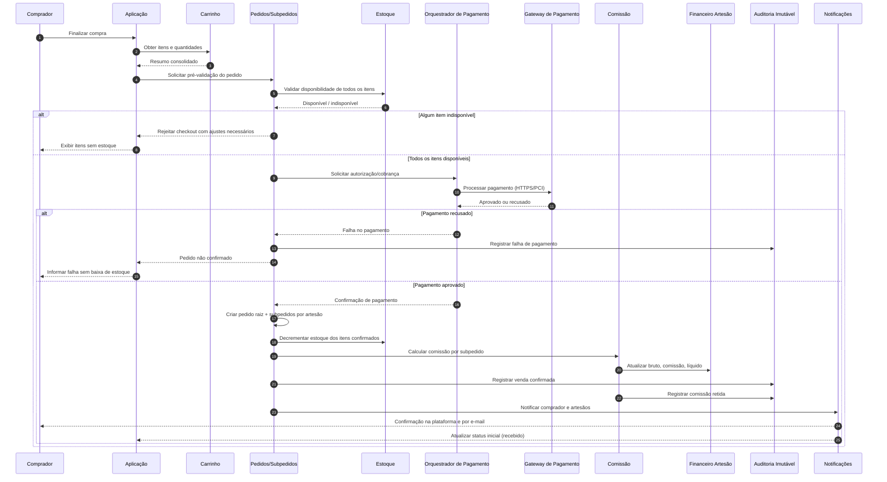
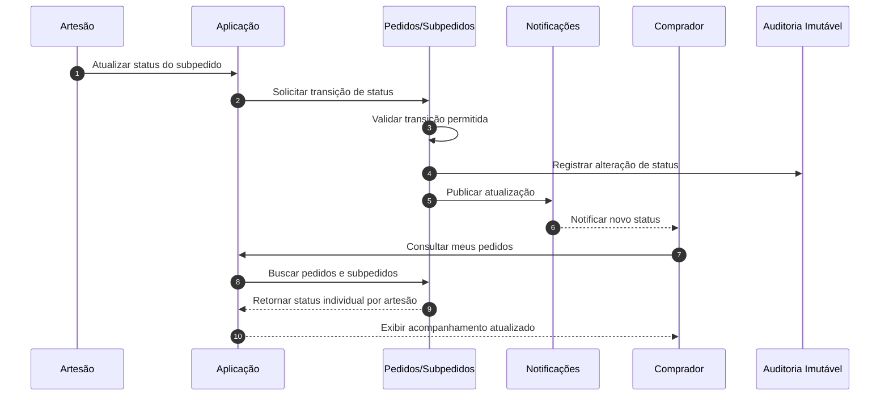

# Relatório Técnico de Arquitetura de Software

## 1. Identificação das HUs

### 1.1 Contexto e Atores
- **Comprador**: navega catálogo, pesquisa, gerencia carrinho, finaliza compra, acompanha pedidos e avalia produtos.
- **Artesão (Vendedor)**: gerencia produtos/estoque, acompanha subpedidos, atualiza status, responde avaliações, acompanha financeiro e solicita saque.
- **Administrador**: gerencia categorias e percentual de comissão.
- **Serviços Externos Conceituais**: gateway de pagamento, serviço de e-mail/notificação, armazenamento externo de imagens.

### 1.2 HUs mapeadas por domínio funcional
- **Domínio Catálogo**
  - HU01, HU02, HU07, HU11
- **Domínio Pedidos e Checkout**
  - HU08, HU09, HU03
- **Domínio Avaliações**
  - HU10, HU06
- **Domínio Financeiro e Comissão**
  - HU04, HU05, HU12

### 1.3 Priorização arquitetural (MVP → Evolução)
- **MVP crítico de negócio**
  - HU01, HU02, HU07, HU08, HU03, HU09, HU12
- **MVP financeiro mínimo**
  - HU04 (visão básica por venda), HU05 (solicitação de saque)
- **Evolução**
  - HU06, HU10 (maturidade social/reputação)
  - Otimizações de desempenho (busca em tempo real, dashboards por período)

---

## 2. Diagramas de Arquitetura (Mermaid)

### 2.1 Diagrama de Componentes (visão lógica)

### 2.2 Diagrama de Sequência — Checkout com múltiplos artesãos, pagamento e consistência transacional

### 2.3 Diagrama de Sequência — Atualização de status pelo artesão e rastreio pelo comprador

---

## 3. Decisões de Arquitetura

### D01 — Modelo de identidade com múltiplos perfis por usuário
- **Decisão**: separar conta de usuário de perfis/roles (comprador, artesão, administrador), permitindo acúmulo de papéis.
- **Motivação**: RF01, RF03, RNF01.
- **Impacto**: autorização por contexto funcional (catálogo vendedor, admin, comprador).

### D02 — Catálogo desacoplado de mídia
- **Decisão**: fotos de produtos armazenadas em serviço externo de object storage; catálogo guarda apenas metadados e referências.
- **Motivação**: RF04, RNF04.
- **Impacto**: melhora escalabilidade e reduz acoplamento de armazenamento.

### D03 — Publicação controlada de produto
- **Decisão**: produto possui estado de visibilidade (publicado/despublicado) independente da existência do cadastro.
- **Motivação**: RF06, HU01.
- **Impacto**: artesão prepara produto antes de torná-lo público.

### D04 — Pedido hierárquico com subpedidos por artesão
- **Decisão**: checkout gera um pedido do comprador e N subpedidos, um por artesão.
- **Motivação**: RF22, HU08, HU09.
- **Impacto**: rastreio individual de status e cálculos financeiros segregados.

### D05 — Integridade transacional no fluxo de pagamento
- **Decisão**: decrementar estoque e confirmar pedido apenas após pagamento aprovado; falha implica não confirmar e não baixar estoque.
- **Motivação**: RF09, RNF08, HU08.
- **Impacto**: evita inconsistência entre cobrança, pedido e estoque.

### D06 — Comissão versionada por vigência
- **Decisão**: alterações de percentual de comissão são versionadas com data de início de vigência; vendas antigas preservam percentual histórico.
- **Motivação**: RF26, RF27, HU12.
- **Impacto**: consistência contábil e auditável.

### D07 — Razão imutável de eventos financeiros e críticos
- **Decisão**: registrar operações financeiras e eventos críticos em trilha imutável append-only.
- **Motivação**: RNF09, RNF13.
- **Impacto**: rastreabilidade, auditoria e suporte a conformidade.

### D08 — Avaliação condicionada a entrega confirmada
- **Decisão**: elegibilidade de avaliação depende de item entregue e unicidade por item de pedido.
- **Motivação**: RF23, HU10.
- **Impacto**: reduz fraude e duplicidade de avaliações.

### D09 — Resposta do artesão imutável (uma única)
- **Decisão**: cada avaliação aceita no máximo uma resposta, sem edição/remoção após publicação.
- **Motivação**: RF25, HU06.
- **Impacto**: transparência pública e simplicidade de moderação.

### D10 — Segurança e privacidade por desenho
- **Decisão**: autenticação forte, hash seguro de senha, segregação de acesso, minimização de dados pessoais e trilhas de consentimento/tratamento.
- **Motivação**: RNF01, RNF02, RNF03, RNF11.
- **Impacto**: aderência regulatória e redução de risco.

---

## 4. Tabela de Componentes e Rastreabilidade

| Componente | Responsabilidade Principal | Comunica-se com | Origem (HU / Critério de Aceite) |
|---|---|---|---|
| Identidade e Acesso | Autenticação, encerramento de sessão, validação de permissões por perfil | Perfis de Usuário, UI, Auditoria | RF01–RF03, RNF01, RNF02 |
| Perfis de Usuário | Gerenciar papéis acumuláveis (comprador/artesão/admin) | Identidade e Acesso, módulos de domínio | RF01, RF03 |
| Catálogo de Produtos | CRUD de produto, publicação/despublicação, metadados e fotos | Estoque, Categorias, Object Storage, Busca | HU01, RF04–RF07 |
| Estoque | Atualização manual, validação de disponibilidade, baixa pós-pagamento | Catálogo, Pedidos | HU02, RF07–RF09 |
| Categorias | CRUD administrativo de categorias e políticas de remoção | Catálogo, Notificações, Auditoria | HU11, RF12 |
| Busca e Navegação | Pesquisa por nome/categoria/artesão e filtros de disponibilidade | Catálogo, UI | HU07, RF10, RF11, RF08 |
| Carrinho | Adição/remoção de itens, ajuste de quantidade, resumo de compra | UI, Pedidos | HU08, RF13–RF15 |
| Pedidos e Subpedidos | Criação de pedido multiartesão, status por subpedido, consulta de histórico | Carrinho, Estoque, Pagamento, Notificações, Avaliações | HU03, HU08, HU09, RF20–RF22 |
| Orquestração de Pagamento | Integração de pagamento, retorno aprovado/recusado, garantia de consistência do fluxo | Gateway de Pagamento, Pedidos, Auditoria | RF16–RF18, RNF03, RNF08 |
| Notificações | Envio de confirmação de pedido/status por e-mail e plataforma | Pedidos, Usuários, Serviço de Mensageria/E-mail | HU03, HU08, RF18, RF19, RF21 |
| Avaliações e Respostas | Avaliação após entrega, média/comentários, resposta única do artesão | Pedidos, Catálogo | HU06, HU10, RF23–RF25 |
| Comissão | Calcular e reter comissão por venda confirmada com regra vigente | Pedidos, Financeiro, Auditoria | HU12, RF26, RF27 |
| Painel Financeiro do Artesão | Exibir bruto/comissão/líquido, saldo disponível, totais por período | Comissão, Pedidos, Saques | HU04, RF28, RF29, RNF06 |
| Saques | Solicitação de saque, validação de saldo, atualização de valor em processamento | Painel Financeiro, Auditoria | HU05, RF30 |
| Auditoria Imutável | Registro inviolável de venda, comissão, saque e eventos críticos | Pedidos, Comissão, Saques, Administração | RNF09, RNF13, HU12 (log de alteração) |
| Privacidade e Conformidade | Regras LGPD (minimização, retenção, direitos do titular), trilha de tratamento | Identidade, Pedidos, Financeiro | RNF11 |

---

## 5. Bloqueios e Pendências

1. **Política detalhada de transição de status**
   - Falta definir transições inválidas (ex.: “enviado” → “recebido”).
   - Impacto: validação de domínio e UX de erro.

2. **Regras de estoque concorrente no checkout**
   - Não está explícito se haverá “reserva temporária” durante pagamento.
   - Impacto: risco de overselling em alta concorrência.

3. **Modelo operacional de saque**
   - Não define prazo de processamento, janela de corte, validações bancárias e cancelamento.
   - Impacto: fluxo financeiro e expectativa do artesão.

4. **Política de moderação de avaliações**
   - Não há regras para conteúdo abusivo, denúncias, ocultação administrativa.
   - Impacto: risco legal e reputacional.

5. **Notificação em “tempo real”**
   - Requisito cita atualização em tempo real, mas sem SLA de latência e canal principal.
   - Impacto: escolha de estratégia de entrega de eventos ao front-end.

6. **LGPD — bases legais e retenção**
   - Falta detalhamento de prazos de retenção, anonimização e fluxo de exclusão.
   - Impacto: conformidade e desenho de dados.

7. **Disponibilidade 99,5%**
   - Não há definição de janelas de manutenção e escopo (somente frontend? APIs? pagamento?).
   - Impacto: medição e responsabilização operacional.

---

## 6. Cobertura de Requisitos

### 6.1 Requisitos Funcionais (RF)

| Requisito | Cobertura Arquitetural | Status |
|---|---|---|
| RF01–RF03 | Identidade e Perfis com autorização por papel e multi-perfil | Coberto |
| RF04–RF07 | Catálogo + Estoque + Publicação | Coberto |
| RF08–RF09 | Validação e baixa de estoque após pagamento aprovado | Coberto |
| RF10–RF12 | Navegação, busca e gestão de categorias por admin | Coberto |
| RF13–RF15 | Carrinho e resumo de pedido | Coberto |
| RF16–RF19 | Checkout integrado, confirmação e notificações | Coberto |
| RF20–RF22 | Status por subpedido e acompanhamento comprador | Coberto |
| RF23–RF25 | Avaliação pós-entrega, média pública e resposta do artesão | Coberto |
| RF26–RF30 | Comissão, painel financeiro, saldo e saque | Coberto |

### 6.2 Requisitos Não Funcionais (RNF)

| Requisito | Estratégia Arquitetural | Status |
|---|---|---|
| RNF01 | Controle de acesso por perfil e escopo funcional | Coberto |
| RNF02 | Armazenamento de senha com hash seguro | Coberto |
| RNF03 | Integração de pagamento segura, sem retenção de cartão | Coberto |
| RNF04 | Mídia em object storage externo | Coberto |
| RNF05 | Busca/listagem otimizada por categoria | Parcial (depende de estratégia de indexação e cache) |
| RNF06 | Painel financeiro com consultas agregadas por período | Parcial (depende de modelagem analítica) |
| RNF07 | UI responsiva multi-dispositivo | Coberto (nível arquitetural) |
| RNF08 | Fluxo transacional pagamento-estoque-pedido | Coberto |
| RNF09 | Auditoria imutável de transações financeiras | Coberto |
| RNF10 | Compatibilidade principais navegadores | Parcial (depende de testes de homologação) |
| RNF11 | Privacidade LGPD por desenho e governança de dados | Parcial (falta política operacional detalhada) |
| RNF12 | Meta de disponibilidade mensal 99,5% | Parcial (falta plano SRE/operacional) |
| RNF13 | Logs de eventos críticos | Coberto |

---

## 7. Gap Analysis

| Lacuna | Impacto Arquitetural | Recomendação |
|---|---|---|
| Ausência de regra de reserva de estoque durante pagamento | Pode gerar venda acima do estoque em concorrência alta | Definir estratégia: reserva temporária com expiração **ou** validação final com retentativa e reprovação parcial |
| SLA indefinido para “tempo real” de status | Dificulta desenho de canal assíncrono e expectativa de UX | Formalizar SLA (ex.: latência máxima percebida) e política de fallback |
| Política de saque incompleta | Incerteza em estados financeiros e reconciliação | Especificar ciclo de saque, validações, estados e eventos de reconciliação |
| Falta de governança detalhada LGPD | Risco de não conformidade | Definir matriz de dados pessoais, bases legais, retenção, anonimização e atendimento a direitos do titular |
| Critérios de moderação de conteúdo (avaliações/respostas) não definidos | Risco jurídico/reputacional | Incluir fluxo de denúncia, revisão administrativa e trilha de decisão |
| Regras de remoção de categorias com produtos ativos dependem de “confirmação explícita” genérica | Ambiguidade operacional | Definir confirmação em 2 passos + notificação obrigatória e relatório de impacto |
| RNF de desempenho sem cenários de carga | Não garante atendimento real de 2s/3s | Criar testes de carga com volumes-alvo e orçamento de desempenho por componente |
| Disponibilidade 99,5% sem escopo de medição | Meta não auditável | Definir SLI/SLO, escopo (APIs críticas), janelas de manutenção e política de incidente |

---

Se quiser, no próximo passo eu posso gerar uma **versão “pronta para Jira/ADO”**, convertendo este relatório em:
- épicos e features,
- histórias técnicas de arquitetura,
- e critérios objetivos de validação (DoD + NFR testáveis).