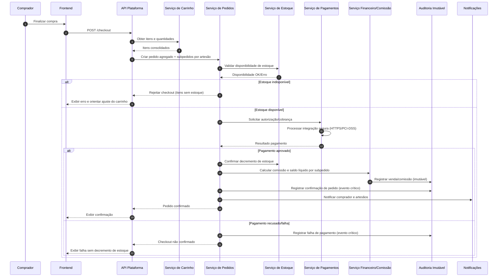
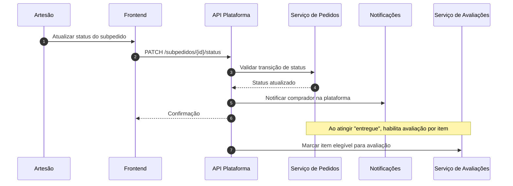

# Relatório Técnico de Arquitetura de Software

## 1. Identificação das HUs

### 1.1 Visão consolidada por domínio funcional

| Domínio | HUs | Objetivo de negócio |
|---|---|---|
| Identidade e Acesso | (implícito por RF01–RF03) | Permitir autenticação, autorização por perfil e multi-perfil por usuário. |
| Catálogo e Estoque | HU01, HU02, HU07, HU11 | Exposição de produtos artesanais com gestão de publicação, categorias e disponibilidade. |
| Carrinho, Checkout e Pedidos | HU08, HU09, HU03 | Compra unificada com múltiplos artesãos, geração de subpedidos e rastreio de status. |
| Avaliações | HU10, HU06 | Reputação do produto com resposta pública do artesão. |
| Financeiro e Comissão | HU04, HU05, HU12 | Cálculo de comissão, painel financeiro, saldo e saque do artesão. |
| Notificações e Auditoria | (transversal a HU03, HU08, HU12) | Comunicação por e-mail/plataforma e trilha de auditoria imutável. |

### 1.2 Atores e capacidades principais

| Ator | Capacidades centrais |
|---|---|
| Comprador | Navegar/pesquisar catálogo, gerenciar carrinho, finalizar pagamento, acompanhar pedidos, avaliar itens entregues. |
| Artesão | Cadastrar/publicar produtos, gerenciar estoque, operar subpedidos, responder avaliações, acompanhar financeiro, solicitar saque. |
| Administrador | Gerenciar categorias, configurar comissão, manter governança operacional. |
| Sistemas Externos | Gateway de pagamento, serviço de e-mail, storage de fotos (object storage). |

---

## 2. Diagramas de Arquitetura (Mermaid)

### 2.1 Diagrama de componentes (visão lógica)

```mermaid
flowchart LR
    UI[Canal Web/Mobile Responsivo]
    API[Camada de Aplicação / API]
    
    IAM[Componente de Identidade e Acesso]
    CAT[Componente de Catálogo]
    EST[Componente de Estoque]
    CAR[Componente de Carrinho]
    PED[Componente de Pedidos/Subpedidos]
    PAG[Componente de Pagamentos]
    FIN[Componente Financeiro e Comissão]
    AVL[Componente de Avaliações]
    NOTI[Componente de Notificações]
    AUD[Componente de Auditoria/Logs Imutáveis]
    BUSCA[Componente de Busca e Navegação]
    CATADM[Componente de Administração de Categorias]
    
    EXT_PAY[Gateway de Pagamento (externo)]
    EXT_MAIL[Serviço de E-mail (externo)]
    EXT_OBJ[Object Storage de Fotos (externo)]

    UI --> API
    API --> IAM
    API --> CAT
    API --> EST
    API --> CAR
    API --> PED
    API --> PAG
    API --> FIN
    API --> AVL
    API --> NOTI
    API --> BUSCA
    API --> CATADM
    API --> AUD

    CAT --> EXT_OBJ
    PAG --> EXT_PAY
    NOTI --> EXT_MAIL

    PED --> EST
    PED --> PAG
    PED --> FIN
    PED --> NOTI
    FIN --> AUD
    PAG --> AUD
    PED --> AUD
    CATADM --> AUD
```

### 2.2 Diagrama de sequência — checkout com múltiplos artesãos e transação financeira



### 2.3 Diagrama de sequência — atualização de status e habilitação de avaliação



---

## 3. Decisões de Arquitetura

1. **Arquitetura modular por domínios**  
   Separação em componentes: Identidade, Catálogo, Estoque, Carrinho, Pedidos, Pagamentos, Financeiro, Avaliações, Notificações e Auditoria.  
   **Motivo:** reduzir acoplamento e melhorar manutenibilidade (RNF13).

2. **Modelo de autorização por papéis com multi-perfil por usuário**  
   Um usuário pode acumular perfis de comprador e artesão (RF03), com restrições por área (RNF01).  
   **Motivo:** aderência ao modelo de negócio híbrido.

3. **Fluxo de checkout transacional com confirmação tardia de estoque**  
   Estoque só é decrementado após pagamento aprovado (RF09, RNF08).  
   **Motivo:** evitar inconsistência cobrança/estoque.

4. **Pedido agregado + subpedidos por artesão**  
   Estrutura de pedido mestre com desmembramento por vendedor (RF22).  
   **Motivo:** rastreabilidade de status e financeiro por artesão (HU09, HU04).

5. **Ledger financeiro imutável para eventos monetários**  
   Venda, comissão e saque gravados como eventos imutáveis (RNF09).  
   **Motivo:** auditoria, conformidade e reconciliação.

6. **Comissão versionada por vigência temporal**  
   Alterações de comissão afetam apenas vendas futuras (HU12).  
   **Motivo:** integridade histórica e previsibilidade financeira.

7. **Fotos desacopladas em object storage externo**  
   Apenas metadados e referências ficam na plataforma (RNF04).  
   **Motivo:** escalabilidade e redução de carga na aplicação.

8. **Busca e listagem com projeções otimizadas de leitura**  
   Catálogo por categoria e busca textual com foco em tempo de resposta (RNF05).  
   **Motivo:** experiência de navegação responsiva (HU07).

9. **Notificações assíncronas com rastreamento de entrega**  
   Confirmação de pedido e alertas de status por plataforma/e-mail (RF18, RF19, HU03).  
   **Motivo:** desacoplar operação principal da comunicação.

10. **LGPD by design**  
    Minimização de dados, consentimento, finalidade, e trilhas de acesso/alteração (RNF11).  
    **Motivo:** conformidade regulatória.

---

## 4. Tabela de Componentes e Rastreabilidade

| Componente | Responsabilidade Principal | Comunica-se com | Origem (HU / Critério de Aceite) |
|---|---|---|---|
| Identidade e Acesso | Cadastro, autenticação, sessão, autorização por perfil e multi-perfil | API, Auditoria | RF01–RF03, RNF01, RNF02 |
| Catálogo de Produtos | CRUD de produto, publicação/despublicação, metadados de fotos | Estoque, Busca, Object Storage, API | HU01 (campos obrigatórios, múltiplas fotos), RF04–RF06 |
| Estoque | Atualização manual e decremento automático pós-venda; bloqueio estoque zero | Pedidos, Catálogo | HU02 (todos CA), RF07–RF09 |
| Busca e Navegação | Navegação por categoria, pesquisa por nome/categoria/artesão, filtros default | Catálogo, API | HU07 (resultados parciais/tempo real, ocultar sem estoque), RF10–RF11 |
| Administração de Categorias | Criar/editar/remover categorias e regras de remoção segura | Catálogo, Notificações, Auditoria | HU11 (confirmação/remoção), RF12 |
| Carrinho | Adição, remoção, ajuste de quantidade, consolidação de total | API, Pedidos | HU08 (itens/quantidades/total), RF13–RF15 |
| Pedidos/Subpedidos | Finalização, criação de pedido mestre e subpedidos, status por artesão | Carrinho, Estoque, Pagamentos, Notificações, Auditoria | HU08, HU09, HU03; RF16, RF20–RF22 |
| Pagamentos | Integração com método de pagamento, retorno aprovado/recusado | Gateway externo, Pedidos, Auditoria | RF17, RNF03, RNF08, HU08 (falha sem decrementar estoque) |
| Notificações | Envio de e-mail e notificação na plataforma para eventos de pedido/status | Pedidos, Administração de Categorias, Serviço de e-mail | RF18, RF19, HU03 (notificar comprador), HU11 (notificar reclassificação) |
| Avaliações | Permitir avaliação pós-entrega, média/comentários e resposta única do artesão | Pedidos, Catálogo, API | HU10, HU06; RF23–RF25 |
| Financeiro e Comissão | Cálculo de comissão, saldo líquido, painel financeiro, solicitação de saque | Pedidos, Auditoria, API | HU04, HU05, HU12; RF26–RF30, RNF06 |
| Auditoria e Logs Imutáveis | Registro de transações financeiras e eventos críticos | Pedidos, Pagamentos, Financeiro, Admin Categorias | RNF09, RNF13, HU12 (log alteração comissão) |
| Compliance e Privacidade | Políticas LGPD, retenção, controle de acesso a dados pessoais | Todos os componentes | RNF11 |

---

## 5. Bloqueios e Pendências

| ID | Pendência / Bloqueio | Impacto Arquitetural | Severidade | Ação recomendada |
|---|---|---|---|---|
| P01 | Política de cancelamento/estorno não especificada | Afeta pedido, estoque, financeiro e ledger | Alta | Definir fluxo de cancelamento, reversão de comissão e atualização de saldo |
| P02 | SLA de “tempo real” para atualização de status/pesquisa não definido numericamente | Ambiguidade de desempenho e UX | Média | Estabelecer SLOs (ex.: latência máxima de atualização e polling/push) |
| P03 | Regra de disputa entre estoque simultâneo (concorrência) não detalhada | Risco de overselling | Alta | Definir estratégia de reserva temporária e timeout de checkout |
| P04 | Processo operacional de saque (aprovação manual/automática) indefinido | Afeta fluxo financeiro e risco de fraude | Alta | Definir política de aprovação, limites, janela de processamento |
| P05 | Requisitos de retenção e descarte de dados LGPD não detalhados | Risco de não conformidade | Alta | Definir ciclo de vida de dados pessoais e trilha de consentimento |
| P06 | Escopo de notificações (tentativas, falhas, reenvio) não especificado | Confiabilidade de comunicação | Média | Definir política de retries e monitoramento de entrega |
| P07 | Critério de disponibilidade 99,5% sem definição de janela/escopo | Medição de SLA inconsistente | Média | Formalizar escopo: aplicação, APIs, integrações críticas e janela mensal |

---

## 6. Cobertura de Requisitos

### 6.1 Cobertura de RFs

| Faixa RF | Cobertura arquitetural |
|---|---|
| RF01–RF03 | Componente de Identidade e Acesso com RBAC e multi-perfil. |
| RF04–RF09 | Catálogo + Estoque com publicação, edição, bloqueio de compra sem estoque e decremento pós-pagamento. |
| RF10–RF12 | Busca/Navegação + Administração de Categorias. |
| RF13–RF16 | Carrinho + Pedidos (resumo e finalização). |
| RF17–RF19 | Pagamentos integrados + Notificações comprador/artesão. |
| RF20–RF22 | Gestão de status por subpedido e rastreio por comprador. |
| RF23–RF25 | Avaliações pós-entrega, média/comentários, resposta única do artesão. |
| RF26–RF30 | Financeiro/Comissão: cálculo, configuração, painel, saldo e saque. |

### 6.2 Cobertura de RNFs

| RNF | Status | Evidência arquitetural |
|---|---|---|
| RNF01 | Atendido | RBAC por perfil e controle de áreas administrativas/vendedor |
| RNF02 | Atendido | Armazenamento de senha com hash seguro |
| RNF03 | Atendido | Integração pagamento segura e sem retenção de cartão |
| RNF04 | Atendido | Armazenamento de fotos em serviço externo |
| RNF05 | Parcial | Componente de busca otimizada; faltam metas detalhadas por volume |
| RNF06 | Parcial | Painel financeiro dedicado; faltam critérios de carga/capacidade |
| RNF07 | Atendido | Canal responsivo web/mobile |
| RNF08 | Atendido | Fluxo transacional de checkout sem decremento em falha |
| RNF09 | Atendido | Ledger/auditoria imutável de transações financeiras |
| RNF10 | Atendido | Compatibilidade contemplada no canal de interface |
| RNF11 | Parcial | Diretriz LGPD definida; faltam políticas operacionais detalhadas |
| RNF12 | Parcial | Meta definida, mas sem estratégia operacional de medição |
| RNF13 | Atendido | Registro de eventos críticos no componente de auditoria |

---

## 7. Gap Analysis

1. **Cancelamento, reembolso e chargeback ausentes**  
   - **Gap:** não há regra pós-pagamento para devolução/cancelamento.  
   - **Impacto:** inconsistência de estoque, comissão, saldo e reputação do pedido.  
   - **Recomendação:** definir estados adicionais de pedido, política de reversão financeira e trilha de auditoria correspondente.

2. **Saque sem regras antifraude/compliance operacional**  
   - **Gap:** HU05 não define validações de titularidade, limites e periodicidade.  
   - **Impacto:** risco financeiro e regulatório.  
   - **Recomendação:** incluir validações de conta bancária, limites por período, filas de aprovação e rastreabilidade reforçada.

3. **Sem definição explícita de concorrência de estoque em alta demanda**  
   - **Gap:** não detalha comportamento quando múltiplos compradores finalizam simultaneamente.  
   - **Impacto:** overselling e falha de experiência.  
   - **Recomendação:** formalizar reserva temporária e expiração de sessão de checkout.

4. **“Tempo real” e desempenho sem orçamento de latência por operação**  
   - **Gap:** termos subjetivos em HU07/HU09.  
   - **Impacto:** critério de aceite técnico ambíguo.  
   - **Recomendação:** definir SLOs por endpoint/evento (busca, atualização de status, painel financeiro).

5. **LGPD em nível macro, sem políticas de ciclo de vida dos dados**  
   - **Gap:** não há tempos de retenção, anonimização e atendimento de direitos do titular.  
   - **Impacto:** risco de não conformidade.  
   - **Recomendação:** especificar matriz de dados pessoais, base legal por processo e rotinas de eliminação/portabilidade.

6. **Governança de categorias ao remover com produtos ativos**  
   - **Gap:** HU11 cita confirmação, mas não define política final (bloquear, despublicar, reclassificar automática/manual).  
   - **Impacto:** ruptura no catálogo e busca.  
   - **Recomendação:** definir fluxo de transição de categoria e janela para reclassificação pelo artesão.

--- 

Se quiser, eu posso gerar em seguida uma **versão “pronta para implementação”** com:
- contratos de API conceituais (sem tecnologia),
- eventos de domínio (ex.: `PedidoConfirmado`, `SaqueSolicitado`),
- e matriz de permissões por perfil (admin/artesão/comprador).