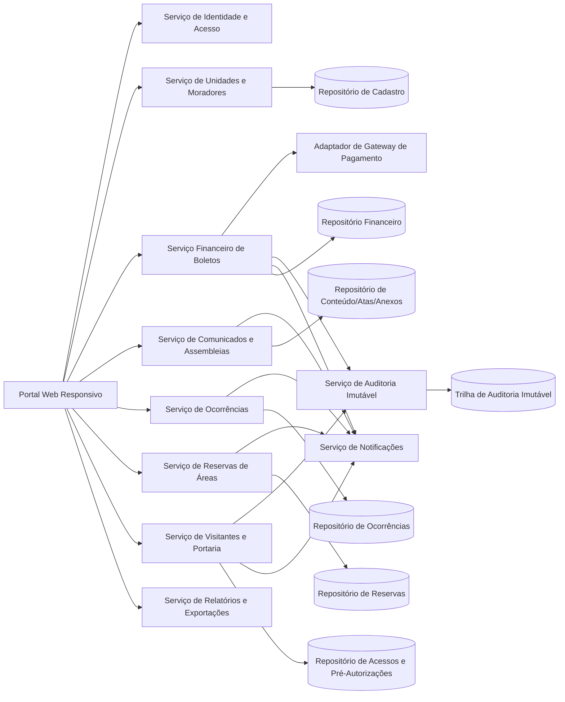
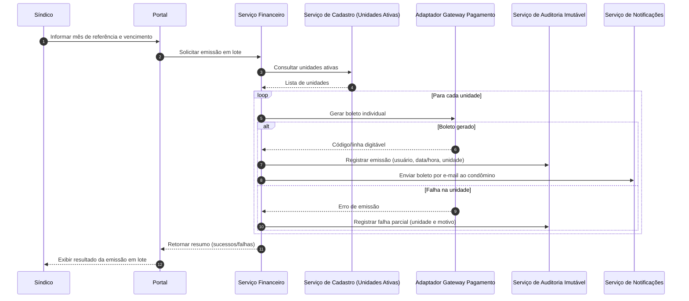

# Relatório Técnico de Arquitetura de Software

## 1. Identificação das HUs

### 1.1 Escopo funcional consolidado por perfil

- **Síndico**: HU01, HU02, HU03, HU04, HU05, HU06, HU07  
  (cadastro condominial, financeiro, comunicação, assembleias, ocorrências, reservas)
- **Condômino**: HU08, HU09, HU10, HU11, HU12  
  (autoatendimento financeiro, reservas, ocorrências, visitantes, consulta de assembleias)
- **Funcionário**: HU13, HU14  
  (controle de acesso de visitantes e consulta de pré-autorizações)

### 1.2 Mapeamento HU → Macrodomínios

1. **Identidade e Acesso**: RF01–RF03, RNF01–RNF02  
2. **Cadastro Condominial** (unidades, moradores, veículos): RF04–RF08, HU01  
3. **Financeiro (Boletos/Inadimplência)**: RF09–RF15, HU02, HU03, HU08  
4. **Comunicados e Assembleias**: RF16–RF20, HU04, HU06, HU12  
5. **Ocorrências**: RF21–RF24, HU05, HU10  
6. **Reserva de Áreas Comuns**: RF25–RF29, HU07, HU09  
7. **Controle de Acesso e Visitantes**: RF30–RF33, HU11, HU13, HU14  

### 1.3 Requisitos transversais críticos

- **Segurança e conformidade**: RNF01, RNF02, RNF03, RNF04  
- **Rastreabilidade e auditoria**: RNF05, RNF06, RNF13  
- **Operação e qualidade de serviço**: RNF07, RNF08, RNF09, RNF10, RNF11, RNF12

---

## 2. Diagramas de Arquitetura (Mermaid)

### 2.1 Diagrama de Componentes (visão lógica)

### 2.2 Diagrama de Sequência — Emissão em lote de boletos com falha parcial

---

## 3. Decisões de Arquitetura

1. **Arquitetura modular por domínios de negócio**  
   Separação explícita em módulos: Identidade, Cadastro, Financeiro, Comunicação/Assembleias, Ocorrências, Reservas, Visitantes, Notificações e Auditoria.

2. **Controle de acesso por perfil (RBAC)**  
   Políticas de autorização por papel (síndico, condômino, funcionário, administrador), cobrindo RF01–RF03.

3. **Dados pessoais com governança LGPD por padrão**  
   Minimização de dados, controle de acesso por necessidade, trilha de tratamento e políticas de retenção/anonimização (RNF04).

4. **Trilha de auditoria imutável para eventos críticos**  
   Eventos financeiros e acessos de visitantes persistidos com usuário, data/hora, operação e contexto (RNF05, RNF06, RNF13).

5. **Integração de pagamentos via adaptador externo com idempotência**  
   Confirmação de pagamento deve suportar reprocessamento sem duplicidade de baixa (RF11, RF12, RNF03).

6. **Processamento em lote resiliente com registro de falhas por unidade**  
   Operação de emissão mensal mantém consistência e reporta falhas parciais sem corromper unidades bem-sucedidas (RNF11, HU02).

7. **Motor de regras para reservas com prevenção de sobreposição**  
   Validação temporal, janelas de antecedência e prazo de cancelamento configurável por área (RF27, RF28, HU07/HU09).

8. **Notificações desacopladas dos fluxos transacionais**  
   Envio de e-mails acionado por eventos de domínio para comunicados, ocorrências, assembleias, reservas e boletos.

9. **Camada de consulta otimizada para painéis e calendários**  
   Leituras especializadas para inadimplência e calendário de reservas visando resposta em até 3 segundos (RNF08).

10. **Operação contínua com backup e recuperação**  
    Backups diários com retenção mínima de 90 dias e procedimentos de restauração testáveis (RNF12, RNF07).

---

## 4. Tabela de Componentes e Rastreabilidade

| Componente | Responsabilidade Principal | Comunica-se com | Origem (HU / Critério de Aceite) |
|---|---|---|---|
| Portal Web Responsivo | Interface de uso para síndico, condômino e funcionário | Todos os serviços de domínio | HU08, HU09, HU10, RNF09, RNF10 |
| Serviço de Identidade e Acesso | Autenticação, sessão, autorização por perfil | Portal, serviços de domínio | RF01, RF02, RF03, RNF01, RNF02 |
| Serviço de Unidades e Moradores | Gerir unidades, moradores, vínculos e veículos | Portal, Financeiro, Visitantes | HU01 (CPF único, múltiplos moradores), RF04–RF08 |
| Serviço Financeiro de Boletos | Configuração de taxa, emissão individual/lote, baixa manual e painel de inadimplência | Portal, Cadastro, Gateway, Auditoria, Notificações, Relatórios | HU02, HU03, HU08, RF09–RF15, RNF05, RNF11 |
| Adaptador de Gateway de Pagamento | Abstrair integração de cobrança e confirmações de pagamento | Serviço Financeiro | RF11, RF12, RNF03 |
| Serviço de Comunicados e Assembleias | Publicar comunicados, criar assembleias, registrar atas e anexos | Portal, Notificações, Repositório de conteúdo | HU04, HU06, HU12, RF16–RF20 |
| Serviço de Ocorrências | Registro, categorização, atualização de status e histórico | Portal, Notificações, Repositório de ocorrências | HU05, HU10, RF21–RF24 |
| Serviço de Reservas de Áreas | Cadastro de áreas/regras, reserva, cancelamento, calendário | Portal, Notificações, Repositório de reservas | HU07, HU09, RF25–RF29 |
| Serviço de Visitantes e Portaria | Pré-autorização, entrada/saída, vínculo com unidade e funcionário | Portal, Cadastro, Auditoria, Notificações | HU11, HU13, HU14, RF30–RF33, RNF06 |
| Serviço de Notificações | Enviar e-mails de eventos de domínio | Financeiro, Comunicados, Ocorrências, Reservas, Visitantes | HU02, HU04, HU05, HU06, HU09, HU10, RF17, RF24 |
| Serviço de Relatórios e Exportações | Exportações (CSV/PDF) e consultas analíticas | Financeiro, Comunicados, Ocorrências, Reservas | HU03 (CSV), HU12 (PDF) |
| Serviço de Auditoria Imutável | Armazenar logs invioláveis de eventos críticos | Financeiro, Visitantes, Ocorrências, Comunicados | RNF05, RNF06, RNF13 |

---

## 5. Bloqueios e Pendências

1. **Política financeira não detalhada**: multa, juros e correção de boletos vencidos não especificados.  
2. **Conceito de “unidade ativa”** para emissão em lote carece de regra formal (ex.: unidade sem morador).  
3. **Notificações por e-mail**: ausência de SLA de entrega/reenvio em caso de falha.  
4. **Anexos em ocorrências/atas**: sem limites de tamanho, formato permitido e política de retenção.  
5. **Exportações**: escopo de campos obrigatórios no CSV de inadimplência não fechado.  
6. **LGPD operacional**: falta definição explícita de bases legais, prazos de retenção por tipo de dado e processo de atendimento ao titular.  
7. **Disponibilidade 99,5%**: ausência de janela de manutenção e critérios de cálculo oficiais.  
8. **Backup**: RPO/RTO não definidos; requisito atual só define frequência e retenção.

---

## 6. Cobertura de Requisitos

### 6.1 Cobertura de RF

| RF | Cobertura Arquitetural |
|---|---|
| RF01–RF03 | Serviço de Identidade e Acesso + RBAC + sessão com expiração |
| RF04–RF08 | Serviço de Unidades e Moradores |
| RF09–RF15 | Serviço Financeiro + Gateway + Auditoria + Relatórios |
| RF16–RF20 | Serviço de Comunicados e Assembleias + Notificações |
| RF21–RF24 | Serviço de Ocorrências + Notificações |
| RF25–RF29 | Serviço de Reservas + motor de regras de conflito/cancelamento |
| RF30–RF33 | Serviço de Visitantes e Portaria + integração com Cadastro |

### 6.2 Cobertura de RNF

| RNF | Cobertura Arquitetural |
|---|---|
| RNF01 | Sessão autenticada com timeout de inatividade |
| RNF02 | Armazenamento de credenciais com hash seguro |
| RNF03 | Adaptador de pagamento sem retenção de dados sensíveis de cartão |
| RNF04 | Governança de dados pessoais e controle de acesso por necessidade |
| RNF05 | Auditoria imutável para emissão/baixa/registro manual financeiro |
| RNF06 | Registro de acessos de visitantes com responsável e unidade |
| RNF07 | Arquitetura para operação contínua e práticas de resiliência |
| RNF08 | Consultas otimizadas para painel de inadimplência e calendário |
| RNF09 | Portal responsivo |
| RNF10 | Compatibilidade com navegadores modernos |
| RNF11 | Emissão em lote resiliente com rastreio de falhas por unidade |
| RNF12 | Backup diário com retenção mínima de 90 dias |
| RNF13 | Log de eventos críticos centralizados |

---

## 7. Gap Analysis

| Lacuna | Impacto Arquitetural | Ação Recomendada |
|---|---|---|
| Regras de multa/juros para inadimplência ausentes | Divergência de cálculo financeiro e inconsistência no painel | Definir política de encargos por período e forma de aplicação |
| Sem contrato detalhado de integração de pagamento | Risco de falhas de confirmação e duplicidade de baixa | Especificar eventos, códigos de erro, idempotência e reconciliação |
| LGPD sem matriz de retenção por dado | Exposição regulatória e retrabalho de dados históricos | Criar matriz de retenção, descarte e atendimento a direitos do titular |
| Critérios de anexo não definidos | Risco de segurança, armazenamento e performance | Definir formatos, limite de tamanho, validação e política de expurgo |
| Falta RPO/RTO de backup | Recuperação imprevisível em incidente | Formalizar objetivos de recuperação e testes periódicos |
| “Administrador” sem fronteira clara de permissões | Conflitos de autorização e risco de privilégio excessivo | Publicar matriz de permissões por papel e exceções |
| Notificação por e-mail sem política de reentrega | Perda de comunicação crítica com usuários | Definir tentativas, fila de reenvio e monitoramento de entrega |
| Regra de cancelamento de reserva pouco precisa | Disputas operacionais entre condôminos e síndico | Especificar janela mínima, fuso horário e exceções por área |

--- 

Se quiser, posso gerar na sequência uma **matriz HU × RF × RNF detalhada** (linha a linha) para apoiar backlog, testes de aceitação e rastreabilidade de auditoria.