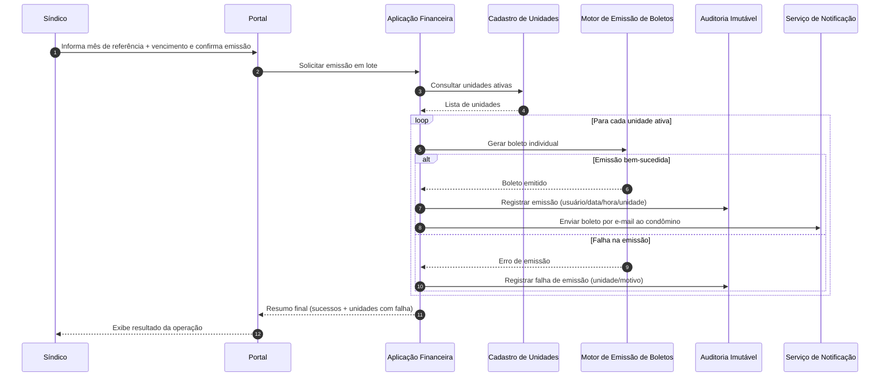
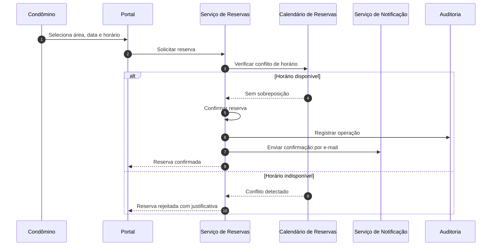

# Relatório Técnico de Arquitetura de Software

## 1. Identificação das HUs

### 1.1 Perfis de usuário e escopo funcional

- **Síndico**: HU01, HU02, HU03, HU04, HU05, HU06, HU07  
- **Condômino**: HU08, HU09, HU10, HU11, HU12  
- **Funcionário**: HU13, HU14  
- **Administrador**: não possui HU explícita no lote, mas é inferido por RF01–RF03 (gestão de acesso/perfil).

### 1.2 Agrupamento por domínio de negócio

1. **Acesso e Identidade**  
   - HU relacionadas: todas (autenticação e autorização transversal).  
   - RF: RF01, RF02, RF03.

2. **Cadastro Condominial (unidades, moradores, veículos)**  
   - HU01  
   - RF: RF04–RF08.

3. **Financeiro Condominial (boletos, pagamentos, inadimplência)**  
   - HU02, HU03, HU08  
   - RF: RF09–RF15.

4. **Comunicação e Governança (comunicados e assembleias)**  
   - HU04, HU06, HU12  
   - RF: RF16–RF20.

5. **Ocorrências**  
   - HU05, HU10  
   - RF: RF21–RF24.

6. **Reservas de Áreas Comuns**  
   - HU07, HU09  
   - RF: RF25–RF29.

7. **Portaria e Visitantes**  
   - HU11, HU13, HU14  
   - RF: RF30–RF33.

### 1.3 Requisitos não funcionais transversais

- Segurança e sessão: RNF01, RNF02, RNF03  
- Conformidade LGPD: RNF04  
- Rastreabilidade/auditoria: RNF05, RNF06, RNF13  
- Disponibilidade/desempenho: RNF07, RNF08  
- UX/compatibilidade: RNF09, RNF10  
- Confiabilidade transacional: RNF11  
- Continuidade/backup: RNF12

---

## 2. Diagramas de Arquitetura (Mermaid)

### 2.1 Diagrama de Componentes (visão lógica)

```mermaid
flowchart LR
    U[Usuários: Síndico / Condômino / Funcionário / Administrador]
    UI[Portal e Interface Responsiva]
    API[Camada de Aplicação e Orquestração]
    IAM[Gestão de Identidade e Acesso]
    CAD[Cadastro Condominial\n(Unidades, Moradores, Veículos)]
    FIN[Financeiro Condominial\n(Taxas, Boletos, Pagamentos)]
    PAY[Adaptador de Gateway de Pagamento]
    INAD[Painel de Inadimplência e Exportação]
    COM[Comunicados]
    ASM[Assembleias e Atas]
    OCR[Ocorrências]
    RES[Reservas de Áreas Comuns]
    VIS[Controle de Visitantes e Pré-autorizações]
    NOTI[Notificações (e-mail)]
    DOC[Gestão de Anexos e Documentos]
    AUD[Auditoria Imutável]
    LOG[Logs de Eventos Críticos]
    BAK[Backup e Recuperação]
    LGPD[Governança LGPD\n(Retenção/Consentimento/Minimização)]

    U --> UI --> API
    API --> IAM
    API --> CAD
    API --> FIN
    FIN --> PAY
    FIN --> INAD
    API --> COM
    API --> ASM
    API --> OCR
    API --> RES
    API --> VIS
    API --> DOC

    COM --> NOTI
    ASM --> NOTI
    OCR --> NOTI
    RES --> NOTI
    FIN --> NOTI
    VIS --> NOTI

    API --> AUD
    API --> LOG
    FIN --> AUD
    VIS --> AUD
    API --> LGPD
    API --> BAK
```

### 2.2 Diagrama de Sequência — Emissão em lote de boletos + tratamento de falha parcial (HU02, RNF11)



### 2.3 Diagrama de Sequência — Reserva de área com prevenção de sobreposição (HU09, RF27)



---

## 3. Decisões de Arquitetura

1. **Arquitetura modular por domínios de negócio**  
   - **Decisão**: separar responsabilidades em módulos (Financeiro, Reservas, Ocorrências, etc.) sob uma camada de aplicação comum.  
   - **Motivação**: reduzir acoplamento e facilitar evolução incremental por HU.  
   - **Impacto**: melhora manutenibilidade (RNF13) e rastreabilidade.

2. **Controle de acesso baseado em papéis (RBAC)**  
   - **Decisão**: autorização por perfil (síndico, condômino, funcionário, administrador) aplicada em nível de caso de uso e operação.  
   - **Motivação**: atender RF01–RF03 e RNF01.  
   - **Impacto**: políticas centralizadas e auditáveis.

3. **Auditoria imutável para eventos sensíveis**  
   - **Decisão**: registrar trilha de auditoria não editável para operações financeiras e acessos de visitantes.  
   - **Motivação**: RNF05, RNF06 e LGPD (responsabilização).  
   - **Impacto**: suporte a compliance e investigação.

4. **Integração financeira desacoplada por adaptador de gateway**  
   - **Decisão**: encapsular integração externa de pagamento por interface de adaptador.  
   - **Motivação**: RF11–RF12, RNF03.  
   - **Impacto**: reduz dependência direta de provedor e simplifica testes.

5. **Processos assíncronos para notificações e rotinas de alto volume**  
   - **Decisão**: publicação de eventos de domínio para envio de e-mail e tarefas em lote.  
   - **Motivação**: HU02, HU04, HU05, HU06, HU09, HU10; desempenho e resiliência.  
   - **Impacto**: melhora tempo de resposta da interface (RNF08).

6. **Garantia de consistência para emissão em lote com falha parcial controlada**  
   - **Decisão**: tratar cada unidade como item transacional independente, com consolidado final da operação.  
   - **Motivação**: RNF11 e critério HU02 (informar falhas por unidade).  
   - **Impacto**: evita corrupção global e permite reprocessamento direcionado.

7. **Modelo de dados com histórico e desativação lógica**  
   - **Decisão**: adotar desativação de morador sem exclusão e histórico de estados para ocorrências/visitas/boletos.  
   - **Motivação**: RF07, RF23, RF33, RNF05/RNF06.  
   - **Impacto**: preservação histórica e governança de dados.

8. **Políticas de privacidade por minimização e retenção**  
   - **Decisão**: limitar coleta/uso de dados pessoais ao necessário e definir ciclo de retenção.  
   - **Motivação**: RNF04 (LGPD).  
   - **Impacto**: exige matriz de dados pessoais por processo.

---

## 4. Tabela de Componentes e Rastreabilidade

| Componente | Responsabilidade Principal | Comunica-se com | Origem (HU / Critério de Aceite) |
|---|---|---|---|
| Portal e Interface Responsiva | Experiência de uso por perfil, acesso web/mobile, formulários e consultas | Camada de Aplicação, Identidade | HU08/CA1, HU09/CA1, RNF09, RNF10 |
| Gestão de Identidade e Acesso | Autenticação, sessão, autorização por perfil | Portal, Camada de Aplicação, Auditoria | RF01–RF03, RNF01, RNF02 |
| Cadastro Condominial | Manter unidades, moradores, tipo (proprietário/inquilino), veículos, desativação lógica | Aplicação, Auditoria | HU01/CA1-3, RF04–RF08 |
| Financeiro Condominial | Configuração de taxa, emissão individual/lote, registro manual, status de boleto | Aplicação, Gateway, Notificações, Auditoria | HU02, HU08, RF09–RF15 |
| Adaptador de Gateway de Pagamento | Intermediar cobrança e confirmação de pagamento sem reter dados sensíveis | Financeiro, Auditoria | RF11, RF12, RNF03 |
| Painel de Inadimplência e Exportação | Consolidar atrasos por unidade/período e exportar CSV | Financeiro, Aplicação | HU03/CA1-3, RF15, RNF08 |
| Comunicados | Publicação, fixação no topo, consulta no portal | Aplicação, Notificações, Logs | HU04/CA1-3, RF16, RF17 |
| Assembleias e Atas | Agenda de assembleias, registro de ata e anexos, disponibilização histórica | Aplicação, Documentos, Notificações | HU06/CA1-3, HU12/CA1-2, RF18–RF20 |
| Gestão de Ocorrências | Abertura, categorização, atualização de status e histórico | Aplicação, Notificações, Logs | HU05, HU10, RF21–RF24 |
| Reservas de Áreas Comuns | Cadastro de áreas/regras, reserva, cancelamento, validação de conflito, calendário | Aplicação, Notificações, Auditoria | HU07, HU09, RF25–RF29 |
| Controle de Visitantes e Pré-autorizações | Pré-autorização por condômino, registro de entrada/saída, vínculo de autorização, histórico | Aplicação, Auditoria, Logs | HU11, HU13, HU14, RF30–RF33 |
| Notificações | Envio de e-mails transacionais (boletos, comunicados, status, reservas, assembleias) | Financeiro, Comunicados, Ocorrências, Reservas, Assembleias, Visitantes | HU02/CA3, HU04/CA2, HU05/CA3, HU06/CA1, HU09/CA3, HU10/CA3 |
| Gestão de Documentos e Anexos | Armazenar/recuperar PDF de atas e anexos de ocorrência | Assembleias, Ocorrências, Portal | HU06/CA3, HU10/CA1, HU12/CA2 |
| Auditoria Imutável | Trilha inviolável de eventos financeiros e acesso de visitantes | Todos módulos críticos | RNF05, RNF06, RNF13 |
| Logs de Eventos Críticos | Log operacional para emissão/pagamento, comunicados, ocorrências, acessos | Módulos de domínio, Observabilidade | RNF13 |
| Governança LGPD | Políticas de consentimento, minimização, finalidade e retenção | Identidade, Cadastro, Visitantes, Auditoria | RNF04 |
| Backup e Recuperação | Backup diário, retenção mínima, restauração controlada | Repositórios de dados e documentos | RNF12 |
| Orquestrador de Rotinas | Tarefas periódicas (expiração de sessão, conciliações, lembretes, backups) | Identidade, Financeiro, Notificações, Backup | RNF01, RNF12, RF12 |

---

## 5. Bloqueios e Pendências

| Tema | Pendência | Impacto |
|---|---|---|
| Política financeira de atraso | Não há regra explícita de multa/juros/correção para inadimplência | Pode afetar cálculo e painel HU03 |
| Regras de boleto por tipo de unidade | RF09 permite por unidade ou tipo, mas sem prioridade em conflitos | Ambiguidade na geração HU02 |
| Regras de cancelamento de reserva | Prazo “configurado pelo síndico” sem granularidade (horas/dias, por área?) | Complexidade em HU07/HU09 |
| Política de anexos | Sem limites de tamanho, formatos aceitos e retenção | Risco operacional e LGPD |
| Escopo do perfil administrador | Responsabilidades não detalhadas em HU | Lacuna em autorização RBAC |
| Notificação por e-mail | Não define retentativas/falha de entrega/SLA | Incerteza de confiabilidade de comunicação |
| Exportação CSV | Sem definição de layout, codificação e fuso de datas | Risco de retrabalho e incompatibilidade |

---

## 6. Cobertura de Requisitos

### 6.1 Requisitos Funcionais (RF)

| RF | Cobertura arquitetural | Componentes principais | Status |
|---|---|---|---|
| RF01–RF03 | Cadastro de perfis, autenticação, sessão e autorização por papel | Identidade e Acesso, Portal | Coberto |
| RF04–RF08 | CRUD de unidades/moradores/veículos, vínculo e desativação lógica | Cadastro Condominial | Coberto |
| RF09–RF15 | Taxa, emissão individual/lote, integração pagamento, baixa automática/manual, inadimplência | Financeiro, Gateway, Painel Inadimplência, Auditoria | Coberto |
| RF16–RF20 | Publicação de comunicados, assembleias, atas, notificação e consulta histórica | Comunicados, Assembleias, Notificações, Documentos | Coberto |
| RF21–RF24 | Registro multiator, categorização, fluxo de status e notificação ao autor | Ocorrências, Notificações | Coberto |
| RF25–RF29 | Cadastro de áreas, regras, reserva, anti-sobreposição, cancelamento e calendário | Reservas | Coberto |
| RF30–RF33 | Registro de entrada/saída, pré-autorização, consulta em portaria, histórico por unidade | Visitantes e Pré-autorizações, Auditoria | Coberto |

### 6.2 Requisitos Não Funcionais (RNF)

| RNF | Cobertura arquitetural | Componentes principais | Status |
|---|---|---|---|
| RNF01 | Sessão com expiração e autenticação obrigatória | Identidade e Acesso, Orquestrador | Coberto |
| RNF02 | Armazenamento seguro de credenciais (hash forte) | Identidade e Acesso | Coberto |
| RNF03 | Integração aderente a PCI-DSS sem armazenamento de cartão | Adaptador Gateway, Financeiro | Coberto |
| RNF04 | Governança de dados pessoais e privacidade | Governança LGPD, Auditoria | Parcial (falta política detalhada) |
| RNF05 | Registro imutável de operações financeiras | Auditoria Imutável, Financeiro | Coberto |
| RNF06 | Registro completo de acessos de visitantes | Visitantes, Auditoria | Coberto |
| RNF07 | Disponibilidade 24/7, uptime 99,5% | Arquitetura modular + operação contínua | Parcial (depende de desenho operacional) |
| RNF08 | Painel/calendário até 3s | Inadimplência, Reservas, otimização de consulta | Parcial (exige testes de capacidade) |
| RNF09 | Responsividade | Portal Responsivo | Coberto |
| RNF10 | Compatibilidade navegadores | Portal + estratégia de testes | Parcial (precisa plano de testes cross-browser) |
| RNF11 | Lote transacional com falha parcial registrada | Financeiro, Auditoria | Coberto |
| RNF12 | Backup diário com retenção 90 dias | Backup e Recuperação | Coberto |
| RNF13 | Logs de eventos críticos | Logs de Eventos Críticos | Coberto |

---

## 7. Gap Analysis

| Lacuna | Impacto arquitetural | Ação recomendada |
|---|---|---|
| Sem definição detalhada de política de cobrança (multa/juros) | Regras de inadimplência e valor devido ficam inconsistentes | Definir política financeira parametrizável e versionada por período |
| Perfil “administrador” sem escopo funcional | Risco de permissões excessivas ou insuficientes | Criar HU específicas de administração e matriz de permissões |
| LGPD sem critérios operacionais (base legal, retenção por entidade, anonimização) | Risco de não conformidade e retrabalho estrutural | Elaborar inventário de dados pessoais + política de retenção/eliminação |
| Não há requisitos de conciliação financeira e reconciliação de pagamentos | Possível divergência entre gateway e sistema | Adicionar HU/RF de conciliação periódica e tratamento de exceções |
| SLA e política de retentativa de notificações ausentes | Notificações críticas podem não chegar sem visibilidade | Definir SLA, retentativas, fila de falhas e dashboard de entrega |
| Documentos/anexos sem limites técnicos | Risco de degradação de desempenho e custo de armazenamento | Definir limites de tamanho, tipos permitidos e política de expurgo |
| Critérios de desempenho sem volume esperado | Difícil validar RNF08 de forma objetiva | Definir carga-alvo (usuários simultâneos, reservas/dia, boletos/mês) e plano de teste |
| Ausência de requisitos de observabilidade operacional | Dificulta cumprir disponibilidade 99,5% | Definir métricas, alertas, trilhas de erro e objetivos operacionais por módulo |

**Conclusão:** a arquitetura proposta cobre integralmente os fluxos funcionais e a maior parte dos RNFs. As principais lacunas são de **detalhamento de políticas operacionais e de conformidade**, e devem ser resolvidas antes da implementação final para reduzir risco de retrabalho.