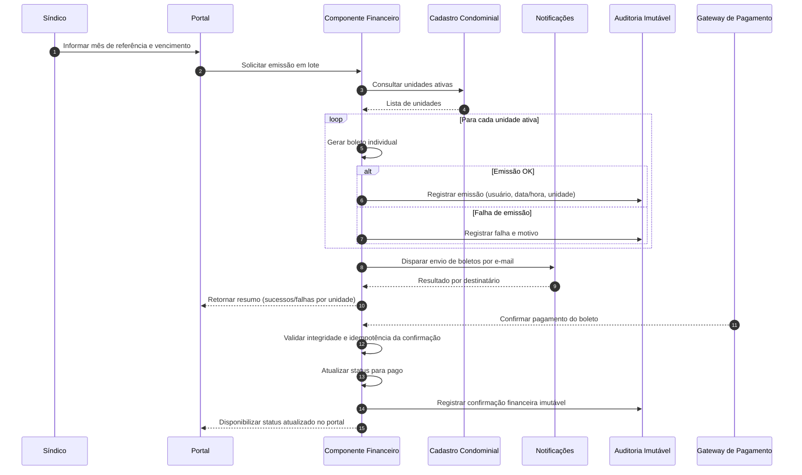
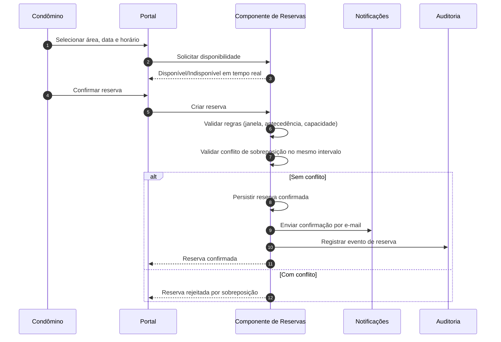

# Relatório Técnico de Arquitetura de Software

## 1. Identificação das HUs

### 1.1 Perfis e objetivos de negócio

| Perfil | HUs | Objetivo principal |
|---|---|---|
| Síndico | HU01–HU07 | Administração cadastral, financeira e operacional do condomínio |
| Condômino | HU08–HU12 | Autosserviço (boletos, reservas, ocorrências, visitantes, assembleias) |
| Funcionário | HU13–HU14 | Operação de portaria e controle de acesso |

### 1.2 Agrupamento funcional das HUs por domínio

| Domínio | HUs | RF correlatos |
|---|---|---|
| Identidade e Acesso | (transversal) | RF01, RF02, RF03 |
| Unidades e Moradores | HU01 | RF04–RF08 |
| Financeiro (Boletos/Inadimplência) | HU02, HU03, HU08 | RF09–RF15 |
| Comunicação e Assembleias | HU04, HU06, HU12 | RF16–RF20 |
| Ocorrências | HU05, HU10 | RF21–RF24 |
| Reservas de Áreas Comuns | HU07, HU09 | RF25–RF29 |
| Visitantes e Portaria | HU11, HU13, HU14 | RF30–RF33 |

---

## 2. Diagramas de Arquitetura (Mermaid)

### 2.1 Diagrama de componentes (visão lógica)

```mermaid
flowchart LR
    U1[Síndico]
    U2[Condômino]
    U3[Funcionário]
    U4[Administrador]

    UI[Portal e Interface de Operação]
    IAM[Componente de Identidade e Controle de Acesso]
    CAD[Componente de Cadastro Condominial<br/>(unidades, moradores, veículos)]
    FIN[Componente Financeiro<br/>(taxas, boletos, inadimplência)]
    COM[Componente de Comunicados e Assembleias]
    OCO[Componente de Ocorrências]
    RES[Componente de Reservas de Áreas Comuns]
    ACC[Componente de Controle de Acesso e Visitantes]
    NOTI[Componente de Notificações]
    AUD[Componente de Auditoria e Trilhas Imutáveis]
    REL[Componente de Consultas e Exportações]
    PAY[Gateway de Pagamento (Externo)]

    U1 --> UI
    U2 --> UI
    U3 --> UI
    U4 --> UI

    UI --> IAM
    UI --> CAD
    UI --> FIN
    UI --> COM
    UI --> OCO
    UI --> RES
    UI --> ACC
    UI --> REL

    FIN <--> PAY

    FIN --> NOTI
    COM --> NOTI
    OCO --> NOTI
    RES --> NOTI
    ACC --> NOTI

    FIN --> AUD
    ACC --> AUD
    COM --> AUD
    OCO --> AUD
    IAM --> AUD
```

### 2.2 Diagrama de sequência — Emissão de boletos em lote + confirmação de pagamento



### 2.3 Diagrama de sequência — Reserva sem sobreposição



---

## 3. Decisões de Arquitetura

| ID | Decisão | Justificativa | Requisitos impactados |
|---|---|---|---|
| DA01 | Arquitetura modular por domínio de negócio | Reduz acoplamento e facilita evolução incremental por HU | RF04–RF33, RNF13 |
| DA02 | Controle de acesso por perfil (RBAC) centralizado | Garante restrição de funcionalidades por papel autenticado | RF01–RF03, RNF01 |
| DA03 | Registro imutável para eventos financeiros e acesso de visitantes | Atende rastreabilidade e auditoria obrigatórias | RNF05, RNF06, RF30–RF33 |
| DA04 | Processamento assíncrono de notificações por e-mail | Evita bloquear fluxos principais e melhora experiência | RF17, RF24, HU02/HU04/HU05/HU09 |
| DA05 | Adaptador de integração com gateway de pagamento + tratamento idempotente de confirmação | Reduz dependência externa e evita atualização duplicada de pagamento | RF11, RF12, RNF03 |
| DA06 | Emissão de boletos em lote com controle transacional e relatório de falhas | Atende consistência operacional sem corromper lote | RF13, HU02, RNF11 |
| DA07 | Desativação lógica de morador (sem exclusão histórica) | Preserva histórico e conformidade de trilha | RF07, RNF04 |
| DA08 | Sessão com expiração por inatividade e autenticação obrigatória | Requisito explícito de segurança de sessão | RNF01 |
| DA09 | Camada de consultas e exportações para painéis e CSV | Suporta desempenho e necessidades analíticas | RF15, HU03, RNF08 |
| DA10 | Registro de logs críticos padronizados por evento de domínio | Facilita operação, auditoria e manutenção | RNF13, RNF05, RNF06 |

---

## 4. Tabela de Componentes e Rastreabilidade

| Componente | Responsabilidade Principal | Comunica-se com | Origem (HU / Critério de Aceite) |
|---|---|---|---|
| Portal e Interface de Operação | Expor funcionalidades por perfil, fluxos de cadastro, consulta e operação | Todos os componentes de domínio | HU01–HU14 (todos os critérios de interação do usuário) |
| Identidade e Controle de Acesso | Autenticação, encerramento de sessão, autorização por perfil | Portal, Auditoria | RF01, RF02, RF03, RNF01, RNF02 |
| Cadastro Condominial | Gestão de unidades, moradores, vínculo, tipo de morador, veículos e desativação lógica | Portal, Financeiro, Auditoria | HU01; RF04–RF08 |
| Financeiro | Configuração de taxa, emissão individual/lote, registro manual, status de pagamento, inadimplência | Portal, Cadastro, Gateway, Notificações, Auditoria, Consultas | HU02, HU03, HU08; RF09–RF15; RNF03, RNF05, RNF11 |
| Adaptador de Pagamento Externo | Encapsular envio/retorno de pagamentos e confirmações | Financeiro, Gateway | RF11, RF12, RNF03 |
| Consultas e Exportações | Painel de inadimplência, filtros e exportação CSV | Financeiro, Portal | HU03; RF15; RNF08 |
| Comunicados e Assembleias | Publicação de comunicados, criação de assembleias, atas e anexos | Portal, Notificações, Auditoria | HU04, HU06, HU12; RF16–RF20 |
| Ocorrências | Abertura, categorização, atualização de status, histórico e anexos | Portal, Notificações, Auditoria | HU05, HU10; RF21–RF24 |
| Reservas de Áreas Comuns | Cadastro de áreas/regras, disponibilidade, reserva, cancelamento, calendário | Portal, Notificações, Auditoria | HU07, HU09; RF25–RF29 |
| Controle de Acesso e Visitantes | Pré-autorização, entrada/saída, vínculo da visita, histórico por unidade | Portal, Notificações, Auditoria | HU11, HU13, HU14; RF30–RF33; RNF06 |
| Notificações | Envio de e-mails transacionais e informativos | Financeiro, Comunicados, Ocorrências, Reservas, Visitantes | RF17, RF24; HU02, HU04, HU05, HU06, HU09, HU10 |
| Auditoria e Trilhas Imutáveis | Registrar eventos críticos com usuário/data/hora e contexto | Todos os componentes de domínio | RNF05, RNF06, RNF13 |
| Gestão de Conformidade de Dados | Suporte a princípios LGPD (minimização, retenção, rastreio de tratamento) | Cadastro, Visitantes, Auditoria | RNF04 |

---

## 5. Bloqueios e Pendências

1. **Políticas financeiras não detalhadas**: multa, juros, desconto, segunda via e renegociação não foram especificados.  
2. **LGPD incompleta em requisitos operacionais**: faltam critérios para retenção, anonimização e atendimento a solicitações do titular.  
3. **Notificações por e-mail sem SLA funcional**: não há regra para retentativa, fila de falhas e monitoramento de entrega.  
4. **Anexos (atas/fotos) sem limites**: tamanho máximo, tipos permitidos e política de segurança de arquivos não definidos.  
5. **Escopo de “administrador”**: permissões exatas não descritas, podendo conflitar com papel de síndico.  
6. **Critérios de desempenho sem volumetria**: RNF08 pede até 3s, mas sem volume esperado de unidades, reservas e ocorrências.  
7. **Disponibilidade 99,5% sem RTO/RPO explícitos**: dificulta desenho de continuidade e recuperação.

---

## 6. Cobertura de Requisitos

### 6.1 Requisitos Funcionais (RF)

| ID | Cobertura arquitetural | Componentes principais | Status |
|---|---|---|---|
| RF01 | Cadastro de usuários por perfil | Identidade e Controle de Acesso | Coberto |
| RF02 | Autorização por perfil | Identidade e Controle de Acesso, Portal | Coberto |
| RF03 | Login/logout | Identidade e Controle de Acesso | Coberto |
| RF04 | CRUD de unidades | Cadastro Condominial | Coberto |
| RF05 | Cadastro e vínculo de moradores | Cadastro Condominial | Coberto |
| RF06 | Tipo proprietário/inquilino | Cadastro Condominial | Coberto |
| RF07 | Desativação sem perda de histórico | Cadastro Condominial, Auditoria | Coberto |
| RF08 | Veículos por unidade | Cadastro Condominial | Coberto |
| RF09 | Configuração de taxa condominial | Financeiro | Coberto |
| RF10 | Emissão individual de boletos | Financeiro | Coberto |
| RF11 | Integração com gateway | Financeiro, Adaptador de Pagamento | Coberto |
| RF12 | Atualização automática para pago | Financeiro | Coberto |
| RF13 | Emissão em lote mensal | Financeiro | Coberto |
| RF14 | Registro manual de pagamento | Financeiro, Auditoria | Coberto |
| RF15 | Painel de inadimplência | Consultas e Exportações, Financeiro | Coberto |
| RF16 | Publicar comunicados | Comunicados e Assembleias | Coberto |
| RF17 | Notificar novo comunicado | Comunicados e Assembleias, Notificações | Coberto |
| RF18 | Criar assembleias | Comunicados e Assembleias | Coberto |
| RF19 | Registrar ata vinculada | Comunicados e Assembleias | Coberto |
| RF20 | Consulta de assembleias/atas | Portal, Comunicados e Assembleias | Coberto |
| RF21 | Condômino registra ocorrência | Ocorrências | Coberto |
| RF22 | Funcionário registra ocorrência interna | Ocorrências | Coberto |
| RF23 | Síndico categoriza/atualiza status | Ocorrências | Coberto |
| RF24 | Notificação por mudança de status | Ocorrências, Notificações | Coberto |
| RF25 | Cadastro de áreas comuns | Reservas de Áreas Comuns | Coberto |
| RF26 | Reserva por data/horário | Reservas de Áreas Comuns | Coberto |
| RF27 | Bloqueio de sobreposição | Reservas de Áreas Comuns | Coberto |
| RF28 | Cancelamento dentro do prazo | Reservas de Áreas Comuns | Coberto |
| RF29 | Calendário geral para síndico | Reservas de Áreas Comuns, Portal | Coberto |
| RF30 | Registro entrada/saída visitante | Controle de Acesso e Visitantes | Coberto |
| RF31 | Pré-autorização por condômino | Controle de Acesso e Visitantes | Coberto |
| RF32 | Exibir pré-autorização na portaria | Controle de Acesso e Visitantes | Coberto |
| RF33 | Histórico por unidade para síndico | Controle de Acesso e Visitantes, Consultas | Coberto |

### 6.2 Requisitos Não Funcionais (RNF)

| ID | Cobertura arquitetural | Componentes principais | Status |
|---|---|---|---|
| RNF01 | Autenticação obrigatória + timeout de sessão | Identidade e Controle de Acesso | Coberto |
| RNF02 | Armazenamento seguro de senha (hash forte) | Identidade e Controle de Acesso | Coberto |
| RNF03 | Conformidade de integração financeira (sem armazenar cartão) | Financeiro, Adaptador de Pagamento | Coberto |
| RNF04 | Conformidade LGPD | Gestão de Conformidade, Cadastro, Visitantes, Auditoria | Parcial (detalhes pendentes) |
| RNF05 | Registro imutável de operações financeiras | Auditoria, Financeiro | Coberto |
| RNF06 | Registro completo de acesso de visitantes | Controle de Acesso e Visitantes, Auditoria | Coberto |
| RNF07 | Disponibilidade 24/7 com 99,5% | Arquitetura operacional transversal | Parcial (faltam SLOs operacionais detalhados) |
| RNF08 | Painel/calendário em até 3s | Consultas e Exportações, Reservas | Parcial (falta volumetria) |
| RNF09 | Interface responsiva | Portal | Coberto |
| RNF10 | Compatível com navegadores modernos | Portal | Coberto |
| RNF11 | Emissão em lote transacional com falhas mapeadas | Financeiro, Auditoria | Coberto |
| RNF12 | Backup diário com retenção de 90 dias | Operação de dados transversal | Parcial (estratégia de restauração não detalhada) |
| RNF13 | Logs de eventos críticos | Auditoria, componentes de domínio | Coberto |

---

## 7. Gap Analysis

| Lacuna | Impacto arquitetural | Ação recomendada |
|---|---|---|
| Regras de negócio de cobrança (juros/multa/desconto) não definidas | Pode exigir refatoração do módulo financeiro e recalcular inadimplência | Formalizar política financeira e cenários de exceção antes da implementação completa |
| LGPD sem fluxos operacionais (consentimento, anonimização, exclusão lógica/legal hold) | Risco regulatório e retrabalho em dados pessoais | Definir matriz de tratamento de dados por entidade (morador, visitante, funcionário) |
| Notificações sem tratamento de falha | Perda de comunicação crítica (boletos, ocorrências, assembleias) | Definir política de retentativas, prazo máximo de entrega e trilha de envio |
| Anexos sem governança (tipo/tamanho/antimalware) | Risco de segurança e custo operacional imprevisível | Especificar validações de upload e política de retenção de anexos |
| RNF08 sem volume-alvo | Não há como validar arquitetura de performance | Definir capacidade esperada (nº unidades, reservas/mês, ocorrências/dia) e critérios de teste |
| RNF07/RNF12 sem RTO/RPO e testes de restauração | Continuidade de negócio indefinida | Estabelecer objetivos de recuperação e plano de testes periódicos de backup/restore |
| Papel “administrador” sem escopo funcional | Ambiguidade de autorização e risco de privilégio excessivo | Criar matriz de permissões por papel e fluxo de auditoria de privilégios |

--- 

Se quiser, eu posso gerar uma **versão 2 deste relatório** com:  
1) matriz HU ↔ RF ↔ RNF completa, e  
2) backlog técnico priorizado (MVP, fase 2, fase 3) para execução incremental.