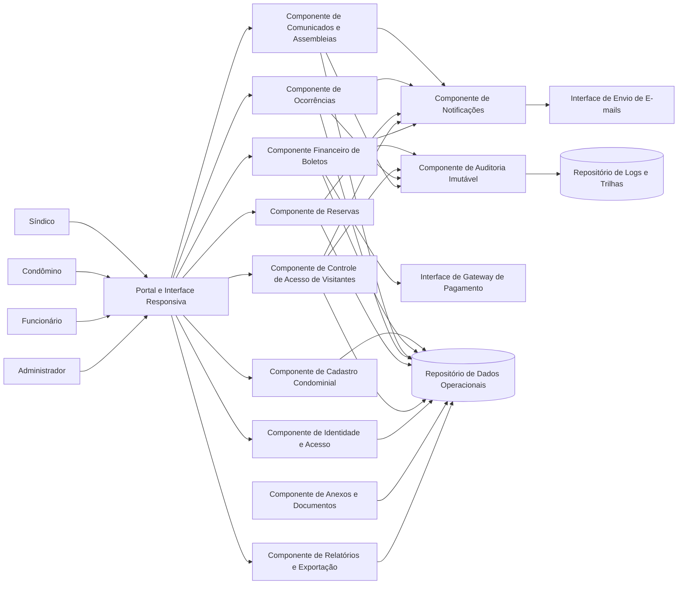
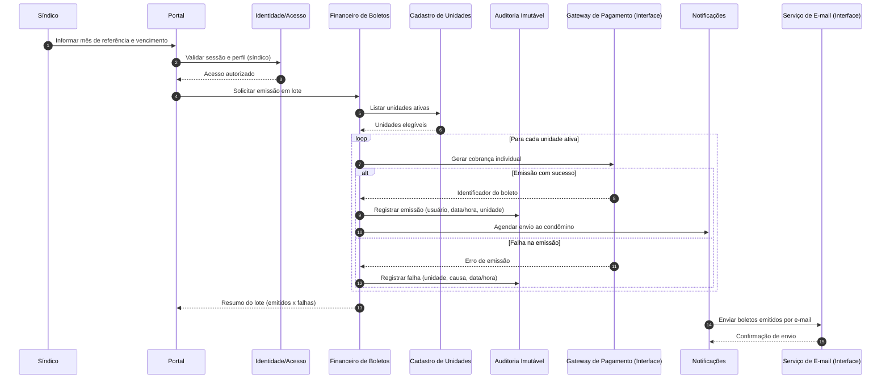

# Relatório Técnico de Arquitetura de Software

## 1. Identificação das HUs

### 1.1 Mapeamento das Histórias de Usuário por domínio

| HU | Perfil | Objetivo | Domínio Arquitetural |
|---|---|---|---|
| HU01 | Síndico | Cadastrar unidades e moradores | Cadastro Condominial |
| HU02 | Síndico | Emitir boletos em lote | Financeiro |
| HU03 | Síndico | Acompanhar inadimplências | Financeiro / Relatórios |
| HU04 | Síndico | Publicar comunicados | Comunicação |
| HU05 | Síndico | Gerenciar ocorrências | Ocorrências |
| HU06 | Síndico | Criar assembleias e registrar atas | Comunicação / Assembleias |
| HU07 | Síndico | Gerenciar áreas comuns e reservas | Reservas |
| HU08 | Condômino | Visualizar e pagar boletos | Financeiro |
| HU09 | Condômino | Reservar área comum | Reservas |
| HU10 | Condômino | Registrar e acompanhar ocorrência | Ocorrências |
| HU11 | Condômino | Pré-autorizar visitante | Portaria / Controle de Acesso |
| HU12 | Condômino | Acompanhar assembleias e atas | Comunicação / Assembleias |
| HU13 | Funcionário | Registrar entrada e saída de visitantes | Portaria / Controle de Acesso |
| HU14 | Funcionário | Consultar pré-autorizações | Portaria / Controle de Acesso |

### 1.2 Atores primários e permissões macro

- **Síndico**: administração operacional e financeira, comunicação, assembleias, ocorrências, reservas.
- **Condômino**: autoatendimento financeiro, reservas, ocorrências, pré-autorização, consulta de comunicados/atas.
- **Funcionário**: operações de portaria e ocorrências internas.
- **Administrador**: gestão sistêmica (usuários/perfis/governança operacional).

---

## 2. Diagramas de Arquitetura (Mermaid)

### 2.1 Diagrama de Componentes (visão lógica)

### 2.2 Diagrama de Sequência — Emissão de boletos em lote (HU02 + RF13 + RNF11)

---

## 3. Decisões de Arquitetura

1. **Arquitetura modular por domínios de negócio**  
   Separação explícita em componentes: Acesso, Cadastro, Financeiro, Comunicação, Ocorrências, Reservas, Portaria, Notificações, Auditoria e Relatórios.  
   **Motivo:** alta coesão por processo de negócio e melhor manutenibilidade (RNF13).

2. **Controle de acesso baseado em papéis (RBAC)**  
   Perfis: síndico, condômino, funcionário e administrador com autorização por funcionalidade (RF01, RF02).  
   **Motivo:** segurança e governança de permissões.

3. **Sessão autenticada com expiração por inatividade**  
   Encerramento automático após 30 minutos sem atividade (RF03, RNF01).  
   **Motivo:** reduzir risco de acesso indevido.

4. **Persistência de histórico com desativação lógica de entidades**  
   Moradores podem ser desativados sem apagar histórico (RF07).  
   **Motivo:** rastreabilidade e conformidade de histórico administrativo.

5. **Integração financeira por interface externa abstrata**  
   Gateway de pagamento tratado como dependência externa via contrato de integração (RF11, RNF03).  
   **Motivo:** desacoplamento e substituibilidade do provedor.

6. **Processamento de lote com tolerância a falha parcial e rastreio unitário**  
   Emissão em lote deve consolidar sucesso/falha por unidade, sem corromper resultados válidos (RF13, HU02, RNF11).  
   **Motivo:** confiabilidade operacional.

7. **Notificações assíncronas para eventos de negócio**  
   Comunicados, assembleias, boletos, ocorrências e reservas geram notificações por e-mail sem bloquear fluxo principal (RF17, RF24 e critérios HU02/HU04/HU05/HU06/HU09).  
   **Motivo:** melhor desempenho percebido e robustez.

8. **Camada de auditoria imutável para eventos críticos**  
   Registro financeiro e controle de acesso de visitantes com usuário, data/hora e contexto (RNF05, RNF06, RNF13).  
   **Motivo:** compliance, perícia e transparência.

9. **Consulta otimizada para painéis críticos**  
   Painel de inadimplência e calendário de reservas com estratégia de leitura eficiente (RNF08).  
   **Motivo:** garantir SLA de até 3 segundos.

10. **Governança de dados pessoais por princípios LGPD**  
    Minimização, finalidade, trilha de acesso, retenção e proteção de dados pessoais de moradores, funcionários e visitantes (RNF04).  
    **Motivo:** conformidade legal e redução de risco regulatório.

---

## 4. Tabela de Componentes e Rastreabilidade

| Componente | Responsabilidade Principal | Comunica-se com | Origem (HU / Critério de Aceite) |
|---|---|---|---|
| Portal e Interface Responsiva | Expor funcionalidades por perfil em web responsiva | Identidade, todos os domínios | HU08, HU09, HU10, HU11, HU12; RNF09, RNF10 |
| Identidade e Acesso | Autenticação, autorização por perfil, sessão e logout | Portal, Repositório de dados | RF01, RF02, RF03; RNF01, RNF02 |
| Cadastro Condominial | Unidades, moradores, vínculo, tipo de morador, veículos, ativação/desativação | Portal, Financeiro, Portaria, Dados | HU01; RF04-RF08 |
| Financeiro de Boletos | Configuração de taxas, emissão individual/lote, baixa automática e manual, status de boleto | Portal, Gateway de Pagamento, Notificações, Auditoria, Relatórios | HU02, HU03, HU08; RF09-RF15; HU02 critérios |
| Comunicados e Assembleias | Publicar comunicados, fixar no topo, criar assembleias, registrar ata e anexos | Portal, Notificações, Anexos, Dados | HU04, HU06, HU12; RF16-RF20 |
| Ocorrências | Registro por condômino/funcionário, categorização, workflow de status, histórico | Portal, Notificações, Auditoria, Dados | HU05, HU10; RF21-RF24 |
| Reservas de Áreas Comuns | Cadastro de áreas e regras, reserva, cancelamento, prevenção de sobreposição, calendário | Portal, Notificações, Dados, Relatórios | HU07, HU09; RF25-RF29 |
| Controle de Acesso de Visitantes | Pré-autorização, listagem para portaria, registro entrada/saída, vínculo visita-autorização, histórico | Portal, Cadastro, Auditoria, Dados | HU11, HU13, HU14; RF30-RF33 |
| Notificações | Orquestrar envio de e-mails por eventos de domínio | Financeiro, Comunicados, Ocorrências, Reservas, Portaria, Interface de e-mail | Critérios HU02/HU04/HU05/HU06/HU09/HU10; RF17, RF24 |
| Relatórios e Exportação | Painel de inadimplência, filtros e exportação CSV | Financeiro, Reservas, Dados | HU03; critério de exportação CSV |
| Auditoria Imutável | Trilhas imutáveis de eventos críticos e financeiros | Financeiro, Portaria, Ocorrências, Comunicados, Logs | RNF05, RNF06, RNF13 |
| Gestão de Anexos e Documentos | Armazenar e disponibilizar atas e anexos (PDF/fotos) | Comunicados/Assembleias, Ocorrências, Portal | HU06 (anexos), HU10 (fotos), HU12 (download PDF) |
| Interface Gateway de Pagamento | Contrato de integração para cobrança e confirmação de pagamento | Financeiro | RF11, RF12, RNF03 |
| Interface de E-mail | Entrega de notificações aos usuários | Notificações | RF17, RF24; critérios HU associados |

---

## 5. Bloqueios e Pendências

| Tema | Lacuna/Pendência | Impacto Arquitetural | Ação Recomendada |
|---|---|---|---|
| Política de multa/juros | Não há regra de cálculo para atraso de boleto | Afeta painel de inadimplência e precisão financeira | Definir fórmula e parâmetros por condomínio |
| Regras de cancelamento de reserva | “Prazo configurado” sem modelo detalhado | Ambiguidade de validação no fluxo RF28 | Definir política: horas mínimas, exceções e feriados |
| Modelo de anexos | Limites de tamanho/tipo não definidos | Risco de performance e armazenamento | Definir tipos aceitos, tamanho máximo e antivírus lógico |
| Notificações por e-mail | Não especifica retentativas/falhas de entrega | Risco de perda de comunicação crítica | Definir política de reenvio, fila de erros e monitoramento |
| LGPD operacional | Falta detalhamento de consentimento/retenção/anonimização | Risco regulatório | Definir matriz de dados pessoais, bases legais e prazos de retenção |
| Exportação CSV | Formato/colunas/locale não especificados | Inconsistência para uso administrativo | Definir layout canônico de exportação |
| Pré-autorização visitante | Janela de validade “no dia indicado” sem horário | Dúvida na portaria e risco de liberação indevida | Definir validade por faixa horária e tolerância |
| SLA interno RNF08 | Métrica de “até 3s” sem volume de dados de referência | Dificulta testes de desempenho | Definir cenário de carga base e critérios de aceite de performance |

---

## 6. Cobertura de Requisitos

### 6.1 Cobertura de Requisitos Funcionais (RF)

| RF | Cobertura Arquitetural |
|---|---|
| RF01 | Identidade e Acesso (cadastro com perfis) |
| RF02 | Identidade e Acesso + Controle de autorização no Portal |
| RF03 | Identidade e Acesso (login/logout/sessão) |
| RF04 | Cadastro Condominial (unidades) |
| RF05 | Cadastro Condominial (moradores + vínculo unidade) |
| RF06 | Cadastro Condominial (proprietário/inquilino) |
| RF07 | Cadastro Condominial (desativação lógica) |
| RF08 | Cadastro Condominial (veículos por unidade) |
| RF09 | Financeiro (taxa por unidade/tipo) |
| RF10 | Financeiro (emissão individual) |
| RF11 | Interface Gateway + Financeiro |
| RF12 | Financeiro (atualização automática por confirmação) |
| RF13 | Financeiro (emissão em lote) |
| RF14 | Financeiro (registro manual de pagamento) |
| RF15 | Relatórios/Financeiro (inadimplência) |
| RF16 | Comunicados e Assembleias (publicação) |
| RF17 | Notificações + Interface de E-mail |
| RF18 | Comunicados e Assembleias (criação de assembleias) |
| RF19 | Comunicados e Assembleias + Anexos (ata vinculada) |
| RF20 | Portal + Comunicados e Assembleias (consulta condômino) |
| RF21 | Ocorrências (registro por condômino) |
| RF22 | Ocorrências (registro por funcionário) |
| RF23 | Ocorrências (categorização e status) |
| RF24 | Notificações (status de ocorrência por e-mail) |
| RF25 | Reservas (cadastro de áreas e regras) |
| RF26 | Reservas (criação de reserva por condômino) |
| RF27 | Reservas (bloqueio de sobreposição) |
| RF28 | Reservas (cancelamento com prazo configurável) |
| RF29 | Reservas/Relatórios (calendário global) |
| RF30 | Controle de Acesso (entrada/saída visitante) |
| RF31 | Controle de Acesso (pré-autorização por condômino) |
| RF32 | Controle de Acesso (consulta pré-autorização por funcionário) |
| RF33 | Controle de Acesso + Relatórios (histórico por unidade) |

### 6.2 Cobertura de Requisitos Não Funcionais (RNF)

| RNF | Cobertura Arquitetural |
|---|---|
| RNF01 | Sessão com timeout e autenticação obrigatória no componente de Identidade |
| RNF02 | Política de armazenamento seguro de credenciais no domínio de Identidade |
| RNF03 | Interface de pagamento sem retenção de dados sensíveis de cartão |
| RNF04 | Governança LGPD transversal: minimização, controle de acesso e trilha |
| RNF05 | Auditoria imutável para emissão/pagamento/registro manual |
| RNF06 | Auditoria de acessos de visitantes com responsável e unidade |
| RNF07 | Desenho operacional orientado a disponibilidade contínua |
| RNF08 | Estratégia de leitura otimizada para painéis críticos |
| RNF09 | Portal responsivo |
| RNF10 | Compatibilidade com navegadores modernos na camada de interface |
| RNF11 | Fluxo transacional de lote com relatório de falhas parciais |
| RNF12 | Processo de backup diário com retenção mínima de 90 dias |
| RNF13 | Logs de eventos críticos via Auditoria + monitoramento de eventos |

---

## 7. Gap Analysis

### 7.1 Lacunas reais identificadas

1. **Regra financeira incompleta (juros/multa/atualização monetária)**  
   - **Impacto:** inadimplência pode ser apresentada sem consistência contábil.  
   - **Recomendação:** formalizar política de encargos por atraso e incidência por período.

2. **Ambiguidade na janela de pré-autorização de visitante**  
   - **Impacto:** inconsistência operacional na portaria e risco de segurança.  
   - **Recomendação:** definir validade por data/hora, tolerância e regras de expiração.

3. **Política de anexos não definida**  
   - **Impacto:** risco de uso indevido de armazenamento e degradação de desempenho.  
   - **Recomendação:** limites de tamanho, formatos permitidos e saneamento de arquivos.

4. **Critérios de desempenho sem baseline de carga**  
   - **Impacto:** RNF08 difícil de validar objetivamente.  
   - **Recomendação:** estabelecer volume de unidades, reservas e ocorrências para teste de referência.

5. **Conformidade LGPD sem requisitos operacionais detalhados**  
   - **Impacto:** risco regulatório em retenção, anonimização e direitos do titular.  
   - **Recomendação:** criar requisitos explícitos de ciclo de vida de dados pessoais.

6. **Processo de recuperação de falhas de integração externa pouco detalhado**  
   - **Impacto:** possível divergência entre status financeiro interno e confirmação externa.  
   - **Recomendação:** definir reconciliação periódica e tratamento de inconsistências.

### 7.2 Síntese de prontidão arquitetural

- **Cobertura funcional:** completa para RF01–RF33.  
- **Cobertura não funcional:** aderente em nível de arquitetura, com pendências de especificação operacional (principalmente LGPD, performance e políticas financeiras).  
- **Próximo passo recomendado:** transformar pendências em requisitos refinados (épicos técnicos + critérios de aceite testáveis) antes da implementação incremental.