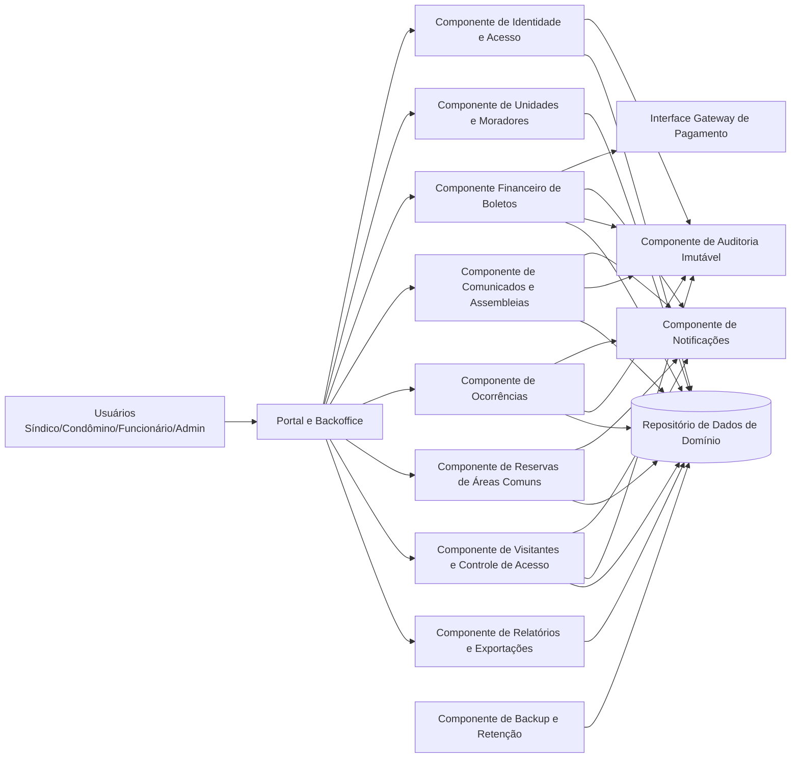
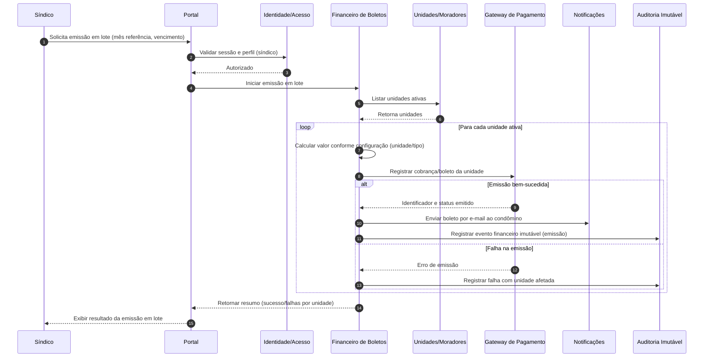

# Relatório Técnico de Arquitetura de Software

## 1. Identificação das HUs

| HU | Perfil | Objetivo de Negócio | RFs Relacionados | Critérios de Aceite Arquiteturalmente Relevantes |
|---|---|---|---|---|
| HU01 | Síndico | Cadastrar unidades e moradores | RF04, RF05, RF06, RF07, RF08 | obrigatoriedade de campos, CPF único, múltiplos moradores por unidade |
| HU02 | Síndico | Emitir boletos em lote | RF09, RF10, RF11, RF12, RF13, RF15 | mês/vencimento obrigatórios, boleto por unidade ativa, envio por e-mail, falhas por unidade |
| HU03 | Síndico | Acompanhar inadimplências | RF15 | filtros por bloco/período/faixa, exportação CSV |
| HU04 | Síndico | Publicar comunicados | RF16, RF17 | publicação com metadados, notificação imediata, fixação no topo |
| HU05 | Síndico | Gerenciar ocorrências | RF21, RF22, RF23, RF24 | listagem com filtros, atualização de status, notificação ao autor |
| HU06 | Síndico | Criar assembleias e registrar atas | RF18, RF19, RF20 | notificação de criação, ata vinculada, anexos, disponibilização no portal |
| HU07 | Síndico | Gerenciar áreas comuns e reservas | RF25, RF26, RF27, RF28, RF29 | regras por área, visão calendário, cancelamento pelo síndico com notificação |
| HU08 | Condômino | Visualizar/pagar boleto | RF10, RF11, RF12 | listagem por status, download, atualização automática de pagamento |
| HU09 | Condômino | Reservar área comum | RF26, RF27, RF28 | disponibilidade em tempo real, confirmação imediata, e-mail confirmação |
| HU10 | Condômino | Registrar/acompanhar ocorrência | RF21, RF24 | abertura com categoria/descrição/anexo, histórico de status, notificação |
| HU11 | Condômino | Pré-autorizar visitante | RF31, RF32 | pré-autorização visível na portaria, cancelamento antes da entrada |
| HU12 | Condômino | Acompanhar assembleias/atas | RF20 | agenda futura e consulta/download de atas |
| HU13 | Funcionário | Registrar entrada/saída visitante | RF30, RF32, RF33 | entrada com dados obrigatórios, destaque pré-autorização, encerramento na saída |
| HU14 | Funcionário | Consultar pré-autorizações | RF32 | filtros, vínculo da entrada com pré-autorização |

---

## 2. Diagramas de Arquitetura (Mermaid)

### 2.1 Diagrama de Componentes (visão lógica)

### 2.2 Diagrama de Sequência — Emissão de boletos em lote (HU02)

---

## 3. Decisões de Arquitetura

| ID | Decisão | Motivação | Impacto |
|---|---|---|---|
| DA01 | Arquitetura modular por domínios de negócio | Reduz acoplamento entre financeiro, reservas, visitantes etc. | Facilita manutenção (RNF13) e evolução incremental |
| DA02 | Controle de acesso baseado em papéis e permissões | RF01–RF03 e segregação por perfil | Segurança de acesso (RNF01), reduz risco de acesso indevido |
| DA03 | Auditoria imutável para eventos críticos | RNF05, RNF06 e RNF13 | Rastreabilidade forte para finanças e portaria |
| DA04 | Processos assíncronos para notificações por e-mail | RF17, RF24 e notificações massivas (HU02/HU06) | Melhora tempo de resposta da interface e confiabilidade operacional |
| DA05 | Integração externa por interface abstrata de pagamento | RF11 e RNF03 | Troca de provedor com baixo impacto no núcleo financeiro |
| DA06 | Regra de não sobreposição de reservas validada no domínio | RF27 e HU09 | Evita conflito de agenda com consistência transacional |
| DA07 | Desativação lógica de morador (sem exclusão histórica) | RF07 e LGPD com retenção necessária | Preserva histórico e evita perda de rastreabilidade |
| DA08 | Estratégia de timeout de sessão e gestão de autenticação | RNF01 | Reforça segurança operacional em acessos compartilhados |
| DA09 | Modelo de dados com suporte a anexos e documentos | HU06, HU10, HU12 | Suporta atas, fotos de ocorrência e downloads por portal |
| DA10 | Relatórios otimizados para consultas operacionais | RNF08, HU03, HU07 | Painéis em até 3s com filtros e exportação |

---

## 4. Tabela de Componentes e Rastreabilidade

| Componente | Responsabilidade Principal | Comunica-se com | Origem (HU / Critério de Aceite) |
|---|---|---|---|
| Portal e Backoffice | Interface para síndico, condômino, funcionário e admin | Todos os componentes de domínio | HU01–HU14 (acesso às funcionalidades) |
| Identidade e Acesso | Autenticação, sessão, autorização por perfil | Portal, Auditoria, Repositório de dados | RF01, RF02, RF03, RNF01, RNF02 |
| Unidades e Moradores | CRUD de unidades, moradores, vínculo, tipo (proprietário/inquilino), veículos, desativação | Portal, Financeiro, Visitantes, Dados | HU01; RF04–RF08 |
| Financeiro de Boletos | Configuração de taxa, emissão individual/lote, status, pagamentos manuais, inadimplência | Portal, Gateway, Notificações, Auditoria, Relatórios, Dados | HU02, HU03, HU08; RF09–RF15; RNF05, RNF11 |
| Interface Gateway de Pagamento | Abstração de comunicação e confirmação de pagamento | Financeiro | HU08; RF11, RF12; RNF03 |
| Comunicados e Assembleias | Publicação de comunicados, assembleias, atas, anexos, fixação | Portal, Notificações, Auditoria, Dados | HU04, HU06, HU12; RF16–RF20 |
| Ocorrências | Registro, categorização, atualização de status, histórico | Portal, Notificações, Auditoria, Dados | HU05, HU10; RF21–RF24 |
| Reservas de Áreas Comuns | Cadastro de áreas e regras, reserva/cancelamento, calendário, bloqueio de sobreposição | Portal, Notificações, Dados | HU07, HU09; RF25–RF29 |
| Visitantes e Controle de Acesso | Pré-autorização, entrada/saída, vínculo com autorização, histórico por unidade | Portal, Unidades/Moradores, Auditoria, Dados | HU11, HU13, HU14; RF30–RF33; RNF06 |
| Notificações | Envio de e-mails transacionais e informativos | Financeiro, Comunicados, Ocorrências, Reservas, Visitantes | HU02, HU04, HU05, HU06, HU09, HU10; RF17, RF24 |
| Relatórios e Exportações | Painel de inadimplência, calendário consolidado, exportações (CSV) | Financeiro, Reservas, Dados | HU03, HU07; RF15; RNF08 |
| Auditoria Imutável | Registro não editável de eventos críticos e financeiros | IAM, Financeiro, Visitantes, Comunicados, Ocorrências | RNF05, RNF06, RNF13 |
| Backup e Retenção | Backup diário e retenção mínima exigida | Repositório de dados | RNF12 |
| Repositório de Dados de Domínio | Persistência de entidades e histórico | Todos os componentes de negócio | Todos RFs + RNFs de confiabilidade/rastreabilidade |

---

## 5. Bloqueios e Pendências

1. **Regras financeiras incompletas**  
   Falta definição explícita de multa, juros, descontos e recálculo de boletos vencidos.  
2. **Conciliação de pagamentos**  
   Não está claro SLA de confirmação do gateway (tempo máximo para refletir pagamento).  
3. **Política de anexos**  
   Limites de tamanho, tipos permitidos e retenção de anexos (atas/fotos) não especificados.  
4. **LGPD operacional**  
   Ausentes regras de consentimento, base legal por tipo de dado e fluxo de anonimização/eliminação.  
5. **Política de notificação**  
   Reenvio, tratamento de falha de entrega e trilha de leitura não definidos.  
6. **Escopo de administrador**  
   RF01 cita perfil administrador, mas sem responsabilidades e permissões detalhadas.  
7. **Parâmetros de reserva**  
   Prioridade de conflito (ex.: bloqueios administrativos, manutenção) não detalhada.

---

## 6. Cobertura de Requisitos

### 6.1 Cobertura dos RFs

- **RF01–RF03**: cobertos por **Identidade e Acesso** + **Portal**.  
- **RF04–RF08**: cobertos por **Unidades e Moradores**.  
- **RF09–RF15**: cobertos por **Financeiro**, **Gateway**, **Relatórios**, **Auditoria**.  
- **RF16–RF20**: cobertos por **Comunicados e Assembleias** + **Notificações**.  
- **RF21–RF24**: cobertos por **Ocorrências** + **Notificações**.  
- **RF25–RF29**: cobertos por **Reservas de Áreas Comuns** + **Relatórios**.  
- **RF30–RF33**: cobertos por **Visitantes e Controle de Acesso** + **Auditoria**.

**Status:** Cobertura funcional arquitetural **completa** no nível de desenho lógico.

### 6.2 Cobertura dos RNFs

| RNF | Cobertura Arquitetural |
|---|---|
| RNF01 | IAM com autenticação, autorização e timeout de sessão |
| RNF02 | Política de armazenamento seguro de credenciais no IAM |
| RNF03 | Integração por interface com gateway aderente PCI-DSS; sem armazenamento de cartão |
| RNF04 | Separação de dados pessoais, rastreabilidade e pendência de políticas LGPD detalhadas |
| RNF05 | Auditoria imutável para operações financeiras |
| RNF06 | Registro obrigatório de acesso de visitante com operador e unidade |
| RNF07 | Requer desenho operacional de disponibilidade (monitoramento/redundância) |
| RNF08 | Relatórios otimizados e consultas especializadas |
| RNF09 | Portal responsivo (requisito de UX a ser validado em testes) |
| RNF10 | Compatibilidade por testes de navegador |
| RNF11 | Emissão em lote com resultado por unidade e tolerância a falha parcial |
| RNF12 | Componente de backup diário com retenção 90 dias |
| RNF13 | Logging de eventos críticos via Auditoria + logs de domínio |

---

## 7. Gap Analysis

| Lacuna | Impacto Arquitetural | Recomendação |
|---|---|---|
| Regras de cálculo financeiro (multa/juros/desconto) ausentes | Pode gerar inconsistência de cobrança e retrabalho no Financeiro | Definir matriz de cálculo por atraso e política de exceções |
| SLA de confirmação do pagamento não definido | Ambiguidade no “tempo real” de atualização de status do boleto | Formalizar tempos máximos e estados intermediários de pagamento |
| LGPD sem regras operacionais detalhadas | Risco de não conformidade legal | Definir ciclo de vida de dados, consentimento, anonimização e atendimento a titulares |
| Falhas de e-mail sem fluxo de contingência | Perda de comunicação crítica (boletos/status/avisos) | Especificar política de reenvio, fila de erro e monitoramento |
| Permissões do perfil administrador não especificadas | Risco de privilégio excessivo ou insuficiente | Criar matriz de autorização por funcionalidade |
| Política de retenção de anexos/documentos não definida | Crescimento descontrolado e risco de compliance | Definir prazo de retenção, tamanho máximo e classes de documento |
| Regras de bloqueio de agenda (manutenção, eventos internos) ausentes | Conflitos no módulo de reservas | Adicionar calendário de indisponibilidade administrativa |
| Estratégia de exportação CSV (volume/limites) não especificada | Possível degradação de desempenho | Definir paginação, limites de período e geração assíncrona quando necessário |

**Conclusão do Gap:** O desenho está consistente para iniciar implementação, mas os pontos acima devem virar histórias técnicas/regras de negócio antes da construção dos módulos financeiros, notificações e LGPD para evitar retrabalho e risco regulatório.