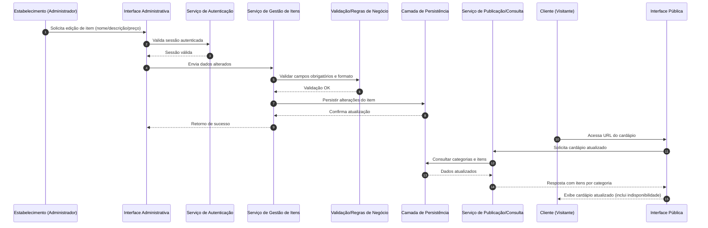

# Relatório Técnico de Arquitetura de Software

## 1. Identificação das HUs

### 1.1 Contexto e Atores
- **Ator 1: Estabelecimento (Administrador)**  
  Responsável por manter o cardápio (itens, categorias, disponibilidade).
- **Ator 2: Cliente (Visitante público)**  
  Consulta o cardápio via navegador, sem autenticação.

### 1.2 Inventário de Histórias de Usuário e Rastreabilidade Primária

| HU | Descrição resumida | RF relacionados | RNF relacionados |
|---|---|---|---|
| HU01 | Cadastrar item com nome, descrição e preço | RF01, RF11 | RNF05 |
| HU02 | Criar categorias, associar item e controlar ordem | RF04, RF05, RF09 | RNF05 |
| HU03 | Editar item | RF02, RF11 | RNF05 |
| HU04 | Marcar/desmarcar indisponibilidade | RF06, RF07, RF10 | RNF05 |
| HU05 | Remover item com confirmação | RF03 | RNF05 |
| HU06 | Visualizar cardápio sem cadastro/login | RF08 | RNF01, RNF02, RNF06, RNF07 |
| HU07 | Navegar por categorias | RF09 | RNF01, RNF06 |
| HU08 | Identificar indisponíveis visualmente | RF10 | RNF01, RNF07 |

---

## 2. Diagramas de Arquitetura (Mermaid)

### 2.1 Diagrama de Componentes (Visão Lógica)

```mermaid
flowchart LR
    A[Interface Web Pública<br/>Cardápio do Cliente]
    B[Interface Web Administrativa]
    C[Controlador de Sessão Administrativa<br/>(Autenticação)]
    D[Serviço de Gestão de Itens]
    E[Serviço de Gestão de Categorias]
    F[Serviço de Disponibilidade de Itens]
    G[Serviço de Publicação/Consulta de Cardápio]
    H[Camada de Persistência]
    I[Validação e Regras de Negócio]
    J[Monitoramento e Métricas]

    B --> C
    B --> D
    B --> E
    B --> F
    D --> I
    E --> I
    F --> I
    D --> H
    E --> H
    F --> H

    A --> G
    G --> H
    G --> I

    C --> H
    D --> J
    E --> J
    F --> J
    G --> J
```

### 2.2 Diagrama de Sequência — Edição de item e atualização imediata do cardápio público



---

## 3. Decisões de Arquitetura

| ID | Decisão | Motivação | Impacto |
|---|---|---|---|
| DA01 | Separar interface pública e administrativa em contextos funcionais distintos | Reduz acoplamento e risco de exposição de funções administrativas | Facilita segurança (RNF03) e evolução independente |
| DA02 | Centralizar regras de validação de item/categoria/disponibilidade em módulo de regras de negócio | Evitar divergência entre telas e operações | Consistência funcional para RF01, RF02, RF04, RF06 |
| DA03 | Modelo de item com estado de disponibilidade (ativo/indisponível) sem remoção obrigatória | Atender indisponibilidade temporária com visibilidade pública | Cobertura direta de RF06, RF07, RF10 e HU04/HU08 |
| DA04 | Consulta pública do cardápio por serviço dedicado de leitura/publicação | Melhorar desempenho e simplificar otimizações de leitura | Apoia RNF02 (tempo de carregamento) e RNF04 (disponibilidade) |
| DA05 | Controle explícito de ordenação de categorias | Critério de aceite da HU02 exige ordem controlável | Necessita atributo de ordenação e operação de reordenação |
| DA06 | Autenticação obrigatória apenas para área administrativa | Cliente deve acessar sem login (HU06) | Delimita fronteira de segurança sem criar fricção pública |
| DA07 | Instrumentar métricas de disponibilidade e latência | Necessário para comprovar RNF02 e RNF04 | Permite governança operacional e melhoria contínua |

---

## 4. Tabela de Componentes e Rastreabilidade

| Componente | Responsabilidade Principal | Comunica-se com | Origem (HU / Critério de Aceite) |
|---|---|---|---|
| Interface Web Administrativa | Permitir CRUD de itens/categorias e alteração de disponibilidade | Serviço de Autenticação, Gestão de Itens, Gestão de Categorias, Disponibilidade | HU01, HU02, HU03, HU04, HU05 |
| Serviço de Autenticação Administrativa | Validar usuário/senha e sessão para acesso administrativo | Interface Administrativa, Camada de Persistência | RNF03 |
| Serviço de Gestão de Itens | Cadastrar, editar, remover itens e validar campos obrigatórios | Interface Administrativa, Regras de Negócio, Persistência | HU01 (campos obrigatórios), HU03, HU05; RF01, RF02, RF03 |
| Serviço de Gestão de Categorias | Criar/editar/remover categorias, associar item a categoria, manter ordenação | Interface Administrativa, Regras de Negócio, Persistência | HU02 (criar, nomear, associar, controlar ordem); RF04, RF05, RF09 |
| Serviço de Disponibilidade de Itens | Marcar/desmarcar indisponibilidade sem exclusão | Interface Administrativa, Regras de Negócio, Persistência | HU04 (indisponível e reversão), HU08; RF06, RF07, RF10 |
| Serviço de Publicação/Consulta de Cardápio | Fornecer cardápio público por categoria com status de disponibilidade | Interface Pública, Persistência, Regras de Negócio | HU06, HU07, HU08; RF08, RF09, RF10, RF11 |
| Interface Web Pública | Exibir cardápio sem autenticação, responsivo e acessível | Serviço de Publicação/Consulta | HU06, HU07, HU08; RNF01, RNF06, RNF07 |
| Camada de Persistência | Armazenar itens, categorias, relações, estado de disponibilidade e ordem | Serviços de domínio e autenticação | Todos os RF de manutenção e consulta |
| Módulo de Regras de Negócio/Validação | Validar obrigatoriedade de campos, consistência de associação e formato de dados | Serviços de Itens/Categorias/Disponibilidade/Publicação | HU01 (validação), HU02 (uma categoria por item), HU03 |
| Monitoramento e Métricas | Coletar disponibilidade, tempo de resposta e erros | Todos os serviços de aplicação | RNF02, RNF04 |

---

## 5. Bloqueios e Pendências

| Tipo | Item | Impacto Arquitetural | Ação recomendada |
|---|---|---|---|
| Pendência | Não está explícito se o sistema é para um único estabelecimento ou multiestabelecimento | Afeta modelo de domínio, autenticação e isolamento de dados | Definir escopo (single-tenant vs multi-tenant) antes da modelagem física |
| Pendência | Política de exclusão de item (física vs lógica) não definida | Impacta auditoria, histórico e restauração | Definir estratégia de exclusão e retenção |
| Pendência | Regras de formatação de preço/moeda não detalhadas | Pode causar inconsistência em exibição e cálculos | Especificar moeda, casas decimais e arredondamento |
| Pendência | Critério “imediatamente” não quantificado | Ambiguidade na expectativa de atualização pública | Definir SLA interno (ex.: segundos máximos após alteração) |
| Pendência | Acessibilidade cita WCAG 2.1 A, mas sem checklist de critérios | Risco de interpretação parcial | Criar checklist de critérios mínimos de conformidade |
| Pendência | Não há requisito explícito de recuperação de senha | Impacta suporte e operação administrativa | Definir política de gestão de credenciais |

---

## 6. Cobertura de Requisitos

### 6.1 Cobertura dos Requisitos Funcionais

| Requisito | Cobertura arquitetural | Status |
|---|---|---|
| RF01 | Serviço de Gestão de Itens + Regras de Negócio + Interface Administrativa | Coberto |
| RF02 | Serviço de Gestão de Itens + Interface Administrativa | Coberto |
| RF03 | Serviço de Gestão de Itens + confirmação na Interface Administrativa | Coberto |
| RF04 | Serviço de Gestão de Categorias + Interface Administrativa | Coberto |
| RF05 | Associação item-categoria no Serviço de Categorias/Regras | Coberto |
| RF06 | Serviço de Disponibilidade de Itens | Coberto |
| RF07 | Serviço de Disponibilidade de Itens (reativação) | Coberto |
| RF08 | Interface Pública + Serviço de Publicação sem autenticação | Coberto |
| RF09 | Serviço de Publicação retorna itens agrupados por categoria | Coberto |
| RF10 | Estado de indisponibilidade + indicação visual na Interface Pública | Coberto |
| RF11 | Serviço de Publicação expõe nome/descrição/preço | Coberto |

### 6.2 Cobertura dos Requisitos Não Funcionais

| Requisito | Estratégia arquitetural | Status |
|---|---|---|
| RNF01 (Responsividade) | Interface Pública com adaptação a múltiplos formatos de tela | Coberto |
| RNF02 (até 3s) | Serviço de leitura dedicado, otimização de consulta e métricas de latência | Parcial (depende de meta operacional detalhada) |
| RNF03 (autenticação admin) | Componente de autenticação e sessão para área administrativa | Coberto |
| RNF04 (99% 24/7) | Monitoramento, desenho modular e operação com alta disponibilidade | Parcial (depende de plano operacional) |
| RNF05 (modularidade) | Separação por componentes de domínio e interfaces | Coberto |
| RNF06 (navegadores modernos) | Interface pública com compatibilidade transversal e testes funcionais | Parcial (depende de matriz de testes) |
| RNF07 (WCAG 2.1 A) | Diretrizes de acessibilidade na interface pública | Parcial (depende de checklist e validação formal) |

---

## 7. Gap Analysis

| Lacuna | Impacto | Risco | Recomendação |
|---|---|---|---|
| Escopo de tenancy não definido | Pode exigir refatoração estrutural de dados e autenticação | Alto | Decisão arquitetural antecipada sobre isolamento por estabelecimento |
| “Atualização imediata” sem SLA numérico | Dificulta teste de aceite e monitoramento | Médio | Definir tempo máximo de propagação após CRUD |
| Sem definição de auditoria/histórico | Dificulta rastrear alterações administrativas | Médio | Incluir requisito de trilha de auditoria mínima |
| Sem política de exclusão e recuperação | Perda irreversível de dados por erro operacional | Médio | Definir exclusão lógica e fluxo de restauração |
| Acessibilidade sem critérios verificáveis | Entrega pode não atender conformidade real | Médio | Anexar checklist WCAG A e critérios de teste |
| Disponibilidade 99% sem janela de manutenção | Ambiguidade contratual/operacional | Médio | Definir calendário e regra de cálculo de SLA |
| Compatibilidade de navegadores sem versões alvo | Testes incompletos ou subjetivos | Baixo | Definir versões mínimas suportadas |

### Síntese Final
A arquitetura proposta cobre integralmente os **RFs** e estabelece base sólida para os **RNFs**, com atenção à separação entre domínio administrativo e consulta pública. As principais lacunas estão em **parâmetros operacionais e de qualidade mensurável** (SLA, acessibilidade verificável, política de dados), que devem ser refinados antes da implementação para reduzir retrabalho e risco de não conformidade.