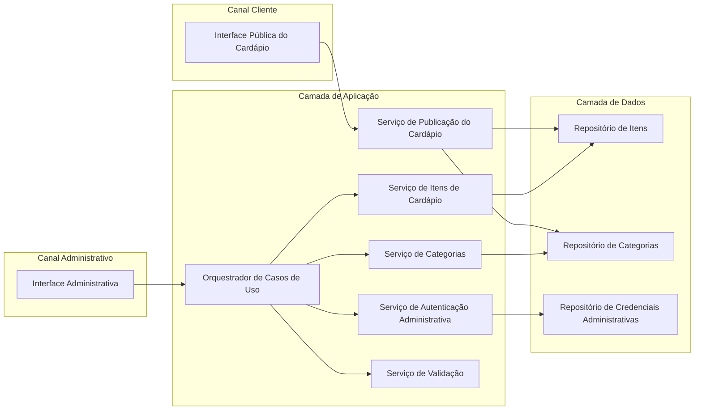
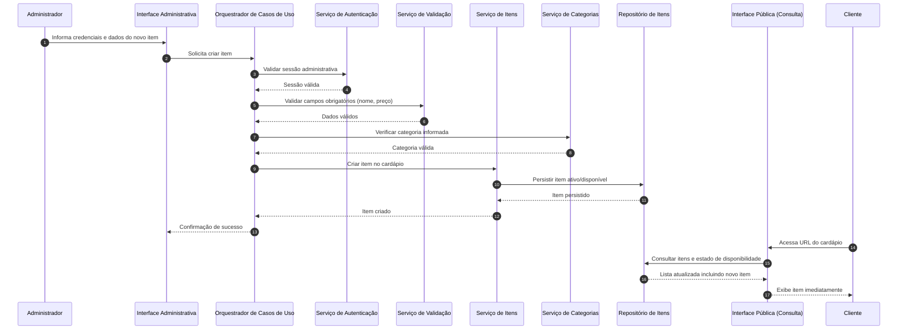

# Relatório Técnico de Arquitetura de Software

## 1. Identificação das HUs

### 1.1 Contexto funcional consolidado
O sistema possui dois perfis principais:

- **Estabelecimento (Administrador)**: gerencia itens e categorias do cardápio.
- **Cliente (Visitante)**: consulta o cardápio publicamente, sem autenticação.

### 1.2 Mapeamento das Histórias de Usuário (HU)

| HU | Perfil | Objetivo de Negócio | RF Relacionados | Critérios de Aceite Relevantes |
|---|---|---|---|---|
| HU01 | Estabelecimento | Cadastrar item com nome, descrição e preço | RF01, RF08, RF11 | Validação de nome/preço obrigatórios; exibição imediata no cardápio |
| HU02 | Estabelecimento | Criar categorias e associar item a categoria | RF04, RF05, RF09 | Categoria livre; item em apenas uma categoria; ordenação de categorias |
| HU03 | Estabelecimento | Editar item existente | RF02, RF08, RF11 | Alterações refletidas imediatamente; todos os campos editáveis modificáveis |
| HU04 | Estabelecimento | Marcar/desfazer indisponibilidade | RF06, RF07, RF10 | Item continua visível com indicador claro; reversão a qualquer momento |
| HU05 | Estabelecimento | Remover item do cardápio | RF03 | Confirmação antes de excluir; item não aparece mais no público |
| HU06 | Cliente | Visualizar cardápio sem cadastro/login | RF08 | Acesso por URL direta; carregamento correto em mobile |
| HU07 | Cliente | Navegar por categorias | RF09 | Categorias visíveis; itens listados na categoria correta |
| HU08 | Cliente | Identificar indisponíveis | RF10 | Indicação visual clara; item permanece na lista |

---

## 2. Diagramas de Arquitetura (Mermaid)

### 2.1 Diagrama de Componentes (visão lógica)

### 2.2 Diagrama de Sequência — Cadastro de item e atualização imediata da visão pública

---

## 3. Decisões de Arquitetura

1. **Separação entre canal público e administrativo**
   - **Motivação:** RF08 (acesso público sem login) e RNF03 (área admin protegida).
   - **Decisão:** duas interfaces conceituais independentes, com políticas de acesso distintas.

2. **Arquitetura modular por capacidades de negócio**
   - **Motivação:** RNF05 (manutenibilidade).
   - **Decisão:** módulos centrais: Autenticação, Itens, Categorias, Publicação/Consulta, Validação.

3. **Consistência de leitura “imediata” para cardápio público**
   - **Motivação:** HU01/HU03 exigem reflexo imediato.
   - **Decisão:** operações de escrita e leitura do cardápio devem refletir alterações sem ciclo manual de publicação.

4. **Modelo de item com estado de disponibilidade**
   - **Motivação:** RF06, RF07, RF10 e HU04/HU08.
   - **Decisão:** indisponibilidade é atributo de estado do item (não exclusão), mantendo visibilidade pública.

5. **Regra de vínculo de item com única categoria**
   - **Motivação:** critério de HU02 (“um item pode pertencer a apenas uma categoria”).
   - **Decisão:** restrição de cardinalidade 1:1 (Item → Categoria).

6. **Ordenação explícita de categorias**
   - **Motivação:** critério HU02 (ordem controlável pelo estabelecimento).
   - **Decisão:** categoria possui atributo de ordenação definido e alterável no domínio.

7. **Validação de entrada centralizada**
   - **Motivação:** HU01 e qualidade de dados.
   - **Decisão:** serviço de validação reutilizável para garantir obrigatoriedade, formato e limites sem duplicação.

8. **Resiliência e disponibilidade mínima**
   - **Motivação:** RNF04 (99% 24/7).
   - **Decisão:** componentes de consulta pública devem priorizar continuidade operacional e observabilidade básica (saúde do serviço, falhas e degradação controlada).

9. **Acessibilidade e responsividade como requisitos de interface**
   - **Motivação:** RNF01 e RNF07.
   - **Decisão:** especificar critérios de interface para contraste, semântica, foco navegável e adaptação mobile/desktop.

---

## 4. Tabela de Componentes e Rastreabilidade

| Componente | Responsabilidade Principal | Comunica-se com | Origem (HU / Critério de Aceite) |
|---|---|---|---|
| Interface Pública do Cardápio | Exibir cardápio por URL sem autenticação; mostrar categorias, itens, preço e status | Serviço de Publicação do Cardápio | HU06, HU07, HU08 / RF08, RF09, RF10, RF11 |
| Interface Administrativa | Permitir CRUD de itens/categorias e gestão de indisponibilidade | Orquestrador de Casos de Uso | HU01–HU05 |
| Serviço de Autenticação Administrativa | Validar credenciais e sessão na área administrativa | Orquestrador, Repositório de Credenciais | RNF03 |
| Orquestrador de Casos de Uso | Coordenar fluxos de negócio administrativos | Autenticação, Validação, Serviços de Itens/Categorias | HU01–HU05 |
| Serviço de Validação | Garantir regras de entrada (nome e preço obrigatórios, consistência de campos) | Orquestrador | HU01 (critério de campos obrigatórios), HU03 |
| Serviço de Itens de Cardápio | Criar, editar, remover e alterar disponibilidade de itens | Orquestrador, Repositório de Itens, Serviço de Categorias | RF01, RF02, RF03, RF06, RF07; HU01, HU03, HU04, HU05 |
| Serviço de Categorias | Criar/editar/remover categorias e controlar ordenação | Orquestrador, Repositório de Categorias | RF04, RF05, RF09; HU02, HU07 |
| Serviço de Publicação do Cardápio | Fornecer visão pública consolidada e ordenada por categoria | Interface Pública, Repositórios de Itens/Categorias | HU06, HU07, HU08; RNF02 |
| Repositório de Itens | Persistência e consulta de itens e estado de disponibilidade | Serviço de Itens, Serviço de Publicação | RF01–RF03, RF06, RF07, RF10, RF11 |
| Repositório de Categorias | Persistência da estrutura e ordenação de categorias | Serviço de Categorias, Serviço de Publicação | RF04, RF05, RF09; HU02 |
| Repositório de Credenciais Administrativas | Armazenar dados de autenticação administrativa | Serviço de Autenticação | RNF03 |

---

## 5. Bloqueios e Pendências

| ID | Pendência | Impacto Arquitetural | Severidade | Ação Recomendada |
|---|---|---|---|---|
| P01 | Política de credenciais (complexidade de senha, expiração, recuperação) não definida | Pode afetar desenho do fluxo de autenticação e segurança operacional | Alta | Definir política mínima de identidade e recuperação de acesso |
| P02 | Escopo multiestabelecimento não está explícito | Pode alterar modelo de dados e isolamento entre cardápios | Alta | Confirmar se o sistema atende um ou vários estabelecimentos |
| P03 | Regra de remoção de categoria com itens vinculados não definida | Pode gerar inconsistência ou perda lógica de organização | Média | Definir comportamento: bloquear, mover itens ou exclusão encadeada |
| P04 | Sem critérios quantitativos de acessibilidade além WCAG A | Risco de interpretação divergente na implementação de UI | Média | Detalhar checklist mínimo de acessibilidade por tela |
| P05 | Métrica e método de medição do “carregar em até 3s” não definidos | Dificulta validação objetiva de desempenho | Média | Estabelecer ponto de medição (primeira renderização, conteúdo total etc.) |
| P06 | Estratégia para atingir 99% de disponibilidade não detalhada | Risco de solução insuficiente para RNF04 | Média | Definir plano de operação, monitoramento e contingência |

---

## 6. Cobertura de Requisitos

### 6.1 Requisitos Funcionais (RF)

| RF | Cobertura Arquitetural | Status |
|---|---|---|
| RF01 | Serviço de Itens + Validação + Interface Admin | Coberto |
| RF02 | Serviço de Itens + Interface Admin | Coberto |
| RF03 | Serviço de Itens + confirmação na Interface Admin | Coberto |
| RF04 | Serviço de Categorias + Interface Admin | Coberto |
| RF05 | Serviço de Itens/Categorias com vínculo item→categoria | Coberto |
| RF06 | Serviço de Itens (estado indisponível) | Coberto |
| RF07 | Serviço de Itens (reativação de disponibilidade) | Coberto |
| RF08 | Interface Pública sem autenticação | Coberto |
| RF09 | Serviço de Publicação com agrupamento por categoria | Coberto |
| RF10 | Interface Pública com indicação visual de indisponível | Coberto |
| RF11 | Interface Pública exibindo nome, descrição e preço | Coberto |

### 6.2 Requisitos Não Funcionais (RNF)

| RNF | Estratégia Arquitetural | Status |
|---|---|---|
| RNF01 (Responsividade) | Diretriz de interface adaptativa para mobile/desktop | Coberto |
| RNF02 (≤3s) | Serviço de Publicação enxuto + otimização de leitura | Parcial (falta métrica formal) |
| RNF03 (Autenticação admin) | Serviço de Autenticação + controle de sessão | Coberto |
| RNF04 (99% disponibilidade) | Priorização de continuidade operacional e observabilidade | Parcial (falta plano operacional detalhado) |
| RNF05 (Modularidade) | Separação por componentes de domínio | Coberto |
| RNF06 (Navegadores modernos) | Interface web baseada em padrões | Coberto |
| RNF07 (WCAG 2.1 A) | Diretrizes de acessibilidade em UI pública | Parcial (falta checklist objetivo) |

---

## 7. Gap Analysis

1. **Ausência de definição de escopo de tenant (um ou vários estabelecimentos)**
   - **Impacto:** altera modelagem de domínio, autorização e isolamento de dados.
   - **Recomendação:** decidir formalmente o modelo de tenancy antes da implementação.

2. **Regras de autenticação pouco detalhadas**
   - **Impacto:** risco de inconsistência em segurança (RNF03).
   - **Recomendação:** definir política de senha, sessão, bloqueio por tentativas e recuperação de acesso.

3. **Exclusão de categorias sem regra de integridade**
   - **Impacto:** risco de itens órfãos ou perda de organização.
   - **Recomendação:** definir regra transacional (bloquear exclusão, mover itens automaticamente ou exigir reassociação).

4. **Critério “imediatamente” não parametrizado**
   - **Impacto:** divergência entre negócio e técnica na validação de HU01/HU03.
   - **Recomendação:** estabelecer SLA de propagação (ex.: atualização perceptível em segundos).

5. **RNF02 sem método de medição**
   - **Impacto:** impossível homologar desempenho de forma objetiva.
   - **Recomendação:** formalizar métrica de tempo de carregamento, perfil de rede e tamanho esperado do cardápio.

6. **RNF04 sem estratégia operacional explicitada**
   - **Impacto:** risco de não atingir 99% em produção.
   - **Recomendação:** definir práticas de monitoramento, resposta a falhas e manutenção planejada.

7. **Acessibilidade definida em nível alto (WCAG A), sem critérios testáveis**
   - **Impacto:** risco de conformidade parcial.
   - **Recomendação:** criar checklist mínimo por tela (navegação por teclado, contraste, alternativas textuais, semântica).

8. **Compatibilidade entre navegadores sem matriz de testes**
   - **Impacto:** defeitos podem surgir em navegadores específicos.
   - **Recomendação:** estabelecer suíte de testes funcionais para Chrome, Firefox, Safari e Edge.

---

Se quiser, posso gerar uma **versão 2 deste relatório** com:
- modelo de domínio (entidades e regras),
- contratos de interface (operações conceituais),
- e critérios de aceite técnicos prontos para QA/arquitetura.