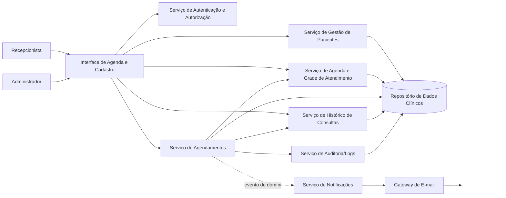
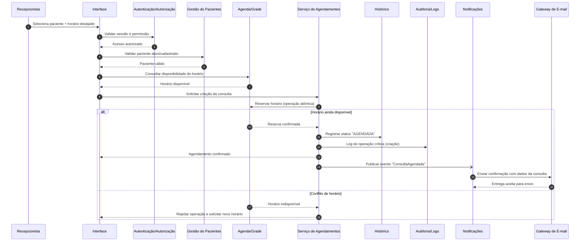
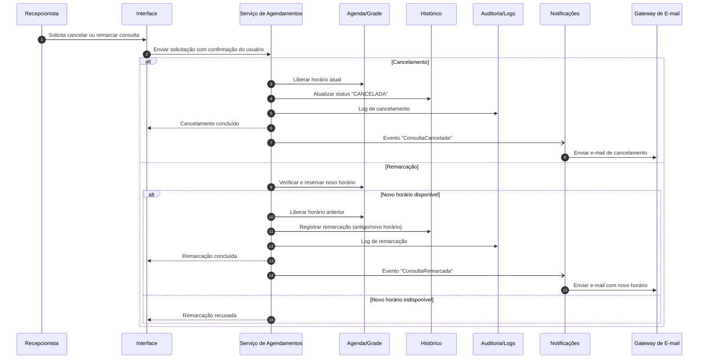

# Relatório Técnico de Arquitetura de Software

## 1. Identificação das HUs

### 1.1 Perfis de usuário identificados
- **Recepcionista**: operação principal do sistema (cadastro, busca, agenda, agendamento, cancelamento, remarcação, histórico).
- **Paciente**: destinatário de notificações por e-mail.
- **Administrador** (derivado de RNF01): gestão de acesso e configuração operacional (incluindo grade de atendimento).

### 1.2 Histórias de usuário consolidadas (com rastreio)
- **HU01 — Cadastrar paciente**  
  Relaciona-se a: RF01, RNF02  
  Regras-chave: obrigatoriedade de nome/telefone/e-mail; validação de e-mail; não duplicar CPF/e-mail.
- **HU02 — Pesquisar paciente**  
  Relaciona-se a: RF03  
  Regras-chave: busca parcial por nome/telefone; lista com nome e telefone.
- **HU03 — Visualizar agenda**  
  Relaciona-se a: RF04, RNF03, RNF04  
  Regras-chave: visão diária/semanal; distinção visual livre/ocupado; navegação temporal.
- **HU04 — Registrar agendamento**  
  Relaciona-se a: RF05, RF06, RF09, RNF05, RNF08  
  Regras-chave: somente horário livre; confirmação de sucesso; envio automático de e-mail.
- **HU05 — Cancelar agendamento**  
  Relaciona-se a: RF07, RF10, RNF08  
  Regras-chave: confirmação prévia; liberação imediata do horário; notificação por e-mail.
- **HU06 — Remarcar agendamento**  
  Relaciona-se a: RF08, RF10, RF06, RNF08  
  Regras-chave: novo horário disponível; liberação do horário anterior; e-mail com novo horário.
- **HU07 — Consultar histórico do paciente**  
  Relaciona-se a: RF12  
  Regras-chave: listar realizadas/canceladas com data/hora/status; acesso via cadastro.
- **HU08 — Paciente recebe confirmação por e-mail**  
  Relaciona-se a: RF09, RNF05  
  Regras-chave: conter profissional, data, horário, endereço; envio até 5 minutos.
- **HU09 — Paciente recebe notificação de cancelamento/remarcação**  
  Relaciona-se a: RF10  
  Regras-chave: sem ambiguidade no tipo de evento; novo horário quando remarcado.

---

## 2. Diagramas de Arquitetura (Mermaid)

### 2.1 Diagrama de componentes lógicos (visão macro)

### 2.2 Diagrama de sequência — Registrar agendamento com confirmação por e-mail

### 2.3 Diagrama de sequência — Cancelamento e remarcação

---

## 3. Decisões de Arquitetura

1. **Separação por responsabilidades de domínio**  
   Componentes distintos para Pacientes, Agenda, Agendamentos, Histórico, Notificações e Auditoria para facilitar evolução e manutenção.

2. **Consistência transacional no agendamento**  
   Reserva de horário deve ocorrer de forma atômica no momento do registro/remarcação para cumprir **RF06** (evitar dupla marcação).

3. **Notificação assíncrona por evento de domínio**  
   Criação/cancelamento/remarcação disparam eventos para Notificações, desacoplando operação de agenda da entrega de e-mail e suportando **RNF05**.

4. **Controle de acesso obrigatório**  
   Todas as operações passam por autenticação/autorização por perfil (Recepcionista/Administrador), atendendo **RNF01**.

5. **Persistência com trilha de auditoria**  
   Operações críticas registradas com carimbo temporal e ator para cumprir **RNF08** e apoiar conformidade.

6. **Modelo de histórico orientado a status de consulta**  
   Cada consulta mantém estados relevantes (agendada, cancelada, realizada, remarcada), permitindo consulta histórica por paciente (**RF12**).

7. **Visão de agenda otimizada para leitura**  
   Projeção de disponibilidade diária/semanal para atender **RNF03** e meta de carregamento em até 2s (**RNF04**).

8. **Conformidade LGPD por minimização e governança de dados**  
   Coleta mínima necessária, controle de acesso, trilhas de auditoria e política de retenção/anonimização a definir (impacta **RNF02**).

---

## 4. Tabela de Componentes e Rastreabilidade

| Componente | Responsabilidade Principal | Comunica-se com | Origem (HU / Critério de Aceite) |
|---|---|---|---|
| Interface de Agenda e Cadastro | Fluxos de cadastro, busca, calendário, agendar/cancelar/remarcar | Autenticação, Pacientes, Agenda, Agendamentos, Histórico | HU01–HU07; HU03 (visão diária/semanal), HU05 (confirmação pré-cancelamento) |
| Serviço de Autenticação e Autorização | Validar identidade e perfis de acesso | Interface, demais serviços | RNF01 |
| Serviço de Gestão de Pacientes | Criar, editar, buscar paciente; validar unicidade cadastral | Interface, Repositório, Agendamentos | HU01, HU02; CA HU01 (e-mail válido, sem duplicidade CPF/e-mail) |
| Serviço de Agenda e Grade de Atendimento | Manter horários disponíveis/ocupados e grade configurável | Interface, Agendamentos, Repositório | RF04, RF11; HU03, HU06 |
| Serviço de Agendamentos | Registrar, cancelar, remarcar consulta; regras de conflito | Interface, Agenda, Histórico, Auditoria, Notificações, Repositório | HU04, HU05, HU06; RF05, RF06, RF07, RF08 |
| Serviço de Histórico de Consultas | Exibir histórico por paciente com status e data/hora | Interface, Agendamentos, Repositório | HU07; RF12 |
| Serviço de Notificações | Orquestrar envio de e-mails por evento | Agendamentos, Gateway de E-mail | HU08, HU09; RF09, RF10, RNF05 |
| Gateway de E-mail | Entrega externa de mensagens ao paciente | Notificações | HU08, HU09 |
| Serviço de Auditoria/Logs | Registrar operações críticas com rastreabilidade | Agendamentos, Repositório | RNF08; HU04/HU05/HU06 |
| Repositório de Dados Clínicos | Armazenar pacientes, consultas, agenda, histórico e logs | Todos os serviços de domínio | RF01–RF12; RNF02, RNF08 |

---

## 5. Bloqueios e Pendências

1. **Inconsistência de dados de paciente (CPF)**  
   HU01 exige bloqueio de duplicidade por CPF/e-mail, mas RF01 não lista CPF no cadastro.  
   **Pendência:** confirmar se CPF é campo obrigatório/opcional.

2. **Escopo de “profissional”**  
   Requisitos falam em “agenda do profissional” no singular.  
   **Pendência:** sistema deve suportar um ou múltiplos profissionais?

3. **Estado “realizada” da consulta**  
   RF12 pede histórico de realizadas e canceladas, mas não há RF para “marcar como realizada”.  
   **Pendência:** definir gatilho/processo para mudar status para realizada.

4. **Dados obrigatórios no e-mail**  
   HU08 cita endereço da clínica e nome do profissional, não especificados no cadastro/parametrização.  
   **Pendência:** origem desses dados e quem os mantém.

5. **Política de remarcação concorrente**  
   Falta regra explícita para concorrência simultânea entre recepcionistas.  
   **Pendência:** confirmar política de bloqueio/retentativa e mensagens de erro padrão.

6. **Políticas LGPD operacionais**  
   RNF02 é genérico.  
   **Pendência:** definir base legal, retenção, anonimização/exclusão, mascaramento em telas e exportação.

7. **Meta de disponibilidade (99%)**  
   Não há janela de medição, manutenção programada nem horário exato da clínica.  
   **Pendência:** formalizar SLO e critérios de cálculo.

---

## 6. Cobertura de Requisitos

### 6.1 Requisitos Funcionais

| Requisito | Cobertura Arquitetural | Status |
|---|---|---|
| RF01 Cadastrar paciente | Gestão de Pacientes + Interface + Repositório | Atendido |
| RF02 Editar paciente | Gestão de Pacientes + Interface | Atendido |
| RF03 Pesquisar paciente | Gestão de Pacientes (busca parcial) + Interface | Atendido |
| RF04 Exibir agenda livre/ocupada | Agenda/Grade + Interface Calendário | Atendido |
| RF05 Registrar consulta | Agendamentos + Agenda + Histórico | Atendido |
| RF06 Impedir dupla marcação | Regra atômica de reserva no Serviço de Agenda/Agendamentos | Atendido |
| RF07 Cancelar consulta | Agendamentos + Agenda + Histórico | Atendido |
| RF08 Remarcar consulta | Agendamentos + Agenda (reserva/liberação) + Histórico | Atendido |
| RF09 E-mail na confirmação | Notificações + Gateway de E-mail | Atendido |
| RF10 E-mail cancelamento/remarcação | Notificações + Gateway de E-mail | Atendido |
| RF11 Configurar grade do profissional | Agenda/Grade + Interface administrativa | Atendido |
| RF12 Histórico por paciente | Histórico + Repositório + Interface | **Parcial** (depende de regra para “realizada”) |

### 6.2 Requisitos Não Funcionais

| Requisito | Cobertura Arquitetural | Status |
|---|---|---|
| RNF01 Autenticação e perfis | Serviço de Autenticação/Autorização | Atendido |
| RNF02 Conformidade LGPD | Governança de dados + auditoria + controle de acesso | Parcial (faltam políticas detalhadas) |
| RNF03 Agenda em calendário diário/semanal | Interface de Agenda | Atendido |
| RNF04 Agenda em até 2s | Projeção otimizada de leitura + consultas focadas | Parcial (exige testes e metas operacionais) |
| RNF05 E-mail até 5 min | Eventos de domínio + serviço de notificações assíncrono | Parcial (exige monitoramento/SLA interno) |
| RNF06 Disponibilidade 99% | Separação de responsabilidades e operação monitorada | Parcial (falta definição formal de SLO) |
| RNF07 Navegadores modernos | Interface compatível com padrões web | Parcial (exige estratégia de testes cross-browser) |
| RNF08 Logs de operações críticas | Serviço de Auditoria/Logs | Atendido |

---

## 7. Gap Analysis

| Lacuna | Impacto Arquitetural | Ação Recomendada |
|---|---|---|
| CPF ausente em RF01, mas exigido em HU01 | Modelo de dados e validação de duplicidade ficam indefinidos | Formalizar CPF no requisito de cadastro (obrigatório ou opcional) |
| Falta de regra para status “realizada” | Histórico (RF12) pode ficar incompleto/inconsistente | Criar RF específico para concluir atendimento/realização da consulta |
| Ambiguidade sobre quantidade de profissionais | Estrutura da agenda pode precisar particionamento por profissional | Definir suporte mono ou multiprofissional e ajustar modelo da grade |
| LGPD sem critérios operacionais | Risco de não conformidade e retrabalho tardio | Definir política de retenção, direitos do titular, trilha de consentimento/base legal |
| RNF04 sem cenário de carga | Não há como validar 2s objetivamente | Definir volume esperado (consultas/dia, usuários simultâneos) e plano de testes |
| RNF05 depende de serviço externo de e-mail | Risco de atraso na entrega de notificações | Definir política de retentativas, fila de pendências e alerta de atraso >5 min |
| RNF06 sem janela de medição | 99% pode ser interpretado de formas diferentes | Definir período de apuração, exclusões e manutenção programada |
| Compatibilidade de navegador sem matriz | Possíveis falhas em produção para perfis específicos | Criar matriz mínima de versões e suíte de regressão de interface |

---

Se quiser, eu também posso gerar uma **versão “pronta para backlog”** com épicos/capacidades técnicas e critérios de pronto por componente.