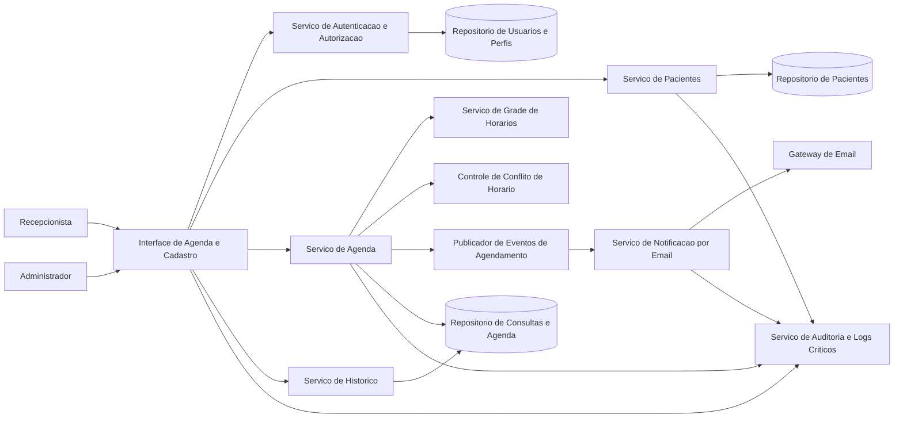
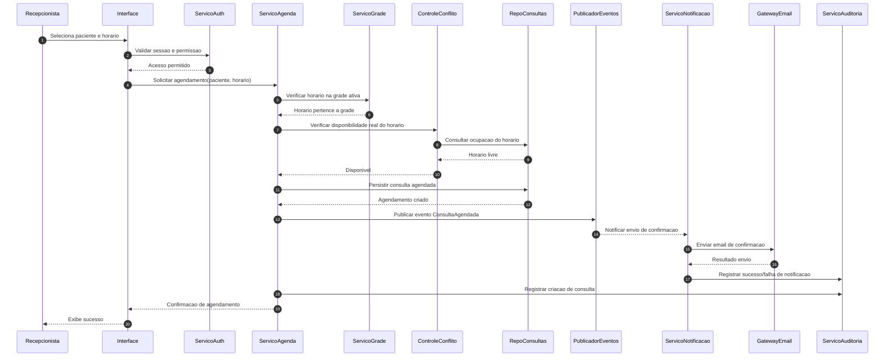

# Relatório Técnico de Arquitetura de Software

## 1. Identificação das HUs

### 1.1 Contexto funcional consolidado
O sistema atende principalmente dois perfis:
- **Recepcionista**: operação da agenda, cadastro e atendimento administrativo.
- **Paciente**: recebe comunicações por e-mail (evento passivo).

### 1.2 Inventário de histórias de usuário e rastreio inicial

| HU | Perfil | Objetivo | RF relacionados | Critérios de aceite-chave |
|---|---|---|---|---|
| HU01 | Recepcionista | Cadastrar paciente | RF01, RF03 | obrigatoriedade de campos, validação e-mail, evitar duplicidade CPF/e-mail |
| HU02 | Recepcionista | Pesquisar paciente | RF03 | busca parcial por nome/telefone, lista resumida |
| HU03 | Recepcionista | Visualizar agenda | RF04, RF11 | visão diária/semanal, distinção livre/ocupado, navegação temporal |
| HU04 | Recepcionista | Registrar agendamento | RF05, RF06, RF09 | selecionar só horários livres, confirmar registro, e-mail automático |
| HU05 | Recepcionista | Cancelar agendamento | RF07, RF10 | confirmação prévia, liberação imediata do horário, e-mail de cancelamento |
| HU06 | Recepcionista | Remarcar agendamento | RF08, RF10 | novo horário livre, liberação do anterior, e-mail com novo horário |
| HU07 | Recepcionista | Consultar histórico do paciente | RF12 | listar realizadas/canceladas com data/hora/status |
| HU08 | Paciente | Receber confirmação por e-mail | RF09 | conteúdo completo e envio até 5 min |
| HU09 | Paciente | Receber notificação de cancelamento/remarcação | RF10 | mensagem clara de cancelamento/remarcação |

### 1.3 Requisitos não funcionais mais sensíveis para arquitetura
- **RNF01/RNF02**: autenticação e conformidade LGPD.
- **RNF04**: agenda em até 2s.
- **RNF05**: envio de e-mail até 5 min.
- **RNF06**: disponibilidade mínima de 99%.
- **RNF08**: logs de operações críticas.

---

## 2. Diagramas de Arquitetura (Mermaid)

### 2.1 Diagrama de componentes (visão lógica)

### 2.2 Diagrama de sequência — registrar agendamento com validação de conflito e envio de e-mail

---

## 3. Decisões de Arquitetura

1. **Separação por domínios funcionais**
   - Pacientes, Agenda, Grade, Histórico, Notificação e Segurança separados por responsabilidade.
   - Benefício: manutenibilidade (RNF08) e evolução por módulos.

2. **Validação de disponibilidade em dupla camada**
   - Verificar se horário está na grade + verificar conflito real no repositório.
   - Benefício: atende RF06 com maior robustez contra concorrência.

3. **Processamento assíncrono para notificações**
   - Criação/cancelamento/remarcação gera evento para envio de e-mail.
   - Benefício: mantém operação de agenda responsiva (RNF04) e ajuda cumprir SLA de 5 min (RNF05).

4. **Auditoria obrigatória de operações críticas**
   - Log estruturado para criação, cancelamento e remarcação.
   - Benefício: conformidade com RNF08 e rastreabilidade operacional.

5. **Controle de acesso baseado em perfil**
   - Recepcionista e administrador com autenticação e autorização.
   - Benefício: atende RNF01 e reduz risco de acesso indevido.

6. **Modelo de histórico derivado do ciclo de vida da consulta**
   - Cada consulta mantém status (agendada, cancelada, realizada, remarcada) com trilha temporal.
   - Benefício: viabiliza RF12/HU07 sem duplicação inconsistente.

7. **Política de proteção de dados pessoais**
   - Minimização de dados, controle de acesso, rastreio de uso e retenção definida por regra de negócio.
   - Benefício: aderência arquitetural ao RNF02 (LGPD).

---

## 4. Tabela de Componentes e Rastreabilidade

| Componente | Responsabilidade Principal | Comunica-se com | Origem (HU / Critério de Aceite) |
|---|---|---|---|
| Interface de Agenda e Cadastro | Fluxos de cadastro, busca, agenda diária/semanal, confirmação visual | Serviço Auth, Pacientes, Agenda, Histórico, Auditoria | HU01–HU07; HU03 (visão diária/semanal e distinção visual) |
| Serviço de Autenticação e Autorização | Validar identidade e perfil (recepcionista/admin) | Interface, Repositório de Usuários | RNF01 |
| Serviço de Pacientes | Criar/editar/pesquisar paciente, validações de campos e duplicidade | Interface, Repositório Pacientes, Auditoria | HU01/HU02; RF01–RF03 |
| Repositório de Pacientes | Persistência e consulta de dados cadastrais | Serviço de Pacientes | RF01–RF03; RNF02 |
| Serviço de Agenda | Agendar/cancelar/remarcar consultas e orquestrar regras | Interface, Grade, Controle Conflito, Repositório Consultas, Eventos, Auditoria | HU04–HU06; RF05–RF08 |
| Serviço de Grade de Horários | Gerir horários disponíveis do profissional | Serviço de Agenda, Interface | RF11; HU03/HU06 |
| Controle de Conflito de Horário | Garantir unicidade de agendamento por horário | Serviço de Agenda, Repositório Consultas | RF06; HU04/HU06 |
| Repositório de Consultas e Agenda | Persistir consultas, status e ocupação de slots | Serviço de Agenda, Histórico, Controle Conflito | RF04–RF08, RF12 |
| Serviço de Histórico | Exibir histórico por paciente com status e datas | Interface, Repositório Consultas | HU07; RF12 |
| Publicador de Eventos de Agendamento | Emitir eventos de criação/cancelamento/remarcação | Serviço de Agenda, Serviço de Notificação | HU04–HU06; RF09/RF10 |
| Serviço de Notificação por E-mail | Compor e enviar e-mails de confirmação/cancelamento/remarcação | Publicador de Eventos, Gateway de E-mail, Auditoria | HU08/HU09; RF09/RF10; RNF05 |
| Gateway de E-mail (abstração) | Entrega externa de mensagens | Serviço de Notificação | RF09/RF10 |
| Serviço de Auditoria e Logs Críticos | Registrar operações críticas e resultados de notificações | Interface, Agenda, Pacientes, Notificação | RNF08; HU04–HU06 |

---

## 5. Bloqueios e Pendências

| Item | Tipo | Impacto | Ação recomendada |
|---|---|---|---|
| CPF é exigido para evitar duplicidade (HU01), mas não está em RF01 | Inconsistência de requisito | Alto (modelo de dados e validações) | Confirmar se CPF será atributo obrigatório do paciente e atualizar RFs |
| Não há regra de duração padrão da consulta nem granularidade dos horários | Lacuna funcional | Alto (grade, conflito, UX) | Definir duração (ex.: 30/60 min), intervalo mínimo e sobreposição permitida |
| Fluxo “consulta realizada” aparece no histórico, mas não há RF de conclusão de atendimento | Lacuna funcional | Médio | Incluir RF para marcar consulta como realizada |
| Dados do e-mail exigem “nome do profissional” e “endereço da clínica”, mas esses dados não estão modelados | Lacuna de dados | Médio | Definir entidades/configuração institucional obrigatória |
| RNF02 (LGPD) está genérico, sem políticas operacionais | Lacuna não funcional | Alto (compliance) | Especificar base legal, retenção, anonimização, trilha de consentimento e direitos do titular |
| RNF06 (99% uptime) sem janela de medição e exceções | Ambiguidade operacional | Médio | Definir período de medição, janelas de manutenção e critérios de indisponibilidade |
| RF08 contém erro textual (“remarcque”) | Qualidade de documentação | Baixo | Corrigir redação oficial para evitar ambiguidade |

---

## 6. Cobertura de Requisitos

### 6.1 Cobertura dos RF

| RF | Coberto por componentes | Situação |
|---|---|---|
| RF01 | Interface, Serviço de Pacientes, Repositório Pacientes | Coberto |
| RF02 | Interface, Serviço de Pacientes, Repositório Pacientes | Coberto |
| RF03 | Interface, Serviço de Pacientes, Repositório Pacientes | Coberto |
| RF04 | Interface, Serviço de Agenda, Repositório Consultas | Coberto |
| RF05 | Interface, Serviço de Agenda, Controle Conflito | Coberto |
| RF06 | Controle Conflito, Repositório Consultas, Serviço de Agenda | Coberto |
| RF07 | Interface, Serviço de Agenda, Repositório Consultas | Coberto |
| RF08 | Interface, Serviço de Agenda, Grade, Repositório Consultas | Coberto |
| RF09 | Publicador de Eventos, Serviço de Notificação, Gateway de E-mail | Coberto |
| RF10 | Publicador de Eventos, Serviço de Notificação, Gateway de E-mail | Coberto |
| RF11 | Serviço de Grade, Interface | Coberto |
| RF12 | Serviço de Histórico, Repositório Consultas, Interface | Coberto (depende de regra de “realizada”) |

### 6.2 Cobertura dos RNF

| RNF | Estratégia arquitetural | Situação |
|---|---|---|
| RNF01 | Autenticação e autorização por perfil | Coberto |
| RNF02 | Proteção de dados e governança LGPD (a detalhar) | Parcial |
| RNF03 | Interface com calendário diário/semanal | Coberto |
| RNF04 | Separação de leitura de agenda e operações assíncronas de notificação | Coberto (requer metas de capacidade) |
| RNF05 | Notificação orientada a evento com SLA monitorado | Coberto |
| RNF06 | Arquitetura com serviços desacoplados e operação monitorada | Parcial (faltam critérios de SLO/SLA) |
| RNF07 | Interface aderente a navegadores modernos | Coberto (exige plano de testes) |
| RNF08 | Serviço de auditoria para operações críticas | Coberto |

---

## 7. Gap Analysis

### 7.1 Lacunas reais identificadas
1. **Modelo de identidade do paciente incompleto** (CPF conflita entre HU e RF).
2. **Regras de agenda insuficientes** (duração, granularidade, bloqueios, feriados, encaixe).
3. **Ciclo de vida da consulta incompleto** (“realizada” sem evento operacional definido).
4. **LGPD em nível declarativo** sem requisitos verificáveis.
5. **SLO operacional incompleto** para disponibilidade e desempenho.

### 7.2 Impactos arquiteturais
- Risco de retrabalho em entidades, APIs e validações.
- Ambiguidade na lógica de conflito e remarcação.
- Dificuldade de auditar conformidade regulatória.
- Impossibilidade de aceitar formalmente RNF04/RNF05/RNF06 sem métricas de observabilidade.

### 7.3 Ações recomendadas (próximo ciclo)
1. **Workshop de refinamento funcional** (produto + operação clínica) para fechar regras de agenda.
2. **Aditivo de requisitos de dados pessoais**: incluir CPF (ou regra alternativa de unicidade), consentimento e retenção.
3. **Novo RF para finalização de consulta** e atualização de histórico.
4. **Definir critérios de aceite não funcionais mensuráveis**:
   - Agenda ≤ 2s em cenário de carga definido.
   - E-mail ≤ 5 min com taxa de sucesso mínima.
   - Disponibilidade 99% com janela de medição explícita.
5. **Plano de testes de compatibilidade e segurança** alinhado aos RNFs.

--- 

Se quiser, eu também posso gerar uma versão deste relatório em formato **“pronto para Jira/Confluence”**, com os itens já quebrados em épicos, stories técnicas e critérios de verificação por requisito.