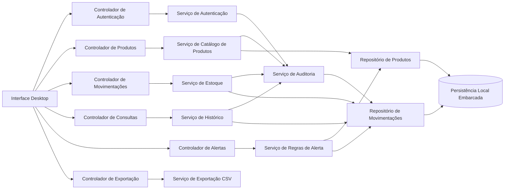
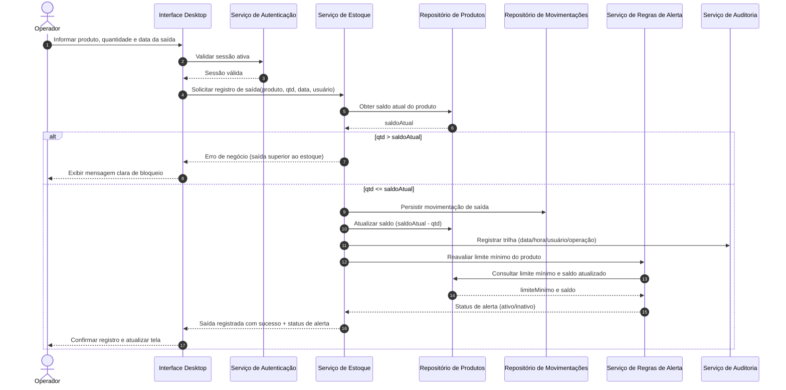

# Relatório Técnico de Arquitetura de Software

## 1. Identificação das HUs

### 1.1 Visão geral do escopo funcional
Sistema desktop para **controle de estoque em loja física**, com foco em:
- cadastro e manutenção de produtos;
- lançamentos de entrada/saída;
- atualização automática de saldo;
- alertas de estoque mínimo;
- consulta de saldo e histórico;
- exportação CSV;
- autenticação e rastreabilidade por usuário.

### 1.2 Mapeamento de Histórias de Usuário (HU) para Requisitos Funcionais (RF)

| HU | Objetivo | RFs Relacionados | Critérios de Aceite-chave |
|---|---|---|---|
| HU01 | Cadastrar produto | RF01, RF10, RF12 | obrigatoriedade de campos, não duplicidade por nome, visibilidade imediata no estoque |
| HU02 | Registrar entrada | RF04, RF07, RF11 | seleção por lista/busca, quantidade inteira positiva, atualização imediata, registro no histórico |
| HU03 | Registrar saída | RF05, RF06, RF07, RF11 | bloqueio de saída acima do saldo, decremento imediato, histórico com data/hora/quantidade |
| HU04 | Alertar estoque baixo | RF09 | alerta destacado, identificação do produto e saldo, persistência até reposição |
| HU05 | Configurar limite mínimo | RF08, RF09 | limite por produto, inteiro não negativo, efeito imediato no alerta |
| HU06 | Consultar saldo geral | RF10 | listagem com nome/saldo/limite, destaque para baixo estoque, ordenação |
| HU07 | Consultar histórico | RF11 | filtro por produto e período, exibição tipo/qtd/data/hora/usuário, ordem cronológica desc |
| HU08 | Exportar dados CSV | RNF07 (suporte funcional associado), RF10/RF11 | exportar campos relevantes, escolha do diretório, confirmação de sucesso |

### 1.3 Atores e responsabilidades de alto nível
- **Operador**: executa operações de negócio (cadastro, movimentações, consultas, exportação).
- **Sistema**: valida regras, persiste dados localmente, mantém rastreabilidade e gera alertas.

---

## 2. Diagramas de Arquitetura (Mermaid)

### 2.1 Diagrama de Componentes (lógico)

### 2.2 Diagrama de Sequência — Registrar saída com validação, auditoria e alerta

---

## 3. Decisões de Arquitetura

1. **Arquitetura em camadas (Interface → Aplicação/Serviços → Domínio/Regras → Persistência).**  
   - **Motivo:** separa responsabilidades e facilita manutenção (RNF07) e evolução.
   - **Impacto:** reduz acoplamento entre tela e dados.

2. **Domínio centrado em entidades Produto e Movimentação.**  
   - **Motivo:** RFs e HUs giram em torno dessas duas entidades e suas invariantes.
   - **Impacto:** regras de estoque ficam concentradas e testáveis.

3. **Regra de integridade de saída (não permitir saldo negativo) tratada no serviço de estoque.**  
   - **Motivo:** RF06/HU03 exigem bloqueio consistente.
   - **Impacto:** evita inconsistência mesmo se houver múltiplos fluxos de interface.

4. **Atualização de saldo e gravação da movimentação em operação transacional única.**  
   - **Motivo:** RNF03 (não perder lançamentos) e RF07.
   - **Impacto:** atomicidade entre histórico e saldo.

5. **Rastreabilidade obrigatória por lançamento (data, hora, usuário, tipo).**  
   - **Motivo:** RNF08 e HU07.
   - **Impacto:** auditoria e investigação de divergências.

6. **Mecanismo de persistência local embarcado com repositórios abstratos.**  
   - **Motivo:** RNF02 e neutralidade de implementação.
   - **Impacto:** desacoplamento entre regra e tecnologia de armazenamento.

7. **Sistema de alerta de estoque baixo como serviço dedicado.**  
   - **Motivo:** RF09/HU04 pedem lógica persistente e destaque contínuo.
   - **Impacto:** regra de alerta reutilizável em consulta, movimentação e edição de limite.

8. **Consultas otimizadas por casos de uso (saldo geral e histórico por filtro).**  
   - **Motivo:** RNF05 (até 2s com volume alto).
   - **Impacto:** necessidade de estratégias de indexação local e paginação/limitação de resultado.

9. **Fluxo de exportação CSV desacoplado da consulta visual.**  
   - **Motivo:** RNF07/HU08.
   - **Impacto:** exportação reprodutível para backup/análise sem depender da ordenação da tela.

10. **Autenticação obrigatória antes do acesso às operações principais.**  
    - **Motivo:** RNF06.
    - **Impacto:** todas as ações de negócio exigem contexto de usuário autenticado.

---

## 4. Tabela de Componentes e Rastreabilidade

| Componente | Responsabilidade Principal | Comunica-se com | Origem (HU / Critério de Aceite) |
|---|---|---|---|
| Interface Desktop | Coletar entradas do operador, exibir consultas, alertas e confirmações | Controladores de Autenticação, Produtos, Movimentações, Consultas, Alertas, Exportação | HU01–HU08 (todos os critérios de interação) |
| Controlador de Autenticação | Orquestrar login/logout e controle de sessão | Serviço de Autenticação, Interface | RNF06 |
| Serviço de Autenticação | Validar credenciais e prover identidade do usuário para trilha | Repositório de Usuários, Serviço de Auditoria | RNF06, RNF08 |
| Controlador de Produtos | Orquestrar cadastro/edição/remoção/pesquisa | Serviço de Catálogo de Produtos | HU01, HU05, RF01, RF02, RF03, RF08, RF12 |
| Serviço de Catálogo de Produtos | Regras de produto (obrigatórios, unicidade de nome, limite mínimo) | Repositório de Produtos, Serviço de Auditoria | HU01 (não duplicidade), HU05 (inteiro não negativo) |
| Controlador de Movimentações | Orquestrar entrada e saída | Serviço de Estoque | HU02, HU03 |
| Serviço de Estoque | Validar quantidades, bloquear saída inválida, atualizar saldo e registrar movimentação | Repositório de Produtos, Repositório de Movimentações, Serviço de Auditoria, Serviço de Alertas | RF04, RF05, RF06, RF07; HU02, HU03 |
| Serviço de Alertas | Avaliar e manter estado de baixo estoque | Repositório de Produtos, Repositório de Movimentações, Interface | HU04, HU05, HU06; RF09 |
| Controlador de Consultas | Orquestrar tela de saldo e histórico com filtros/ordenação | Serviço de Consultas (estoque/histórico), Serviço de Alertas | HU06, HU07; RF10, RF11 |
| Serviço de Consultas de Estoque | Retornar saldo atual por produto e ordenação | Repositório de Produtos, Serviço de Alertas | HU06 |
| Serviço de Histórico | Retornar movimentações por produto/período em ordem desc | Repositório de Movimentações | HU07, RF11 |
| Controlador de Exportação | Disparar exportação e retorno de status | Serviço de Exportação CSV | HU08 |
| Serviço de Exportação CSV | Gerar arquivo CSV de estoque/movimentações no diretório escolhido | Serviço de Consultas, Serviço de Histórico, Interface, Serviço de Auditoria | HU08, RNF07 |
| Serviço de Auditoria | Registrar data/hora/usuário/operação em toda ação relevante | Serviços de negócio e repositórios | RNF08, HU02, HU03, HU07 |
| Repositório de Produtos | Persistência e recuperação de produtos e saldos | Persistência Local Embarcada | RF01, RF02, RF03, RF08, RF10 |
| Repositório de Movimentações | Persistência e consulta de entradas/saídas | Persistência Local Embarcada | RF04, RF05, RF11, RNF03 |
| Persistência Local Embarcada | Armazenamento local sem servidor externo | Repositórios | RNF02 |

---

## 5. Bloqueios e Pendências

| ID | Pendência / Bloqueio | Impacto Arquitetural | Severidade | Ação recomendada |
|---|---|---|---|---|
| P01 | Regra de unicidade do nome: sensível a maiúsculas/minúsculas? acentos? espaços extras? | Pode gerar duplicidade ambígua (HU01) | Alta | Definir política de normalização de nome |
| P02 | Remoção de produto com histórico existente: permitir exclusão lógica/física? | Integridade histórica e auditoria (RF03, HU07) | Alta | Definir política de desativação vs exclusão |
| P03 | Política de senha (complexidade, troca, bloqueio por tentativas) não especificada | RNF06 incompleto para segurança real | Média | Definir requisitos de autenticação detalhados |
| P04 | Definição de “grande volume” para RNF05 não quantificada | Impossível validar desempenho objetivamente | Alta | Estabelecer metas numéricas (ex.: nº de produtos e movimentações) |
| P05 | Fuso horário e formato de data/hora para trilha e filtros | Pode causar inconsistência no histórico (RNF08, HU07) | Média | Padronizar timezone e formatação |
| P06 | Comportamento offline com falhas de energia/encerramento abrupto sem detalhar recuperação | RNF03 exige estratégia de consistência e recuperação | Alta | Definir estratégia de commit e verificação de integridade na inicialização |
| P07 | Exportação CSV: codificação, separador e escaping não definidos | Risco de incompatibilidade em planilhas externas | Média | Definir padrão de arquivo CSV |
| P08 | Controle de concorrência local (duas janelas/sessões simultâneas) não especificado | Pode causar corrida em saldo | Média | Definir modelo de bloqueio/serialização de operação |

---

## 6. Cobertura de Requisitos

### 6.1 Cobertura dos RFs

| Requisito | Cobertura Arquitetural | Status |
|---|---|---|
| RF01 | Serviço de Catálogo + Repositório de Produtos + validações de obrigatórios | Coberto |
| RF02 | Serviço de Catálogo (edição) + auditoria | Coberto |
| RF03 | Serviço de Catálogo (remoção) + pendência sobre política de exclusão | Parcial (depende P02) |
| RF04 | Serviço de Estoque (entrada) + Movimentações + trilha | Coberto |
| RF05 | Serviço de Estoque (saída) + Movimentações + trilha | Coberto |
| RF06 | Regra de bloqueio no Serviço de Estoque | Coberto |
| RF07 | Operação transacional saldo + movimentação | Coberto |
| RF08 | Campo de limite mínimo no Produto + validação não negativa | Coberto |
| RF09 | Serviço de Alertas + destaque em Interface | Coberto |
| RF10 | Serviço de Consultas de Estoque + Interface | Coberto |
| RF11 | Serviço de Histórico com filtros por produto/período | Coberto |
| RF12 | Pesquisa por nome no Catálogo/Consultas | Coberto |

### 6.2 Cobertura dos RNFs

| Requisito | Cobertura Arquitetural | Status |
|---|---|---|
| RNF01 | Interface Desktop para ambiente Windows | Coberto |
| RNF02 | Persistência local embarcada via repositórios | Coberto |
| RNF03 | Operações transacionais + persistência imediata + recuperação | Parcial (detalhar P06) |
| RNF04 | Fluxos curtos via tela principal e controladores dedicados | Coberto (validar UX em protótipo) |
| RNF05 | Serviços de consulta otimizados + estratégia de desempenho | Parcial (detalhar P04) |
| RNF06 | Autenticação usuário/senha + sessão | Parcial (detalhar P03) |
| RNF07 | Serviço de Exportação CSV | Coberto |
| RNF08 | Serviço de Auditoria (data/hora/usuário por lançamento) | Coberto |

---

## 7. Gap Analysis

| Lacuna | Evidência | Impacto | Recomendação |
|---|---|---|---|
| Critério de duplicidade de produto não formalizado | HU01 menciona “mesmo nome”, sem regra de normalização | Cadastros inconsistentes e retrabalho operacional | Definir regra canônica (normalização de texto) e testes de aceite |
| Exclusão de produto sem política de retenção histórica | RF03 vs HU07 (histórico) | Perda de rastreabilidade ou quebra referencial | Adotar exclusão lógica com status “inativo” como padrão |
| Segurança limitada a “usuário e senha” | RNF06 genérico | Risco operacional e auditoria fraca | Especificar política mínima de senha, expiração e bloqueio por tentativas |
| RNF05 sem baseline quantitativo | “grande volume” indefinido | Não testável e risco de não conformidade | Definir volume-alvo e plano de teste de desempenho |
| RNF03 sem estratégia explícita de recuperação | Apenas “não perder lançamento” | Possível corrupção em encerramento abrupto | Definir protocolo de escrita atômica e rotina de verificação ao iniciar |
| Falta de requisitos de permissões por perfil | Só há perfil Operador | Escalabilidade funcional limitada (admin/supervisor futuro) | Preparar modelo de autorização extensível, mesmo com perfil único inicial |
| CSV sem especificação de compatibilidade | HU08 não detalha formato técnico | Arquivos incompatíveis entre ferramentas | Definir padrão de separador, codificação e escape de campos |

### Conclusão do Gap
A arquitetura proposta cobre integralmente o fluxo de negócio principal, mas há lacunas de especificação que afetam **testabilidade, segurança e integridade histórica**. Recomenda-se tratar os itens P01–P06 antes da implementação final para reduzir risco de retrabalho e garantir conformidade dos RNFs.