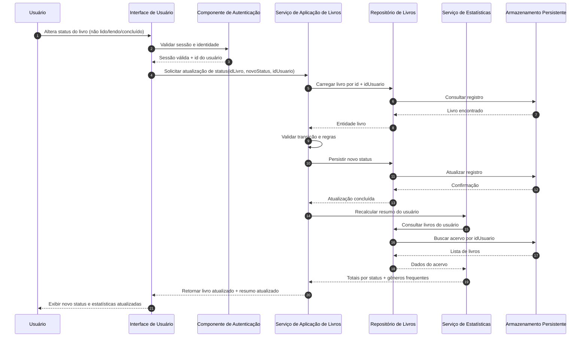

# Relatório Técnico de Arquitetura de Software

## 1. Identificação das HUs

### 1.1 Escopo funcional consolidado
O lote de requisitos descreve um **sistema pessoal de catalogação de livros**, com foco em:
- CRUD de livros, gêneros e coleções.
- Organização por status de leitura, gênero e coleção.
- Busca e filtros combináveis.
- Estatísticas dinâmicas do acervo.
- Exportação de dados.
- Isolamento por usuário autenticado.

### 1.2 Mapeamento das Histórias de Usuário (HU)
- **HU01 — Cadastrar livro**: criação de livro com validações obrigatórias (título e autor), tipo (físico/digital), status e exibição imediata.
- **HU02 — Atualizar status**: alteração de status a qualquer momento com reflexo instantâneo nas estatísticas.
- **HU03 — Organizar por gênero**: CRUD de gênero, associação N:N com livro e desvinculação segura na exclusão.
- **HU04 — Organizar por coleção**: CRUD de coleção, associação 1:N (livro pertence a no máximo uma coleção), desvinculação na exclusão.
- **HU05 — Filtrar acervo**: filtros por múltiplos atributos com atualização dinâmica e limpeza global.
- **HU06 — Busca por título/autor**: busca parcial e dinâmica por texto.
- **HU07 — Resumo do acervo**: total geral, total por status e gêneros mais frequentes, com atualização automática.
- **HU08 — Exportar acervo**: exportação completa em CSV/JSON com download pelo navegador.

### 1.3 Requisitos transversais críticos
- **Segurança e isolamento por usuário (RNF01)**.
- **Persistência confiável (RNF04)**.
- **Desempenho de listagem/filtragem em até 2s (RNF03)**.
- **Responsividade e compatibilidade navegadores (RNF02, RNF06)**.
- **Atualização em tempo real das estatísticas (RNF05)**.

---

## 2. Diagramas de Arquitetura (Mermaid)

### 2.1 Diagrama de Componentes (visão lógica)

```mermaid
flowchart LR
    U[Usuário] --> UI[Interface de Usuário]

    UI --> AUTH[Componente de Autenticação e Sessão]
    UI --> LIVROAPP[Serviço de Aplicação de Livros]
    UI --> TAXO[Serviço de Taxonomias\n(Gêneros e Coleções)]
    UI --> CONSULTA[Serviço de Consulta\n(Filtros e Busca)]
    UI --> RESUMO[Serviço de Estatísticas do Acervo]
    UI --> EXPORT[Serviço de Exportação]

    LIVROAPP --> VAL[Validador de Regras de Negócio]
    TAXO --> VAL
    CONSULTA --> VAL

    LIVROAPP --> LIVROREP[Repositório de Livros]
    TAXO --> GENREP[Repositório de Gêneros]
    TAXO --> COLREP[Repositório de Coleções]
    CONSULTA --> LIVROREP
    CONSULTA --> GENREP
    CONSULTA --> COLREP
    RESUMO --> LIVROREP
    RESUMO --> GENREP
    EXPORT --> LIVROREP
    EXPORT --> GENREP
    EXPORT --> COLREP

    AUTH --> USERREP[Repositório de Usuários e Credenciais]

    LIVROREP --> DS[(Armazenamento Persistente)]
    GENREP --> DS
    COLREP --> DS
    USERREP --> DS
```

### 2.2 Diagrama de Sequência — Atualização de status com estatística em tempo real



---

## 3. Decisões de Arquitetura

| ID | Decisão | Motivação | Consequências |
|---|---|---|---|
| DA-01 | Arquitetura modular em camadas (Interface, Aplicação, Domínio/Regras, Persistência) | Separar responsabilidades e facilitar manutenção | Evolução mais previsível; exige disciplina de fronteiras |
| DA-02 | Isolamento de dados por identidade de usuário em todas as consultas/comandos | Atender RNF01 (acervo estritamente pessoal) | Toda operação precisa contexto de usuário autenticado |
| DA-03 | Modelagem explícita de taxonomias: Gênero (N:N com Livro) e Coleção (1:N com Livro) | Atender HU03/HU04 e seus critérios | Simplifica desvinculação sem exclusão de livros |
| DA-04 | Serviço dedicado de consulta (filtros + busca parcial) | Atender HU05/HU06 com combinação de filtros e resposta dinâmica | Requer estratégia de paginação/ordenção e otimização de consulta |
| DA-05 | Serviço de estatísticas desacoplado de CRUD | Atender HU07 e RNF05 (atualização automática) | Possível recálculo sob demanda ou incremental |
| DA-06 | Exportação por gerador de formato (CSV/JSON) com interface única | Atender HU08 e RNF07 sem acoplamento a formato | Permite adicionar formatos futuros |
| DA-07 | Validação de regras no domínio (campos obrigatórios, status permitido, cardinalidades) | Garantir consistência independente da interface | Reduz inconsistência e duplicidade de validação |

---

## 4. Tabela de Componentes e Rastreabilidade

| Componente | Responsabilidade Principal | Comunica-se com | Origem (HU / Critério de Aceite) |
|---|---|---|---|
| Interface de Usuário | Capturar ações do usuário, apresentar listas, filtros, busca, resumo e download | Autenticação, Serviços de Aplicação/Consulta/Resumo/Exportação | HU01–HU08 (todos os critérios de exibição dinâmica) |
| Componente de Autenticação e Sessão | Validar identidade e sessão; prover contexto do usuário | Interface, Repositório de Usuários | RNF01 |
| Serviço de Aplicação de Livros | Criar, editar, remover livros; atualizar status; aplicar regras de livro | Interface, Validador, Repositório de Livros, Serviço de Estatísticas | HU01, HU02; RF01, RF02, RF03, RF04, RF05, RF13 |
| Serviço de Taxonomias (Gêneros/Coleções) | CRUD de gêneros e coleções; vinculação/desvinculação com livros | Interface, Validador, Repositórios de Gênero/Coleção/Livro | HU03, HU04; RF06, RF07, RF08 |
| Serviço de Consulta (Filtros e Busca) | Filtrar por múltiplos atributos e busca parcial por título/autor | Interface, Repositórios | HU05, HU06; RF09, RF12 |
| Serviço de Estatísticas do Acervo | Calcular total geral, totais por status e gêneros mais frequentes | Interface, Serviço de Livros, Repositórios | HU07; RF10, RF11; RNF05 |
| Serviço de Exportação | Gerar exportação completa em CSV ou JSON para download | Interface, Repositórios | HU08; RNF07 |
| Validador de Regras de Negócio | Validar obrigatoriedade, enum de status, cardinalidades e integridade referencial lógica | Serviços de Aplicação/Taxonomias/Consulta | HU01 CA, HU03 CA, HU04 CA; RF04 |
| Repositório de Livros | Persistência e consulta de livros por usuário | Serviços de Livros, Consulta, Estatísticas, Exportação | RF01, RF02, RF03, RF05, RF09, RF12, RNF04 |
| Repositório de Gêneros | Persistência de gêneros e associações | Serviço de Taxonomias, Consulta, Estatísticas, Exportação | HU03; RF06, RF08, RF11 |
| Repositório de Coleções | Persistência de coleções e associação 1:N | Serviço de Taxonomias, Consulta, Exportação | HU04; RF07, RF08 |
| Repositório de Usuários/Credenciais | Armazenar e recuperar dados de autenticação | Autenticação | RNF01 |
| Armazenamento Persistente | Garantir durabilidade dos dados | Todos os repositórios | RNF04 |

---

## 5. Bloqueios e Pendências

1. **Escopo de autenticação incompleto**  
   - Não está definido fluxo de cadastro de usuário, recuperação de acesso e política de sessão.
2. **RNF03 com meta absoluta (“independentemente do volume”)**  
   - Meta rígida pode ser inviável sem limites de escala e critérios de medição.
3. **Atualização “em tempo real” (RNF05)**  
   - Falta definição: atualização imediata no cliente atual apenas, ou entre múltiplas sessões/dispositivos simultâneos.
4. **Regras de ordenação e paginação**  
   - Não definido comportamento padrão de listagem, importante para UX e desempenho.
5. **Exportação sem limites operacionais**  
   - Não há definição de volume máximo, codificação de caracteres, separador CSV, escape de campos.
6. **Filtro por “qualquer atributo”**  
   - Falta esclarecer se filtros são estritamente combinados por E lógico, e se há suporte a operadores avançados (contém, igual, prefixo etc.).
7. **Política de remoção**  
   - Não definido se remoção de livro é definitiva ou recuperável.

---

## 6. Cobertura de Requisitos

### 6.1 Requisitos Funcionais (RF)

| Requisito | Cobertura Arquitetural | Status |
|---|---|---|
| RF01 Cadastro de livro | Serviço de Livros + Validador + Repositório de Livros | Coberto |
| RF02 Edição de livro | Serviço de Livros + Repositório de Livros | Coberto |
| RF03 Remoção de livro | Serviço de Livros + Repositório de Livros | Coberto |
| RF04 Status (3 opções) | Validador de domínio (enum controlado) | Coberto |
| RF05 Atualizar status a qualquer momento | Serviço de Livros + Estatísticas | Coberto |
| RF06 CRUD de gêneros | Serviço de Taxonomias + Repositório de Gêneros | Coberto |
| RF07 CRUD de coleções | Serviço de Taxonomias + Repositório de Coleções | Coberto |
| RF08 Associação livro-gêneros-coleção | Serviço de Taxonomias + Validador + Repositórios | Coberto |
| RF09 Filtrar por atributos cadastrados | Serviço de Consulta + Repositórios | Coberto |
| RF10 Resumo por status | Serviço de Estatísticas | Coberto |
| RF11 Gêneros mais frequentes | Serviço de Estatísticas | Coberto |
| RF12 Busca por título/autor | Serviço de Consulta | Coberto |
| RF13 Diferenciar físico/digital | Modelo de Livro + Validador | Coberto |

### 6.2 Requisitos Não Funcionais (RNF)

| Requisito | Cobertura Arquitetural | Status |
|---|---|---|
| RNF01 Autenticação e isolamento por usuário | Componente de Autenticação + filtro por id de usuário em repositórios | Coberto (depende detalhamento de política) |
| RNF02 Interface responsiva | Responsabilidade da Interface de Usuário | Parcial (depende design UI e testes) |
| RNF03 Listagem/filtragem até 2s | Serviço de Consulta dedicado + estratégia de otimização | Parcial (faltam metas de carga e limites) |
| RNF04 Persistência sem perda | Camada de repositórios + armazenamento persistente | Coberto |
| RNF05 Estatísticas em tempo real | Acoplamento funcional CRUD -> Estatísticas -> retorno imediato | Coberto (modo multi-sessão pendente) |
| RNF06 Navegadores modernos | Contrato de Interface web padrão | Parcial (requer plano de testes de compatibilidade) |
| RNF07 Exportação CSV/JSON | Serviço de Exportação por formato | Coberto |

---

## 7. Gap Analysis

| Lacuna de Especificação | Impacto Arquitetural | Ação Recomendada | Prioridade |
|---|---|---|---|
| Fluxos completos de autenticação não definidos | Risco de decisões tardias em segurança e sessão | Especificar login, ciclo de sessão, expiração e recuperação de conta | Alta |
| Meta RNF03 sem critério de volume/carga | Risco de não conformidade mensurável | Definir baseline de dados, concorrência e SLA por cenário | Alta |
| “Tempo real” ambíguo (RNF05) | Pode exigir mecanismo de atualização entre sessões | Definir se atualização é local imediata ou sincronização multi-dispositivo | Alta |
| Sem política de paginação/ordenação | Pode degradar UX e desempenho | Definir ordenação padrão, paginação e limites de retorno | Média |
| Regras de exportação incompletas | Inconsistência de arquivos e interoperabilidade | Definir convenções CSV/JSON, charset, nomenclatura e tratamento de campos especiais | Média |
| Exclusão de livro não detalha recuperação | Impacta integridade e suporte operacional | Definir exclusão lógica vs. física e eventual restauração | Média |
| Sem requisitos de auditoria/histórico de status | Limita rastreabilidade do progresso de leitura | Decidir se histórico de alterações é necessário no MVP ou futura iteração | Baixa |
| Sem definição de acessibilidade | Risco de usabilidade insuficiente | Incluir critérios mínimos de acessibilidade na UI responsiva | Baixa |

---

Se quiser, posso gerar na sequência uma **versão complementar com modelo de domínio (entidades e cardinalidades em Mermaid classDiagram)** para apoiar implementação e testes de aceitação.