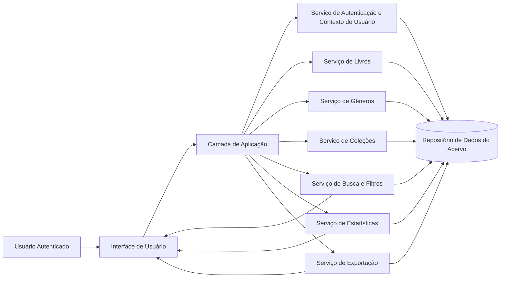
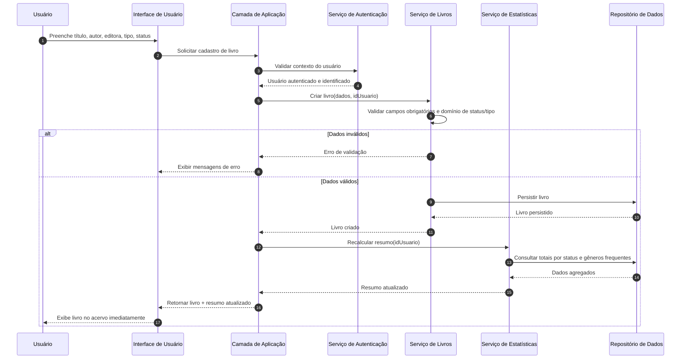

# Relatório Técnico de Arquitetura de Software

## 1. Identificação das HUs

| HU | Objetivo do Usuário | Capacidades Arquiteturais Necessárias | RF Relacionados |
|---|---|---|---|
| HU01 — Cadastrar livro | Registrar livro no acervo pessoal | Validação de campos obrigatórios, persistência transacional, atualização imediata da listagem | RF01, RF04, RF13 |
| HU02 — Atualizar status de leitura | Registrar progresso de leitura | Atualização parcial de entidade Livro, recálculo de estatísticas em tempo real | RF05, RF10 |
| HU03 — Organizar por gênero | Categorizar livros por múltiplos gêneros | CRUD de Gênero, relacionamento N:N Livro-Gênero, desvinculação sem exclusão de Livro | RF06, RF08, RF11 |
| HU04 — Organizar por coleção | Agrupar livros em série/saga | CRUD de Coleção, relacionamento 1:N (Livro→Coleção opcional), desvinculação em remoção da coleção | RF07, RF08 |
| HU05 — Filtrar acervo | Localizar livros por múltiplos atributos | Mecanismo de consulta com filtros combináveis, atualização dinâmica dos resultados | RF09, RF13 |
| HU06 — Pesquisar por título/autor | Busca rápida textual parcial | Busca incremental por texto parcial, atualização dinâmica durante digitação | RF12 |
| HU07 — Visualizar resumo | Entender distribuição do acervo | Serviço de agregação (totais por status e gêneros frequentes), atualização automática | RF10, RF11 |
| HU08 — Exportar acervo | Backup/portabilidade dos dados | Serialização completa de acervo por usuário, geração de arquivo CSV/JSON para download | RNF07 |

**Ator principal:** Usuário autenticado.  
**Restrição transversal:** Isolamento estrito dos dados por usuário (RNF01).

---

## 2. Diagramas de Arquitetura (Mermaid)

### 2.1 Diagrama de Componentes (Visão Lógica)

### 2.2 Diagrama de Sequência — Cadastro de Livro com Atualização de Resumo

---

## 3. Decisões de Arquitetura

1. **Separação por domínios funcionais (Livros, Gêneros, Coleções, Busca/Filtros, Estatísticas, Exportação).**  
   - **Motivo:** reduzir acoplamento e facilitar evolução incremental das HUs.  
   - **Impacto:** manutenção mais simples (RNF07) e rastreabilidade clara por requisito.

2. **Isolamento de dados por contexto de usuário autenticado em todas as operações.**  
   - **Motivo:** atender RNF01 (acervo estritamente pessoal).  
   - **Impacto:** toda consulta/comando deve incluir identificador de usuário validado.

3. **Modelo de relacionamento: Livro ↔ Gênero (N:N) e Livro → Coleção (0..1).**  
   - **Motivo:** aderência direta aos critérios de HU03 e HU04.  
   - **Impacto:** remoção de gênero/coleção executa desvinculação, sem exclusão de livros.

4. **Atualização automática do resumo via fluxo reativo pós-escrita.**  
   - **Motivo:** RNF05 e critérios de HU02/HU07.  
   - **Impacto:** cada alteração de acervo dispara recomputação (imediata ou incremental).

5. **Consulta unificada para filtros combinados e busca textual parcial.**  
   - **Motivo:** RF09 e HU05/HU06 exigem experiência dinâmica.  
   - **Impacto:** contrato de consulta deve suportar múltiplos parâmetros opcionais.

6. **Exportação como capacidade de leitura completa e serialização em dois formatos lógicos.**  
   - **Motivo:** HU08 e RNF07.  
   - **Impacto:** definição de esquema canônico de saída para CSV e JSON.

7. **Validações de domínio centralizadas na camada de aplicação.**  
   - **Motivo:** consistência das regras (status permitido, obrigatórios, tipo físico/digital).  
   - **Impacto:** evita divergência entre pontos de entrada distintos.

---

## 4. Tabela de Componentes e Rastreabilidade

| Componente | Responsabilidade Principal | Comunica-se com | Origem (HU / Critério de Aceite) |
|---|---|---|---|
| Interface de Usuário | Captura ações do usuário, apresenta acervo, filtros, busca, resumo e exportação | Camada de Aplicação | HU01–HU08 (todos os critérios de interação dinâmica e feedback imediato) |
| Camada de Aplicação (Orquestração) | Orquestrar casos de uso, aplicar políticas transversais e fluxos | UI, Serviços de Domínio, Autenticação | HU01–HU08 |
| Serviço de Autenticação e Contexto | Validar acesso e prover identidade do usuário para isolamento de dados | Camada de Aplicação, Repositório | RNF01 |
| Serviço de Livros | CRUD de livros, validação de título/autor/status/tipo, atualização de status | Camada de Aplicação, Repositório, Estatísticas | HU01, HU02, RF01, RF02, RF03, RF04, RF05, RF13 |
| Serviço de Gêneros | CRUD de gêneros e vínculo/desvínculo com livros | Camada de Aplicação, Repositório | HU03, RF06, RF08, RF11 |
| Serviço de Coleções | CRUD de coleções e vínculo/desvínculo com livros (1 coleção por livro) | Camada de Aplicação, Repositório | HU04, RF07, RF08 |
| Serviço de Busca e Filtros | Consultas por atributos e busca parcial em título/autor com combinação de filtros | Camada de Aplicação, Repositório | HU05, HU06, RF09, RF12 |
| Serviço de Estatísticas | Totais por status e gêneros mais frequentes, atualização automática | Camada de Aplicação, Repositório | HU02, HU07, RF10, RF11, RNF05 |
| Serviço de Exportação | Gerar arquivo completo do acervo em CSV ou JSON | Camada de Aplicação, Repositório, UI | HU08, RNF07 |
| Repositório de Dados do Acervo | Persistência confiável de livros, gêneros, coleções, vínculos e metadados | Todos os serviços | RNF04, suporte a RF/RNF globais |

---

## 5. Bloqueios e Pendências

| Tipo | Item | Impacto Arquitetural | Ação Necessária |
|---|---|---|---|
| Pendência | Não há volumetria esperada do acervo por usuário | Dificulta garantir RNF03 (até 2s “independentemente do volume”) | Definir faixas de volume e critérios de teste de desempenho |
| Pendência | Política de autenticação não detalhada (sessão, expiração, recuperação de acesso) | Pode afetar UX e segurança operacional | Especificar fluxo de autenticação e requisitos de sessão |
| Pendência | Regras de ordenação/paginação de listagem não explicitadas | Impacta escalabilidade e usabilidade em acervos grandes | Definir comportamento padrão de ordenação e paginação |
| Pendência | Escopo de campos no CSV não formalizado (ex.: representação de múltiplos gêneros) | Risco de ambiguidade na exportação | Definir contrato de exportação e convenções de serialização |
| Pendência | Regra de normalização textual para busca parcial não definida | Resultados inconsistentes entre usuários/idiomas | Definir critérios de busca (acentos, maiúsculas/minúsculas, prefixo/contém) |

---

## 6. Cobertura de Requisitos

### 6.1 Requisitos Funcionais

| Requisito | Cobertura | Componentes Envolvidos |
|---|---|---|
| RF01 | Completa | UI, Aplicação, Serviço de Livros, Repositório |
| RF02 | Completa | UI, Aplicação, Serviço de Livros, Repositório |
| RF03 | Completa | UI, Aplicação, Serviço de Livros, Repositório |
| RF04 | Completa | Serviço de Livros (validação de domínio), UI |
| RF05 | Completa | Serviço de Livros, Serviço de Estatísticas, UI |
| RF06 | Completa | Serviço de Gêneros, Repositório, UI |
| RF07 | Completa | Serviço de Coleções, Repositório, UI |
| RF08 | Completa | Serviços de Livros/Gêneros/Coleções, Repositório |
| RF09 | Completa | Serviço de Busca e Filtros, UI, Repositório |
| RF10 | Completa | Serviço de Estatísticas, UI |
| RF11 | Completa | Serviço de Estatísticas, Serviço de Gêneros |
| RF12 | Completa | Serviço de Busca e Filtros, UI |
| RF13 | Completa | Serviço de Livros, UI, Repositório |

### 6.2 Requisitos Não Funcionais

| Requisito | Cobertura | Estratégia Arquitetural |
|---|---|---|
| RNF01 Segurança | Completa | Autenticação obrigatória + isolamento por usuário em todas as operações |
| RNF02 Usabilidade responsiva | Parcial (depende de implementação de interface) | Contratos de dados simples e atualização dinâmica para múltiplos dispositivos |
| RNF03 Desempenho ≤2s | Parcial (necessita metas de volume) | Serviço de consulta otimizado e critérios de teste por carga/volumetria |
| RNF04 Persistência | Completa | Repositório persistente com operações transacionais |
| RNF05 Resumo em tempo real | Completa | Recalcular/atualizar estatísticas a cada mutação do acervo |
| RNF06 Compatibilidade navegadores | Parcial (validação em testes) | Interface baseada em padrões web e plano de testes cruzados |
| RNF07 Manutenibilidade (exportação) | Completa | Serviço de exportação com formatos CSV e JSON |

---

## 7. Gap Analysis

| Lacuna | Impacto | Risco | Recomendação |
|---|---|---|---|
| “Independentemente do volume” (RNF03) sem limite mensurável | Arquitetura de consulta pode ser superdimensionada ou insuficiente | Alto | Definir SLO por faixas (ex.: pequeno/médio/grande acervo) e cenários de teste |
| Ausência de requisitos de auditoria/histórico de mudanças de status | Pode limitar análises futuras de progresso de leitura | Médio | Decidir se haverá trilha temporal de alterações de status |
| Sem regra de unicidade de livros (duplicidade permitida?) | Pode gerar inconsistência de acervo/resumo | Médio | Definir política de duplicidade (por título+autor, identificador externo etc.) |
| Sem especificação de comportamento offline/intermitência | UX incerta em dispositivos móveis | Médio | Definir expectativa: somente online ou suporte a sincronização posterior |
| Exportação sem contrato detalhado de schema | Dificulta interoperabilidade com outras ferramentas | Médio | Publicar esquema canônico para CSV/JSON e exemplos de arquivo |
| Não há diretriz de acessibilidade | Risco de baixa inclusão e retrabalho | Baixo/Médio | Incluir critérios mínimos de acessibilidade e testes de interface |

**Conclusão:** a arquitetura proposta cobre integralmente os RF e majoritariamente os RNF, com pendências concentradas em metas não funcionais mensuráveis e regras operacionais de detalhamento. Essas definições devem ser fechadas antes da etapa de construção para reduzir risco de retrabalho.