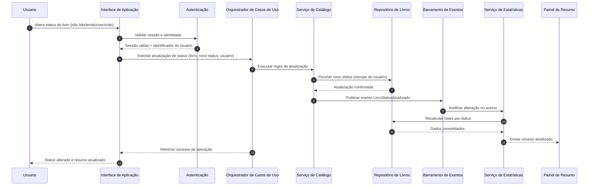

# Relatório Técnico de Arquitetura de Software

## 1. Identificação das HUs

| HU | Objetivo de Negócio | RF Relacionados | RNF Impactados |
|---|---|---|---|
| HU01 — Cadastrar livro | Registrar livros no acervo pessoal com dados mínimos válidos | RF01, RF04, RF13 | RNF04, RNF05 |
| HU02 — Atualizar status de leitura | Refletir progresso de leitura ao longo do tempo | RF05, RF10 | RNF03, RNF05 |
| HU03 — Organizar por gênero | Criar taxonomia flexível por múltiplos gêneros | RF06, RF08, RF11 | RNF04 |
| HU04 — Organizar por coleção | Agrupar livros por coleção única | RF07, RF08 | RNF04 |
| HU05 — Filtrar o acervo | Localizar livros por múltiplos atributos combináveis | RF09 | RNF03, RNF02 |
| HU06 — Pesquisar por título/autor | Busca parcial dinâmica por texto | RF12, RF09 | RNF03, RNF02 |
| HU07 — Visualizar resumo do acervo | Monitorar composição e comportamento de leitura | RF10, RF11 | RNF05 |
| HU08 — Exportar o acervo | Backup e interoperabilidade em CSV/JSON | RF01–RF13 (dados completos), RF08 | RNF07, RNF04, RNF01 |

---

## 2. Diagramas de Arquitetura (Mermaid)

### 2.1 Diagrama de Componentes (Visão Lógica)

```mermaid
flowchart LR
    U[Usuário] --> UI[Interface de Aplicação]

    UI --> AUTH[Componente de Autenticação e Isolamento de Usuário]
    UI --> APP[Orquestrador de Casos de Uso]

    APP --> CAT[Serviço de Catálogo de Livros]
    APP --> TAX[Serviço de Taxonomias\n(Gêneros e Coleções)]
    APP --> QRY[Serviço de Consulta, Busca e Filtros]
    APP --> STATS[Serviço de Estatísticas do Acervo]
    APP --> EXP[Serviço de Exportação]

    CAT --> RL[(Repositório de Livros)]
    TAX --> RG[(Repositório de Gêneros)]
    TAX --> RC[(Repositório de Coleções)]
    QRY --> RL
    QRY --> RG
    QRY --> RC
    STATS --> RL
    STATS --> RG
    STATS --> RC
    EXP --> RL
    EXP --> RG
    EXP --> RC

    CAT --> EVT[Barramento Interno de Eventos de Domínio]
    TAX --> EVT
    EVT --> STATS
```

### 2.2 Diagrama de Sequência (HU02 — Atualização de Status com Resumo em Tempo Real)



---

## 3. Decisões de Arquitetura

1. **Arquitetura modular por capacidades de negócio**  
   - **Decisão:** Separar Catálogo, Taxonomias, Consulta, Estatísticas e Exportação em componentes lógicos independentes.  
   - **Motivo:** Reduz acoplamento e melhora manutenção (RNF07).  
   - **Impacto:** Facilita evolução de filtros, exportação e estatísticas sem regressão global.

2. **Isolamento estrito por usuário em todas as operações**  
   - **Decisão:** Todo comando/consulta deve incluir contexto de identidade validada.  
   - **Motivo:** Atender RNF01 (acervo pessoal e isolado).  
   - **Impacto:** Regras de autorização aplicadas transversalmente nos componentes.

3. **Modelo de domínio com relacionamentos explícitos**  
   - **Decisão:**  
     - Livro ↔ Gênero: muitos-para-muitos.  
     - Livro ↔ Coleção: muitos-para-um (livro em uma coleção por vez).  
     - Livro possui `statusLeitura` com domínio fechado: {não lido, lendo, concluído}.  
   - **Motivo:** Atender RF04, RF08 e critérios HU03/HU04.  
   - **Impacto:** Integridade de dados e validação centralizada.

4. **Atualização de estatísticas orientada a eventos de domínio**  
   - **Decisão:** Após mutações (criar/editar/remover livro, gênero, coleção, status), publicar evento interno para atualização de resumo.  
   - **Motivo:** Atender RNF05 (tempo real) com baixo acoplamento.  
   - **Impacto:** Necessidade de idempotência e consistência eventual curta (ou síncrona conforme prioridade UX).

5. **Consulta com filtros combináveis e busca parcial**  
   - **Decisão:** Serviço de consulta especializado para compor filtros múltiplos e busca textual parcial por título/autor.  
   - **Motivo:** Cobrir RF09, RF12, HU05 e HU06 com performance previsível (RNF03).  
   - **Impacto:** Exige estratégias de paginação, ordenação e otimização de consulta.

6. **Exportação desacoplada do front-end**  
   - **Decisão:** Componente de exportação gera artefato CSV/JSON sob demanda com todos os campos do acervo.  
   - **Motivo:** Atender HU08 e RNF07.  
   - **Impacto:** Requer mapeamento canônico de campos e tratamento de volume.

7. **Persistência obrigatória de dados de negócio**  
   - **Decisão:** Repositórios de livros, gêneros e coleções como contratos de persistência durável.  
   - **Motivo:** RNF04.  
   - **Impacto:** Fluxos CRUD sempre transacionais no escopo de cada caso de uso.

---

## 4. Tabela de Componentes e Rastreabilidade

| Componente | Responsabilidade Principal | Comunica-se com | Origem (HU / Critério de Aceite) |
|---|---|---|---|
| Interface de Aplicação | Capturar ações do usuário, exibir acervo, filtros, resumo e exportação | Autenticação, Orquestrador, Painel de Resumo | HU01–HU08 (todos os critérios de interação) |
| Componente de Autenticação e Isolamento | Validar sessão e fornecer identidade para escopo pessoal | Interface, Orquestrador | RNF01 |
| Orquestrador de Casos de Uso | Coordenar chamadas entre serviços de domínio | Interface, Catálogo, Taxonomias, Consulta, Estatísticas, Exportação | HU01–HU08 |
| Serviço de Catálogo de Livros | CRUD de livros e atualização de status/tipo | Orquestrador, Repositório de Livros, Barramento de Eventos | HU01, HU02; RF01, RF02, RF03, RF05, RF13 |
| Serviço de Taxonomias | CRUD de gêneros/coleções e vínculos com livros | Orquestrador, Repositórios de Gêneros/Coleções, Barramento de Eventos | HU03, HU04; RF06, RF07, RF08 |
| Serviço de Consulta, Busca e Filtros | Filtragem combinável e busca parcial dinâmica | Orquestrador, Repositórios | HU05, HU06; RF09, RF12 |
| Serviço de Estatísticas do Acervo | Totais por status e gêneros mais frequentes com atualização automática | Orquestrador, Repositórios, Barramento de Eventos, Painel de Resumo | HU07, HU02; RF10, RF11; RNF05 |
| Serviço de Exportação | Gerar exportação completa em CSV/JSON para download | Orquestrador, Repositórios, Interface | HU08; RNF07 |
| Barramento Interno de Eventos de Domínio | Propagar eventos de mutação para atualização de projeções | Catálogo, Taxonomias, Estatísticas | HU02, HU07; RNF05 |
| Repositório de Livros | Persistir livros e vínculos de leitura | Catálogo, Consulta, Estatísticas, Exportação | RF01–RF05, RF08–RF10, RF12, RF13; RNF04 |
| Repositório de Gêneros | Persistir gêneros e associações | Taxonomias, Consulta, Estatísticas, Exportação | RF06, RF08, RF11; RNF04 |
| Repositório de Coleções | Persistir coleções e associações | Taxonomias, Consulta, Estatísticas, Exportação | RF07, RF08, RF09; RNF04 |

---

## 5. Bloqueios e Pendências

1. **Critério de desempenho “independentemente do volume” (RNF03) é aberto/absoluto**  
   - Sem limite de volume e perfil de consulta, não há meta testável realista.

2. **Política de autenticação não detalhada**  
   - Falta definição de cadastro/login, expiração de sessão, recuperação de acesso, etc.

3. **Comportamento exato de “tempo real” (RNF05) não especificado**  
   - Necessário acordar se atualização é síncrona imediata na mesma resposta ou assíncrona com pequeno atraso.

4. **Sem regras explícitas para deduplicação de livros**  
   - Pode haver múltiplos registros iguais? (mesmo título/autor/editora).

5. **Sem definição de ordenação padrão da listagem**  
   - Impacta UX de busca/filtro e consistência de testes.

6. **Exportação sem definição de codificação e delimitador CSV**  
   - Pode gerar incompatibilidade entre ferramentas do usuário final.

---

## 6. Cobertura de Requisitos

### 6.1 Requisitos Funcionais

| Requisito | Cobertura Arquitetural | Componentes-Chave | Status |
|---|---|---|---|
| RF01 Cadastrar livro | Fluxo de criação com validações de campos | Interface, Orquestrador, Catálogo, Repositório de Livros | Coberto |
| RF02 Editar livro | Atualização de atributos do livro | Catálogo, Repositório de Livros | Coberto |
| RF03 Remover livro | Exclusão lógica/física conforme regra de negócio | Catálogo, Repositório de Livros, Estatísticas | Coberto |
| RF04 Status de leitura (3 opções) | Enumeração de domínio restrita | Catálogo, Interface | Coberto |
| RF05 Atualizar status a qualquer momento | Comando dedicado de mudança de status | Catálogo, Repositório de Livros, Eventos, Estatísticas | Coberto |
| RF06 CRUD de gêneros | Serviço de taxonomias para gênero | Taxonomias, Repositório de Gêneros | Coberto |
| RF07 CRUD de coleções | Serviço de taxonomias para coleção | Taxonomias, Repositório de Coleções | Coberto |
| RF08 Associar livro a gêneros e coleção | Relacionamentos M:N (gêneros) e N:1 (coleção) | Catálogo, Taxonomias, Repositórios | Coberto |
| RF09 Filtrar por qualquer atributo | Consulta combinável multiatributo | Consulta, Repositórios, Interface | Coberto |
| RF10 Resumo por status | Projeção estatística por status | Estatísticas, Repositório de Livros | Coberto |
| RF11 Gêneros mais frequentes | Agregação por frequência de gênero | Estatísticas, Repositório de Gêneros/Livros | Coberto |
| RF12 Pesquisa por título/autor | Busca textual parcial dinâmica | Consulta, Interface | Coberto |
| RF13 Diferenciar físico/digital | Atributo de tipo no domínio Livro | Catálogo, Interface, Repositório de Livros | Coberto |

### 6.2 Requisitos Não Funcionais

| Requisito | Cobertura Arquitetural | Componentes-Chave | Status |
|---|---|---|---|
| RNF01 Segurança (autenticação/isolamento) | Contexto de identidade obrigatório em comandos/consultas | Autenticação, Orquestrador, Serviços de Domínio | Coberto |
| RNF02 Responsividade (mobile/desktop) | Interface adaptável e fluxos de interação simples | Interface | Parcial (depende de design UI) |
| RNF03 Desempenho ≤2s | Serviço de consulta dedicado e otimização de acesso | Consulta, Repositórios | Parcial (faltam metas de carga) |
| RNF04 Persistência durável | Contratos de repositório persistente | Repositórios | Coberto |
| RNF05 Estatísticas em tempo real | Eventos de domínio + atualização de resumo | Eventos, Estatísticas, Interface | Coberto (com definição fina pendente) |
| RNF06 Compatibilidade navegadores | Interface com padrões web amplamente suportados | Interface | Parcial (requer testes de compatibilidade) |
| RNF07 Exportação CSV/JSON | Serviço de exportação multi-formato | Exportação, Repositórios, Interface | Coberto |

---

## 7. Gap Analysis

| Lacuna | Impacto Arquitetural | Ação Recomendada |
|---|---|---|
| RNF03 sem baseline de volume/concurrency | Risco de não cumprir SLA de 2s em cenários reais | Definir metas de capacidade: nº de livros por usuário, usuários simultâneos, perfil de filtros, p95 de latência |
| “Tempo real” sem SLA objetivo | Ambiguidade entre consistência síncrona e assíncrona | Definir SLA de atualização (ex.: até X ms após mutação) e estratégia de entrega ao cliente |
| Autenticação pouco detalhada | Risco de lacunas de segurança e retrabalho | Especificar fluxos de acesso, ciclo de sessão e requisitos mínimos de proteção |
| Sem política de exclusão/recuperação | Possível perda acidental sem reversão | Definir se remoção é definitiva ou recuperável e impacto em estatísticas |
| Sem padrão de validação textual (título/autor/editora) | Dados inconsistentes e experiência ruim de busca | Definir regras de normalização, limites de tamanho e tratamento de caracteres |
| Exportação sem contrato de formato | Arquivos incompatíveis com ferramentas externas | Publicar especificação de schema JSON e convenções CSV (delimitador, escape, codificação) |
| Ausência de critérios de ordenação/paginação | Inconsistência de UX e performance degradada | Definir ordenação padrão e paginação para listagem/filtro/busca |

**Conclusão do Gap Analysis:** a arquitetura proposta cobre integralmente os RF e a maior parte dos RNF, porém o time precisa fechar critérios mensuráveis de desempenho, tempo real e segurança operacional para reduzir risco de retrabalho e garantir verificabilidade objetiva em testes.