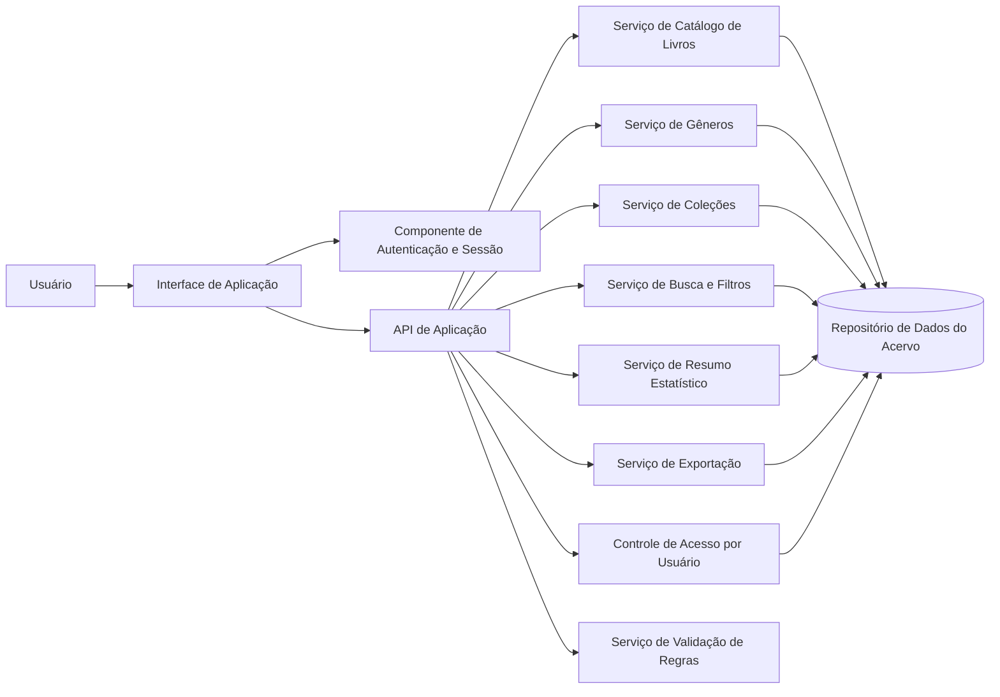
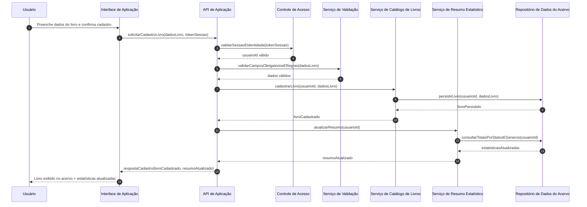

# Relatório Técnico de Arquitetura de Software

## 1. Identificação das HUs

| HU | Objetivo do Usuário | Requisitos Relacionados | Critérios de Aceite Relevantes para Arquitetura |
|---|---|---|---|
| HU01 | Cadastrar livro no acervo pessoal | RF01, RF04, RF13, RNF04 | Validação de obrigatórios (título/autor), enumeração de status, persistência e atualização imediata da listagem |
| HU02 | Atualizar status de leitura | RF05, RF10, RNF05 | Mudança de status a qualquer momento e reflexo imediato nas estatísticas |
| HU03 | Organizar por gênero | RF06, RF08, RF11 | CRUD de gêneros, relacionamento N:N livro-gênero, desvinculação sem exclusão de livro |
| HU04 | Organizar por coleção | RF07, RF08 | CRUD de coleções, relacionamento 1:N coleção-livros, desvinculação sem exclusão de livro |
| HU05 | Filtrar o acervo | RF09, RNF03 | Filtros combináveis, atualização dinâmica, limpar filtros |
| HU06 | Pesquisar por título/autor | RF12, RNF03 | Busca parcial com atualização dinâmica durante digitação |
| HU07 | Visualizar resumo estatístico | RF10, RF11, RNF05 | Totais por status, total geral, gêneros frequentes, atualização automática |
| HU08 | Exportar acervo | RNF07, RNF04 | Exportação completa dos dados em CSV/JSON com download direto |

**Ator principal:** Usuário autenticado (acervo isolado por identidade — RNF01).

---

## 2. Diagramas de Arquitetura (Mermaid)

### 2.1 Diagrama de Componentes (visão lógica)

### 2.2 Diagrama de Sequência — Cadastro de Livro com atualização de resumo

---

## 3. Decisões de Arquitetura

1. **Arquitetura modular por capacidades de negócio**
   - Módulos centrais: Catálogo, Gêneros, Coleções, Busca/Filtro, Resumo, Exportação, Autenticação/Isolamento.
   - **Motivo:** reduzir acoplamento e facilitar evolução incremental por HU.

2. **Isolamento estrito por usuário (multi-tenant lógico)**
   - Todo acesso a dados exige `usuarioId` derivado de sessão autenticada.
   - **Motivo:** atender RNF01 e evitar vazamento entre acervos.

3. **Modelo de domínio com relacionamentos explícitos**
   - Livro ↔ Gênero (N:N), Livro → Coleção (0..1), Livro possui tipo (físico/digital) e status controlado.
   - **Motivo:** cobrir RF08, HU03, HU04, RF13 com integridade semântica.

4. **Atualização reativa de estatísticas**
   - Eventos de alteração de acervo (criar/editar/remover/alterar status) disparam recálculo ou atualização incremental de resumo.
   - **Motivo:** cumprir RNF05 e HU02/HU07.

5. **Busca e filtros combináveis na camada de aplicação**
   - Interface única de consulta com critérios compostos e paginação lógica.
   - **Motivo:** RF09, HU05, HU06 e RNF03.

6. **Exportação como capacidade transversal**
   - Geração de artefato de exportação (CSV/JSON) a partir do estado atual do acervo do usuário.
   - **Motivo:** RNF07/HU08.

7. **Validação centralizada de regras**
   - Regras de obrigatoriedade, enumerações e consistência relacional em serviço dedicado.
   - **Motivo:** evitar divergência entre fluxos de cadastro/edição e manter qualidade dos dados.

---

## 4. Tabela de Componentes e Rastreabilidade

| Componente | Responsabilidade Principal | Comunica-se com | Origem (HU / Critério de Aceite) |
|---|---|---|---|
| Interface de Aplicação | Capturar ações do usuário, renderizar acervo, filtros, busca, resumo e exportação | API de Aplicação, Componente de Autenticação | HU01–HU08 (todos os critérios de interação dinâmica) |
| Componente de Autenticação e Sessão | Autenticar usuário e manter contexto de sessão | Interface, Controle de Acesso | RNF01 |
| Controle de Acesso por Usuário | Garantir isolamento do acervo por identidade | API, Repositório, Autenticação | RNF01 (“acervo estritamente pessoal e isolado”) |
| API de Aplicação | Orquestrar casos de uso e contratos de entrada/saída | Interface, serviços de domínio | Todas as HUs |
| Serviço de Validação de Regras | Validar campos obrigatórios, status permitido, tipo de livro, consistência de vínculos | API, serviços de domínio | HU01 (título/autor obrigatórios, status válido), HU03/HU04 |
| Serviço de Catálogo de Livros | CRUD de livros e atualização de status | API, Repositório, Resumo Estatístico | RF01, RF02, RF03, RF05, RF13; HU01, HU02 |
| Serviço de Gêneros | CRUD de gêneros e vínculo/desvínculo com livros | API, Repositório | RF06, RF08, RF11; HU03 |
| Serviço de Coleções | CRUD de coleções e vínculo/desvínculo com livros | API, Repositório | RF07, RF08; HU04 |
| Serviço de Busca e Filtros | Consultas por atributos, busca parcial por título/autor, combinação de filtros | API, Repositório | RF09, RF12; HU05, HU06; RNF03 |
| Serviço de Resumo Estatístico | Totais por status, total geral e gêneros mais frequentes; atualização automática | API, Repositório, Catálogo/Gêneros/Coleções | RF10, RF11; HU07; RNF05 |
| Serviço de Exportação | Gerar exportação completa em CSV/JSON para download | API, Repositório | RNF07; HU08 |
| Repositório de Dados do Acervo | Persistência durável de livros, gêneros, coleções e vínculos por usuário | Todos os serviços de domínio | RNF04 |

---

## 5. Bloqueios e Pendências

1. **Definição de escala para RNF03 (“independentemente do volume”)**
   - Falta limite objetivo de volume e concorrência para validar SLA de 2s.

2. **Regras de exclusão lógica vs. física**
   - Não está definido se remoção de livro/gênero/coleção deve ser recuperável.

3. **Especificação de paginação e ordenação**
   - Necessária para listas grandes e previsibilidade de UX/performance.

4. **Detalhe do escopo de exportação**
   - Confirmar se exportação inclui metadados de sistema (datas de criação/alteração, identificadores internos).

5. **Política de consistência do resumo**
   - “Tempo real” precisa de definição operacional (instantâneo, eventual em segundos, etc.).

6. **Tratamento de duplicidade de livros**
   - Não há regra para permitir ou bloquear cadastros duplicados por título/autor.

---

## 6. Cobertura de Requisitos

### 6.1 Requisitos Funcionais

| Requisito | Cobertura Arquitetural | Status |
|---|---|---|
| RF01 | Serviço de Catálogo + Validação + Repositório + Interface | Coberto |
| RF02 | Serviço de Catálogo (edição) + Validação | Coberto |
| RF03 | Serviço de Catálogo (remoção) + Repositório | Coberto |
| RF04 | Validação de enumeração de status | Coberto |
| RF05 | Serviço de Catálogo (mudança de status) + Resumo Estatístico | Coberto |
| RF06 | Serviço de Gêneros (CRUD) | Coberto |
| RF07 | Serviço de Coleções (CRUD) | Coberto |
| RF08 | Gestão de vínculos livro-gêneros/coleção nos serviços de domínio | Coberto |
| RF09 | Serviço de Busca e Filtros (filtros combináveis) | Coberto |
| RF10 | Serviço de Resumo Estatístico (totais por status) | Coberto |
| RF11 | Serviço de Resumo Estatístico (gêneros frequentes) | Coberto |
| RF12 | Serviço de Busca (título/autor parcial) | Coberto |
| RF13 | Campo “tipo de livro” com validação (físico/digital) | Coberto |

### 6.2 Requisitos Não Funcionais

| Requisito | Cobertura Arquitetural | Status |
|---|---|---|
| RNF01 Segurança | Autenticação + Controle de Acesso por usuário | Coberto |
| RNF02 Usabilidade responsiva | Interface de Aplicação com adaptação de layout | Coberto (depende de implementação) |
| RNF03 Desempenho (≤2s) | Serviço de Busca/Filtros otimizado + paginação/estratégia de consulta | Parcial (falta baseline de carga) |
| RNF04 Persistência | Repositório durável de dados | Coberto |
| RNF05 Resumo em tempo real | Atualização reativa do Serviço de Resumo | Coberto (depende de definição temporal) |
| RNF06 Compatibilidade navegadores | Interface com testes de compatibilidade | Parcial (requer plano de testes) |
| RNF07 Exportação CSV/JSON | Serviço de Exportação + download via interface | Coberto |

---

## 7. Gap Analysis

| Lacuna de Especificação | Impacto Arquitetural | Ação Recomendada |
|---|---|---|
| “Até 2s independentemente do volume” sem perfil de carga | Risco de meta irreal e decisões inadequadas de consulta | Definir volumes-alvo, concorrência e cenários críticos de busca/listagem |
| “Tempo real” sem tolerância de atraso | Ambiguidade entre consistência forte vs eventual | Fixar SLA de atualização (ex.: até X segundos) |
| Sem política de paginação/ordenação | Possível degradação de UX/performance com acervos grandes | Especificar paginação padrão, ordenação e limites máximos |
| Sem regra de duplicidade de livro | Pode gerar inconsistência semântica do acervo | Definir estratégia: permitir duplicados, alertar ou bloquear |
| Sem detalhamento de auditoria/histórico de status | Limita análises futuras de progresso de leitura | Decidir se haverá trilha histórica de mudanças |
| Sem critérios de erro para exportação (volume, timeout) | Risco de falha sem feedback adequado | Definir contrato de erro e comportamento para grandes exportações |
| Compatibilidade entre navegadores sem matriz de versões | Cobertura de testes indefinida | Definir matriz mínima de versões suportadas e critérios de aceite |
| Remoção sem definir “soft delete” | Impacta recuperação de dados e integridade relacional | Validar necessidade de lixeira/recuperação e política de retenção |

**Conclusão do Gap:** os requisitos estão bem definidos para o domínio funcional principal, porém precisam de refinamento em metas mensuráveis de desempenho, consistência temporal e políticas operacionais (exclusão, duplicidade e compatibilidade) para reduzir risco arquitetural na implementação.