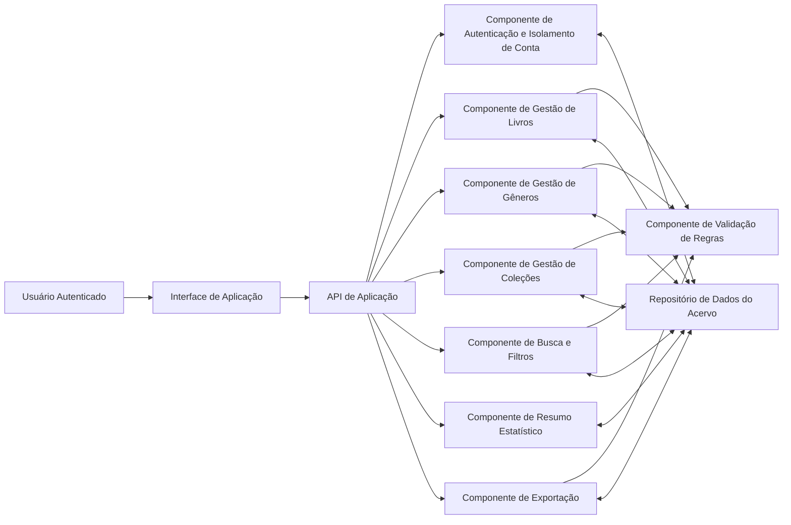
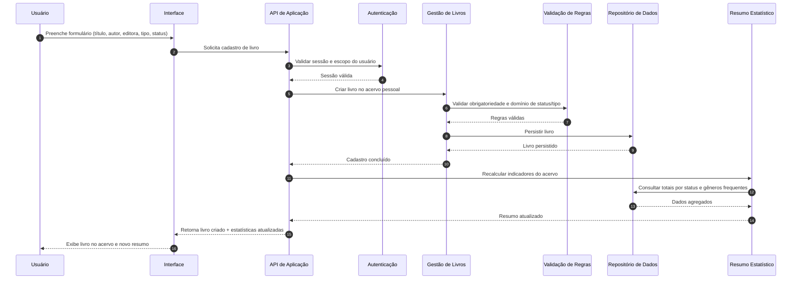

# Relatório Técnico de Arquitetura de Software

## 1. Identificação das HUs

| HU | Objetivo do Usuário | RFs Relacionados | RNFs Relacionados | Observações de Escopo |
|---|---|---|---|---|
| HU01 | Cadastrar livro com metadados e status | RF01, RF04, RF13 | RNF04, RNF05 | Campos obrigatórios: título e autor; criação deve refletir no acervo imediatamente. |
| HU02 | Atualizar status de leitura | RF05, RF04 | RNF05, RNF03 | Mudança de status deve recalcular estatísticas em tempo real. |
| HU03 | Organizar por gênero | RF06, RF08 | RNF04 | Relacionamento muitos-para-muitos (livro ↔ gêneros). Remoção desvincula, não exclui livros. |
| HU04 | Organizar por coleção | RF07, RF08 | RNF04 | Relacionamento um-para-muitos (coleção ↔ livros). Remoção desvincula livros. |
| HU05 | Filtrar acervo por atributos combinados | RF09 | RNF03, RNF02 | Filtros cumulativos e limpeza global de filtros. |
| HU06 | Pesquisar por título/autor com correspondência parcial | RF12 | RNF03, RNF02 | Busca dinâmica enquanto digita. |
| HU07 | Visualizar resumo estatístico do acervo | RF10, RF11 | RNF05, RNF03 | Totais por status e gêneros mais frequentes. |
| HU08 | Exportar acervo em CSV/JSON | RF08 (dados completos associados), RF13 | RNF07, RNF04 | Exportação com todos os campos e download no navegador. |

---

## 2. Diagramas de Arquitetura (Mermaid)

### 2.1 Diagrama de Componentes (visão lógica)

### 2.2 Diagrama de Sequência — Cadastro de Livro com atualização imediata de resumo

---

## 3. Decisões de Arquitetura

1. **Arquitetura modular por capacidades de negócio**  
   Separação em componentes: livros, gêneros, coleções, busca/filtro, resumo e exportação.  
   **Motivo:** reduz acoplamento e melhora manutenibilidade (RNF07).

2. **Isolamento estrito por usuário no domínio e na persistência**  
   Toda operação é contextualizada por identidade autenticada.  
   **Motivo:** aderência a RNF01 (acervo pessoal e isolado).

3. **Validação centralizada de regras de negócio**  
   Regras de obrigatoriedade, domínios fechados (status/tipo), cardinalidades e desvinculações ficam em componente dedicado.  
   **Motivo:** consistência entre fluxos de criação, edição, importação e exportação.

4. **Modelo relacional conceitual do domínio**  
   - Livro (1) ↔ (N) coleção (opcional por livro: no máximo 1 coleção)  
   - Livro (N) ↔ (N) gêneros  
   **Motivo:** atender HU03/HU04 e RF08 sem perda semântica.

5. **Resumo estatístico atualizado por evento de mutação**  
   Após criar/editar/remover/alterar status, o resumo é recalculado e retornado.  
   **Motivo:** RNF05 (tempo real percebido no uso).

6. **Busca e filtros combináveis como serviço de consulta único**  
   Consulta aceita múltiplos critérios simultâneos + limpeza unificada.  
   **Motivo:** HU05 e desempenho previsível (RNF03).

7. **Exportação desacoplada da interface**  
   Serviço gera representação canônica do acervo e serializa em CSV/JSON.  
   **Motivo:** RNF07 e reutilização futura (ex.: integração com importação futura).

---

## 4. Tabela de Componentes e Rastreabilidade

| Componente | Responsabilidade Principal | Comunica-se com | Origem (HU / Critério de Aceite) |
|---|---|---|---|
| Interface de Aplicação | Capturar interação do usuário, renderizar lista, filtros, resumo e feedback imediato | API de Aplicação | HU01, HU05, HU06, HU07 (atualização dinâmica e imediata) |
| API de Aplicação | Orquestrar casos de uso, aplicar autorização e compor respostas | Autenticação, componentes de domínio | Todas as HUs |
| Autenticação e Isolamento de Conta | Validar sessão e garantir escopo de dados por usuário | API, Repositório | RNF01 |
| Gestão de Livros | CRUD de livros, atualização de status e tipo físico/digital | API, Validação, Repositório, Resumo | HU01, HU02, RF01, RF02, RF03, RF04, RF05, RF13 |
| Gestão de Gêneros | CRUD de gêneros e vínculos livro-gênero | API, Validação, Repositório | HU03, RF06, RF08 |
| Gestão de Coleções | CRUD de coleções e vínculo único livro-coleção | API, Validação, Repositório | HU04, RF07, RF08 |
| Busca e Filtros | Pesquisa parcial por título/autor e filtros combinados por atributos | API, Validação, Repositório | HU05, HU06, RF09, RF12 |
| Resumo Estatístico | Total geral, total por status e gêneros frequentes | API, Repositório | HU07, RF10, RF11, RNF05 |
| Exportação de Acervo | Gerar arquivo de backup em CSV/JSON com todos os campos | API, Repositório, Validação | HU08, RNF07 |
| Validação de Regras | Garantir obrigatoriedade, domínios fechados, integridade de vínculos e desvinculação segura | Componentes de domínio | Critérios HU01–HU08; RF04; regras de desvinculação HU03/HU04 |
| Repositório de Dados do Acervo | Persistência durável, consultas filtradas, agregações para resumo | Todos os componentes de domínio | RNF04, RNF03 |

---

## 5. Bloqueios e Pendências

| Item | Tipo | Impacto Arquitetural | Ação Recomendada |
|---|---|---|---|
| Política de unicidade de livro (mesmo título/autor repetido?) | Regra de negócio | Afeta validação e experiência de cadastro | Definir se duplicidade é permitida e em quais condições |
| Definição de “tempo real” (push, pull, refresh por ação) | Não funcional | Impacta estratégia de atualização de resumo | Fixar SLA funcional de atualização (ex.: imediato após resposta da operação) |
| Escopo de “independentemente do volume” (RNF03) | Desempenho | Sem volume-alvo não há dimensionamento mensurável | Definir carga de referência (ex.: 10k, 100k livros por usuário) |
| Ordenação padrão da listagem | UX/Consulta | Impacta paginação e previsibilidade de resultados | Definir critério padrão (ex.: título ascendente, data de cadastro) |
| Regras de exclusão lógica/física | Persistência/Auditoria | Impacta integridade, histórico e exportação | Definir se remoção é definitiva ou recuperável |
| Formato CSV detalhado (separador, encoding, cabeçalho) | Interoperabilidade | Impacta compatibilidade de importação externa | Publicar contrato de exportação |

---

## 6. Cobertura de Requisitos

### 6.1 Requisitos Funcionais

| RF | Cobertura Arquitetural | Status |
|---|---|---|
| RF01 | Gestão de Livros + Validação + Persistência | Coberto |
| RF02 | Gestão de Livros + Validação + Persistência | Coberto |
| RF03 | Gestão de Livros + Persistência + Resumo | Coberto |
| RF04 | Validação de domínio (status fixos) | Coberto |
| RF05 | Gestão de Livros (mudança de status) + Resumo | Coberto |
| RF06 | Gestão de Gêneros | Coberto |
| RF07 | Gestão de Coleções | Coberto |
| RF08 | Gestão de vínculos livro-gênero e livro-coleção | Coberto |
| RF09 | Busca e Filtros combinados | Coberto |
| RF10 | Resumo Estatístico (totais por status) | Coberto |
| RF11 | Resumo Estatístico (gêneros frequentes) | Coberto |
| RF12 | Busca parcial por título/autor | Coberto |
| RF13 | Gestão de Livros (tipo físico/digital) | Coberto |

### 6.2 Requisitos Não Funcionais

| RNF | Cobertura Arquitetural | Status |
|---|---|---|
| RNF01 | Autenticação + isolamento de escopo por usuário | Coberto |
| RNF02 | Interface responsiva (requisito de front-end) | Parcialmente detalhado |
| RNF03 | Busca/filtros otimizados + metas de consulta | Parcial (falta carga-alvo) |
| RNF04 | Repositório durável de dados | Coberto |
| RNF05 | Recalcular/responder resumo após mutações | Coberto |
| RNF06 | Compatibilidade entre navegadores modernos | Parcialmente detalhado |
| RNF07 | Componente de exportação CSV/JSON | Coberto |

---

## 7. Gap Analysis

1. **Métrica de desempenho insuficiente (RNF03)**  
   - **Lacuna:** “independentemente do volume” sem baseline quantitativa.  
   - **Impacto:** impossível validar arquitetura de consulta de forma objetiva.  
   - **Ação:** definir perfis de carga por usuário e concorrência esperada.

2. **Ausência de regra de paginação/limite de resultados**  
   - **Lacuna:** filtros e busca dinâmicos sem política de paginação.  
   - **Impacto:** risco de degradação de UX e desempenho em grandes acervos.  
   - **Ação:** estabelecer paginação, ordenação e tamanho de página padrão.

3. **Contrato de exportação incompleto**  
   - **Lacuna:** sem especificação formal de campos, formatação e codificação.  
   - **Impacto:** inconsistência entre consumidores do arquivo.  
   - **Ação:** publicar esquema canônico de exportação CSV/JSON e casos de teste.

4. **Regras de governança de dados não explicitadas**  
   - **Lacuna:** retenção, exclusão definitiva, recuperação e auditoria ausentes.  
   - **Impacto:** decisões tardias podem exigir retrabalho estrutural.  
   - **Ação:** definir políticas de ciclo de vida dos dados.

5. **Critérios de compatibilidade de navegadores sem matriz de testes**  
   - **Lacuna:** navegadores listados, mas sem versões mínimas.  
   - **Impacto:** ambiguidade na validação de RNF06.  
   - **Ação:** fixar versões alvo e suíte de testes de regressão de interface.

--- 

Se quiser, na próxima etapa eu converto este relatório em **backlog técnico executável** (épicos, histórias técnicas e critérios de pronto por componente).