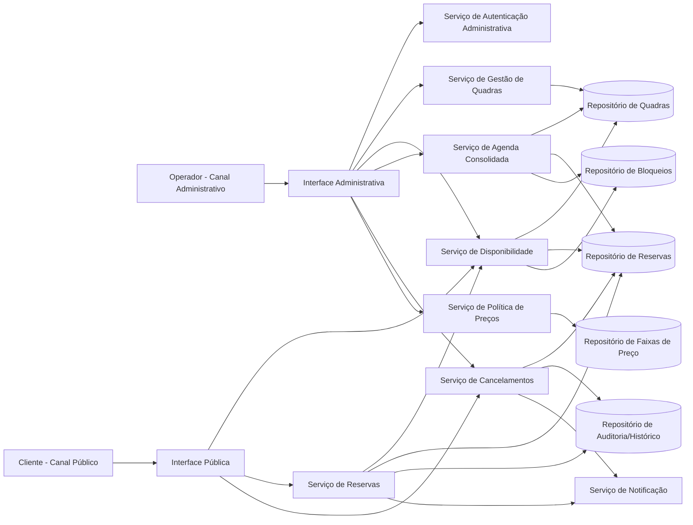
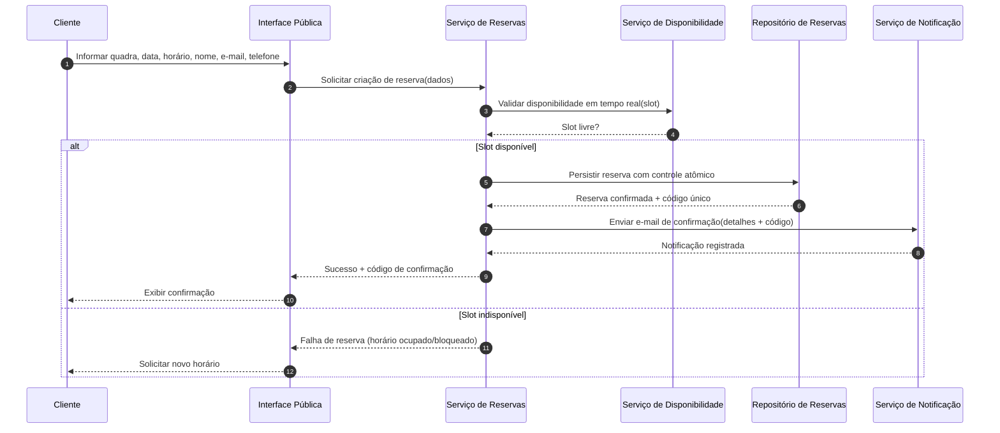
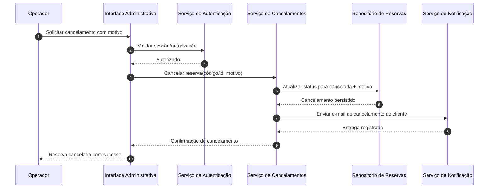

# Relatório Técnico de Arquitetura de Software

## 1. Identificação das HUs

### 1.1 Inventário de Histórias de Usuário
| HU | Perfil | Objetivo | Requisitos relacionados |
|---|---|---|---|
| HU01 | Operador | Cadastrar quadra com tipo, horário e valor | RF01, RF02, RF12 |
| HU02 | Operador | Bloquear horários para manutenção/feriados | RF03, RF04, RF07 |
| HU03 | Operador | Visualizar agenda consolidada diária | RF11 |
| HU04 | Operador | Cancelar reserva com justificativa | RF09, RF10 |
| HU05 | Cliente | Consultar disponibilidade sem login | RF04, RF07 |
| HU06 | Cliente | Realizar reserva e receber confirmação | RF05, RF06, RF07, RF10 |
| HU07 | Cliente | Cancelar reserva com código | RF08 |

### 1.2 Atores e Fronteiras
- **Cliente (público, sem autenticação):**
  - Consulta disponibilidade
  - Efetiva reserva
  - Cancela por código de confirmação
- **Operador (área administrativa autenticada):**
  - Gerencia quadras e preços
  - Bloqueia horários
  - Visualiza agenda consolidada
  - Cancela reservas com justificativa

### 1.3 Capacidades funcionais consolidadas
1. **Gestão de Quadras e Regras de Preço**
2. **Gestão de Disponibilidade (livre/reservado/bloqueado)**
3. **Reserva com garantia de atomicidade**
4. **Cancelamento por cliente e operador**
5. **Notificação por e-mail**
6. **Visão operacional diária (agenda consolidada)**

---

## 2. Diagramas de Arquitetura (Mermaid)

### 2.1 Diagrama de Componentes (visão lógica)

### 2.2 Diagrama de Sequência — Realização de Reserva (HU06, RF05-07-10, RNF05)

### 2.3 Diagrama de Sequência — Cancelamento pelo Operador (HU04, RF09-RF10)

---

## 3. Decisões de Arquitetura

| ID | Decisão | Motivação | Impacto |
|---|---|---|---|
| DA01 | Separar canais público e administrativo | Perfis e riscos distintos (cliente sem login vs operador autenticado) | Atende RF04 e RNF03, reduz exposição de funções críticas |
| DA02 | Centralizar lógica de disponibilidade em serviço próprio | Regras de livre/ocupado/bloqueado devem ser consistentes | Evita divergência entre consulta e reserva (RF04, RF07, HU05, HU06) |
| DA03 | Confirmar reserva com operação atômica | Evitar duplo agendamento em concorrência | Atende RNF05 e RF07 |
| DA04 | Gerar código único de confirmação no domínio de reservas | Código é chave funcional para cliente cancelar | Atende RF06 e RF08 |
| DA05 | Tratar cancelamento como capacidade dedicada (cliente e operador) | Regras diferentes: operador exige justificativa | Atende RF08, RF09, HU04, HU07 |
| DA06 | Notificação desacoplada do fluxo principal de domínio | Reserva/cancelamento e e-mail têm responsabilidades distintas | Melhora manutenibilidade e rastreabilidade de envios (RF10) |
| DA07 | Agenda consolidada como serviço de consulta especializado | Necessidade de visão diária transversal de quadras | Atende RF11 com melhor organização de leitura |
| DA08 | Política de preços modular por faixa horária | Evolução de regras tarifárias sem alterar reserva base | Atende RF12 e RNF07 |
| DA09 | Registrar histórico de ações críticas (cancelamentos, confirmações) | Governança operacional e suporte | Facilita auditoria e suporte ao operador |

---

## 4. Tabela de Componentes e Rastreabilidade

| Componente | Responsabilidade Principal | Comunica-se com | Origem (HU / Critério de Aceite) |
|---|---|---|---|
| Interface Pública | Expor consulta de disponibilidade, reserva e cancelamento por código | Serviço de Disponibilidade, Serviço de Reservas, Serviço de Cancelamentos | HU05, HU06, HU07 |
| Interface Administrativa | Expor gestão operacional para operador | Autenticação, Gestão de Quadras, Disponibilidade, Agenda, Cancelamentos, Preços | HU01, HU02, HU03, HU04 |
| Serviço de Autenticação Administrativa | Controlar acesso seguro à área do operador | Interface Administrativa | RNF03 |
| Serviço de Gestão de Quadras | Cadastrar, editar, remover quadras e dados básicos | Repositório de Quadras | HU01, RF01, RF02 |
| Serviço de Disponibilidade | Calcular slots livres/ocupados/bloqueados por data/quadra | Repositórios de Quadras, Reservas e Bloqueios; Serviço de Reservas | HU02, HU05, HU06; RF03, RF04, RF07 |
| Serviço de Reservas | Validar e confirmar reserva; gerar código único | Disponibilidade, Repositório de Reservas, Notificação, Auditoria | HU06; RF05, RF06, RF07, RF10; RNF05 |
| Serviço de Cancelamentos | Cancelar reserva por código (cliente) ou por operador com motivo | Repositório de Reservas, Notificação, Auditoria | HU04, HU07; RF08, RF09, RF10 |
| Serviço de Agenda Consolidada | Exibir ocupação diária de todas as quadras | Repositórios de Quadras, Reservas e Bloqueios | HU03; RF11 |
| Serviço de Política de Preços | Configurar valor da hora por faixa de horário | Repositório de Preços, Gestão de Quadras | RF12, HU01 |
| Serviço de Notificação | Enviar confirmações e cancelamentos por e-mail | Reservas, Cancelamentos | HU04, HU06; RF10 |
| Repositório de Quadras | Persistir dados das quadras | Gestão de Quadras, Disponibilidade, Agenda | RF01, RF02, RF11 |
| Repositório de Reservas | Persistir reservas e status | Reservas, Cancelamentos, Disponibilidade, Agenda | RF05, RF07, RF08, RF09, RF11 |
| Repositório de Bloqueios | Persistir bloqueios operacionais | Disponibilidade, Agenda | RF03, HU02 |
| Repositório de Preços | Persistir regras de preço por faixa horária | Política de Preços | RF12 |
| Repositório de Auditoria/Histórico | Registrar ações críticas (confirmação/cancelamento) | Reservas, Cancelamentos | HU04, RNF07 (manutenibilidade/operação) |

---

## 5. Bloqueios e Pendências

| Tema | Tipo | Impacto Arquitetural | Status |
|---|---|---|---|
| Granularidade do horário (ex.: 30min, 60min) | Pendência funcional | Afeta modelo de disponibilidade, cálculo de conflitos e agenda | Em aberto |
| Regra de antecedência mínima para reservar/cancelar | Pendência de negócio | Afeta validações no serviço de reservas/cancelamentos | Em aberto |
| Política de envio de e-mail em falha transitória | Pendência não funcional | Impacta confiabilidade da comunicação ao cliente | Em aberto |
| Fuso horário oficial do sistema | Pendência técnica-funcional | Evita inconsistência em horários e calendário | Em aberto |
| Critérios de autenticação/autorização do operador (papéis) | Pendência de segurança | Pode demandar perfis além de “operador” | Em aberto |
| Política de retenção de dados pessoais | Pendência de governança | Impacta modelo de dados e compliance | Em aberto |

---

## 6. Cobertura de Requisitos

### 6.1 Requisitos Funcionais (RF)

| RF | Cobertura na Arquitetura | Situação |
|---|---|---|
| RF01 | Serviço de Gestão de Quadras + Repositório de Quadras | Coberto |
| RF02 | Serviço de Gestão de Quadras | Coberto |
| RF03 | Serviço de Disponibilidade + Repositório de Bloqueios | Coberto |
| RF04 | Interface Pública + Serviço de Disponibilidade | Coberto |
| RF05 | Interface Pública + Serviço de Reservas | Coberto |
| RF06 | Serviço de Reservas (geração de código único) | Coberto |
| RF07 | Disponibilidade centralizada + confirmação atômica | Coberto |
| RF08 | Serviço de Cancelamentos por código | Coberto |
| RF09 | Cancelamento administrativo com motivo obrigatório | Coberto |
| RF10 | Serviço de Notificação por e-mail (reserva/cancelamento) | Coberto |
| RF11 | Serviço de Agenda Consolidada | Coberto |
| RF12 | Serviço de Política de Preços por faixa horária | Coberto |

### 6.2 Requisitos Não Funcionais (RNF)

| RNF | Cobertura na Arquitetura | Situação |
|---|---|---|
| RNF01 Usabilidade | Separação de interface pública com requisito de responsividade considerado na camada de apresentação | Parcial (depende de implementação UI) |
| RNF02 Desempenho (2s) | Serviço de consulta dedicado para disponibilidade e agenda | Parcial (exige metas de teste e otimização) |
| RNF03 Segurança | Autenticação obrigatória na área administrativa | Coberto |
| RNF04 Disponibilidade 99% 24/7 | Arquitetura modular permite operação contínua e isolamento de falhas | Parcial (requer estratégia operacional) |
| RNF05 Confiabilidade/atomicidade | Confirmação de reserva com operação atômica e validação em tempo real | Coberto |
| RNF06 Compatibilidade navegadores | Atendido no desenho de canais web; depende de testes de compatibilidade | Parcial |
| RNF07 Manutenibilidade | Serviços modulares por responsabilidade de domínio | Coberto |

---

## 7. Gap Analysis

| Lacuna | Impacto | Recomendação |
|---|---|---|
| Não há definição de unidade de tempo da reserva | Risco de conflito de agenda e regras inconsistentes | Formalizar duração padrão e política de encaixe de horários |
| Não há regra para conflitos de bloqueio vs reserva existente | Pode gerar ambiguidades operacionais | Definir precedência (bloqueio impede novas reservas, mas não retroage sem ação explícita) |
| Falta política de reajuste e vigência de preço por faixa | Cobrança inconsistente ao longo do tempo | Versionar regras de preço com data de início/fim de vigência |
| Não há SLA para envio de e-mail | Cliente pode não receber confirmação em tempo útil | Definir prazo máximo de envio e estratégia de reenvio |
| RNF04 (99%) sem diretrizes de continuidade | Meta de disponibilidade pode não ser comprovada | Definir plano de observabilidade, contingência e janelas de manutenção |
| Ausência de requisitos explícitos de proteção de dados pessoais | Risco regulatório e de segurança | Especificar consentimento, retenção e máscara de dados sensíveis |
| Não há regra de limite de reservas por cliente | Possível abuso de slots | Definir política de uso (limite por dia/semana, antispam) |

### Síntese Final
A arquitetura proposta cobre integralmente os RFs e endereça os RNFs críticos no nível de desenho lógico. Os principais riscos remanescentes estão em **regras de negócio ainda não especificadas** (tempo de reserva, política de preços e governança de dados) e em **metas operacionais mensuráveis** (desempenho e disponibilidade), que devem ser refinadas antes da implementação.