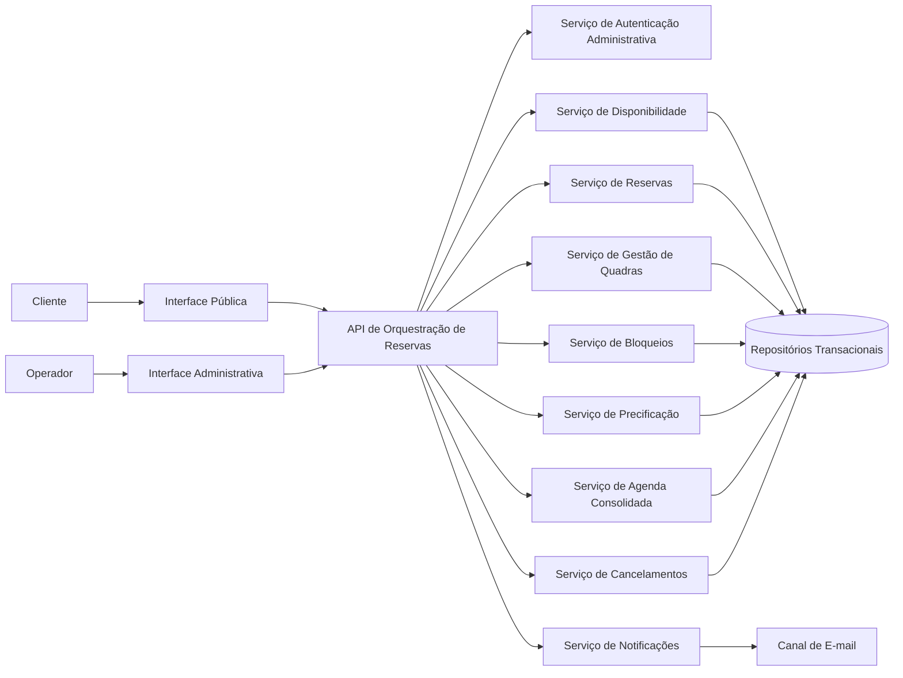
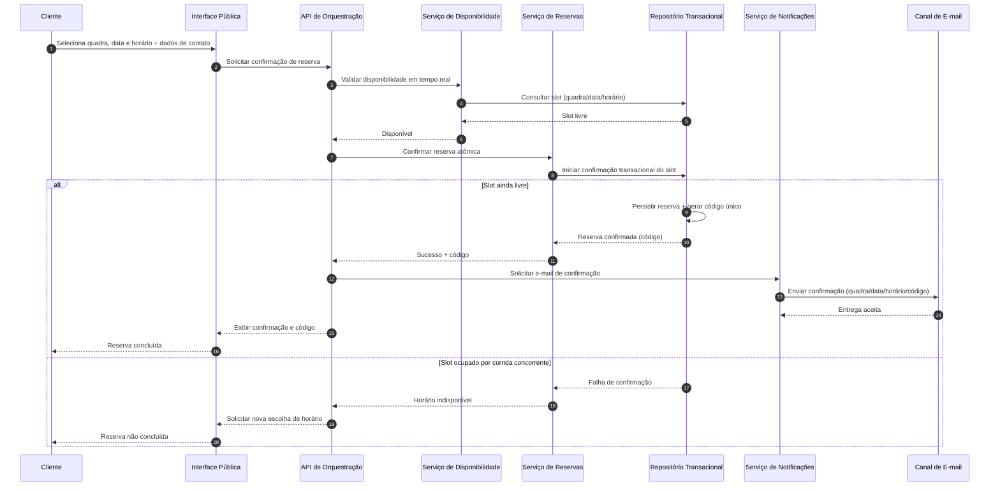
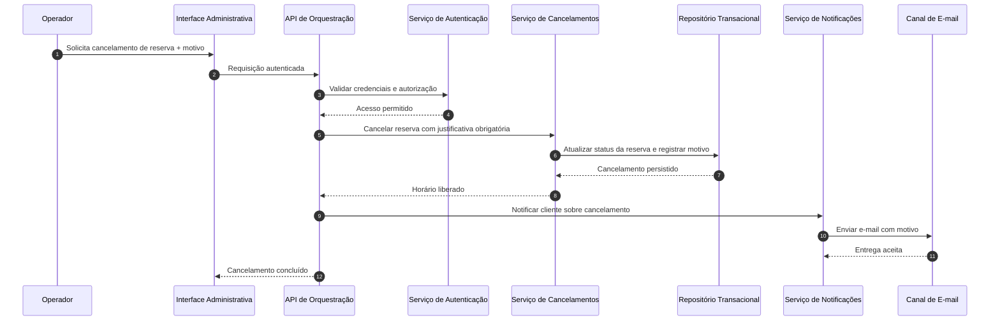

# Relatório Técnico de Arquitetura de Software

## 1. Identificação das HUs

### 1.1 Perfis e objetivos de negócio
- **Operador (HU01–HU04)**: administrar catálogo de quadras, bloquear horários, acompanhar agenda consolidada e cancelar reservas com justificativa.
- **Cliente (HU05–HU07)**: consultar disponibilidade sem login, reservar horário e cancelar com código de confirmação.

### 1.2 HUs consolidadas por capacidades arquiteturais
1. **Gestão de Quadras e Regras de Uso**
   - HU01 (cadastrar quadra), HU02 (bloqueios de horário)
2. **Consulta Pública de Disponibilidade**
   - HU05 (consulta sem cadastro/login)
3. **Ciclo de Reserva**
   - HU06 (realizar reserva com validação concorrente e código único)
4. **Ciclo de Cancelamento**
   - HU07 (cancelamento por código) e HU04 (cancelamento por operador com motivo + notificação)
5. **Operação Diária**
   - HU03 (agenda consolidada por dia e navegação por datas)

### 1.3 Casos de uso arquiteturalmente críticos
- **UC-CR1: Confirmar reserva de forma atômica** (RNF05 + RF07 + HU06)
- **UC-CR2: Exibir disponibilidade em até 2s** (RNF02 + HU05)
- **UC-CR3: Segregar área administrativa autenticada** (RNF03 + HU01-HU04)
- **UC-CR4: Notificação por e-mail em reserva/cancelamento** (RF10 + HU04/HU06)

---

## 2. Diagramas de Arquitetura (Mermaid)

### 2.1 Diagrama de Componentes (visão lógica)

### 2.2 Diagrama de Sequência — Realizar Reserva (atômica)

### 2.3 Diagrama de Sequência — Cancelamento por Operador com motivo

---

## 3. Decisões de Arquitetura

1. **Separação entre canal público e canal administrativo**
   - **Decisão:** duas interfaces lógicas com políticas distintas de acesso.
   - **Motivo:** HU05 exige consulta sem login, RNF03 exige autenticação na administração.
   - **Consequência:** segurança sem fricção para cliente.

2. **Serviço de disponibilidade desacoplado da confirmação**
   - **Decisão:** disponibilidade para consulta rápida e confirmação final no ato da reserva.
   - **Motivo:** RNF02 (até 2s) e HU06 (revalidar no momento da confirmação).
   - **Consequência:** boa performance sem comprometer consistência.

3. **Confirmação transacional atômica de reserva**
   - **Decisão:** operação de confirmação com controle de concorrência no slot.
   - **Motivo:** RNF05 + RF07 (evitar duplo agendamento).
   - **Consequência:** integridade forte em cenários simultâneos.

4. **Modelo de domínio orientado a “slot” (quadra + data + horário)**
   - **Decisão:** slot como unidade central para disponibilidade, bloqueio e reserva.
   - **Motivo:** simplifica RF03, RF07, HU02, HU06, HU07.
   - **Consequência:** rastreabilidade clara e regras uniformes.

5. **Notificação assíncrona após eventos de negócio**
   - **Decisão:** reserva e cancelamento disparam solicitação de e-mail.
   - **Motivo:** RF10 e HU04; reduz acoplamento do fluxo principal.
   - **Consequência:** maior resiliência operacional.

6. **Precificação por faixa horária como regra de domínio configurável**
   - **Decisão:** componente dedicado de precificação consultado na reserva/consulta.
   - **Motivo:** RF12.
   - **Consequência:** facilita evoluções de políticas comerciais.

7. **Arquitetura modular por capacidades**
   - **Decisão:** componentes independentes por responsabilidade.
   - **Motivo:** RNF07 (manutenibilidade e expansão de modalidades).
   - **Consequência:** menor impacto em mudanças futuras.

---

## 4. Tabela de Componentes e Rastreabilidade

| Componente | Responsabilidade Principal | Comunica-se com | Origem (HU / Critério de Aceite) |
|---|---|---|---|
| Interface Pública | Exibir disponibilidade e coletar dados de reserva/cancelamento por código | API de Orquestração | HU05 (sem login), HU06 (entrada de dados), HU07 (cancelar por código) |
| Interface Administrativa | Gestão operacional autenticada (quadras, bloqueios, agenda, cancelamentos) | API de Orquestração, Serviço de Autenticação | HU01, HU02, HU03, HU04 |
| API de Orquestração | Coordenar fluxos e validações entre serviços de domínio | Todos os serviços de domínio | Todos os RF/HU |
| Serviço de Autenticação Administrativa | Validar identidade e autorização do operador | API, Interface Administrativa | RNF03 |
| Serviço de Gestão de Quadras | Cadastrar/editar/remover quadras e atributos operacionais | API, Repositório | HU01; RF01, RF02 |
| Serviço de Bloqueios | Registrar/remover bloqueios por quadra/data/horário | API, Repositório | HU02 (bloqueio não disponível ao cliente) |
| Serviço de Disponibilidade | Consolidar slots livres/ocupados/bloqueados para consulta rápida | API, Repositório, Precificação | HU05; RNF02 |
| Serviço de Reservas | Confirmar reserva, gerar código único, persistir confirmação atômica | API, Repositório, Notificações | HU06; RF06, RF07, RNF05 |
| Serviço de Cancelamentos | Cancelar por código (cliente) ou por operador com motivo | API, Repositório, Notificações | HU07, HU04 (motivo obrigatório) |
| Serviço de Agenda Consolidada | Exibir visão diária de todas as quadras e navegação por data | API, Repositório | HU03 |
| Serviço de Precificação | Aplicar valor base e faixas horárias diferenciadas | API, Disponibilidade, Reservas, Repositório | RF12 |
| Serviço de Notificações | Enviar confirmações e cancelamentos por e-mail | API, Reservas, Cancelamentos, Canal de E-mail | RF10; HU04/HU06 |
| Repositórios Transacionais | Persistência de quadras, slots, reservas, bloqueios, cancelamentos e tabelas de preço | Serviços de domínio | RF01–RF12; RNF05 |

---

## 5. Bloqueios e Pendências

1. **Granularidade do horário**
   - Pendência: intervalo fixo (ex.: 30/60 min) não especificado.
   - Impacto: modelagem de slot, agenda e precificação.

2. **Política de cancelamento**
   - Pendência: prazo limite para cancelamento pelo cliente não definido.
   - Impacto: regras de negócio e UX de HU07.

3. **Fuso horário e calendário especial**
   - Pendência: tratamento de feriados locais/regionais não detalhado.
   - Impacto: bloqueios automáticos (RF03) e consistência de agenda.

4. **Confiabilidade de entrega de e-mail**
   - Pendência: comportamento em falha de envio não definido (reenvio, tentativas, alerta).
   - Impacto: atendimento de RF10 e experiência do cliente.

5. **Escopo de auditoria**
   - Pendência: nível de trilha de auditoria para ações do operador não explícito.
   - Impacto: governança e suporte operacional.

---

## 6. Cobertura de Requisitos

### 6.1 Cobertura de RF

| Requisito | Coberto por | Situação |
|---|---|---|
| RF01, RF02 | Serviço de Gestão de Quadras + Interface Administrativa | Coberto |
| RF03 | Serviço de Bloqueios + Disponibilidade | Coberto |
| RF04 | Interface Pública + Serviço de Disponibilidade | Coberto |
| RF05 | Interface Pública + Serviço de Reservas | Coberto |
| RF06 | Serviço de Reservas (geração de código único) | Coberto |
| RF07 | Confirmação transacional atômica no Serviço de Reservas | Coberto |
| RF08 | Serviço de Cancelamentos por código | Coberto |
| RF09 | Serviço de Cancelamentos com motivo obrigatório (operador) | Coberto |
| RF10 | Serviço de Notificações (e-mail de confirmação) | Coberto |
| RF11 | Serviço de Agenda Consolidada | Coberto |
| RF12 | Serviço de Precificação por faixa horária | Coberto |

### 6.2 Cobertura de RNF

| Requisito | Estratégia Arquitetural | Situação |
|---|---|---|
| RNF01 (responsividade) | Interface pública e administrativa compatíveis com múltiplos formatos de tela | Parcial (depende de design de UI) |
| RNF02 (2s calendário) | Serviço de disponibilidade dedicado, consultas otimizadas por slot | Parcial (depende de testes de desempenho) |
| RNF03 (autenticação admin) | Serviço de autenticação e autorização no canal administrativo | Coberto |
| RNF04 (99% 24/7) | Componentes desacoplados e operação contínua | Parcial (depende de estratégia operacional/SRE) |
| RNF05 (atomicidade) | Confirmação transacional com controle de concorrência | Coberto |
| RNF06 (navegadores modernos) | Contratos web padronizados e testes de compatibilidade | Parcial |
| RNF07 (modularidade) | Separação por serviços de domínio e interfaces claras | Coberto |

---

## 7. Gap Analysis

| Lacuna | Impacto Arquitetural | Recomendação |
|---|---|---|
| Não define unidade mínima de horário | Ambiguidade em disponibilidade, preço e conflito de reserva | Formalizar “duração padrão de slot” e regras de arredondamento |
| Não define políticas de antecedência/atraso de cancelamento | Regras de cancelamento inconsistentes | Especificar janelas de cancelamento por perfil (cliente/operador) |
| Não define comportamento para falha de e-mail | Cliente pode não receber confirmação/cancelamento | Definir política de reenvio, status de notificação e suporte |
| Não define volume esperado de acessos | Risco em RNF02/RNF04 sem dimensionamento | Levantar metas de carga (picos por minuto, concorrência) |
| Não define requisitos de privacidade dos dados de contato | Risco regulatório e de segurança | Estabelecer política de retenção, mascaramento e consentimento |
| Não define regras de feriados recorrentes | Bloqueios manuais excessivos | Incluir calendário configurável com recorrência |
| Não define escopo de relatórios operacionais | Possível retrabalho futuro | Priorizar backlog de relatórios (ocupação, cancelamentos, receita) |

**Conclusão:** a arquitetura proposta cobre integralmente os RF e endereça os RNF no nível estrutural. Os principais riscos remanescentes estão em regras operacionais ainda não especificadas e critérios de operação contínua, que devem virar requisitos detalhados antes da implementação.