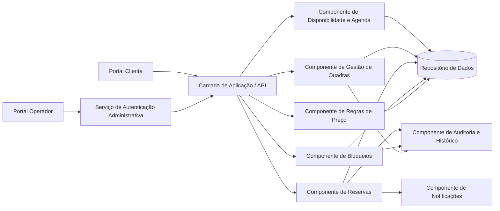
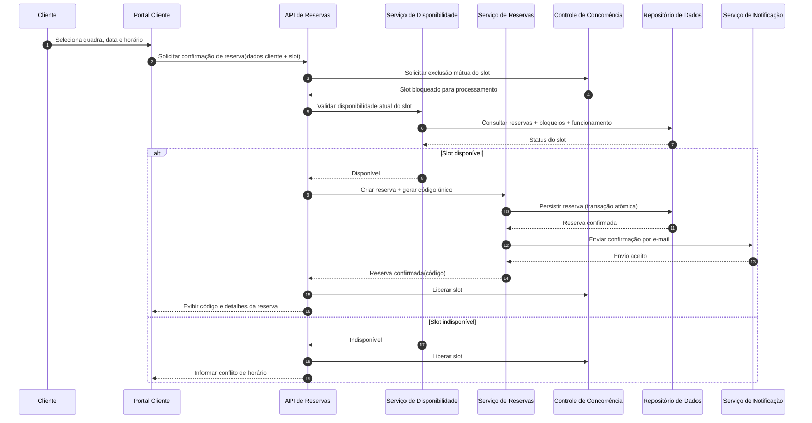
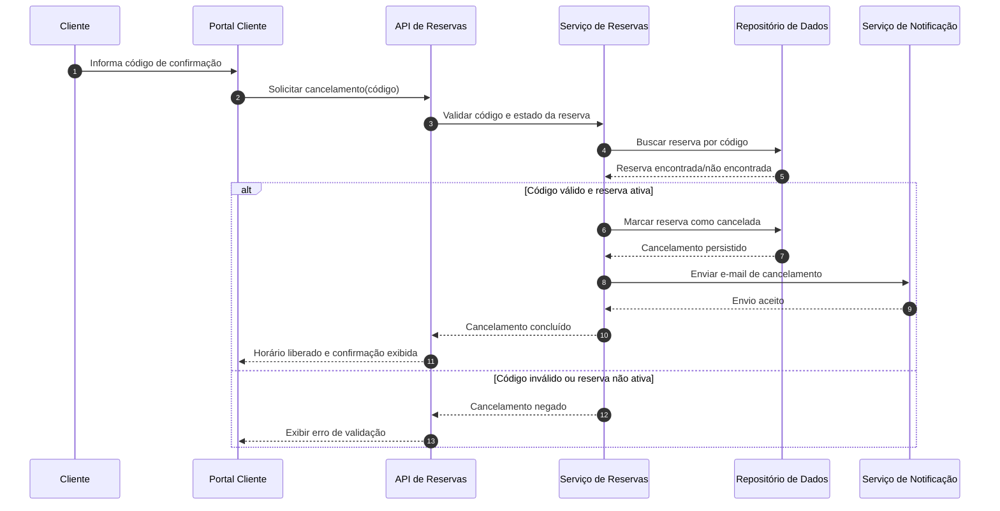

# Relatório Técnico de Arquitetura de Software

## 1. Identificação das HUs

| HU | Perfil | Objetivo | RF Relacionados | RNF Relacionados |
|---|---|---|---|---|
| HU01 | Operador | Cadastrar quadra com dados obrigatórios e disponibilizar para reserva | RF01, RF02, RF04 | RNF07 |
| HU02 | Operador | Bloquear/remover bloqueios de horários por manutenção/feriado | RF03, RF04 | RNF05, RNF07 |
| HU03 | Operador | Visualizar agenda diária consolidada de todas as quadras | RF11 | RNF02, RNF01 |
| HU04 | Operador | Cancelar reserva com motivo e notificar cliente | RF09, RF10 | RNF03, RNF05 |
| HU05 | Cliente | Consultar disponibilidade sem cadastro/login | RF04, RF07 | RNF01, RNF02, RNF06 |
| HU06 | Cliente | Realizar reserva com dados de contato e receber código | RF05, RF06, RF07, RF10 | RNF05, RNF02 |
| HU07 | Cliente | Cancelar própria reserva por código | RF08 | RNF05, RNF01 |

---

## 2. Diagramas de Arquitetura (Mermaid)

### 2.1 Visão de Componentes (lógica)

### 2.2 Sequência — Realização de Reserva com Garantia Atômica (RNF05)

### 2.3 Sequência — Cancelamento por Código (Cliente)

---

## 3. Decisões de Arquitetura

1. **Separação por domínios funcionais**  
   - Gestão de Quadras, Disponibilidade, Reservas, Bloqueios, Preço e Notificação foram separados para modularidade.  
   - **Motivação:** RNF07 (manutenibilidade) e evolução de modalidades/ regras.

2. **Consulta pública e administração segregadas**  
   - Fluxo do cliente sem autenticação para consulta e reserva; fluxo administrativo com autenticação obrigatória.  
   - **Motivação:** RF04, RNF03.

3. **Confirmação de reserva com controle de concorrência + transação atômica**  
   - Reserva só confirma após validação final de disponibilidade em janela crítica.  
   - **Motivação:** RF07 e RNF05 (evitar duplo agendamento).

4. **Código único de confirmação como identificador externo da reserva**  
   - Código utilizado para consulta/cancelamento pelo cliente sem conta.  
   - **Motivação:** RF06, RF08, HU06, HU07.

5. **Disponibilidade derivada de múltiplas regras**  
   - Horário livre depende de: funcionamento da quadra, bloqueios, reservas ativas e data/hora atual.  
   - **Motivação:** RF01, RF03, RF04, RF07.

6. **Notificação assíncrona ao fluxo principal de negócio (com rastreabilidade)**  
   - A reserva/cancelamento é registrada e notificação é disparada com status auditável.  
   - **Motivação:** RF10, HU04 e confiabilidade operacional.

7. **Agenda consolidada como projeção otimizada de leitura**  
   - Visão diária por quadra orientada a leitura rápida para operador.  
   - **Motivação:** RF11, RNF02.

---

## 4. Tabela de Componentes e Rastreabilidade

| Componente | Responsabilidade Principal | Comunica-se com | Origem (HU / Critério de Aceite) |
|---|---|---|---|
| Portal Cliente | Exibir disponibilidade, coletar dados de reserva/cancelamento | API de Aplicação | HU05, HU06, HU07 |
| Portal Operador | Operações administrativas de quadras, bloqueios, agenda e cancelamentos | Autenticação Administrativa, API | HU01, HU02, HU03, HU04 |
| Serviço de Autenticação Administrativa | Validar acesso do operador | Portal Operador, API | HU01-HU04 / RNF03 |
| API de Aplicação | Orquestrar casos de uso e validações de entrada | Portais, serviços de domínio | Todas as HUs |
| Gestão de Quadras | Cadastro/edição/remoção de quadras e horários base | API, Repositório, Auditoria | HU01 / RF01, RF02 |
| Gestão de Bloqueios | Criar/remover bloqueios por quadra/data/horário | API, Repositório, Auditoria | HU02 / RF03 |
| Disponibilidade e Agenda | Calcular slots livres/ocupados e agenda consolidada | API, Repositório, Preço | HU03, HU05 / RF04, RF11 |
| Regras de Preço | Aplicar valor padrão e faixas diferenciadas | API, Disponibilidade, Repositório | RF12 |
| Serviço de Reservas | Confirmar reserva atômica, gerar código, cancelar por código ou operador | API, Repositório, Notificação, Auditoria | HU06, HU07, HU04 / RF05-RF09 |
| Serviço de Notificação | Enviar confirmações e cancelamentos por e-mail | Serviço de Reservas | HU04, HU06 / RF10 |
| Auditoria e Histórico | Registrar eventos críticos (cadastros, cancelamentos, motivos) | Serviços de domínio, Repositório | HU04 / RF09 |
| Repositório de Dados | Persistência de quadras, reservas, bloqueios, preços e histórico | Todos os serviços de domínio | Suporte transversal a RF01-RF12 |

---

## 5. Bloqueios e Pendências

| Tipo | Item | Impacto Arquitetural | Ação Recomendada |
|---|---|---|---|
| Pendência | Política de granularidade de horário (ex.: 30 min, 60 min) | Modelo de disponibilidade, conflitos e precificação | Definir unidade padrão e regras de arredondamento |
| Pendência | Fuso horário e horário de verão | Risco de inconsistência em agenda/reserva | Definir padrão temporal único e regras de exibição |
| Pendência | Regras de cancelamento (prazo limite, multas) | Fluxo de cancelamento e possíveis estados adicionais | Formalizar política de negócio antes da implementação |
| Pendência | Conteúdo e idioma dos e-mails | Contratos de notificação e UX | Aprovar templates e variáveis obrigatórias |
| Pendência | Volume esperado de acessos simultâneos | Dimensionamento de concorrência e desempenho (RNF02/RNF04) | Definir metas de carga e critérios de teste |

---

## 6. Cobertura de Requisitos

### 6.1 Requisitos Funcionais

| RF | Cobertura Arquitetural | Status |
|---|---|---|
| RF01 | Gestão de Quadras + API + Portal Operador | Coberto |
| RF02 | Gestão de Quadras + Auditoria | Coberto |
| RF03 | Gestão de Bloqueios + Disponibilidade | Coberto |
| RF04 | Portal Cliente + Disponibilidade (sem login) | Coberto |
| RF05 | Serviço de Reservas + validação de entrada | Coberto |
| RF06 | Serviço de Reservas (geração de código único) | Coberto |
| RF07 | Disponibilidade + controle de concorrência atômico | Coberto |
| RF08 | Cancelamento por código no Serviço de Reservas | Coberto |
| RF09 | Cancelamento administrativo com motivo obrigatório | Coberto |
| RF10 | Serviço de Notificação por e-mail | Coberto |
| RF11 | Disponibilidade e Agenda (visão consolidada diária) | Coberto |
| RF12 | Regras de Preço por faixa horária | Coberto |

### 6.2 Requisitos Não Funcionais

| RNF | Estratégia de Atendimento | Status |
|---|---|---|
| RNF01 | Portais responsivos e fluxos simplificados | Coberto |
| RNF02 | Projeção otimizada de agenda/disponibilidade e consultas objetivas | Parcial (depende de metas de carga) |
| RNF03 | Autenticação obrigatória no portal operador | Coberto |
| RNF04 | Operação contínua com monitoramento e recuperação | Parcial (depende de plano operacional) |
| RNF05 | Transação atômica + exclusão mútua por slot | Coberto |
| RNF06 | Interface web compatível com navegadores modernos | Coberto |
| RNF07 | Arquitetura modular por componentes de domínio | Coberto |

---

## 7. Gap Analysis

1. **Ausência de regra explícita para duração de reserva**  
   - **Impacto:** afeta cálculo de disponibilidade, preço e conflitos.  
   - **Recomendação:** definir duração fixa ou múltiplos permitidos por modalidade.

2. **Não há definição de política de no-show e penalidade**  
   - **Impacto:** pode exigir novos estados de reserva e regras de bloqueio de cliente.  
   - **Recomendação:** decidir se haverá tratamento de comparecimento e sanções.

3. **RNF04 (99% 24/7) sem requisitos de operação/observabilidade detalhados**  
   - **Impacto:** risco de não conformidade em produção.  
   - **Recomendação:** especificar objetivos operacionais: monitoramento, tempos de recuperação e janelas de manutenção.

4. **RNF02 (2 segundos) sem cenário de carga formal**  
   - **Impacto:** difícil validar desempenho de agenda/disponibilidade.  
   - **Recomendação:** definir volume simultâneo, datasets de teste e percentis-alvo.

5. **Autenticação administrativa sem detalhes de autorização**  
   - **Impacto:** potencial acesso excessivo entre operadores.  
   - **Recomendação:** definir perfis e permissões (ex.: somente leitura, gestão total, cancelamento).

6. **Notificação por e-mail sem política de falha/reenvio**  
   - **Impacto:** inconsistência entre estado da reserva e comunicação ao cliente.  
   - **Recomendação:** estabelecer retentativas, rastreabilidade de entrega e tratamento de erro funcional.